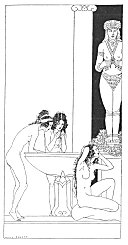

[Intangible Textual Heritage](../../index)  [Classics](../index.md) 
[Sappho](../sappho/index)  [Index](index)  [Previous](sob100.md) 
[Next](sob102.md) 

------------------------------------------------------------------------

p. 123

[  
Click to enlarge](img/12200.jpg.md)

 

### THE PRIESTESSES OF ASTARTE

Astarte's priestesses engage in love at the rising of the moon; then
they arise and bathe themselves in a great basin with a silver rim.

With crook'd fingers they comb their tangled locks, and their
purple-tinted hands twined in their jet-black curls are like so many
coral-branches in a dark and running sea.

They never pluck their deltas, for the goddess's triangle marks their
bellies as a temple; but they tint themselves with paint-brush, and
heavily scent themselves.

Astarte's priestesses engage in love at the setting of the moon, then in
a tent where bums a high gold lamp they stretch themselves at random.

------------------------------------------------------------------------

[Next: The Mysteries](sob102.md)
