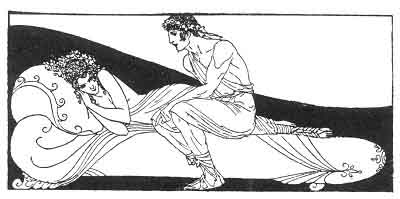

[Intangible Textual Heritage](../../index)  [Classics](../index.md) 
[Sappho](../sappho/index)  [Index](index)  [Previous](sob105.md) 
[Next](sob107.md) 

------------------------------------------------------------------------

p. 128

 

### CONVERSATION

Good-day. --Good-day to you. --You are in a hurry. --Perhaps less in a
hurry than you think.

--You are a pretty girl. --Perhaps more pretty than you even know.

--What is your charming name? --I do not tell my name in such a hurry.
--Have you some one for this evening? --I always have my lover. --And
how do you love him? --As he would wish.

--Shall we dine together? --If you wish. But what will you give? --This.
--Five drachmae? That is for my slave. And me? --Say it yourself. --A
hundred.

--Where do you live? --In that blue house. --At what time do you wish me
to come seek you? --At once if you should care. --At once. --Lead on.

------------------------------------------------------------------------

[Next: The Torn Dress](sob107.md)
