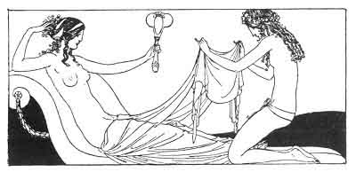

[Intangible Textual Heritage](../../index)  [Classics](../index) 
[Sappho](../sappho/index)  [Index](index)  [Previous](sob109) 
[Next](sob111) 

------------------------------------------------------------------------

p. 132

 

### CLEAR WATER OF THE BASIN

"Clear water of the basin, silent mirror, tell me of my beauty.
--Bilitis, or whoever you may be, Tethys [132](sob154.htm#xref_132) or
mayhap lovely Amphitrite, you are beautiful, oh, know it well!

"Your face bends over, 'neath your heavy hair, thick with perfumes and
entwined flowers. Your tender lids can scarcely open, and your thighs
are wearied by the thrusts of love.

"Your body, weighted by your heavy breasts, displays fine nail-marks and
the deep blue scars made by ardent kisses. Your arms are reddened by the
fast embrace. Each wrinkle in your skin has been beloved."

--"Clear water of the basin, your freshness brings repose. Receive me,
who am truly tired. Bear away the tints upon my cheeks, the perspiration
of my belly and the memory of the night.

------------------------------------------------------------------------

[Next: Desire](sob111)
