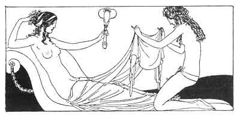

[Intangible Textual Heritage](../../index)  [Classics](../index) 
[Sappho](../sappho/index)  [Index](index)  [Previous](sob113) 
[Next](sob115) 

------------------------------------------------------------------------

p. 137

 

### THE BATH

Child, keep watch upon the door, and do not let any passers-by come in,
for I and six young girls with lovely arms are going secretly to bathe
in the basin's tepid pool.

We only want to laugh and swim a while. Let lovers stay outside. We'll
drench our legs in the water, and, seated on the marble edge, play dice.

We'll play ball too. But let no lovers enter; our hair is too wet, our
throats have gooseflesh and the ends of our fingers are wrinkled.

Besides, whoever found us naked would regret it! Bilitis is not Athene,
but she only shows herself at her own hours and she punishes eyes that
are too ardent.

------------------------------------------------------------------------

[Next: To Her Breasts](sob115)
