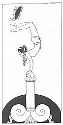

[Intangible Textual Heritage](../../index)  [Classics](../index.md) 
[Sappho](../sappho/index)  [Index](index)  [Previous](sob126.md) 
[Next](sob128.md) 

------------------------------------------------------------------------

p. 150

[  
Click to enlarge](img/15000.jpg.md)

p. 151

 

### THE JUGGLERESS

When the rays of dawn were mingling with the feeble torches' glow, I had
a dissolute, nimble flutist join the orgy; she trembled slightly, being
slightly cold.

Praise the little purple-lidded girl, with short hair and impertinent
sharp breasts, clothed solely in a girdle hung with jet-black iris-stems
and yellow ribbons.

Praise her! for she was clever and performed trying feats of skill. She
juggled hoops and did not break a thing, and hopped right through them
like a grasshopper.

Sometimes she walked on hands and feet, making a wheel of them. Or
better,. legs in air and knees apart, she bent far back and laughing
touched the earth.

------------------------------------------------------------------------

[Next: The Flower Dance](sob128.md)
