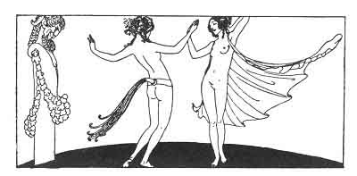

[Intangible Textual Heritage](../../index)  [Classics](../index) 
[Sappho](../sappho/index)  [Index](index)  [Previous](sob127) 
[Next](sob129) 

------------------------------------------------------------------------

p. 152

 

### THE FLOWER DANCE

Anthis, the Lydian dancer, has seven veils about her. She unrolls the
yellow veil and her jet-black tresses spread upon the air. The rosy-veil
slides from her mouth. The white veil falling shows her naked arms.

She frees her little breasts from the opening scarlet veil. She drops
the green one from her round and double croup. She draws the blue veil
from her shoulders, but she still retains the last transparent one,
pressing it upon her puberty.

The young men plead with her; she shakes her head. Only at the music of
the flutes she tears it off a bit, then altogether, and with the
gestures of the dance she plucks the fresh young flowers of her body,

Singing: "Where are my roses, where my perfumed violets! Where are my
sprays of parsley! --Here are my roses, and I give them to you. There
are my violets, do you care for any? There are my lovely curling parsley
wisps."

------------------------------------------------------------------------

[Next: Violence](sob129)
