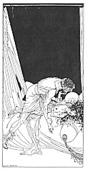

[Intangible Textual Heritage](../../index)  [Classics](../index.md) 
[Sappho](../sappho/index)  [Index](index)  [Previous](sob128.md) 
[Next](sob130.md) 

------------------------------------------------------------------------

p. 153

[  
Click to enlarge](img/15300.jpg.md)

p. 154

 

### VIOLENCE

No, you shall not take me by force, and do not think you will, oh,
Lamprias! If you have heard that Parthenis was raped, know then she met
her ravisher half-way, for we cannot be enjoyed without our invitation.

Oh! do your best, make your strongest effort. See, you have fallen
short, although I scarce defend myself. I shall not call for help. And I
shall not even struggle; but I move. Poor friend, you've fallen short
again, I see.

Continue. This little game is funny. More especially since I know that I
shall win. One more unhappy pass and perhaps you'll not be so disposed
to prove the weakness of your feeble lust.

Butcher, what are you doing! Cur, you are breaking my wrists! and this
knee, this knee which disembowels me! Ah! now, what a pretty conquest,
to rape a young girl on the ground, in tears.

------------------------------------------------------------------------

[Next: Song](sob130.md)
