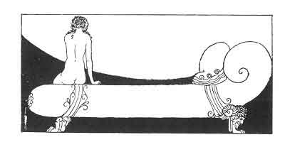

[Intangible Textual Heritage](../../index)  [Classics](../index) 
[Sappho](../sappho/index)  [Index](index)  [Previous](sob135) 
[Next](sob137) 

------------------------------------------------------------------------

p. 161

 

### MELANCHOLY

I shiver, the night is chill and the woods are wet. Why have you brought
me here? isn't my big bed softer than all this pebble-studded moss?

My flowery robe will get all grass-stained and my hair all tangled up
with little twigs; my elbow, look at my elbow, how dirty it is already
with wet earth.

One time, however, I used to follow *him* into the wood. . . Ah! leave
me awhile. I am sad this evening. Don't speak, just leave me, hands upon
my eyes.

Really, can't you wait! are we brute beasts for you to take us so I
Leave me alone. You shall not open my lips nor yet my knees. For fear of
crying, my very eyes are closed.

------------------------------------------------------------------------

[Next: Little Phanion](sob137)
