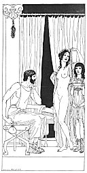

[Intangible Textual Heritage](../../index)  [Classics](../index.md) 
[Sappho](../sappho/index)  [Index](index)  [Previous](sob138.md) 
[Next](sob140.md) 

------------------------------------------------------------------------

p. 164

 

### THE VENDOR OF WOMEN

Who is there? --I am the woman-vendor. Open your door, Sostrata, I'll
give you two good reasons. This one first. Approach, Anasyrtolis, and
undress yourself. --She is a little heavy.

--She's a beauty. Besides, she does the kordax; and knows eighty songs.
--Turn around. Raise your arms. Show your hair. Put up your foot. Now
smile. That's good.

--This one now. --She is too young! --Oh! not at all! She was twelve the
day before yesterday, and you cannot teach her a thing. --Take off your
tunic. Let's see? No, she is thin.

--I only ask a mina for her. --And the first? --Two minae thirty.
--Three minae for the both? --Done. --Come in and wash yourselves. And
you, farewell.

p. 165

[  
Click to enlarge](img/16500.jpg.md)

 

------------------------------------------------------------------------

[Next: Stranger](sob140.md)
