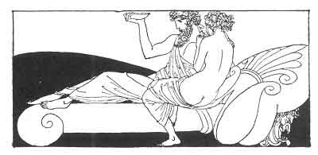

[Intangible Textual Heritage](../../index)  [Classics](../index.md) 
[Sappho](../sappho/index)  [Index](index)  [Previous](sob142.md) 
[Next](sob144.md) 

------------------------------------------------------------------------

p. 169

 

### THE UNKNOWN

He sleeps. I do not know him. He horrifies me. However, his purse is
full of gold, and he gave the slave four drachmae when he entered. I
expect a mina for myself.

But I told the Phrygian to go to bed in my place. He was drunk and took
her for me. I had rather die in torment than stretch myself alongside of
this man.

Alas! I dream of the fields of Tauros. . . I was a little virgin. . .
Then my breasts were light, and I was so mad with amorous envy that I
loathed my married sisters.

What would I not have done to have obtained that which I have refused
tonight! Today my breasts are drooping, and in my worn-out heart Eros
falls asleep from weariness.

------------------------------------------------------------------------

[Next: Trickery](sob144.md)
