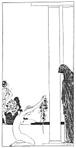

[Intangible Textual Heritage](../../index)  [Classics](../index.md) 
[Sappho](../sappho/index)  [Index](index)  [Previous](sob147.md) 
[Next](sob149.md) 

------------------------------------------------------------------------

p. 174

[  
Click to enlarge](img/17400.jpg.md)

p. 175

 

### TRUE DEATH

Aphrodite! inexorable Goddess, thou hast desired that happy youth with
lovely curls should fade from me, too, in a few short days. Why did I
not die altogether then?

I looked at myself in my mirror: I can no longer smile or even cry. Oh!
lovely face that Mnasidika loved, I can't believe that you were really
mine.

Can it be that all is ended now! I have not yet lived five times eight
short years; I feel that I was born but yesterday, and now it must
already be proclaimed: No one will ever love me any more.

I have shorn all my hair, and twined it in my girdle and I offer it to
thee, eternal Kypris! I shall not cease from loving thee. This is the
last verse of the pious Bilitis.

------------------------------------------------------------------------

[Next: The Tomb of Bilitis](sob149.md)
