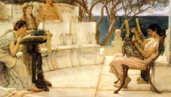

  
[Intangible Textual Heritage](../../index)  [Classics](../index) 

------------------------------------------------------------------------

<table width="75%">
<colgroup>
<col style="width: 50%" />
<col style="width: 50%" />
</colgroup>
<tbody>
<tr class="odd">
<td width="50%"></td>
<td width="50%"><h1 id="poems-of-sappho-unicode" data-align="CENTER">Poems of Sappho 
(Unicode)</h1></td>
</tr>
</tbody>
</table>

------------------------------------------------------------------------

This is a version of the ISTA [Sappho poetry
collection](../sappho/index) with the Greek text displayed in
[Unicode](../../unicode). Note that final sigmas are written as medials
(all sigmas were lunate sigmas in the source text, but I decided to
'modernize' the orthography slightly). This version also corrects some
transcription errors in the original etext, which has not been altered
at this point. The introduction has also been updated slightly.

Note: This etext, particularly the introduction and the Unicode markup,
is copyrighted material (© 2002, J.B. Hare, all rights reserved) and any
reprinting or copying of this text except for academic fair use must be
arranged with the [copyright holder](../../contact).

J.B. Hare 9/17/2002

------------------------------------------------------------------------

[Title Page](sph00)  
[Introduction](sph01)  
[1: Hymn to Aphrodite](sph02)  
[2: That one seems to me the equal of the gods...](sph03)  
[3: Some say that the fairest thing upon the dark earth is a host of
horsemen...](sph04)  
[4: The stars about the full moon...](sph05)  
[5: And by the cool stream the breeze murmurs...](sph06)  
[6: Come, goddess of Cyprus...](sph07)  
[7: If thee, Cyprus or Paphos or Panormos...](sph08)  
[8: But for thee I will bring to the altar...](sph09)  
[9: May I win this prize...](sph10)  
[10: Who made me gifts...](sph11)  
[11: This will I now sing...](sph12)  
[12: For thee to whom I do good...](sph13)  
[13: But that which one desires I](sph14)  
[14: To you, fair maidens...](sph15)  
[15: And this I feel myself.](sph16)  
[16: But the spirit within them turned chill...](sph17)  
[17: From my distress...](sph18)  
[18: Just now the golden-sandalled Dawn](sph19)  
[19: A broidered strap...](sph20)  
[20: Shot with innumerable hues.](sph21)  
[21: Thou forgettest me.](sph22)  
[22: Or lovest another...](sph23)  
[23: You are nought to me.](sph24)  
[24: I yearn and I seek.](sph25)  
[25: When anger spreads...](sph26)  
[26: Hadst thou wished for things good or noble...](sph27)  
[27: Face me, my dear one](sph28)  
[28: And golden pulse grew along the shores.](sph29)  
[29: Lato and Niobe were most dear friends.](sph30)  
[30: I think men will remember us even hereafter.](sph31)  
[31: I loved thee Atthis...](sph32)  
[32: To me thou didst seem a small and ungraceful child.](sph33)  
[Foolish woman...](sph34)  
[34: I know not what to do...](sph35)  
[35: With my two arms...](sph36)  
[36: So, like a child after its mother, I flutter.](sph37)  
[37: The messager of spring, the sweet voiced nighingale.](sph38)  
[38: Now Love, the ineluctable...](sph39)  
[39: But to thee, Athis...](sph40)  
[40: Now Eros shakes my soul...](sph41)  
[41: When all night long sleep holds them.](sph42)  
[42: Come, O divine shell](sph43)  
[43: And delicately woven garlands round tender neck.](sph44)  
[44: More fond of children than Gello.](sph45)  
[45: Very weary of Gorgo.](sph46)  
[46: But upon a soft cushion I dispose my limbs](sph47)  
[47: And there the bowl of ambrosia was mixed](sph48)  
[48: The moon has set...](sph49)  
[49: The moon rose full...](sph50)  
[50: Thus sometimes, the Cretan women, tender footed...](sph51)  
[51: Then lightly, in an enfolding garment I sprang.](sph52)  
[52: They say that Leda...](sph53)  
[53: And dark-eyed Sleep, child of Night.](sph54)  
[54: The handmaiden of Aphrodite, shining like gold.](sph55)  
[55: Andromeda has a fair reward.](sph56)  
[56: Sappho, why \[celebrate or worship\] most happy
Aphrodite?](sph57)  
[57: Come now gentle Graces, and fair-haired Muses.](sph58)  
[58: A sweet-voiced maiden.](sph59)  
[59: Gentle Adonis is dying, O Cythera, what shall we do?...](sph60)  
[60: O for Adonis.](sph61)  
[61: Coming from heaven...](sph62)  
[62: Come rosy-armed Graces, virgin daughters of Zeus.](sph63)  
[63: But Ares said he would forcibly drag Hephaestus.](sph64)  
[64: Innumerable drinking cups thou drainest.](sph65)  
[65: But thou shalt ever lie dead...](sph66)  
[66: No maiden, I think, more wise than thou...](sph67)  
[67: What rustic girl bewitches thee...](sph68)  
[68: Hero of Gyara, that swift runner, I taught.](sph69)  
[69: I am not of a malign nature...](sph70)  
[70: Then sweet maidens wove garlands.](sph71)  
[71: Thou and my servant, Eros.](sph72)  
[72: For if thou lovest us...](sph73)  
[73: More shapely is Mnasidica, than gentle Gyrinno.](sph74)  
[74: One more scornful than thee, O Eranna, I have never
found.](sph75)  
[75: Do thou, O Dica, set garlands upon thy lovely hair...](sph76)  
[76: I love refinement...](sph77)  
[77: And down I set the cushion.](sph78)  
[78: Wealth without thee...](sph79)  
[79: And thou thyself, Calliope.](sph80)  
[80: Sleep thou, in the bosom of thy sweetheart.](sph81)  
[81: Hither now, ye Muses...](sph82)  
[82: I have a fair daughter...](sph83)  
[83: From all joy to me...](sph84)  
[84: In my dream, I spoke to the Cyprian goddess.](sph85)  
[85: Why lovely swallow...](sph86)  
[86: She wrapped herself well in gossamer garments.](sph87)  
[87: My sweet mother! Fair Aphrodite's spell...](sph88)  
[88: Raise high the roof beams, Workmen!...](sph89)  
[89: Towering like the singer of Lesbos among men of other
lands.](sph90)  
[90: As the sweet apple blushes on the end of the bough...](sph91)  
[91: O'er the hills the heedless shepherd,...](sph92)  
[92: Hail, gentle Evening, that bringst back...](sph93)  
[93: Ever shall I be a maid.](sph94)  
[94: We will give, says the father.](sph95)  
[95: To the door-keeper, feet seven fathoms long...](sph96)  
[96: Happy bridegroom!...](sph97)  
[97: And a sweet expression spreads over her fair face.](sph98)  
[98: He who is fair to look upon is good...](sph99)  
[99: Do I still long for maidenhood?](sph100)  
[100: The bride comes rejoicing...](sph101)  
[101: To what may I liken thee, dear bridegroom?...](sph102)  
[102: Hail bride...](sph103)  
[103: For, like her, O bridegroom, there was no other maiden.](sph104)  
[104: Maidenhood, maidenhood, whither art thou gone from
me?...](sph105)  
[105: To himself he seems...](sph106)  
[106: ...much whiter than an egg](sph107)  
[107: Neither honey nor bee for me.](sph108)  
[108: Stir not the pebbles.](sph109)  
[109: Thou burnest us.](sph110)  
[110: A napkin dripping.](sph111)  
[111: Him she called her son.](sph112)  
[112: Maidens, although I am dumb, yet thus I speak...](sph113)  
[113: This is the dust of Timas...](sph114)  
[114: A most tender maiden gathering flowers.](sph115)  
[115: Than the lyre, far sweeter in tone, than gold, more
golden.](sph116)  
[116: fragment: fiction weaving](sph117)  
[117: the brightness...not destroying the sight](sph118)  
[118: With rosy cheeks...](sph119)  
[119: Pausanias on Sappho](sph120)  
[120: Himerius on Sappho](sph121)  
[121: Persuasion](sph122)  
[122: Athenaeus on Sappho](sph123)  
[Additional Fragments](sph124)  
