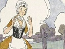

  
[Intangible Textual Heritage](../../index.md)  [Comparative
Religion](../index)  [Index](index)  [Next](otmf01.md) 

------------------------------------------------------------------------

  
*On the Migration of Fables*, by Max Müller, \[1881\], at Intangible
Textual Heritage

------------------------------------------------------------------------

p. 139

# ON THE MIGRATION OF FABLES.

##### A LECTURE DELIVERED AT THE ROYAL INSTITUTION, ON FRIDAY, JUNE 3, 1870.

##### From *Chips from a German Workshop*, by F. Max Müller, Vol. IV, pp. 139–198. New York: Charles Scribner's Sons \[1881\].

Scanned, proofed and formatted by John Bruno Hare at Intangible Textual
Heritage, December 2009. This text is in the public domain in the US
because it was published prior to 1923.

"Count not your chickens before they be
hatched," is a well-known proverb in English, and most people, if asked
what was its origin, would probably appeal to La Fontaine's delightful
fable, *La Laitière et le Pot au Lait*. [1](#fn_0.md) We all know Perrette, lightly stepping along
from her village to the town, carrying the milk-pail on her head, and in
her day-dreams selling her milk for a good sum, then buying a hundred
eggs, then selling the chickens, then buying a pig, fattening it,
selling it again, and buying a cow with a calf. The calf frolics about,
and kicks up his legs—so does Perrette, and, alas! the pail falls down,
the milk is spilt, her riches gone, and she only hopes when she comes
home that she may escape a flogging from her husband.

Did La Fontaine invent this fable? or did he merely follow the example
of Sokrates, who, as we know from the Phædon, [2](#fn_1.md) occupied himself in prison, during the last
days of his life, with turning into verse some of the fables, or, as he
calls them, the myths of Æsop.

p. 140

La Fontaine published the first six books of his fables in 1668, [1](#fn_2.md) and it is well known that the subjects of
most of these early fables were taken from Æsop, Phædrus, Horace, and
other classical fabulists, if we may adopt this word "fabuliste," which
La Fontaine was the first to introduce into French.

In 1678 a second edition of these six books was published, enriched by
five books of new fables, and in 1694 a new edition appeared, containing
one additional book, thus completing the collection of his charming
poems.

The fable of Perrette stands in the seventh book, and was published,
therefore, for the first time in the edition of 1678. In the preface to
that edition La Fontaine says: "It is not necessary that I should say
whence I have taken the subjects of these new fables. I shall only say,
from a sense of gratitude, the largest portion of them to Pilpay the
Indian sage."

If, then, La Fontaine tells us himself that he borrowed the subjects of
most of his new fables from Pilpay, the Indian sage, we have clearly a
right to look to India in order to see whether, in the ancient
literature of that country, any traces can be discovered of Perrette
with the milk-pail.

Sanskrit literature is very rich in fables and stories; no other
literature can vie with it in that respect; nay, it is extremely likely
that fables, in particular animal fables, had their principal source in
India. In the sacred literature of the Buddhists, fables held a most
prominent place. The Buddhist preachers, addressing themselves chiefly
to the people, to the untaught,

p. 141

the uncared for, the outcast, spoke to them, as we still speak to
children, in fables, in proverbs and parables. Many of these fables and
parables must have existed before the rise of the Buddhist religion;
others, no doubt, were added on the spur of the moment, just as Sokrates
would invent a myth or fable whenever that form of argument seemed to
him most likely to impress and convince his hearers. But Buddhism gave a
new and permanent sanction to this whole branch of moral mythology, and
in the sacred canon, as it was settled in the third century before
Christ, many a fable received, and holds to the present day, its
recognized place. After the fall of Buddhism in India, and even during
its decline, the Brahmans claimed the inheritance of their enemies, and
used their popular fables for educational purposes. The best known of
these collections of fables in Sanskrit is the Pañ*k*atantra, literally
the Pentateuch, or Pentamerone. From it and from other sources another
collection was made, well known to all Sanskrit scholars by the name of
Hitopade*s*a, *i.e.*, Salutary Advice. Both these books have been
published in England and Germany, and there are translations of them in
English, German, French, and other languages. [1](#fn_3.md)

The first question which we have to answer refers to the date of these
collections, and dates in the history

p. 142

of Sanskrit literature are always difficult points.

Fortunately, as we shall see, we can in this case fix the date of the
Pañ*k*atantra at least, by means of a translation into ancient Persian,
which was made about 550 years after Christ, though even then we can
only prove that a collection somewhat like the Pañ*k*atantra must have
existed at that time; but we cannot refer the book, in exactly that form
in which we now possess it, to that distant period.

If we look for La Fontaine's fable in the Sanskrit stories of the
Pañ*k*atantra, we do not find, indeed, the milkmaid counting her
chickens before they are hatched, but we meet with the following story:—

"There lived in a certain place a Brâhman, whose
name was Svabhâvak*ri*pa*n*a, which means 'a born miser.' He had
collected a quantity of rice by begging (this reminds us somewhat of the
Buddhist mendicants), and after having dined off it, he filled a pot
with what was left over. He hung the pot on a peg on the wall, placed
his couch beneath, and looking intently at it all the night, he thought,
'Ah, that pot is indeed brimful of rice. Now, if there should be a
famine, I should certainly make a hundred rupees by it. With this I
shall buy a couple of goats. They will have young ones every six months,
and thus I shall have a whole herd of goats. Then, with the goats, I
shall buy cows. As soon as they have calved, I shall sell the calves.
Then, with the cows, I shall buy buffaloes; with the buffaloes, mares.
When the mares have foaled, I shall have plenty of horses; and when I
sell them, plenty of gold. With that gold I shall get a house with four
wings. And then a Brâhman will come to my house, and will give me his
beautiful daughter, with a large dowry. She will have a son, and I shall
call him Soma*s*arman. When he is old enough to be danced on his
father's knee, I shall sit with a book at the back of the stable, and
while I am reading the boy will see me, jump from his mother's lap, and
run towards me to be danced on my knee. He will come too near the
horse's hoof, and, full of anger, I shall call to my wife, "Take the
baby; take him!" But she, distracted by some domestic work does not hear
me. Then I get up, and give her

p. 143

such a kick with my foot.' While he thought this, he
gave a kick with his foot, and broke the pot. All the rice fell over
him, and made him quite white. Therefore, I say, 'He who makes foolish
plans for the future will be white all over, like the father of
Soma*s*arman.'" [1](#fn_4.md)

I shall at once proceed to read you the same story, though slightly
modified, from the Hitopade*s*a. [2](#fn_5.md) The
Hitopade*s*a professes to be taken from the Pañ*k*atantra and some other
books; and in this case it would seem as if some other authority had
been followed. You will see, at all events, how much freedom there was
in telling the old story of the man who built castles in the air.

"In the town of Devîko*tt*a there lived a Brâhman of
the name of Deva*s*arman. At the feast of the great equinox he received
a plate full of rice. He took it, went into a potter's shop, which was
full of crockery, and, overcome by the heat, he lay down in a corner and
began to doze. In order to protect his plate of rice, he kept a stick in
his hand, and began to think, 'Now, if I sell this plate of rice, I
shall receive ten cowries (kapardaka). I shall then, on the spot, buy
pots and plates, and after having increased my capital again and again,
I shall buy and sell betel nuts and dresses till I become enormously
rich. Then I shall marry four wives, and the youngest and prettiest of
the four I shall make a great pet of. Then the other wives will be so
angry, and begin to quarrel. But I shall be in a great rage, and take a
stick, and give them a good flogging.' . . . . While he said this, he
flung his stick away; the plate of rice was smashed to pieces, and many
of the pots in the shop were broken. The potter, hearing the noise, ran
into the shop, and when he saw his pots broken, he gave the Brâhman a
good scolding, and drove him out of his shop. Therefore I say, 'He who
rejoices over plans for the future will come to grief, like the Brâhman
who broke the pots.'"

In spite of the change of a Brahman into a milkmaid, no one, I suppose,
will doubt that we have here

p. 144

in the stories of the Pañ*k*atantra and Hitopade*s*a the first germs of
La Fontaine's fable. [1](#fn_6.md) But how did that
fable travel all the way from India to France? How did it doff its
Sanskrit garment and don the light dress of modern French? How was the
stupid Brahman born again as the brisk milkmaid, "*cotillon simple et
souliers plats?*"

It seems a startling case of longevity that while languages have
changed, while works of art have perished, while empires have risen and
vanished again, this simple children's story should have lived on, and
maintained its place of honor and its Undisputed sway in every
school-room of the East and every nursery of the West. And yet it is a
case of longevity so well attested that even the most skeptical would
hardly venture to question it. We have the passport of these stories
*viséed* at every place through which they have passed, and, as far as I
can judge, *parfaitement en règle*. The story of the migration of these
Indian fables from East to West is indeed wonderful; more wonderful and
more instructive than many of these fables themselves. Will it be
believed that we, in this Christian country and in the nineteenth
century, teach our children the first, the most important lessons of
worldly wisdom, nay, of a more than worldly wisdom, from books borrowed
from Buddhists and Brahmans, from heretics and idolaters, and that wise
words, spoken a thousand, nay, two thousand years ago, in a lonely
village of India, like precious seed scattered broadcast all over the
world, still bear fruit a hundred and a thousand-fold in that soil which
is the most precious before God and man, the soul of a child? No
lawgiver, no philosopher,

p. 145

has made his influence felt so widely, so deeply, and so permanently as
the author of these children's fables. But who was he? We do not know.
His name, like the name of many a benefactor of the human race, is
forgotten. We only know he was an Indian …—and that he lived at least
two thousand years ago.

No doubt, when we first hear of the Indian origin of these fables, and
of their migration from India to Europe, we wonder whether it can be so;
but the fact is, that the story of this Indo-European migration is not,
like the migration of the Indo-European languages, myths, and legends, a
matter of theory, but of history, and that it was never quite forgotten
either in the East or in the West. Each translator, as he handed on his
treasure, seems to have been anxious to show how he came by it.

Several writers who have treated of the origin and spreading of
Indo-European stories and fables, have mixed up two or three questions
which ought to be treated each on its own merits.

The first question is whether the Aryans, when they broke up their
pro-ethnic community, carried away with them, not only their common
grammar and dictionary, but likewise some myths and legends which we
find that Indians, Persians, Greeks, Romans, Celts, Germans, Slaves,
when they emerge into the light of history, share in common? That
certain deities occur in India, Greece, and Germany, having the same
names and the same character, is a fact that can no longer be denied.
That certain heroes, too, known to Indians, Greeks, and Romans, point to
one and the same origin, both by their name and by their

p. 146

history, is a fact by this time admitted by all whose admission is of
real value. As heroes are in most cases gods in disguise, there is
nothing very startling in the fact that nations, who had worshipped the
same gods, should also have preserved some common legends of demi-gods
or heroes, nay, even in a later phase of thought, of fairies and ghosts.
The case, however, becomes much more problematical when we ask, whether
stories also, fables told with a decided moral purpose, formed part of
that earliest Aryan inheritance? This is still doubted by many who have
no doubts whatever as to common Aryan myths and legends, and even those
who, like myself, have tried to establish by tentative arguments the
existence of common Aryan fables, dating from before the Aryan
separation, have done so only by showing a possible connection between
ancient popular saws and mythological ideas, capable of a moral
application. To any one, for instance, who knows how in the poetical
mythology of the Aryan tribes, the golden splendor of the rising sun
leads to conceptions of the wealth of the Dawn in gold and jewels and
her readiness to shower them upon her worshippers, the modern German
proverb, *Morgenstunde hat Gold im Munde*, seems to have a kind of
mythological ring, and the stories of benign fairies, changing
everything into gold, sound likewise like an echo from the
long-forgotten forest of our common Aryan home. If we know how the trick
of dragging stolen cattle backwards into their place of hiding, so that
their footprints might not lead to the discovery of the thief, appears
again and again in the mythology of different Aryan nations, then the
pointing of the same trick as a kind of proverb, intended to convey a
moral lesson,

p. 147

and illustrated by fables of the same or a very similar character in
India and Greece, makes one feel inclined to suspect that here too the
roots of these fables may reach to a pro-ethnic period. *Vestigia nulla
retrorsum* is clearly an ancient proverb, dating from a nomadic period,
and when we see how Plato ("Alcibiades," i. 123) was perfectly familiar
with the Æsopian myth or fable,—κατὰ τὸν Αἰσώπου μῦθον, he says—of the
fox declining to enter the lion's cave, because all footsteps went into
it and none came out, and how the Sanskrit Pañ*k*atantra (III. 14) tells
of a jackal hesitating to enter his own cave, because he sees the
footsteps of a lion going in, but not coming out, we feel strongly
inclined to admit a common origin for both fables. Here, however, the
idea that the Greeks, like La Fontaine, had borrowed their fable from
the Pañ*k*atantra would be simply absurd, and it would be much more
rational, if the process must be one of borrowing, to admit, as Benfey
("Pantschatantra," i. 381) does, that the Hindus, after Alexander's
discovery of India, borrowed this story from the Greeks. But if we
consider that each of the two fables has its own peculiar tendency, the
one deriving its lesson from the absence of backward footprints of the
victims, the other from the absence of backward footprints of the lion
himself, the admission of a common Aryan proverb such as "*vestigia
nulla retrorsum*," would far better explain the facts such as we find
them. I am not ignorant of the difficulties of this explanation, and I
would myself point to the fact that among the Hottentots, too, Dr. Bleek
has found a fable of the jackal declining to visit the sick lion,
"because the traces of the animals

p. 148

who went to see him did not turn back." [1](#fn_7.md) Without, however, pronouncing any decided
opinion on this vexed question, what I wish to place clearly before you
is this, that the spreading of Aryan myths, legends, and fables, dating
from a pro-ethnic period, has nothing whatever to do with the spreading
of fables taking place in strictly historical times from India to
Arabia, to Greece and the rest of Europe, not by means of oral
tradition, but through more or less faithful translations of literary
works. Those who like may doubt whether *Zeus* was Dyaus, whether
*Daphne* was Ahanâ, whether *La Belle au Bois* was the mother of two
children, called *L’Aurore* and *Le Jour*, [2](#fn_8.md) but the fact that a collection of fables
was, in the sixth century of our era, brought from India to Persia, and
by means of various translations naturalized among Persians, Arabs,
Greeks, Jews, and all the rest, admits of no doubt or cavil. Several
thousand years have passed between those two migrations, and to mix them
up together, to suppose that Comparative Mythology has anything to do
with the migration of such fables as that of Perrette, would be an
anachronism of a portentous character.

There is a third question, viz., whether besides the two channels just
mentioned, there were others through which Eastern fables could have
reached Europe, or Æsopian and other European fables have been
transferred to the East. There are such channels, no doubt. Persian and
Arab stories, of Indian origin, were through the crusaders brought back
to Constantinople, Italy, and France; Buddhist fables

p. 149

were through Mongolian [1](#fn_9.md) conquerors
(13th century) carried to Russia and the eastern parts of Europe. Greek
stories may have reached Persia and India at the time of Alexander's
conquests and during the reigns of the Diadochi, and even Christian
legends may have found their way to the East through missionaries,
travellers, or slaves.

Lastly, there comes the question, how far our common human nature is
sufficient to account for coincidences in beliefs, customs, proverbs,
and fables, which, at first sight, seem to require an historical
explanation. I shall mention but one instance. Professor Wilson ("Essays
on Sanskrit Literature," i. p. 201) pointed out that the story of the
Trojan horse occurs in a Hindu tale, only that instead of the horse we
have an elephant. But he rightly remarked that the coincidence was
accidental. In the one case, after a siege of nine years, the principal
heroes of the Greek army are concealed in a wooden horse, dragged into
Troy by a stratagem, and the story ends by their falling upon the
Trojans and conquering the city of Priam. In the other story a king bent
on securing a son-in-law, had an elephant constructed by able artists,
and filled with armed men. The elephant was placed in a forest, and when
the young prince came to hunt, the armed men sprang out, overpowered the
prince and brought him to the king, whose daughter he was

p. 150

to marry. However striking the similarity may seem to one unaccustomed
to deal with ancient legends, I doubt whether any comparative
mythologist has postulated a common Aryan origin for these two stories.
They feel that, as far as the mere construction of a wooden animal is
concerned, all that was necessary to explain the origin of the idea in
one place was present also in the other, and that while the Trojan horse
forms an essential part of a mythological cycle, there is nothing truly
mythological or legendary in the Indian story. The idea of a hunter
disguising himself in the skin of an animal, or even of one animal
assuming the disguise of another, [1](#fn_10.md)
are familiar in every part of the world, and if that is so, then the
step from hiding under the skin of a large animal to that of hiding in a
wooden animal is not very great.

Every one of these questions, as I said before, must be treated on its
own merits, and while the traces of the first migration of Aryan fables
can be rediscovered

p. 151

only by the most minute and complex inductive processes, the documents
of the latter are to be found in the library of every intelligent
collector of books. Thus, to return to Perrette and the fables of
Pilpay, Huet, the learned bishop of Avranches, the friend of La
Fontaine, had only to examine the prefaces of the principal translations
of the Indian fables in order to track their wanderings, as he did in
his famous "Traite de l’Origine des Romans," published at Paris in 1670,
two years after the appearance of the first collection of La Fontaine's
fables. Since his time the evidence has become more plentiful, and the
whole subject has been more fully and more profoundly treated by
Sylvestre de Sacy, [1](#fn_11.md) Loiseleur
Deslongchamps, [2](#fn_12.md) and Professor
Benfey. [3](#fn_13.md) But though we have a more
accurate knowledge of the stations by which the Eastern fables reached
their last home in the West, Bishop Huet knew as well as we do that they
came originally from India through Persia by way of Bagdad and
Constantinople.

In order to gain a commanding view of the countries traversed by these
fables, let us take our position at Bagdad in the middle of the eighth
century, and watch from that central point the movements of our literary
caravan in its progress from the far East to the far West. In the middle
of the eighth century, during the reign of the great Khalif Almansur,
Abdallah ibn Almokaffa wrote his famous collection of fables, the
"Kalila and Dimnah," which we still possess.

p. 152

\[paragraph continues\] The Arabic text of
these fables has been published by Sylvestre de Sacy, and there is an
English translation of it by Mr. Knatchbull, formerly Professor of
Arabic at Oxford. Abdallah ibn Almokaffa was a Persian by birth, who
after the fall of the Omeyyades became a convert to Mohammedanism, and
rose to high office at the court of the Khalifs. Being in possession of
important secrets of state, he became dangerous in the eyes of the
Khalif Almansur, and was foully murdered. [1](#fn_14.md) In the preface, Abdallah ibn Almokaffa
tells us that he translated these fables from Pehlevi, the ancient
language of Persia; and that they had been translated into Pehlevi
(about two hundred years before his time) by Barzûyeh, the physician of
Khosru Nushir van, the King of Persia, the contemporary of the Emperor
Justinian. The King of Persia had heard that there existed in India a
book full of wisdom, and he had commanded his Vezier, Buzurjmihr, to
find a man acquainted with the languages both of Persia and India. The
man chosen was Barzûyeh. He travelled to India, got possession of the
book, translated it into Persian, and brought it back to the court of
Khosru. Declining all rewards beyond a dress of honor, he only
stipulated that an account of his own life and opinions should be added
to the book. This account, probably written by himself, is extremely
curious. It is a kind of *Religio Medici* of the sixth century, and
shows us a soul dissatisfied with traditions and formularies, striving
after truth, and finding rest only where many other seekers after truth
have found rest before and after him, in a life devoted to alleviating
the sufferings of mankind.

There is another account of the journey of this

p. 153

\[paragraph continues\] Persian physician
to India. It has the sanction of Firdúsi, in the great Persian epic, the
Shah Nâmeh, and it is considered by some [1](#fn_15.md) as more original than the one just quoted.
According to it, the Persian physician read in a book that there existed
in India trees or herbs supplying a medicine with which the dead could
be restored to life. At the command of the king he went to India in
search of those trees and herbs; but, after spending a year in vain
researches, he consulted some wise people on the subject. They told him
that the medicine of which he had read as having the power of restoring
men to life had to be understood in a higher and more spiritual sense,
and that what was really meant by it were ancient books of wisdom
preserved in India, which imparted life to those who were dead in their
folly and sins. [2](#fn_16.md) Thereupon the
physician translated these books, and one of them was the collection of
fables, the "Kalila and Dimnah."

It is possible that both these stories were later inventions; the
preface also by Ali, the son of Alshah Farési, in which the names of
Bidpai and King Dabshelim are mentioned for the first time, is of later
date. But the fact remains that Abdallah ibn Almokaffa, the author of
the oldest Arabic collection of our fables, translated them from
Pehlevi, the language of Persia at the time of Khosru Nushirvan, and
that the Pehlevi text which he translated was believed to be a
translation of a book brought from India in the middle of the sixth
century. That Indian book could not have been the Pañ*k*atantra, as we
now possess it, but must have been a much larger collection of fables,

p. 154

for the Arabic translation, the "Kalilah and Dimnah," contains eighteen
chapters instead of the five of the Pañ*k*atantra, and it is only in the
fifth, the seventh, the eighth, the ninth, and the tenth chapters that
we find the same stories which form the five books of the Pañ*k*atantra
in the *textus ornatior*. Even in these chapters the Arabic translator
omits stories which we find in the Sanskrit text, and adds others which
are not to be found there.

In this Arabic translation the story of the Brahman and the pot of rice
runs as follows:—

"A religious man was in the habit of receiving every
day from the house of a merchant a certain quantity of butter (oil) and
honey, of which, having eaten as much as he wanted, he put the rest into
a jar, which he hung on a nail in a corner of the room, hoping that the
jar would in time be filled. Now, as he was leaning back one day on his
couch, with a stick in his hand, and the jar suspended over his head, he
thought of the high price of butter and honey, and said to himself, 'I
will sell what is in the jar, and buy with the money which I obtain for
it ten goats, which, producing each of them a young one every five
months, in addition to the produce of the kids as soon as they begin to
bear, it will not be long before there is a large flock.' He continued
to make his calculations, and found that he should at this rate, in the
course of two years, have more than four hundred goats. 'At the
expiration of this term I will buy,' said he, 'a hundred black cattle,
in the proportion of a bull or a cow for every four goats. I will then
purchase land, and hire workmen to plough it with the beasts, and put it
into tillage, so that before five years are over I shall, no doubt, have
realized a great fortune by the sale of the milk which the cows will
give, and of the produce of my land. My next business will be to build a
magnificent house, and engage a number of servants, both male and
female; and, when my establishment is completed, I will marry the
handsomest woman I can find, who, in clue time becoming a mother, will
present me with an heir to my possessions, who, as he advances in age,
shall receive the best masters that can be procured; and, if the
progress which he makes

p. 155

in learning is equal to my reasonable expectations,
I shall be amply repaid for the pains and expense which I have bestowed
upon him; but if, on the other hand, he disappoints my hopes, the rod
which I have here shall be the instrument with which I will make him
feel the displeasure of a justly-offended parent. [1](#fn_17.md) At these words he suddenly raised the band
which held the stick towards the jar, and broke it, and the contents ran
down upon his head and face." [1](#fn_17.md)
…

You will have observed the coincidences between the Arabic and the
Sanskrit versions, but also a considerable divergence, particularly in
the winding up of the story. The Brahman and the holy man both build
their castles in the air; but, while the former kicks his wife, the
latter only chastises his son. How this change came to pass we cannot
tell. One might suppose that, at the time when the book was translated
from Sanskrit into Pehlevi, or from Pehlevi into Arabic, the Sanskrit
story was exactly like the Arabic story, and that it was changed
afterwards. But another explanation is equally admissible, viz., that
the Pehlevi or the Arabic translator wished to avoid the offensive
behavior of the husband kicking his wife, and therefore substituted the
son as a more deserving object of castigation.

We have thus traced our story from Sanskrit to Pehlevi, and from Pehlevi
to Arabic; we have followed it in its migrations from the hermitages of
Indian sages to the court of the kings of Persia, and from thence to the
residence of the powerful Khâlifs at Bagdad. Let us recollect that the
Khalif Almansur, for whom the Arabic translation was made, was the
contemporary of Abderrhaman, who ruled in Spain, and that both were but
little anterior to Harun

p. 156

al Rashid and Charlemagne. At that time, therefore, the way was
perfectly open for these Eastern fables, after they had once reached
Bagdad, to penetrate into the seats of Western learning, and to spread
to every part of the new empire of Charlemagne. They may have done so,
for all we know; but nearly three hundred years pass before these fables
meet us again in the literature of Europe. The Carlovingian empire had
fallen to pieces, Spain had been rescued from the Mohammedans, William
the Conqueror had landed in England, and the Crusades had begun to turn
the thoughts of Europe towards the East, when, about the year 1080, we
hear of a Jew of the name of Symeon, the son of Seth, who translated
these fables from Arabic into Greek. He states in his preface that the
book came originally from India, that it was brought to the King
Chosroes of Persia, and then translated into Arabic. His own translation
into Greek must have been made from an Arabic MS. of the "Kalila and
Dimna," in some places more perfect, in others less perfect, than the
one published by De Sacy. The Greek text has been published, though very
imperfectly, under the title of "Stephanites and Ichnelates." [1](#fn_18.md) Here our fable is told as follows (p.
337):—

"It is said that a beggar kept some honey and butter
in a jar close to where he slept. One night he thus thought within
himself: 'I shall sell this honey and butter for however small a sum;
with it I shall buy ten goats, and these in five months will produce as
many again. In five years they will become four hundred. With them I
shall buy one hundred cows, and with them I shall cultivate some land.
And what with their calves

p. 157

and the harvests, I shall become rich in five years,
and build a house with four wings, [1](#fn_19.md)
ornamented with gold, and buy all kinds of servants, and marry a wife.
She will give me a child, and I shall call him Beauty It will be a boy,
and I shall educate him properly; and if I see him lazy, I shall give
him such a flogging with this stick…' With these words he took a stick
that was near him, struck the jar, and broke it, so that the honey and
milk ran down on his beard."

This Greek translation might, no doubt, have reached La Fontaine; but as
the French poet was not a great scholar, least of all a reader of Greek
MSS., and as the fables of Symeon Seth were not published till 1697, we
must look for other channels through which the old fable was carried
along from East to West.

There is, first of all, an Italian translation of the "Stephanites and
Ichnelates," which was published at Ferrara in 1583. [2](#fn_20.md) The title is, "Del Governo de’ Regni.
Sotto morali essempi di animali ragionanti tra loro. Tratti prima di
lingua Indiana in Agarena da Lelo Demno Saraceno. Et poi dall’ Agarena
nella Greca da Simeone Setto, philosopho Antiocheno. Et hora tradotti di
Greco in Italiano." This translation was probably the work of Giulio
Nuti.

There is, besides, a Latin translation, or rather a free rendering of
the Greek translation by the learned Jesuit, Petrus Possinus, which was
published at Rome in 1666. [3](#fn_21.md) This may
have been, and, according to some authorities, has really been one of
the sources from which La Fontaine drew his inspirations. But though La
Fontaine may have consulted this work

p. 158

for other fables, I do not think that he took from it the fable of
Perrette and the milk-pail.

The fact is, these fables had found several other channels through
which, as early as the thirteenth century, they reached the literary
market of Europe, and became familiar as household words, at least among
the higher and educated classes. We shall follow the course of some of
these channels. First, then, a learned Jew, whose name seems to have
been Joel, translated our fables from Arabic into Hebrew (1250?). His
work has been preserved in one MS. at Paris, but has not yet been
published, except the tenth book, which was communicated by Dr. Neubauer
to Benfey's journal, "Orient and Occident" (vol. i. p. 658). This Hebrew
translation was translated by another converted Jew, Johannes of Capua,
into Latin. His translation was finished between 1263-1278, and, under
the title of "Directorium Humanæ Vitæ," it became very soon a popular
work with the select reading public of the thirteenth century. [1](#fn_22.md) In the "Directorium," and in Joel's
translation, the name of Sendebar is substituted for that of Bidpay. The
"Directorium" was translated into German at the command of Eberhard, the
great Duke of Würtemberg, [2](#fn_23.md) and both
the Latin text and the German translation occur, in repeated editions,
among the rare books printed between 1480 and the end of the fifteenth
century. [3](#fn_24.md) A Spanish translation,
founded both on the German and the Latin texts, appeared at Burgos in
1493; [4](#fn_25.md) and from these different
sources flowed in the sixteenth century the Italian

p. 159

renderings of Firenzuola (1548) [1](#fn_26.md) and
Doni (1552). [2](#fn_27.md) As these Italian
translations were repeated in French [3](#fn_28.md)
and English, before the end of the sixteenth century, they might no
doubt have supplied La Fontaine with subjects for his fables.

But, as far as we know, it was a third channel that really brought the
Indian fables to the immediate notice of the French poet. A Persian
poet, of the name of Nasr Allah, translated the work of Abdallah ibn
Almokaffa into Persian about 1150. This Persian translation was enlarged
in the fifteenth century by another Persian poet, Husain ben Ali called
el Vaez, under the title of "Anvári Suhaili." [4](#fn_29.md) This name will be familiar to many members
of the Indian Civil Service, as being one of the old Haileybury
class-books which had to be construed by all who wished to gain high
honors in Persia. This work, or

The second book is a translation of the second part of Doni's *Filosofia
Morale*.

p. 160

at least the first books of it, were translated into French by David
Sahid of Ispahan, and published at Paris in 1644, under the title of
"Livre des Lumières, ou, la Conduite des Rois, composé par le Sage
Pilpay, Indien." This translation, we know, fell into the hands of La
Fontaine, and a number of his most charming fables were certainly
borrowed from it.

But Perrette with the milk-pail has not yet arrived at the end of her
journey, for if we look at the "Livre des Lumières," as published at
Paris, we find neither the milkmaid nor her prototype, the Brahman who
kicks his wife, or the religious man who flogs his boy. That story
occurs in the later chapters, which were left out in the French
translation; and La Fontaine, therefore, must have met with his model
elsewhere.

Remember that in all our wanderings we have not yet found the milkmaid,
but only the Brahman or the religious man. What we want to know is who
first brought about this metamorphosis.

No doubt La Fontaine was quite the man to seize on any jewel which was
contained in the Oriental fables, to remove the cumbersome and
foreign-looking setting, and then to place the principal figure in that
pretty frame in which most of us have first become acquainted with it.
But in this case the charmer's wand did not belong to La Fontaine, but
to some forgotten worthy, whose very name it will be difficult to fix
upon with certainty.

We have, as yet, traced three streams only, all starting from the Arabic
translation of Abdallah ibn Almokaffa, one in the eleventh, another in
the twelfth, a third in the thirteenth century, all reaching Europe,

p. 161

some touching the very steps of the throne of Louis XIV., yet none of
them carrying the leaf which contained the story of "Perrette," or of
the "Brahman," to the threshold of La Fontaine's home. We must,
therefore, try again.

After the conquest of Spain by the Mohammedans, Arabic literature had
found a new home in Western Europe, and among the numerous works
translated from Arabic into Latin or Spanish, we find towards the end of
the thirteenth century (1289) a Spanish translation of our fables,
called "Calila é Dymna." [1](#fn_30.md) In this the
name of the philosopher is changed from Bidpai to Bundobel. This, or
another translation from Arabic, was turned into Latin verse by Raimond
de Béziers in 1313 (not published).

Lastly, we find in the same century another translation from Arabic
straight into Latin verse, by Baldo, which became known under the name
of "Æsopus alter." [2](#fn_31.md)

From these frequent translations, and translations of translations, in
the eleventh, twelfth, and thirteenth centuries, we see quite clearly
that these Indian fables were extremely popular, and were, in fact, more
widely read in Europe than the Bible, or any other book. They were not
only read in translations, 'but having been introduced into
sermons, [3](#fn_32.md) homilies, and works on
morality, they were improved upon, acclimatized, localized, moralized,
till at last it is almost impossible to recognize their Oriental
features under their homely disguises.

I shall give you one instance only.

Rabelais, in his "Gargantua," gives a long description how a man might
conquer the whole world. At

p. 162

the end of this dialogue, which was meant as a satire on Charles V., we
read:—

"There was there present at that time an old gentleman well experienced
in the wars, a stern soldier, and who had been in many great hazards,
named Echephron, who, hearing this discourse, said: 'J’ay grand peur que
toute ceste entreprise sera semblable à la farce *du pot au laict*
duquel un cordavanier se faisoit riche par resverie, puis le pot cassé,
n’eut de quoy disner.'"

This is clearly our story, only the Brahman has, as yet, been changed
into a shoemaker only, and the pot of rice or the jar of butter and
honey into a pitcher of milk. Now it is perfectly true that if a writer
of the fifteenth century changed the Brahman into a shoemaker, La
Fontaine might, with the same right, have replaced the Brahman by his
milkmaid. Knowing that the story was current, was, in fact, common
property in the fifteenth century, nay, even at a much earlier date, we
might really be satisfied after having brought the germs of "Perrette"
within easy reach of La Fontaine. But, fortunately, we can make at least
one step further, a step of about two centuries. This step backwards
brings us to the thirteenth century, and there we find our old Indian
friend again, and this time really changed into a milkmaid. The book I
refer to is written in Latin, and is called, "Dialogus Creaturarum
optime moralizatus;" in English, the "Dialogue of Creatures moralized."
It was a book intended to teach the principles of Christian morality by
examples taken from ancient fables. It was evidently a most successful
book, and was translated into several modern languages. There is an old
translation of it in English, first printed by Rastell, [1](#fn_33.md) and

p. 163

afterwards repeated in 1816. I shall read you from it the fable in
which, as far as I can find, the milkmaid appears for the first time on
the stage, surrounded already by much of that scenery which, four
hundred years later, received its last touches at the hand of La
Fontaine.

"Dialogo C. (p.
ccxxiii.) For as it is but madnesse to trust to moche in surete, so it
is but foly to hope to moche of vanyteys, for vayne be all erthly
thinges longynge to men, as sayth Davyd, Psal. xciiii: Wher of it is
tolde in fablys that a lady uppon a tyme delyvered to her mayden a
*galon of mylke* to sell at a cite, and by the way, as she sate and
restid her by a dyche side, she began to thinke that with the money of
the mylke she wold bye an henne, the which shulde bringe forth chekyns,
and when they were growyn to hennys she wolde sell them and by piggis,
and eschaunge them in to shepe, and the shepe in to oxen, and so whan
she was come to richesse she sholde be maried right worshipfully unto
some worthy man, and thus she reioycid. And whan she was thus
mervelously comfortid and ravisshed inwardly in her secrete solace,
thinkynge with howe greate ioye she shuld be ledde towarde the chirche
with her husbond on horsebacke, she sayde to her self: 'Goo we, goo we.'
Sodaynlye she smote the ground with her fote, myndynge to spurre the
horse, but her fote slypped, and she fell in the dyche, and there lay
all her mylke, and so she was farre from her purpose, and never had that
she hopid to have." [1](#fn_34.md)

p. 164

Here we have arrived at the end of our journey. It has been a long
journey across fifteen or twenty centuries, and I am afraid our
following Perrette from country to country, and from language to
language, may have tired some of my hearers. I shall, therefore, not
attempt to fill the gap that divides the fable of the thirteenth century
from La Fontaine. Suffice it to say, that the milkmaid, having once
taken the place of the Brahman, maintained it against all corners. We
find her as Dona Truhana, in the famous "Conde Lucanor," the work of the
Infante Don Juan Manuel, [1](#fn_35.md) who died in
1347, the grandson of St. Ferdinand, the nephew of Alfonso the Wise,
though himself not a king, yet more powerful than a king; renowned both
by his sword and by his pen, and possibly not ignorant of Arabic, the
language of his enemies. We find her again in the "Contes et Nouvelles"
of Bonaventure des Periers, published in the sixteenth century, a book
which we know that La Fontaine was well acquainted with. We find her
after La Fontaine in all the languages of Europe. [2](#fn_36.md)

You see now before your eyes the bridge on which our fables came to us
from East to West. The same bridge which brought us Perrette brought us
hundreds of fables, all originally sprung up in India, many of them
carefully collected by Buddhist priests, and preserved in their sacred
canon, afterwards handed on to the Brahminic writers of a later age,
carried by Barzûyeh from India to the court of

p. 165

  [  
Click to enlarge](img/16500.jpg.md)  
OLD COLLECTION OF INDIAN FABLES.  

p. 166

\[paragraph continues\] Persia, then to
the courts of the Khalifs at Bagdad and Cordova, and of the emperors at
Constantinople. Some of them, no doubt, perished on their journey,
others were mixed up together, others were changed till we should hardly
know them again. Still, if you once know the eventful journey of
Perrette, you know the journey of all the other fables that belong to
this Indian cycle. Few of them have gone through so many changes, few of
them have found so many friends, whether in the courts of kings or in
the huts of beggars. Few of them have been to places where Perrette has
not also been. This is why I selected her and her passage through the
world as the best illustration of a subject which otherwise would
require a whole course of lectures to do it justice.

But though our fable represents one large class or cluster of fables, it
does not represent all. There were several collections, besides the
Pañ*k*atantra, which found their way from India to Europe. The most
important among them is the "Book of the Seven Wise Masters, or the Book
of Sindbad," the history of which has lately been written, with great
learning and ingenuity, by Signor Comparetti. [1](#fn_37.md)

These large collections of fables and stories mark what may be called
the high roads on which the literary products of the East were carried
to the West. But there are, beside these high roads, some smaller, less
trodden paths on which single fables, sometimes mere proverbs, similes,
or metaphors, have come to us from India, from Persepolis, from Damascus
and Bagdad. I have already alluded to the powerful influence which
Arabic literature exercised on Western Europe through Spain. Again, a
most

p. 167

active interchange of Eastern and Western ideas took place at a later
time during the progress of the Crusades. Even the inroads of Mongolian
-tribes into Russia and the East of Europe kept up a literary bartering
between Oriental and Occidental nations.

But few would have suspected a Father of the Church as an importer of
Eastern fables. Yet so it is.

At the court of the same Khalif Almansur, where Abdallah ibn Almokaffa
translated the fables of Calla and Dimna from Persian into Arabic, there
lived a Christian of the name of Sergius, who for many years held the
high office of treasurer to the Khalif. He had a son to whom he gave the
best education that could then be given, his chief tutor being one
Cosmas, an Italian monk, who had been taken prisoner by the Saracens,
and sold as a slave at Bagdad. After the death of Sergius, his son
succeeded him for some time as chief councillor (πρωτοσύμβουλος) to the
Khalif Almansur. Such, however, had been the influence of the Italian
monk on his pupil's mind, that he suddenly resolved to retire from the
world, and to devote himself to study, meditation, and pious works. From
the monastery of St. Saba, near Jerusalem, this former minister of the
Khalif issued the most learned works on theology, particularly his
"Exposition of the Orthodox Faith." He soon became the highest authority
on matters of dogma in the Eastern Church, and he still holds his place
among the saints both of the Eastern and Western Churches. His name was
Joannes, and from being born at Damascus, the former capital of the
Khalifs, he is best known in history as Joannes Damascenus, or St. John
of Damascus. He must

p. 168

have known Arabic, and probably Persian; but his mastery of Greek earned
him, later in life, the name of Chrysorrhoas, or Gold-flowing. He became
famous as the defender of the sacred images, and as the determined
opponent of the Emperor Leo the Isaurian, about 726. It is difficult in
his life to distinguish between legend and history, but that he had held
high office at the court of the Khalif Almansur, that he boldly opposed
the iconoclastic policy of the Emperor Leo, and that he wrote the most
learned theological works of his time, cannot be easily questioned.

Among the works ascribed to him is a story called "Barlaam and
Joasaph." [1](#fn_38.md) There has been a fierce
controversy as to whether he was the author of it or not. Though for our
own immediate purposes it would be of little consequence whether the
book was written by Joannes Damascenus or by some less distinguished
ecclesiastic, I must confess that the arguments hitherto adduced against
his authorship seem to me very weak.

The Jesuits did not like the book, because it was

p. 169

a religious novel. They pointed to a passage in which the Holy Ghost is
represented as proceeding from the Father "and the Son," as incompatible
with the creed of an Eastern ecclesiastic. That very passage, however,
has now been proved to be spurious; and it should be borne in mind,
besides, that the controversy on the procession of the Holy Ghost from
the Father and the Son, or from the Father through the Son, dates a
century later than Joannes. The fact, again, that the author does not
mention Mohammedanism, [1](#fn_39.md) proves
nothing against the authorship of Joannes, because, as he places Barlaam
and Joasaph in the early centuries of Christianity, he would have ruined
his story by any allusion to Mohammed's religion, then only a hundred
years old. Besides, he had written a separate work, in which the
relative merits of Christianity and Mohammedanism are discussed. The
prominence given to the question of the worship of images shows that the
story could not have been written much before the time of Joannes
Damascenus, and there is nothing in the style of our author that could
be pointed out as incompatible with the style of the great theologian.
On the contrary, the author of "Barlaam and Joasaph" quotes the same
authors whom Joannes Damascenus quotes most frequently—*e*g*.*, Basilius
and Gregorius Nazianzenus. And no one but Joannes could have taken long
passages from his own works without saying where he borrowed them. [2](#fn_40.md)

p. 170

The story of "Barlaam and Joasaph"—or, as he is more commonly called,
Josaphat—may be told in a few words: "A king in India, an enemy and
persecutor of the Christians, has an only son. The astrologers have
predicted that he would embrace the new doctrine. His father, therefore,
tries by all means in his power to keep him ignorant of the miseries of
the world, and to create in him a taste for pleasure and enjoyment. A
Christian hermit, however, gains access to the prince, and instructs him
in the doctrines of the Christian religion. The young prince is not only
baptized, but resolves to give [up](errata.htm#0.md) all his earthly
riches; and after having converted his own father and many of his
subjects, he follows his teacher into the desert."

The real object of the book is to give a simple exposition of the
principal doctrines of the Christian religion. It also contains a first
attempt at comparative theology, for in the course of the story there is
a disputation on the merits of the principal religions of the world—the
Chaldæan, the Egyptian, the Greek, the Jewish, and the Christian. But
one of the chief attractions of this manual of Christian theology
consisted in a number of fables and parables with which it is enlivened.
Most of them have been traced to an Indian source. I shall mention one
only which has found its way into almost every literature of the
world: [1](#fn_41.md)—

"A man was pursued by a unicorn, and while he tried
to flee from it, he fell into a pit. In falling he stretched out both
his

p. 171

arms, and laid hold of a small tree that was growing
on one side of the pit. Having gained a firm footing, and holding to the
tree, he fancied he was safe, when he saw two mice, a black and a white
one, busy gnawing the root of the tree to which he was clinging. Looking
down into the pit, he perceived a horrid dragon with his mouth wide
open, ready to devour him, and when examining the place on which his
feet rested, the heads of four serpents glared at him. Then he looked
up, and observed drops of honey falling down from the tree to which he
clung. Suddenly the unicorn, the dragon, the mice, and the serpents were
all [forgotten](errata.htm#1.md), and his mind was intent only on catching
the drops of sweet honey trickling down from the tree."

An explanation is hardly required. The unicorn is Death, always chasing
man; the pit is the world; the small tree is man's life, constantly
gnawed by the black and the white mouse—*i.e.*, by night and day; the
four serpents are the four elements which compose the human body; the
dragon below is meant for the jaws of hell. Surrounded by all these
horrors, man is yet able to forget them all, and to think only of the
pleasures of life, which, like a few drops of honey, fall into his mouth
from the tree of life. [1](#fn_42.md)

But what is still more curious is, that the author of "Barlaam and
Josaphat" has evidently taken his very hero, the Indian Prince Josaphat,
from an Indian source. In the "Lalita Vistara"—the life, though no doubt
the legendary life, of Buddha—the father of Buddha is a king. When his
son is born, the Brahman Asita predicts that he will rise to great
glory, and become either a powerful king, or, renouncing the throne and
embracing the life of a hermit

p. 172

become a Buddha. [1](#fn_43.md) The great object of
his father is to prevent this. He therefore keeps the young prince, when
he grows up, in his garden and palaces, surrounded by all pleasures
which might turn his mind from contemplation to enjoyment. More
especially he is to know nothing of illness, old age, and death, which
might open his eyes to the misery and unreality of life. After a time,
however, the prince receives permission to drive out; and then follow
the four drives, [2](#fn_44.md) so famous in
Buddhist history. The places where these drives took place were
commemorated by towers still standing in the time of Fa Hian's visit to
India, early in the fifth century after Christ, and even in the time of
Hiouen Thsang, in the seventh century. I shall read you a short account
of the three drives: [3](#fn_45.md)—

"One day when the prince with a large retinue was driving through the
eastern gate of the city, on the way to one of his parks, he met on the
road an old man, broken and decrepit. One could see the veins and
muscles over the whole of his body, his teeth chattered, he was covered
with wrinkles, bald, and hardly able to utter hollow and unmelodious
sounds. He was bent on his stick, and all his limbs and joints trembled.
'Who is that man?' said the prince to his coachman. 'He is small and
weak, his flesh and his blood are dried up, his muscles stick to his
skin, his head is white, his teeth chatter, his body is wasted away;
leaning on his stick, he is hardly able to walk, stumbling at every
step. Is there something peculiar in his family, or is this the common
lot of all created beings?'

"'Sir,' replied the coachman, 'that man is sinking under old age, his
senses have become obtuse, suffering has destroyed his strength, and he
is despised by his relations. He is without support and useless, and
people have abandoned him, like a dead tree in a forest. But this is not
peculiar to his family.

p. 173

\[paragraph continues\]

In every creature youth is defeated by old age. Your father, your
mother, all your relations, all your friends, will come to the same
state; this is the appointed end of all creatures.'

"'Alas!' replied the prince, "are creatures so ignorant, so weak and
foolish as to be proud of the youth by which they are intoxicated, not
seeing the old age which awaits them? As for me, I go away. Coachman,
turn my chariot quickly. What have I, the future prey of old age—what
have I to do with pleasure?" And the young prince returned to the city
without going to the park.

"Another time the prince was driving through the southern gate to his
pleasure-garden, when he perceived on the road a man suffering from
illness, parched with fever, his body wasted, covered with mud, without
a friend, without a home, hardly able to breathe, and frightened at the
sight of himself, and the approach of death. Having questioned his
coachman, and received from him the answer which he expected, the young
prince said, 'Alas! health is but the sport of a dream, and the fear of
suffering must take this frightful form. Where is the wise man who,
after having seen what he is, could any longer think of joy and
pleasure?' The prince turned his chariot, and returned to the city.

"A third time he was driving to his pleasure-garden through the western
gate, when he saw a dead body on the road, lying on a bier and covered
with a cloth. The friends stood about crying, sobbing, tearing their
hair, covering their heads with dust, striking their breasts, and
uttering wild cries. The prince, again, calling his coachman to witness
this painful scene, exclaimed, 'Oh, woe to youth, which must be
destroyed by old age! Woe to health, which must be destroyed by so many
diseases! Woe to this life, where a man remains so short a time! If
there were no old age, no disease, no death; if these could he made
captive forever!' Then, betraying for the first time his intentions, the
young prince said, 'Let us turn back, I must think how to accomplish
deliverance.'

"A last meeting put an end to hesitation. He was driving through the
northern gate on the way to his pleasure-gardens, when he saw a
mendicant, who appeared outwardly calm, subdued, looking downwards,
wearing with an air of dignity his religious vestment, and carrying an
alms-bowl.

"'Who is that man?' asked the prince.

p. 174

"'Sir,' replied the coachman, 'this man is one of those who are called
Bhikshus, or mendicants. He has renounced all pleasures, all desires,
and leads a life of austerity. He tries to conquer himself. He has
become a devotee. Without passion, without envy, he walks about asking
for alms.'

"'This is good and well said,' replied the prince. 'The life of a
devotee has always been praised by the wise. It will be my refuge, and
the refuge of other creatures; it will lead us to a real life, to
happiness and immortality.'

"With these words the young prince turned his chariot, and returned to
the city."

If we now compare the story of Joannes of Damascus, we find that the
early life of Josaphat is exactly the same as that of Buddha. His father
is a king, and after the birth of his son, an astrologer predicts that
he will rise to glory; not, however, in his own kingdom, but in a higher
and better one; in fact, that he will embrace the new and persecuted
religion of the Christians. Everything is done to prevent this. He is
kept in a beautiful palace, surrounded by all that is enjoyable; and
great care is taken to, keep him in ignorance of sickness, old age, and
death. After a time, however, his father gives him leave to drive out.
On one of his drives he sees two men, one maimed, the other blind. He
asks what they are, and is told that they are suffering from disease. He
then inquires whether all men are liable to disease, and whether it is
known beforehand who will suffer from disease and who will be free; and
when he hears the truth, he becomes sad, and returns home. Another time,
when he drives out, he meets an old man with wrinkled face and shaking
legs, bent down, with white hair, his teeth gone, and his voice
faltering. He asks again what all this means, and is told that this is
what happens

p. 175

to all men; and that no one can escape old age, and that in the end all
men must die. Thereupon he returns home to meditate on death, till at
last a hermit appears, [1](#fn_46.md) and opens
before his eyes a higher view of life, as contained in the Gospel of
Christ.

No one, I believe, can read these two stories without feeling convinced
that one was borrowed from the other; and as Fa Hian, three hundred
years before John of Damascus, saw the towers which commemorated the
three drives of Buddha still standing among the ruins of the royal city
of Kapilavastu, it follows that the Greek father borrowed his subject
from the Buddhist scriptures. Were it necessary, it would be easy to
point out still more minute coincidences between the life of Josaphat
and of Buddha, the founder of the Buddhist religion. Both in the end
convert their royal fathers, both fight manfully against the assaults of
the flesh and the devil, both are regarded as saints before they die.
Possibly even a proper name may have been transferred from the sacred
canon of the Buddhists to the pages of the Greek writer. The driver who
conducts Buddha then he flees by night from his palace where he leaves
his wife, his only son, and all his treasures, in order to devote
himself to a contemplative life, is called Chandaka, in Burmese,
Sanna. [2](#fn_47.md) The friend and companion of
Barlaam is called Zardan. [3](#fn_48.md) Reinaud

p. 176

in his "Mémoire sur l’Inde," p. 91 (1849), was the first, it seems, to
point out that Youdasf, mentioned by Massoudi as the founder of the
Sabæan religion, and Youasaf, mentioned as the founder of Buddhism by
the author of the "Kitáb-al-Fihrist," are both meant for Bodhisattva, a
corruption quite intelligible with the system of transcribing that name
with Persian letters. Professor Benfey has identified Theudas, the
sorcerer in "Barlaam and Joasaph," with the Devadatta of the Buddhist
scriptures. [1](#fn_49.md)

How palpable these coincidences are between the two stories is best
shown by the fact that they were pointed out, independently of each
other, by scholars in France, Germany, and England. I place France
first, because in point of time M. Laboulaye was the first who called
attention to it in one of his charming articles in the "Débats." [2](#fn_50.md) A more detailed comparison

p. 177

was given by Dr. Liebrecht. [1](#fn_51.md) And,
lastly, Mr. Beal, in his translation of the "Travels of Fa Hian," [2](#fn_52.md) called attention to the same fact—viz.,
that the story of Josaphat was borrowed from the "Life of Buddha." I
could mention the names of two or three scholars besides who happened to
read the two books, and who could not help seeing, what was as clear as
daylight, that Joannes Damascenus took the principal character of his
religious novel from the "Lalita Vistara," one of the sacred books of
the Buddhists; but the merit of having been the first belongs to M.
Laboulaye.

This fact is, no doubt, extremely curious in the history of literature;
but there is another fact connected with it which is more than curious,
and I wonder that it has never been pointed out before. It is well known
that the story of "Barlaam and Josaphat" became a most popular book
during the Middle Ages. In the East it was translated into Syriac(?),
Arabic, Ethiopic, Armenian, and Hebrew; in the West it exists in Latin,
French, Italian, German, English, Spanish, Bohemian, and Polish. As
early as 1204, a King of Norway translated it into Icelandic, and at a
later time it was translated by a Jesuit missionary into Tagala, the
classical language of the Philippine Islands. But this is not all,
Barlaam and Josaphat have actually risen to the rank of saints, both in
the Eastern and in the Western [churches](errata.htm#2.md). In the Eastern
church the 26th of August is the saints’ day of Barlaam and Josaphat; in
the

p. 178

\[paragraph continues\] Roman
Martyrologium, the 27th of November is assigned to them.

There have been from time to time misgivings about the historical
character of these two saints. Leo Allatius, in his "Prolegomena,"
ventured to ask the question, whether the story of :"Barlaam and
Josaphat" was more real than the "Cyropædia" of Xenophon, or the
"Utopia" of Thomas More; but, *en bon Catholique*, he replied, that as
Barlaam and Josaphat were mentioned, not only in the Menæa of the Greek,
but also in the Martyrologium of the Roman Church, he could not bring
himself to believe that their history was imaginary. Billius thought
that to doubt the concluding words of the author, who says that he
received the story of "Barlaam and Josaphat" from men incapable of
falsehood, would be to trust more in one's own suspicions than in
Christian charity, which believeth all things. Bellarminus thought he
could prove the truth of the story by the fact that, at the end of it,
the author himself invokes the two saints Barlaam and Josaphat! Leo
Allatius admitted, indeed, that some of the speeches and conversations
occurring in the story might be the work of Joannes Damascenus, because
Josaphat, having but recently been converted, could not have quoted so
many passages from the Bible. But he implies that even this could be
explained, because the Holy Ghost might have taught St. Josaphat what to
say. At all events, Leo has no mercy for those "quibus omnia sub
sanctorum nomine prodita male olent, quemadmodum de sanctis Georgio,
Christophoro, Hippolyto, Catarina, aliisque nusquam eos in rerum natura
extitisse impudentissime nugantur." The Bishop of Avranches had likewise
his doubts;

p. 179

but he calmed them by saying: "Non pas que je veuille soustenir que tout
en soit supposé: il y auroit de la témerité à desavouer qu’il y ait
jamais eû de Barlaam ni de Josaphat. Le témoignage du Martyrologe, qui
les met au nombre des Saints, et leur intercession que Saint Jean
Damascene reclame à la fin de cette histoire ne permettent pas d’en
douter." [1](#fn_53.md)

With us the question as to the historical or purely imaginary character
of Josaphat has assumed a new and totally different aspect. We willingly
accept the statement of Joannes Damascenus that the story of "Barlaam
and Josaphat" was told him by men who came from India. We know that in
India a story was current of a prince who lived in the sixth century
B.C., a prince of whom it was predicted that he would resign the throne,
and devote his life to meditation, in order to rise to the rank of a
Buddha. The story tells us that his father did everything to prevent
this; that he kept him in a palace secluded from the world, surrounded
by all that makes life enjoyable; and that he tried to keep him in
ignorance of sickness, old age, and death. We know from the same story
that at last the young prince obtained permission to drive into the
country, and that, by meeting an old man, a sick man, and a corpse, his
eyes were opened to the unreality of life, and the vanity of this life's
pleasures; that he escaped from his palace, and, after defeating the
assaults of all adversaries, became the founder of a new religion. This
is the story, it may be the legendary story, but at all events the
recognized story of Gautama S*â*kyamuni, best known to us under the name
of Buddha.

If, then, Joannes Damascenus tells the same story,

p. 180

only putting the name of Joasaph or Josaphat, *i.e.*, Bodhisattva, in
the place of Buddha; if all that is human and personal in the life of
St. Josaphat is taken from the "Lalita Vistara"—what follows? It follows
that, in the same sense in which La Fontaine's Perrette is the Brahman
of the Pañ*k*atantra, St. Josaphat is the Buddha of the Buddhist canon.
It follows that Buddha has become a saint in the Roman Church; it
follows that, though under a different name, the sage of Kapilavastu,
the founder of a religion which, whatever we may think of its dogma, is,
in the purity of its morals, nearer to Christianity than any other
religion, and which counts even now, after an existence of 2,400 years,
455,000,000 of believers, has received the highest honors that the
Christian Church can bestow. And whatever we may think of the sanctity
of saints, let those who doubt the right of Buddha to a place among them
read the story of his life as it is told in the Buddhist canon. If he
lived the life which is there described, few saints have a better claim
to the title than Buddha; and no one either in the Greek or in the Roman
Church need be ashamed of having paid to Buddha's memory the honor that
was intended for St. Josaphat, the prince, the hermit, and the saint.

History, here as elsewhere, is stranger than fiction; and a kind fairy,
whom men call Chance, has here, as elsewhere, remedied the ingratitude
and injustice of the world.

------------------------------------------------------------------------

### Footnotes

[139:1](#fr_0.md) La Fontaine, *Fables*, livre vii.,
fable 10.

[139:2](#fr_1.md) Phædon, 61, 5: Μετὰ δὲ τὸν θεόν,
ἐννοήσας, ὅτι τὸν ποιητὴν δέοι, εἴπερ μέλλοι ποιητὴς εἶναι, ποιεῖν
μυθους, ἀλλ᾽ οὐ λόγους, καὶ αὐτὸς οὐκ ἦ μυθολογικός, διὰ ταῦτα δὴ οὑς
προχείρους εἶχον καὶ ἠπιστάμην μύθους τοὺς Αἰσώπου, τούτων ἐποίησα οἶς
πρώτοις ἐνέτυχου.

[140:1](#fr_2.md) Robert, *Fables Inédites*, des
XIIe, XIIIe, et XIVe Siècles; Paris,
1825; vol. i. p. ccxxvii.

[141:1](#fr_3.md) *Paṇtschatantrum sine
Quinquepartitum*, edidit I. G. L. Kosegarten. Bonnæ, 1848.

*Pantschatantra, Fünf Bücher indischer Fablen, aus dem Sanskrit
übersetzt*. Von Th. Benfey. Leipzig, 1859.

*Hitopade*s*a*, with interlinear translation, grammatical analysis, and
English translation, in Max Müller's Handbooks for the study of
Sanskrit. London, 1864.

*Hitopade*s*a, eine alte indische Fabelsammlung aus dem Sanskrit zum
ersten Mal in das Deutsche übersetzt*. Von Max Muller. Leipzig, 1844.

[143:1](#fr_4.md) *Pañ*k*atantra*, v. 10.

[143:2](#fr_5.md) *Hitopade*s*a*, ed. Max Muller, p.
120; German translation, p. 159.

[144:1](#fr_6.md) Note A, page 188.

[148:1](#fr_7.md) *Hottentot Fables and Tales*, by
Dr. W. H. I. Bleek, London, 1894, p. 19.

[148:2](#fr_8.md) *Academy*, vol. v. p. 548.

[149:1](#fr_9.md) *Die Märchen des Siddhi-kür*, or
*Tales of an Enchanted Corpse*, translated front Kalmuk into German by
B. Jülg, 1866. (This is based on the Vetâlapañ*k*avi*ms*ati.) *Die
Geschichte des Ardschi-Bordschi Chan*, translated from Mongolian by Dr.
B. Jülg, 1868. (This is based on the Si*m*hâsanadvâtri*ms*ati.) A
Mongolian translation of the *Kalila and Dimnah*, is ascribed to Mélik
Said Iftikhar eddin Mohammed ben Abou Nasr, who died A*D*. 1280. See
Barbier de Meynard, "Description de la Ville de Kazvin," *Journal
Asiatique*, 1857, p. 284; Lancereau, *Pantchatantra*, p. xxv.

[150:1](#fr_10.md) Plato's expression, "As I have
put on the lion's skin" (*Kratylos*, 411), seems to show that he knew
the fable of an animal or a man having assumed the lion's skin without
the lion's courage. The proverb ὄνος παρὰ Κυμαίους seems to be applied
to men boasting before people who have no means of judging. It
presupposes the story of a donkey appearing in a lion's skin.

A similar idea is expressed in a fable of the Pañ*k*atantra (IV. 8)
where a dyer, not being rich enough to feed his donkey, puts a tiger's
skin on him. In this disguise the donkey is allowed to roam through all
the cornfields without being molested, till one day he see a female
donkey, and begins to bray. Thereupon the owners of the field kill him.

In the Hitopade*s*a (III. 3) the same fable occurs, only that there it
is the keeper of the field who on purpose disguises himself as a
she-donkey, and when he hears the tiger bray, kills him.

In the Chinese Avadânas, translated by Stanislas Julien (vol. ii. p.
59), the donkey takes a lion's skin and frightens everybody, till he
begins to bray, and is recognized as a donkey.

In this case it is again quite clear that the Greeks did not borrow
their fable and proverb from the Pañ*k*atantra; but it is not so easy to
determine positively whether the fable was carried from the Greeks to
the East, or whether it arose independently in two places.

[151:1](#fr_11.md) *Calilah et Dimna, ou, Fables de
Bidpai, en Arabe, précédées d’un Mémoire sur l’origine de ce livre*. Par
Sylvestre de Sacy. Paris, 1816.

[151:2](#fr_12.md) Loiseleur Deslongchamps, *Essai
sur les Fables Indiennes, et sur leur Introduction en Europe*. Paris,
1838.

[151:3](#fr_13.md) *Pantschatantra, Fünf Bücher
indischer Fabeln, Märchen und Erzählungen, mit Einleitung*. Von. Th.
Benfey. Leipzig, 1859.

[152:1](#fr_14.md) See Weil, *Geschichte der
Chalifen*, vol. ii. p. 84.

[153:1](#fr_15.md) Benfey, p. 60.

[153:2](#fr_16.md) Cf. *Barlaam et Joasaph*, ed.
Boissonade, p. 37.

[155:1](#fr_18.md) *Kalila and Dimna; or, the
Fables of Bidpai, translated from the Arabic*. By the Rev. Wyndham
Knatchbull, A. M. Oxford, 1819.

[156:1](#fr_19.md) *Specimen Sapientiæ Indorum
Veterum, id est Liber Ethico-Politicus pervetustus, dictus Arabice
Kalilah ve Dinanah, Græce Stephanites et Ichnelates, nunc primum Græce
ex MS. Cod. Halsteiniano prodit cum versione Latina, opera S. G.
Starkii*. Berolini, 1697.

[157:1](#fr_20.md) This expression, a four-winged
house, occurs also in the Pañ*k*atantra. As it does not occur in the
Arabic text, published by De Sacy, it is clear that Symeon must have
followed another Arabic text in which this adjective, belonging to the
Sanskrit, and no doubt to the Pehlevi text, also, had been preserved.

[157:2](#fr_21.md) Note B, p. 190.

[157:3](#fr_22.md) Note C, p. 191.

[158:1](#fr_23.md) Note D, p. 192.

[158:2](#fr_24.md) Note E, p. 193.

[158:3](#fr_25.md) Benfey, *Orient and Occident*,
vol. i. p. 138.

[158:4](#fr_26.md) Ibid. vol. i. p. 501. Its title
is: "Exemplario contra los engaños y peligros del mundo," ibid. pp. 167,
168.

[159:1](#fr_27.md) *Discorsi degli animali, di
Messer Agnolo Firenzuola, in prose di M. A. F.* (Fiorenza, 1548.)

[159:2](#fr_28.md) *La Moral Filosophia del Doni,
tratta da gli antichi scrittori*. Vinegia, 1552.

*Trattati Diversi di Sendebar Indian, filosopho morale*. Vinegia, 1552.
P. 65. *Trattato Quarto*.

A woman tells her husband to wait till her son is born, and says:—

"Stava uno Romito domestico ne i monti di Brianza a far penitenza e
teneva alcune cassette d’ api per suo spasso, e di quelle a suoi tempi
ne cavava il *Mele*, e di quello ne vendeva alcuna parte tal volta per i
suoi besogni. Avenue che un’ anno ne fu una gran carestia, e egli
attendeva a conservarlo, e ogni giorno lo guardava mille volte, e gli
pareva cent’ anni ogni hora, che e gli indugiava a empierlo di Mele,"
etc.

[159:3](#fr_29.md) *Le Plaisant et Facétieux
Discours des Animaux, novellement traduict de Tuscan en François*. Lyon,
1556, par Gabriel Cottier.

*Deux Livres de Filosofie Fabuleuse, le Premier Pris des Discours de M.
Ange Firenzuola, le Second Extraict des Traictez de Sandebar Indien, par
Pierre de La Rivey*. Lyon, 1579.

[159:4](#fr_30.md) *The Anvar-i Suhaili, or the
Lights of Canopus, being the Persian version of the Fables of Pilpay, or
the Book, Kalílah and Damnah, rendered into Persian by Husain Vá’iz
U’l-Káshifi, literally translated by E. B. Eastwick*. Hertford, 1854.

[161:1](#fr_31.md) Note F, p. 194.

[161:2](#fr_32.md) Note G, p. 194.

[161:3](#fr_33.md) Note H, p. 196.

[162:1](#fr_34.md) *Dialogues of Creatures
moralysed*, sm. 4to, circ. 1517. It is generally attributed to the press
of John Rastell, but the opinion of Mr. Haslewood, p. 163 in his preface to the reprint of 1816, that
the book was printed on the continent, is perhaps the correct one.
(*Quaritch's Catalogue*, July, 1870.)

[163:1](#fr_35.md) The Latin text is more simple:
"Unde cum quedam domina dedisset ancille sue lac ut venderet et lac
portaret ad urbem juxta fossatum cogitare cepit quod de p̃cio lactis
emerit gallinam qua faceret pullos quos auctos in gallinas venderet et
porcellos emeret eosque mutaret in oves et ipsas in boves. Sic que
ditata contraheret cum aliquo nobili et sic gloriabatur. Et cum sic
gloriaretur et cogitaret cum quanta gloria duceretur ad illum virum
super equum dicendo gio gio cepit pede percutere terram quasi pungeret
equum calcaribus. Sed tunc lubricatus est pes ejus et cecidit in
fossatum effundendo lac. Sic enim non habuit quod se adepturam
sperabat." *Dialogus Creaturarum optime moralizatus* (ascribed to
Nicolaus Pergaminus, supposed to have lived in the thirteenth century).
He quotes Elynandus, in *Gestis Romanorum*. First edition, "per Gerardum
leeu in oppido Goudensi inceptum; munere Dei finitus est, Anno Domini,
1480."

[164:1](#fr_36.md) Note I, p. 197.

[164:2](#fr_37.md) My learned German translator,
Dr. Felix Liebrecht, says in a note: "Other books in which our story
appears before La Fontaine are *Esopus*, by Burkhard Waldis, ed. H.
Kurz, Leipzig, 1862, ii. 177; note to *Des Bettlers Kaufmannschaft;* and
Oesterley, in Kirchoff's *Wendunmuth*, v. 44, note to i. 171, *Vergebene
Anschleg reich zuwerden* (Bibl. des liter. Vereins zu Stuttg. No. 99).

[166:1](#fr_38.md) *Ricerche intorno al Libro di
Sindibad*. Milano, 1869.

[168:1](#fr_39.md) The Greek text was first
published in 1832 by Boissonade, in his *Anecdota Græca*, vol. iv. The
title, as given in some MSS. is: Ἱστορία ψυχωφελὴς ἐκ τῆς ἐνδοτέρας τῶν
Αἰθιόπων χώρας, τῆς Ἰνδῶν λεγομένης, πρὸς τὴν ἁγίαν πόλιν μετενεχθεῖσα
διὰ Ἰωάννου τοῦ μοναχοῦ \[other MSS. read, συγγραφεῖσα παρὰ τοῦ ἁγίου
παρτὸς ἡμῶν Ἰωάννου τοῦ Δαμασκηνοῦ\], ἀνδρὸς τιμίου καὶ ἐναρέτου μονῆς
τοῦ ἁγίου Σάβα· ἐν ᾖ ὁ βίος Βαρλαάμ καὶ Ἰωάσαφ τῶν ἀοιδίμων καὶ
μακαρίων. Joannes Monachus occurs as the name of the author in other
works of Joannes Damascenus. See Leo Allatius, Prolegomena, p L., in
*Damasceni Opera Omnia*. Ed. Lequien, 1748. Venice.

At the end the author says: Ἐως ὦδε τὸ πέρας τοῦ παρόντος λόγου, ὃν κατὰ
δύναμιν ἐμὴν γεγράφηκα, καθὼς ἀκήκοα παρὰ τῶν ἀψευδῶς παραδεδωκων μοι
τιμίων ἀνδρῶν. Γένοιτο δὲ ὴμᾶς, τοὺς ὰναγινώσκοντάς τε καὶ ἀκούοντας τὴν
ψυχωφελῆ διήγησιν ταύτην, τῆς μερίδος ἀξιωθῆναι τῶν εὐαρεστησάντων τῷ
κυριῳ εὐχαῖς καὶ πρεσβείαις Βαρλαὰμ καὶ Ἰωάσαφ τῶν μακαρίων, περὶ ὦν ἡ
διήγησις. See also Wiener, *Jahrbücher*, vol. lxiii. pp. 44-83; vol.
lxxii. pp. 274-288; vol. lxxiii. pp. 176–202.

[169:1](#fr_40.md) Littré, *Journal des Savants*,
1865, p. 337.

[169:2](#fr_41.md) The *Martyrologium Romanum*,
whatever its authority may be, states distinctly that the acts of
Barlaam and Josaphat were written by Sanctus Joannes Damascenus. "Aped
Indos Persis finitimos sanctorum Barlaam et Josaphat, quorum actus
mirandos sanctus Joannes Damascenus conscripsit." See Leonis Allatii
Prolegomena, in *Joannis Damasceni Opera*, p.
170 ed. Lequien, vol. L p. xxvi. He adds: "Et Gennadius
Patriarcha per Conch. Florent. cap. 5: οὐχ ἦττον δὲ καὶ ὁ Ἰωάννης ο
μέγας τοῦ Δαμασκοῦ ὀφθ αλμὸς ἐν τῷ βίῳ Βαρλαὰμ καὶ Ἰωσάφατ τῶν Ἰνδῶν
μαρτυρεῖ λέγων."

[170:1](#fr_42.md) The story of the caskets, well
known from the *Merchant of Venice*, occurs in *Barlaam and Josaphat*,
though it is used there for a different purpose.

[171:1](#fr_43.md) Cf. Benfey, *Pantschatantra*,
vol. i. p. 80; vol. ii. p. 528; *Les Avadanas, Contes et Apologues
indiens*, par Stanislas Julien, i. pp. 132, 191 *Gesta Romanorum*, cap.
168; *Homáyun Nameh*, cap. iv.; Grimm, *Deutsche Mythologie*, pp. 758,
759; Liebrecht, *Jahrbücher für Rom. and Engl. Literatur*, 1860.

[172:1](#fr_44.md) *Lalita Vistara*, ed. Calcutt.,
p. 120.

[172:2](#fr_45.md) Ibid., p. 225.

[172:3](#fr_46.md) See M. M.'s *Chips from a German
Workshop*, Amer. ed., vol. i. p. 207.

[175:1](#fr_47.md) Minayeff, *Mélanges Asiatiques*,
vi. 5, p. 584, remarks: "According to a legend in the *Mahâvastu* of
Ya*s*as or Ya*s*oda (in a less complete form to be found in Schiefner,
*Eine tibetische Lebensbeschreibung Sâkyamunis*, p. 247; Hardy, *Manual
of Buddhism*, p. 187; Bigandet, *The Life or Legend of Gaudama*, p.
113), a merchant appears in Yo*s*oda's house, the night before he has
the dream which induces him to leave his paternal house, and proclaims
to him the true doctrine.

[175:2](#fr_48.md) *Journal of the American
Oriental Society*, vol. iii. p. 21.

[175:3](#fr_49.md) In some places one might almost
believe that Joannes Damascenus did not only hear the story of Buddha,
as he says, from the mouth of people p. 176
who had brought it to him from India, but that he had before him the
very text of the Lalita Vistara. Thus in the account of the three or
four drives we find indeed that the Buddhist canon represents Buddha as
seeing on three successive drives, first an old, then a sick, and at
last a dying man, while Joannes makes Joasaph meet two men on his first
drive, one maimed, the other blind, and an old man, who is nearly dying,
on his second drive. So far there is a difference which might best be
explained by admitting the account given by Joannes Damascenus himself,
viz: that the story was brought from India, and that it was simply told
him by worthy and truthful men. But, if it was so, we have here another
instance of the tenacity with which oral tradition is able to preserve
the most minute points of the story. The old man is described by a long
string of adjectives both in Greek and in Sanskrit, and many of them are
strangely alike. The Greek γέρων, old, corresponds to the Sanskrit
*g*îr*n*a; πεπαλαιώμενος, aged, is Sanskrit v*ri*ddha; ἐρρικνώμενος τὸ
πρόσωπον, shriveled in his face, is balîni*k*itakâya, the body covered
with wrinkles; παρείμενος τὰς κνήμας weak in his knees, is
pravedhayamâna*h* sarvângapratyangai*h*, trembling in all his limbs;
συγκεκυφώς, bent, is kub*g*a: πεπολιώμενος, gray, is palitake*s*a;
ἐστερήμενος τοὺς ὀδόντας, toothless, is kha*nd*adanta; ἐγκεκομένα λαλῶν,
stammering, is khurakhurâva*s*aktaka*nth*a.

[176:1](#fr_50.md) *Zeitschrift der Deutschen
Morgenländischen Gesellschaft*, vol. xxiv p. 480.

[176:2](#fr_51.md) *Débats*, 1859, 21 and 26
Juillet.

[177:1](#fr_52.md) *Die Quellen des Barlaam and
Josaphat, in Jahrbuch für roman. and engl. Litteratur*, vol. ii. p. 314,
1860.

[177:2](#fr_53.md) *Travels of Fah-hian and
Sung-gun, Buddhist Pilgrims from China to India*. (400 A*D*. and 518
A*D*.) Translated from the Chinese by Samuel Beal. London, Trübner & Co.
1869.

[179:1](#fr_54.md) Littré, Journal Les Savants,
1865, p. 337.

------------------------------------------------------------------------

[Next: Appendix](otmf01.md)

