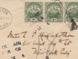

 

### Contact Intangible Textual Heritage

------------------------------------------------------------------------

The email address for the Internet Sacred Text Archive is:

[postmaster@ith.oarc.science](mailto:postmaster@ith.oarc.science?subject=ISTA)

------------------------------------------------------------------------

***FIRST TIME EMAILING US?  
WAIT! DON'T HIT SEND JUST YET!***

Please be considerate: We get a lot of email. Answering it diverts time
and energy from building the site. We've put a lot of effort into
answering all of the questions you have about the site. Click on the
links below to get started.

-   [Frequently Asked Questions](faq)
-   
-   

Here's a helpful tip: put the letters **ISTA** in your email subject
line, and we can guarantee that we'll at least *see* your email. Our
spam filter is set to deliver any email with those magic letters in the
subject line direct to our inbox.

There are a lot of files at this site. You can help us out by telling us
which file you are talking about when you email, that is, include the
URL of the file in your email. Otherwise we'll have to send you an email
with the subject line 'Huh?'

------------------------------------------------------------------------

Inquiries about sales, orders, shipments of Sacred Texts on Disk can be
addressed to:

[sales@ith.oarc.science](mailto:sales@ith.oarc.science?subject=ISTA)

------------------------------------------------------------------------

The postal address for the Internet Sacred Text Archive is:

Internet Sacred Text Archive (ISTA)  
P.O. Box 7429  
Santa Cruz, CA 95061-7429  
USA
