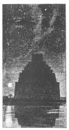
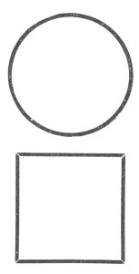

  
[Intangible Textual Heritage](../../index)  [Earth Mysteries](../index.md) 
[Index](index)  [Next](amm01.md) 

------------------------------------------------------------------------

[Buy this Book at
Amazon.com](https://www.amazon.com/exec/obidos/ASIN/0486435199/internetsacredte.md)

------------------------------------------------------------------------

*Architecture, Mysticism and Myth*, by W.R. Lethaby, \[1892\], at
Intangible Textual Heritage

------------------------------------------------------------------------

[  
Click to enlarge](img/front.jpg.md)

# ARCHITECTURE

# MYSTICISM

# AND MYTH

## by W. R. Lethaby

#### WITH ILLUSTRATIONS BY THE AUTHOR

 

|                                                                                                                        |
|------------------------------------------------------------------------------------------------------------------------|
| '*Are there symbols which may be called constant; proper to all races, all societies, and all countries?*'—CÉSAR DALY. |

 

 

#### Percival & Co., London.

#### \[1892\]

Scanned at Intangible Textual Heritage, March 2007. Proofed and
formatted by John Bruno Hare. This text is in the public domain in the
United States because it was published prior to January 1st, 1923. These
files may be used for any non-commercial purpose, provided this notice
of attribution is left intact in all copies.

<table data-border="0">
<colgroup>
<col style="width: 100%" />
</colgroup>
<tbody>
<tr class="odd">
<td data-valign="top">
'<em>And upon pelers grete, of jasper longe 
I sawgh a temple of glas ifounded stronge</em>.'—CHAUCER.
</td>
</tr>
</tbody>
</table>

------------------------------------------------------------------------

[Next: Preface](amm01.md)
