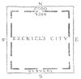
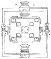

  
[Intangible Textual Heritage](../../index)  [Earth Mysteries](../index) 
[Index](index)  [Previous](amm05)  [Next](amm07) 

------------------------------------------------------------------------

[Buy this Book at
Amazon.com](https://www.amazon.com/exec/obidos/ASIN/0486435199/internetsacredte)

------------------------------------------------------------------------

*Architecture, Mysticism and Myth*, by W.R. Lethaby, \[1892\], at
Intangible Textual Heritage

------------------------------------------------------------------------

p. 53

### CHAPTER III

### FOUR SQUARE

<table data-border="0">
<colgroup>
<col style="width: 100%" />
</colgroup>
<tbody>
<tr class="odd">
<td data-valign="top">
'<em>A tower of strength that stood 
 Four square to all the winds that blow</em>.' 
                                           —TENNYSON.
</td>
</tr>
</tbody>
</table>

THE perfect temple should stand at the centre of the world, a microcosm
of the universe fabric, its walls built four square with the walls of
heaven. And thus they stand the world over, be they Egyptian, Buddhist,
Mexican, Greek, or Christian, with the greatest uniformity and
exactitude. When the world has become circular and spherical, the
squareness is retained almost universally as a characteristic of the
celestial earth, the four-square enclosure on the top of the world
mountain, where the polar tree or column stands, and whence issue the
four rivers. From the thought of such an enclosure we get, Lenormant
states, our word 'Paradise.'

The significance of the direction of buildings is much wider than is
understood by Orientation, a looking to the rising sun; for the
pyramids, and the Babylonian and Mexican stepped temples, or rather
altars, are square, and the Buddhist topes circular in a square
enclosure, with no sanctuary to define direction. When, however, there
is a major axis, it agrees (with some exceptions in Egypt) with the
sun's path through the heavens.

p. 54

The universal early use in temples was to have the entrance at the east,
facing the sunrise, and the more sacred part of the sanctuary to the
west, where was the throne of the presence. It was the god or the altar
that thus fronted the sun as it rose through the eastern door, and the
reversal of this later seems to have been the result of the temple
becoming a place for congregation rather than a local habitation of the
god.

Egypt furnishes some exceptions in temples, which have their axes at
various angles. In a recent lecture (May 1891) before the Society of
Antiquaries, Mr Norman Lockyer explained some conclusions he had reached
as to complicated temple groups like that at Karnak. Starting with
Mariette's dates obtained from the inscriptions, and searching the
star-lists for each angle, he found that the temples were directed to
watch certain important stars, such as Gamma Draconis, Canopus, and
Vega. When, owing to the precession of the equinoxes, the star no longer
rose or set through the open portal as viewed from the remote and dark
sanctuary which was specially contrived like a great stone telescope for
the purpose of receiving pure light, another temple was built at an
angle with the first, and possibly across its 'fairway' to the horizon,
for it was no longer required. This is evidently a refined and
complicated system, and therefore comparatively late.

The pyramids, however, are set out with the greatest accuracy. Mr
Petrie's careful survey shows that the Great Pyramid deviated only 5´,
and he says that it is the world that has shifted rather than the
structure—no fault to its builders! The group of three, moreover, stand
*en echelon*, so that each has its four sides clear to the four quarters
to which Mariette says they were dedicated. On the east side of each was
a small

p. 55

isolated temple with its door eastward. One of these is the so-called
temple of the Sphinx. 'It is to be noticed,' Mr Proctor says, 'that the
peculiar figure and position of the pyramids will bring about the
following relations. Between the autumn and the spring equinoxes the
rays of the rising and setting sun illuminated the southern face of the
pyramids; whereas during the rest of the year, that is, the six months
between the spring and autumn equinoxes, the rays of the rising and
setting sun illuminated the northern face.' The slanting passage appears
to have pointed directly to the pole star.

'Like the house of the living, the tomb was strictly oriented, but after
a mystic principle of its own. In the necropolis of Memphis the door of
nearly every tomb is turned to the east, and there is not a single stele
which does not face in that direction. In the necropolis of Abydos both
door and stele are more often turned towards the south; that is, towards
the sun at its zenith. But neither at Memphis, at Abydos, nor at Thebes
is there a tomb which is lighted from the west, or presents its
inscription to the setting sun. Thus, from the shadowy depths where they
dwell, the dead have their eyes turned to the quarter of the heavens
where the life-giving flame is each day rekindled, and seem to be
waiting for the ray which is to destroy their night, and to rouse them
from their long repose' (Perrot and Chipiez). 'The major axis of the
rectangle upon which these structures (tombs) are planned always runs
due north and south; and at Gizeh, the necropolis of the west, they are
arranged upon a symmetrical plan, so as to resemble a chessboard, on
which all the squares are strictly oriented. The principal face of the
tomb is turned to the east. In four cases out of five the entrance to
its chambers, when there is one, is found upon this face. Next

p. 56

after the eastern face in relative importance comes that which is turned
towards the north' (Mariette).

That orientation in a limited sense was not the object to the Egyptians,
but rather a desire to make their building square with the cardinal
sides of earth and sky, is again and again expressed in the
inscriptions. That of Thothmes III. on the foundations of Karnack says
that 'after the position of the building had been fixed according to the
position of the four quarters the great stone gates were erected'
(Brugsch). This laying out the lines to square with the world is a part
of ceremonial at foundations in all countries at all times; we see it
again and again repeated, as also the thought that there was a magic
influence in it, the magic of correspondence; for, as the foundations of
heaven and earth are firm, 'not to be moved for ever,' so the building
imitating them would share their stability. In Egypt it is expressed in
a regular formula—'It is such as a heaven in all its quarters,' 'firm as
the heavens.' In the Psalms, as also in the Vedas, the firmness of the
world temple is extolled.

The Buddhist buildings are strictly related to the heavens. The circular
tope is surrounded by an enclosure exactly square, with a gateway to the
north and to the south, to the east and to the west; the east gate being
the chief entrance, the west the exit. The temples containing statues of
Buddha were entered at the east—'Statue of Buddha facing the east,'
Fa-Hian reiterates. The Hindu temple of Jagannatha follows the same
rule. In the temples of Japan, a mirror hangs at the far end; and in the
old temples of Peru a golden disc of the sun, over the altar, fronted
through the open door the dawn of day.

The Greek temples were entered at the east. Mr Penrose finds that, like
the Egyptian temples, the

p. 57

axis through the open door was directed to the point of rising of some
star which appeared above the horizon before dawn. The Syrian and
Persian temples were also entered at the eastern end.

In Western Asia (again to quote from Perrot) 'the inhabitants of
Mesopotamia were so much impressed by celestial phenomena, and believed
so firmly in the influence of the stars over human destiny, that they
were sure to establish some connection between those heavenly bodies and
the arrangement of their edifices. All the buildings of Chaldea and
Assyria are oriented; the principle is everywhere observed, but it is
not always understood in the same fashion. Mesopotamian buildings were
always rectangular and often square on plan, and it is sometimes the
angles and sometimes the centres of each face that are directed to the
four cardinal points. The earlier Chaldean structures, as Warka, follow
the former method, as do the remains at Nineveh.' 'On the other hand, in
those ruins at Nimroud that have been identified with the ancient Calah,
it is the sides of the mound and of the buildings upon it that face the
four cardinal points. The first of these two methods of orientation had
the advantage of establishing a more exact and well-defined relation
between the disposition of the building and those celestial points to
which a peculiar importance was attached.' The two small temples
excavated at Nimroud by Layard were entered at the east, and had their
sanctuaries to the west. The inscriptions repeat very much the thoughts
which we have seen were present to the Egyptian builders. In the
inscription on the great bulls at the entrance gates of the square
enclosure at Korsabad the founder says, 'I placed the lintels in the
four heavenly directions, I opened eight gates in the direction of the
four cardinal points. Towards the four regions of the sun

p. 58

\[paragraph continues\] I disposed the
cornices and the door posts' (Inscription of Sargon, B.C. 710, 'Records
of the Past').

 

Of this four-sided world, each quarter had a 'regent,' apparently in
their origin the winds. These four guardians of the regions play a part
in many systems, and generally under the symbols of amorphous persons or
beasts.

That this was the case in Egypt we have the word of Mariette; they are
the 'four powers of the Amenti,' whose heads, three animal and one
human, surmount the four funereal vases in the burial ceremonies.

In the northern system of the Edda the heavens,. which were set up with
four sides, have a dwarf supporting every corner.

In the myths of ancient America these creatures play a large part, and
are defined clearly as the four winds. 'In the mythology of Yucatan the
four gods Bacab were supposed to stand one at each corner of the world,
supporting like gigantic caryatides, the overhanging firmament. When at
the general deluge the other gods and men were swallowed by the waters,
they alone escaped to people the earth anew. . . . The East was
distinguished by yellow, the South by red, the West by black, the North
by white, and these colours appear again in different parts of the world
with the same meaning, as representing the four quarters of the world'
(M. Müller, Gifford Lect. 1890).

All over the East these four kings of the regions are known. In the
Avesta and other Persian writings they are described as 'four chieftains
appointed on the four sides.' They are the four Maharajas of the
Buddhists. 'Great champions of the earth and the heavens against the
demons. These four are represented in full armour with drawn swords'
(Sir M. Williams). In a mystical form they enter into Jewish.

p. 59

tradition. They appear as the four composite creatures of Ezekiel's
vision, full of eyes, that support the firmament, 'the colour of the
terrible crystal which stretched forth over their heads above,' with
faces of a man, a lion, an ox, and an eagle. They seem to stand at the
four cardinal points, the lion on the right side (south), and the ox on
the left (north).

The pseudo Enoch writes: 'I also beheld the four winds which bear up the
earth, and the firmament of heaven,' and in his vision of heaven he
'heard the voices of those upon the four sides magnifying the Lord of
Glory.' He asks whose were the four voices of the four sides, and is
told that they are Michael, Raphael, Gabriel, and the fourth Phanuel.

In the Apocalypse, it is these, the beast symbols of the North, South,
East, and West, round about the throne, who 'cease not day nor night,
saying, Holy, holy, holy.' The 'four winds of the four corners of the
earth' are also mentioned in Revelation vii. 1.

Compare the like forms of the protecting genii of the Chaldeans given by
Lenormant (Magic, p. 121). The four riders in the Revelation on horses
white, red, black, and pale resemble the four chariots with horses, red,
black, white, and grisled in Zechariah (chap. vi.). 'These are the four
spirits (or winds) of the heavens.' Renan thinks the riders of the
Apocalypse are planets, but see how each is associated with one of the
four beasts, and how they had power over a fourth part of the earth.
Lenormant tells us (Contemp. Rev. Sept. 1881) that the four rivers
spouted out from their fount on Meru through the mouths of four symbolic
animals of four colours and metals. E. white or silver, S. red or
copper, W. yellow or gold, N. brown or iron. These are the colours of
the four castes and of all kindred who set out from Meru to people the
world.

Then there are the four ages 'of the gradual degeneracy

p. 60

of successive ages, which is expressed by the metals the names of which
are applied to them; gold, silver, bronze, and iron' (Lenormant). Remark
also how in Daniel vii., 'Four great beasts diverse from one another,'
symbolise the coming of four great kingdoms.

These four symbols we find present in our microcosm the temple. In the
Buddhist temples of China, 'two colossal wooden statues meet the eye on
each side, these are the four great Kings of Devas; they govern the
continents lying in the direction of the four cardinal points from mount
Sumeru.' They are called *Tein-Wang*, 'the Princes of Heaven.' Miss Bird
saw them in Japanese temples painted in bright colours, and trampling
demons under foot. The 'Celestial' army, according to directions in the
ancient books, was to be marshalled under the banners of these four
regents of the quarters; to the East a blue Dragon, West a white tiger,
a red bird to the South, and to the North a black warrior.

The celestial mount Meru was of different colours on the four sides. In
the temple to the Spirits of Land and Grain at Pekin, 'the terrace is
laid with earth of five colours arranged according to the ordinary
Chinese distribution of the five colours among the cardinal points: blue
is east, red is south, black is north, white is west, and yellow is
central. The inner wall is built with different coloured bricks on each
of its four sides, according to position' (Edkins, in Williamson's
Journeys).

If we rearranged these colours for ourselves, white might reasonably
stand for the east as the point of light, red for the meridian sun of
south, blue for the west of evening, and black for north.

Sometimes there appears to have been eight regents, who thus guarded the
angles as well as the sides of the

p. 61

square, just as the four winds became eight. In the *Ramayana* the City
of Ayodhya is described: 'Every gate of the city was guarded by mighty
heroes who were as strong as the eight gods who rule the eight points of
the universe.' These eight giant porters are sculptured in pairs on the
side posts of each of the four gates at the Sanchi tope.

The guardians of the corners of the world stand at the four angles of
the Egyptian sepulchral chamber shown in the papyrus of Ani, published
by the British Museum: and as the four powers of the Amenti they always
accompany the throned Osiris. Under the form of the four beast-symbols
of the Evangelists they rightly fill the pendentives of the domed
heavens of Byzantine churches, as at the Mausoleum of Galla Placidia. At
St. Mark's the four Evangelists stand over the four heavenly rivers,
which pour out their waters one in each angle; and we seem still to
preserve in the nursery the tradition of these watchers—

'Matthew, Mark, Luke, and John,  
 Bless the bed that I lie on,  
 Two to foot, and two to head,  
 Four to carry me when I'm dead.'

In Chaldea there were powers, not beneficent guardians, but to be
guarded against. 'From the four cardinal points the impetuosity of their
invasion burns like fire. They violently attack the dwellings of man'
(Chaldean Magic).

They were legion, but certain spirits of the winds seem to have had
distinct forms according to the quarters from which they approached.
These demons had horrible compound forms made up of lion, eagle, bull,
scorpion, and whatever beast bites, thrusts, and stings, and Lenormant
remarks how the talisman consisted of the form of the power to be
combated

p. 62

placed to face the quarter from which each one acted; for so terrible
was each of them in appearance, that it was affrighted by its own image,
like a Gorgon slain by a mirror. Besides the great bulls and lions
guarding the doors, there were sculptured on the walls of the façade a
combat between the Chaldean Hercules, Gilgames (Gizdhubar), 'Patrol of
the four regions,' and one of these creatures.

At Persepolis there are four colossal sculptures of this kind, of which
fine photographs are given in Dieulafoy's great work, and they are
described by Sir R. K. Porter as—(1) A compound of lion with head of
eagle; (2) a winged lion with eagle's claws; (3) a horned lion; and (4)
a unicorn bull. All these the hero, in this case Cyrus the King, calmly
slays with the sword, a token to the demons what they were to expect.

 

The world walls made a vast square, the type of all perfect gardens and
cloisters, the enclosure four-square, in which, according to the Avesta,
man was first placed. The square paradise of Yima, where men were saved
from the flood. The word Yard (garth) is but the Scandinavian Garth, the
world.

The Sacred Court, the Temenos of the Greeks, the Haram or Mosque of the
Arabs, preceded the temple; the steps probably being—(1) The Sacred
Site; (2) the Enclosure delimiting this; (3) the Altar; (4) the Shrine
by the Altar in the Court, the dwelling of the Deity worshipped from
without by procession and prostration; (5) the Altar is brought within
the building; and (6) the temple becomes a place for congregation, the
orientation being changed.

The Book of Enoch, after describing the rising and setting of sun and
moon, proceeds to account for the winds: 'I beheld twelve gates open for
all the winds;

p. 63

three of them are open in the front of heaven, three in the west, three
on the right side of heaven, and three on the left. The first 

<table data-align="RIGHT">
<colgroup>
<col style="width: 100%" />
</colgroup>
<tbody>
<tr class="odd">
<td data-valign="CENTER"><a href="img/fig03.jpg"> 
Click to enlarge</a> 
 
</td>
</tr>
</tbody>
</table>

three are those which are towards the east.'

This is the perfect type of the Temple enclosure, or the City wall; 'on
the east three gates; on the north three gates; on the south three
gates; and on the west three gates.'

Compare Ezekiel's vision (c. 48) of the ideal city 4500 measures square,
and three gates to each quarter, with the plan of an Assyrian, or a
Hindu enclosure, or with the walls of the City of Pekin (Taidu), as
described by Marco Polo: 'The 

<table data-align="RIGHT">
<colgroup>
<col style="width: 100%" />
</colgroup>
<tbody>
<tr class="odd">
<td data-valign="CENTER"><a href="img/fig04.jpg"> 
Click to enlarge</a> 
 
</td>
</tr>
</tbody>
</table>

wall of the city has twelve gates, three on each side of the square.'
The modern town of Mandalay, the Burmese capital city, is likewise
walled square, a mile and an eighth long on every face, and there are
twelve gates, three on every side. The palace is in the midst, and in
the exact centre of the palace and of the city rises the seven-roofed
spire, which the Burmese look upon as the centre of Burma, and therefore
of creation (Scott, 'Burma').

p. 64

\[paragraph continues\] The perfect type
of these cities is the Chinese square enclosure, with twelve gates of
the 'Hall of Distinction,' as figured in Dr Morrison's 'Dictionary,' or
of the Temple of Earth at Pekin given by Du Halde. That the gates should
face the cardinal aspects is quite universal. Was it not on issuing from
the four gates of the city in succession, beginning at the east, that
Buddha saw the sights which made him enter on 'the path'? The towns in
England of Roman foundation still have north, south, east, and west
gates, following the camps and the Etruscan cities. The east gate was
reserved for the prince as directed by Ezekiel. When there are three
gates together, the central one is the Royal Gate, 'and kept shut,
except when the Khan passes that way,' as Marco Polo says; just as in
the great churches from Constantinople to Chartres, the middle door is
the King's. From the triple eastern gate the main avenue ran westward,
as at Alexandria. At Palmyra, over fifteen hundred columns, sixty feet
high, were disposed in four rows. At Damascus 'the street called
Straight' started from the east gate, and had two rows of Corinthian
pillars. 'Every great city of the East had a *via recta*—a "straight
street," or high street, somewhat similar in plan and ornament to that
at Palmyra' (Porter, 'Bashan').

This four squareness was a talismanic assurance of permanence and
stability. The thought that, as the heavens were stable upon the earth,
so any building four square with them would be immovable, seems, as we
have seen, a natural analogy. Fa-Hian says of a Buddhist monastery, 'The
side is forty paces square; though heaven should quake and the earth'
open, this spot would not move.' Professor Beal in a note compares this
with the Egyptian treasure city of Rameses, 'solid upon the earth like
the four pillars of

p. 65

the firmament.' In the Talmud the Temple of Jerusalem is called the
'immovable house;' and it is surely the same symbol of indestructibility
that is taken by St. John in the cubical city of the Apocalypse.

The most ancient form of Rome, 'the City of Romulus,' was called *Roma
Quadrata;* it was built on the Palatine Hill, and enclosed by a wall,
around which the sacred pomœrium was marked out by a plough furrow, a
religious ceremony in the foundation of towns by the Etruscans. 'Within
the area of Apollo (temple on the Palatine) was also a mysterious object
which appears to have symbolised the ancient *Roma Quadrata*. This
sacred object, which was probably a cubical block of stone used as an
altar, was called *Roma Quadrata*, and was surrounded by a circular
trench, the *Mundus*, a symbol of the mystic plough turned furrow, by
which the pomœrium or sacred circuit line was marked in accordance with
the primitive religious ceremonies performed while founding a new city'
(Middleton, 'Ancient Rome').

Of all forms, the cube and the hemisphere are the most sacred; the first
was that of the Sanctuary at Jerusalem, and that chosen by St John as
the type of the Holy City; 'its length, breadth, and height were equal.'
Mr Fergusson tells us that the temple of Herod was 100 cubits long in
the body, 100 cubits high, and 100 cubits broad on the façade, 'so as to
make it practically a cube, or at least a building of three equal
dimensions.' The cube was the form of the shrine of one stone forty
cubits every way that Herodotus saw in Egypt; the Phœncian shrines found
by Renan at Amrit; and the Caaba, 'the cube,' of Mecca. The temples of
Janus Quadrifrons were 'built with four equal sides, with a door and
three windows on each side.'

p. 66

\[paragraph continues\] The hemisphere is
the form of the Buddhist topes. To combine the two has been the
builder's problem in all ages.

Another form is also persistent—the double-square; Vitruvius, indeed,
says, 'The length of a temple must be twice its width;' and, roughly,
this is the proportion to which classic examples conform. Plato makes
the temple that surmounted his ideal city one stadium long by half a
stadium wide. The King's chamber in the great Pyramid is exactly of this
proportion, as was the Cella of the Temple of the Jews. We have seen the
classic geographers of the fourth century, B.C., amongst whom is
Pytheas, making the earth of precisely this form, and a reason has been
suggested sufficient to account for it. Another, however, which must
strongly have confirmed their view is to be found in the range of the
sun along the horizon from the winter to the summer solstice.
Symmetrical both on the rising and setting horizons, and subtending an
angle which seemed just within the ends of a parallelogram of which the
width was equal to half its length.

Now to the Hindus east to west is 'lengthways,' north to south is
'crossways.' In the Persian *Bundahish* it is said, 'From where the sun
comes in on the longest day to where it comes in on the shortest day is
the East; from where it comes in on the shortest day to where it goes
off on the shortest day is South; where it goes in on the shortest to
where it goes in on the longest day is the West; from where it comes in
on the longest to where it goes off on the longest day is the North.' In
the Talmud an exactly similar account is given. The sun rages, up and
down the eastern and western horizon like a mighty beast prisoned in a
cage; it cannot go farther because of the enclosing sides of the
firmament. The gates

p. 67

for it to pass to the lower world and rise again are only found in the
ends of the box.

We need barely refer to the actual use of the Temple as a calendar; the
sun ray entering at the eastern door at the moment of its appearance
above the horizon was certainly registered, and so gave in a long series
an accurate observation of the solar year; once a year more especially
it exactly fell on the altar. Even now in some of the French
cathedrals—Bourges and Nevers, for instance—diagonal lines maybe seen
right across the floor graduated into a scale of months and days.

 

The observations and ceremony connected with determining the
orientation, and laying the foundation stone, were of the greatest
importance. Brugsch gives an inscription recording the foundation of
Abydos: 'I gave the order,' says the King, 'to prepare the cords and
pegs for the laying of the foundation in my presence. The advent of the
day of the new moon was fixed for the festival of the laying the
foundation stone.'

According to Berosos, the gods taught the Chaldeans the rules for the
foundation of towns and building of temples. Of the modern Buddhist
custom, Bock gives us an instance from Siam: 'The site being duly
dedicated to the purpose, eight round stones are taken, and a
parallelogram marked out with them, one being placed at each of the
eight points of the compass.' In the old Latin rites (quoting the French
Dictionary of Antiquities) one of the chief duties of the augurs was to
set out the new temple foundation from the heavens. The usage 'appears
to have been to direct the *Cardo* according to the meridian when the
observer faced the south, and had at his left the east, "the happy
side," later they adopted the Etruscan

p. 68

practice, and turned towards the west, with the view of combining the
ideas of the Etruscans, who placed the seat of the gods to the
north—therefore the happy side—and the Roman custom which had placed the
north to the left in turning to the east. It has been thought that at
times the *Cardo* was not the axis, but the diagonal of a square, and
that the augur stationed at the centre directed his vision to the
angles.'

To the late Romans of the time of Vitruvius the aspect seems to have
been opposed to what had been the universal earlier practice. He tells
us, 'If there be nothing to prevent it, and the use of the edifice allow
it, the temples of the immortal gods should have such an aspect that the
statue in the Cella may have its face towards the west, so that those
who enter to sacrifice, or to make offerings, may have their faces to
the east as well as to the statue in the temple. Thus suppliants and
those performing their vows seem to have the temple, the East, and the
Deity, as it were, looking on them at the same moment. Hence all the
altars of the gods should be placed towards the east.' In another place
he explains how the true north may be obtained. In a marble slab or a
level space a gnomon is placed upright. The shadow cast by the gnomon is
to be marked about the fifth hour before the meridian, the extreme point
being accurately determined, and from the centre of the gnomon a circle
is described equal in radius to the length of the shadow just obtained.
After the sun has passed the meridian watch the shadow until the moment
when it touches the circle again at another point; a line drawn from the
centre bisecting the arc thus obtained will indicate the north.

Christian buildings at first followed the old westward direction of the
Jewish temple; for instance, the Church of the Holy Sepulchre in
Jerusalem built by

p. 69

\[paragraph continues\] Constantine. So
also early churches in Italy, and even here in England, were
'occidented' rather than oriented. This ultimately gave way to the
eastward direction; all Justinian's churches have their prospect towards
the east, and it becomes of interest to determine if this is with the
object of their being directed towards Jerusalem, or of conforming to
orientation. The great church built by Constantine at Bethlehem, which
is directly south of Jerusalem, and only a few miles off, lies east and
west, not north and south, as it would if directed to the Holy City.
Still further south the Coptic Churches of Egypt are described by Mr
Butler as having the entrance 'almost invariably towards, if not in the
western side, while the sanctuaries lie always on the eastern.' Far
south in Abyssinia the curious excavated monolithic churches follow the
same axis west to east.

A passage in Procopius gives a clear statement of the purpose in the
orientation of Sta Sophia, the great Church of Christendom. He says,
'The part where the sacred mysteries are performed in honour of God is
built towards the rising sun.' And of the Church of the Apostles,
rebuilt by Justinian, in Constantinople, he gives this interesting
relation: 'The lines were drawn in the form of a cross, joining one
another in the middle, the upright one pointing to the rising and the
setting sun, and the other cross line towards the north and the south
wind. These were surrounded by a circuit of walls, and within by columns
placed both above and below; at the crossing of the two straight lines,
that is, about the middle point of them, there is a place set apart that
may not be entered except by the priests, and which is consequently
termed the sanctuary. The transepts which lie on each side of this about
the cross line are of equal length; but that part of the upright line
towards the

p. 70

setting sun is built so much longer than the other part as to form the
figure of the Cross.'

The old Antiquary Stukeley gave a very clear account of orientation
anticipating the points here set out. 'Ever since the world began, in
building temples or places of religious worship, men have been studious
in setting them according to the quarters of the heavens; since they
considered the world as the general temple, or house of God, and that
all particular temples should be regulated according to that idea. The
east naturally claims a prerogative, where the sun and all the planets
and stars rise. The east they therefore considered the face and front of
the universal temple.'

------------------------------------------------------------------------

[Next: Chapter IV. At the Centre of the Earth](amm07)
