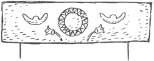
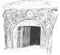
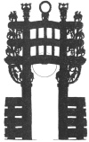
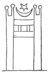
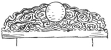

  
[Intangible Textual Heritage](../../index)  [Earth Mysteries](../index.md) 
[Index](index)  [Previous](amm10)  [Next](amm12.md) 

------------------------------------------------------------------------

[Buy this Book at
Amazon.com](https://www.amazon.com/exec/obidos/ASIN/0486435199/internetsacredte.md)

------------------------------------------------------------------------

*Architecture, Mysticism and Myth*, by W.R. Lethaby, \[1892\], at
Intangible Textual Heritage

------------------------------------------------------------------------

p. 174

### CHAPTER VIII

### THE GOLDEN GATE OF THE SUN

<table data-border="0">
<colgroup>
<col style="width: 100%" />
</colgroup>
<tbody>
<tr class="odd">
<td data-valign="top">
        .        .        .'<em>The eastern gate 
Where the great sun begins his state</em>.'—MILTON.
</td>
</tr>
</tbody>
</table>

'*The doors of Heaven seem slowly to open, and what are called the
bright flocks of the Dawn step out of the dark stable, returning to
their wonted pastures. . . . Not only the east, but the west, and the
south, and the north, the whole temple of Heaven, is illuminated*.'—MAX
MÜLLER (*Comp. Myth*.).

WHEN the earth, or rather the wall of mountains surrounding the utmost
bounds of ocean, was the foundation of the solid sky, some contrivance
was necessary to account for the disappearance and return of the sun. A
new sun, it was thought, was created in the morning to die at night, the
creature of a day. Others believed that when it reached the ocean it was
floated round by the north to the place of rising in the east; or that,
as the earth rose in the north like a great mountain, the sun was
periodically hidden behind it. The general early view, however, was that
there were two openings—the Gates of the East, and the Gates of the
West. Through the one the sun enters in the morning the mundane temple,
to pass out at the other in the evening, and thence pursue its way back
by the dark path of the under world.

p. 175

Thus Hesiod:—

'There night and day, near passing, mutual greeting still  
 Exchange, alternate as they glide athwart  
 The brazen threshold vast. This enters, that  
 Forth issues, nor the two can one abode  
 At once contain. This passes forth and roams  
 The round of earth. That in the mansion waits  
 Till the due season of her travel come.'

In the Veda:—'The dawn shone with brilliance and opened for us the doors
that open high and wide with their frames.'

In Babylonia the same scheme is shown, in such texts as the invocations
to the rising sun, given in Records of the Past,' and by Lenormant, of
which the first is curiously like Hesiod. 'He opened great gates on
every side; he made strong the portals on the left hand and on the
right; in the centre he placed luminaries. The moon he appointed to rule
the night and to wander through the night until the dawn of day.'

'Sun, thou shinest in the lowest heavens: Thou openest the bolts which
close the high heavens: Thou openest the gate of Heaven.' Or:—'In the
great door of the high heavens in the opening which belongs to thee.'
Steps led up the sky from the east gate and descended to the west
(Lenormant). Dr Hayes Ward in the American Journal of Archæology (Vol.
3), shows some dozen Babylonian seals, with intaglios of the Sun-god
passing through the double-valved gate of the East and beginning to
climb the mountain of the sky. The gate has two guardian figures.

To the Egyptians, the sun was The Opener. The gates to the grave land
are often mentioned in the Book of the Dead, and are figured on the
tombs.

In Virgil, it is the slamming of these great portals

p. 176

of the firmament that makes the thunder resound from the whole vault of
heaven; probably a primitive thought, as it is such a good explanation,
'quem super origens porta tonat cæli' (Georg. iii. 260).

To the Phœnicians, Hercules (Melkarth) the sun-god, established in the
distant west the Pillars of Hercules, identified afterwards with the
mountains on either hand at the Straits of Gibraltar; but even as late
as Tacitus it was not decided where they were, nor what.

 

Such being the gates of the world structure, we may expect temple doors
to have a definite relation to their great prototypes; and accordingly
in chapter iii. we saw that not only did the building offer its four
walls to the four heavenly aspects, but it was the universal early
practice for the great door to be 'the Gate of Sunrise.' This door of
enormous size was properly the sole opening to the temple, serving as
much for light as to enter by; it was thrown open at dawn, and the sun
thus entered the world temple and its microcosm at one bound. His symbol
signs as we shall see the temple gates, and by a natural reaction, what
belongs to one idea is reflected in the other.

In Egypt the gates of the under world through which the sun passes are
shown in the illustrations to the Book of the Dead as great pylons like
the entrances to the temples. Every temple pylon becomes a sun gate, and
sculptured and painted on the centre of its lintel is the red disc of
the sun. 'The winged globe,' says Wilkinson, 'always having its place
over the doorways.' And Perrot and Chipiez, 'It was generally ornamented
with the winged globe, an emblem which was afterwards appropriated by
the nations which became connected with Egypt. This emblem in its full
development was formed by the

p. 177

solar disc, supported on each side by the uræus, the serpent which meant
royalty. The disc and its supporters are flanked by two wide-stretching
wings with rounded fan-shaped extremities, which symbolized the untiring
activity of the sun in making its daily journey from one end of the
firmament to the other. Egyptologists tell us that the group as a whole
signifies the triumph of right over wrong, the victory of Horus over Set
(light over dark). An inscription at Edfou tells us that after this
victory Thoth ordered that the emblem should be carved over every door
in Egypt, and in fact there are very few lintels without it.' That is,
there was a sacred legend saying that the God of Wisdom ordered the sun
to be represented on every portal, to symbolise the victory of the sun
over darkness, in the struggle at daybreak at the gates of the east.

These colossal gates are the all-important features to which the shrines
are but secondary; so much so that an Egyptian temple might be defined
as a series of gates. They were most impressive in themselves and their
ritual significance must have awed into thought and silence whoever
entered. Miss Edwards thus describes Karnak, Denderah, and the rock-cut
temple at Aboo Simbel. 'Crossing this court in the glowing sunlight we
came to a mighty doorway. Only a jutting fragment of the lintel stone
remains. That stone when perfect measured forty feet and ten inches
across. The doorway must have been full a hundred feet in height'
(Karnak).

'The winged globe depicted upon a gigantic scale on the curve of the
cornice seems to hover above the central doorway' (Denderah).

'On certain mornings in the year, in the very heart of the mountain, as
the sun comes up above the eastern hill-tops, one long level beam
strikes through

p. 178

the doorway, pierces the inner darkness like an arrow, penetrates to the
sanctuary, and falls like fire from Heaven upon the altar at the feet of
the gods. No one who has watched for the coming of that shaft of
sunlight can doubt that it was a calculated effect, and that the
excavation was directed at one especial angle in order to produce it. In
this way Ra, to whom the temple was dedicated, may be said to have
entered in daily, and by a direct manifestation of his presence to have
approved the sacrifices of his worshippers' (Aboo Simbel). Sculptured
over the door is a figure of Horus bearing the sun disc.

[  
Click to enlarge](img/fig17.jpg.md)  
  

An inscription of Rameses II. on the temple of Ptah, at Memphis, might
well boast:—

'Its gates are like the heavenly horizon of light.'

The Phœnicians likewise signed with the sun the centre of their
doorways, borrowing the Egyptian orb at Byblos. At Ebba the sun rises
between two moons (see above from Perrot). The great ceremonial propylæ
to the temples, as shown on the coins, have the sun and moon depicted
immediately above them. And in the ruins at Medeba, in Moab, Dr Tristram
found upon a lintel over an ancient doorway the sculptured emblems of
the sun and moon.

p. 179

\[paragraph continues\] The acroterion of
the portico of the Heræum at Olympia, the oldest known temple in Greece,
was a solar disc; and another instance of the same kind is given by
Lebas and Waddington.

In the classic period of Syrian art most of the great temple doors had
sculptured on the under side of the epistyle an enormous eagle with
expanded wings. The great eastern door of the sun temple at Baalbek,
'city of the sun,' is the finest of these; it is 21 feet wide, and
therefore, some 40 feet high, as the approved proportion was twice as
high as broad. 'Here on the lower surface (lintel of the door) is the
celebrated figure of the crested eagle, beautifully wrought, holding in
his talons a caduceus, and in his beak strings of long garlands
extending on each side, where the other ends are borne up by flying
genii. The crest shows that it was not the Roman eagle; but as the same
figure is found in the great Temple of the Sun at Palmyra, Volney and
others regarded it as the Oriental eagle consecrated to the sun'
(Robinson 'Palestine Researches').

The lintel of Palmyra is figured by Wood and Dawkins. The door faces due
east, and the great eagle appears to fly into the temple, the wings
expanded ten or twelve feet; the rest of the space is occupied by stars,
and two genii of the dawn. In front, on the eastern side of the vast
court, 700 feet square, is a magnificent propylon.

The Memoirs of the Palestine Exploration Society  describe remains of a
temple of similar style at Kades, fronting full east, with three
doorways, the centre one being very large. 'The lintel, which lies
broken in front of the doorway, bears on the under side a representation
of the winged deity, the Sun; it resembles the lintel of the small
temple at Baalbek.'

Another remarkable instance is the great eastern

p. 180

portal of the temple of Baalzamin, figured and described by De Vogüé.
Here is, first, a 'solar head with rays' on the lintel; the lower side
of the architrave of the pillared portico has the solar bird, and on its
front face is a large sculptured disc.

[  
Click to enlarge](img/fig18.jpg.md)  
  

The cornice or arch of the door was at times only charged with a
circular sun-disc, as that of the tomb at Shefa Amr, in Galilee, here
figured. It was this tradition that was afterwards followed in the
universal Syrian Christian custom of placing a disc with the sacred
monogram or cross on the lintel, usually with ribbon-like appendages,
right and left, which are direct survivals of the Egyptian uræus, that
in a similar position accompanied the sun's orb. This becomes a

p. 181

decorative commonplace in Byzantine art, either at Constantinople or
Venice.

In Persia also the gates were dedicated to the sun. At Hatra, a temple,
supposed to have been erected under the Parthian dynasty, has the sun
rising between two moons displayed on the eastern door; this, and many
others, have birds right and left, emblems of dawn. Later, under the
Sassanian kings, the tradition was preserved on the great arch of
Chosroes II., at Tak-i-Bostan. Flandin shows at its crown a crescent
moon, and on either hand flying genii. There was also, Rawlinson thinks,
a ball, 'thus presenting to the spectator, at the culminating point of
the whole sculpture, the familiar emblems of two of the national
divinities.'

A symbol of the sun is placed in the same way centrally over the great
ceremonial gates of the enclosure of the Buddhist topes, which face the
cardinal points, the ritual providing that the procession should enter
by the gate at the east, circle round the dome—representing the
firmament—and go out at the west. These wheel symbols of the sun remain
at Sanchi; and the custom would seem to have been followed generally,
for an ancient native authority says that the Raja of Ceylon inserted
gems in the centres of '*the four suns*' in the great tope. 'This,
perhaps,' adds General Cunningham, 'points to the absorption of the
ancient sun-worship into Buddhism; for the wheel was one of the common
and obvious emblems of the sun.' (In the Talmud the sun was the great
whirling wheel. 'But for the noise of the solar wheel, the hubbub of The
City (Rome) might be heard; but for the noise of the city, the sound of
the revolving wheel.')

In Orissa, we find not only the sun, or sun and moon,

p. 182

but the whole of the planets. 'The *Nava Graha*, or nine planets, adorn
the lintels of all the temples of the Kessari line' (Fergusson).
Sometimes they are sculptured figures, at others merely nine bosses.

[  
Click to enlarge](img/fig19.jpg.md)  
  

It is impossible not to compare the great Buddhist gateways, with their
triple lintels and sun-discs, to the propylons of Phœnician temples
preserved in

p. 183

semblance on coins (see that of Paphos, figured below). These have
double lintels binding the otherwise isolated sideposts, and over the
centre of the lintel are the sun and moon. Probably the doorposts of the
sun-gates in the East and West are the origin of the two pillars that
served for symbol of Melkarth in Phœnician temples, for this symbol was
not a single stone, a shapeless ærolith, but a pair of pillars of metal
or emerald glass, almost certainly connected by a 

<table data-align="RIGHT">
<colgroup>
<col style="width: 100%" />
</colgroup>
<tbody>
<tr class="odd">
<td data-valign="CENTER"><a href="img/fig20.jpg"> 
Click to enlarge</a> 
 
</td>
</tr>
</tbody>
</table>

lintel. They are bethels and Gates of Heaven' dedicated to the Opener.
Perrot remarks that, 'in speaking of the Phœnician and Syrian temples,
classic authors often mentioned the tall pillars which rose in couples
before the sanctuary. In the temples of Melkarth, at Gades, they were of
bronze, eight cubits high, and bore a long inscription. In the shrine of
the same deity at Tyre the admiration of Herodotus was stirred by the
sight of two shafts, one of pure gold and the other of emerald, that is,
of lapis lazuli or coloured glass. These shafts or stelæ probably stood
in similar places to those occupied at Jerusalem by Jachin and Boaz, the
two famous bronze columns, which rose at the threshold of a building
also erected by a Phœnician architect.'

Such pillars have been found engraved as a symbol of Melkarth on a
votive stele (*see* Perrot's Phœnicia), and they really form a gateway,
a trilithon, for, standing apart, they are connected by a lintel; over
them are the sun and moon—a counterpart of the gateway to the temple on
the coin of Paphos.

p. 184

Professor Robertson Smith, in the recent volume of the 'Encyclopædia
Britannica' (art. Temple), says definitely: 'Such twin pillars or twin
stelæ in stone are of constant occurrence in Phœnician sacred art, and
are still familiar to us as the Pillars of Hercules.'

The Egyptian obelisks that flank the great portals of the temples, at
once occur to us as having a corresponding intention. In both ancient
and modern times the symbolism of these is understood to be solar.
'Dedicated to the sun,' says that at Rome set up by Augustus. According
to Pliny, they 'represent rays of the sun.' 'The obelisks,' says Ebers,
'were sacred to Ra, the sun.' It has been remarked that sometimes they
were entirely gilt, that the apex was at other times covered with gilded
bronze, and some at least appear to have carried spheres or discs, also
of gilded metal.

An inscription describes two obelisks erected by Queen Hashop, the
sister of the great Thothmes: 'Their tops are covered with copper of the
best war tributes of all countries; they are seen a great many miles
off. *It is a flood of shining-splendour when the sun rises between
them*' (Brugsch). The Assyrian slabs and bronzes seem to make it clear
that 'sun pillars' flanked the entrances, or were set up right and left
of an altar.

In India, pillars supporting sun-wheels are found at the entrance gates
to sacred buildings. Fergusson says: 'My impression is that all the
pillars surmounted by lions in front of the caves, as at Karla,
supported originally a wheel in metal.' Such 'chakra pillars' are
frequent on the Buddhist sculptures, and the wheels appear to have been
turned on an axle. In Orissa, Dr Hunter tells us, 'sun pillars' are
surmounted by the charioteer of the god, or by an eagle.

In Peru and Mexico we get exactly the same interpretation of the
universal thought. At the gold-plated

p. 185

temple of Cuzco 'the doors opened to the east, and at the far end was
the golden disc of the sun, placed so as to reflect the first rays of
the morning on its brilliant surface, and, as it were, reproduce the
golden luminary.' 'Columns of the sun' were erected in Peru. 'They were
regarded as "seats of the sun," who loved to rest upon them. At the
equinoxes and solstices they placed golden thrones upon them for him to
sit upon.' Quadrants were traced at the base as dials (Réville, Hibbert
Lectures).

The monolithic doorway at Tiahuanco has on the centre of the lintel 'a
figure, probably representing the sun' (Clements Markham).

[  
Click to enlarge](img/fig21.jpg.md)  
  

In China it is the same. A tomb doorway at Canton, figured by Dresser,
has the entire lintel sculptured with the sun rising from the clouds;
but the most usual form is to charge the beam or the ridge of the great
roofed gates (*Pailoos*) with a flaming sun rising between two guardian
dragons.

The custom of erecting such a fore-gate is still maintained at the
Shinto temples of Japan. Dr Dickson says the temple enclosure 'is marked
by a stone *torii* or sacred portal. The torii is characteristic of all
Shinto shrines; it consists of two upright posts, on the tops of which
rests a horizontal beam, projecting slightly on each side; beneath this
is a smaller cross beam, whose ends do not project. The

p. 186

material used is generally wood, but may be stone or bronze. The
original purpose of the torii was to serve as a perch for the sacred
fowls, *kept to give warning of the daybreak;* but after the
introduction of Buddhism it came to be regarded as a gateway.' We may
remark here, that the weathercocks on every church are gilded birds that
greet the sun.

In M. Bing's recent book on Japanese art it is remarked that everything
is symbolical in the architecture of Japan. 'The torii is a "roost," as
the word indicates, and its two bent beams are made in order that the
sun, the King of Nature, may come, like a bird, and perch there.'
Hokusai, the great Japanese artist, has devoted a book to this very
subject, and he accounts for the curves of the massive roofs of the
temple porches thus: 'The sun, represented by a large circle on a
horizontal line, is supported on its right and left by four smaller
circles, representing the four seasons.' Though a diagram which he gives
really seems far fetched, if is interesting that he associates the sun
thus definitely with the gate; and our wide comparison sufficiently
answers the question of the writer who quotes this from Hokusai in the
first-named work, and asks, 'Has this explanation any historical value,
or is it only ingenious and poetical? At any rate, it is enough that it
should come from a Japanese artist, who does not limit to that extent
his indications of a like nature in order to prove how strong is the
conviction in Japan that architectural forms come, more or less, from
hazy recollections of some ancient symbolism.'

The suggestion that the torii were primarily roosts either in purpose or
by [etymology](errata.htm#4.md) is certainly not well founded, although it
was made by Mr Satow. They were doubtless derived with Buddhism from the
gates to the Indian topes there called torana, 'Celestial gates.'

p. 187

In Japan, the palace of the god-king at Kioto is entered by 'The Gate of
the Sun' (Reid); and Dr Dresser saw pilgrims worshipping the rising sun
as seen between two rocks connected by a straw-band, from which Shinto
symbols were pendant.

These Shinto symbols are the torii itself, the mirror, slips of paper
attached to a wand, and the rope. This last is of rice-straw, 'varying
in thickness from the heavy cable which often hangs across a torii or
temple entrance to that no thicker than a finger, which is suspended
across house doors.' In Peru a chain was suspended from two rocks across
a valley to catch the sun (Frazer, 'Golden Bough'). The two pillars in
front of the temple of Paphos, C. O. Müller says, were joined by a
chain. In Hindu temples a chain is sometimes found festooned across the
top of the portal. The thought of localising the sun by catching him at
the eastern door would thus seem general. The actual sun, we may
remember, was often thought to be chained in the performance of his
daily toil.

In Arcadia, Pausanias visited a grove of Zeus:—'And on the highest crest
of the whole mountain there is a mound of heaped-up earth, the altar of
Zeus Lycæus; and the most part of Peloponnesus can be seen from that
place; and before the altar stand *two pillars facing the rising sun,
and thereon golden eagles* of yet more ancient workmanship' (viii. 2).

At the most ancient of the sacred sites in Greece—the pre-Homeric oracle
of Zeus of Dodona—were two columns; on one was a brazen bowl, on the
other a brazen statue. Against the bowl it was arranged that balls
attached to chains should strike, swayed by the wind. It cannot be
doubted that the chain-work and pomegranates around the bowls on the
pillars of Solomon were intended, in the same way, to form

p. 188

æolian bells, shivering out music to every breath of wind, like the
golden bells suspended about the exterior of Burmese temples, which are
definitely intended to recall the sweet sounds of paradise. For these
gates of Solomon and Herod see the chapter 'Toran' in Ferguson's 'Temple
of the Jews.'

The gate, according to Josephus, had no doors, 'for it symbolised the
heavens, everywhere open and everywhere visible.' In the Talmud it is
said that it was 40 cubits high and 20 broad. Above the pillars were
five beams of wood, each of which projected at the ends a cubit more
than the one below. 'A golden vine was spread over this gateway of the
temple, and it was carried on the supporting beams.' (Other Syrian
gateways were ornamented with sculptured vine; and this gives us another
Byzantine origin.) The whole porch and inner doorway were entirely
covered with gold. This was opened at the moment of sunrise; when the
noise, it was said, of loosing the bolts was heard even to Jericho.
Across the porch hung a veil embroidered with stars.

The Greek *Propylæa* of the Acropolis follows the same thought; and it
is of some interest to note that the early Greek and Etruscan doorways
were of forms suitable and common to these isolated structures—the jambs
inclined, and the lintel widely over-lapping them.

The Japanese say that 'unless you passed under the toran on entering the
temple your prayers would not be listened to' (Fergusson); and some
Christians who were obliged to give up their faith had to pass under one
of these torii, as a sign; for this, too, is none other than the gate of
heaven. Probably the custom of squeezing between pillars has been at
times associated with this thought. St Willibald, in the eighth century,
says of the Ascension Church: 'the man who can creep between the wall
and the columns is free from his sins.'

p. 189

Pairs of pillars are associated together also as memorials of the dead,
or used to record the past. The two brazen columns in the temple of
Hercules at Gades bore a long legend. And Procopius, in 'Wars of the
Vandals,' says that in his time two huge stone stelæ existed in the
Numidian town of Tirgisis, inscribed by the inhabitants, in Phœnician,
with the legend, 'We are they who fled from before Joshua, the robber,
the son of Nun.' A yet older record was said to preserve, in this way,
the learning of those before the flood. 'The sons of Seth wrote the
knowledge of things celestial upon two columns.' 'And that their
inventions might not be lost before they were sufficiently known, upon
Adam's prediction that the world was to be destroyed at one time by the
force of fire, and at another time by the violence of water, they made
two pillars, the one of brick, the other of stone; they inscribed their
discoveries on them both, that, in case the pillar of brick should be
destroyed by the flood, the pillar of stone might remain, and exhibit
these discoveries to mankind, and also inform them that there was
another pillar of brick erected by them. Now this remains in the land of
Siriad to this day.' (Josephus, I.–II.)

The pair of immense pillars before the temple at Hieropolis were said to
have been in some way connected with the flood.

The most characteristic and persistent type of tomb was the dolmen, or
trilithon; ranging from the rudest balancing of rough stones to
perfectly finished work—a pair of columns with an entablature. In this
form they are especially found in Syria and places connected with
Phœnicia; but the custom is of wider distribution than can be attributed
to contact with any one country. Fergusson, in 'Rude Stone Monuments,'
has already pointed out the affinity with

p. 190

the toran gateway, giving an illustration of a Buddhist tomb of the
toran form as corresponding to the Western sepulchral trilithons. As in
Egypt, and generally to the peoples of antiquity, the soul was expected
to pass through the gate of the west; and as in most early tombs—those
of Persia and Lycia, for example—there is a false door, a mere
representation of a doorway, with two guardian watchers; as,
furthermore, we have seen that the grave was the under world in double:
shall we not be justified in regarding these sepulchral trilithons as at
once the door of the tomb and portal of the under world? It was so
certainly in Egypt. Maspero tells us how in the tombs of early or later
dynasties the chief object is a false door, the entrance to the 'eternal
home' of the dead. 'It is often found in the west, but that position was
not prescribed by rule (?). In the earliest times it was indicated like
a real door, low and narrow, framed and decorated like the door of an
ordinary house, but not pierced through. An inscription graven upon the
lintel, in large readable characters, commemorated the name and rank of
the owner.' In the pyramid of Unas (sixth dynasty), the chamber was
lined with alabaster, and engraved to represent great monumental doors;
and carrying the duplication even farther, 'small obelisks, about three
feet in height, are found in tombs as early as the fourth dynasty. They
are placed on either side of the door which leads to the dwelling of the
dead.'

In the 'Encyclopædia of India' (Balfour, art. 'Toran') this same
suggestion is made: 'The dolmen or trilithic altar, in the centre of all
those monuments called Druidic, is most probably a toran, sacred to the
sun-god, . . . to whom (in India), as soon as the temple is raised the
toran is erected.'

The Egyptian obelisks were pre-eminently used for

p. 191

important inscriptions, and their symbolic suitability as everlasting
records will be reinforced by what Perrot says of the hieroglyphic
significance of the obelisk:—'It was used to write the syllable *men*,
which signified *firmness or stability*.' From the Bible Dictionary we
learn that *Boaz* and *Jachin*, the names of the pillars of Solomon, had
an equivalent value. Jachin, 'he established;' Boaz, 'in him is
strength.' Renan reads: 'May the double column firmly stand.' We can
hardly doubt longer that twin columns represent the eternal and
immovable pillars of the sky—Heaven's gate—through which the worshipper
must pass to the temple; or the soul to the other world.

 

Portals must have guardians. The gateways of the Assyrians were in this
respect like the sun gates of the east and the west, where the solid
firmament rested on two winged genii in the form of bulls. 'The "path of
the Sun" to the "great twin gates" was guarded by the pair of scorpion
kerubim' (Boscawen, Bab. Record).

'We read invocations to the two bulls who flanked the gate of the
infernal abode, which were no longer simulacra of stone, but living
beings, like the bulls at the gates of the celestial palaces of the
gods.'

'The invocation which follows is addressed to the ears of the bull
"placed on the right of the bronze enclosure," because they imagined the
gate of hell to be flanked by human-headed bulls *like those which
guarded the gates of the Assyrian palaces;* only these bulls were living
genii: "O great bull, very great bull, which stampest high, which
openest access to the interior!" The bull on the left of the bronze
enclosure is invoked in his turn' (Lenormant).

It is clear at this point that these are not the characteristics of the
temple and palace gate read into the

p. 192

solar gateway to the under world, but the exact reverse; for these
guardians were known to story ages before it was possible to realise
such 'simulacra' in stone as are to be seen in the British Museum. In
the inscription on the bull of the gateway at Khorsabad, its great
builder says: 'I opened eight gates in the direction of the four
cardinal points. I have named the large gates of *the east the gates of
Samas* (the sun) and of Bin.' Another king ornaments with silver 'the
gate of the sunrise.'

The huge human-headed bulls were reproductions for the gate of the
palace, of the creatures that guarded the sun gates of the east and
west, to which they were dedicated. 'Such,' says Lenormant, 'are the
readings furnished us, from the cuneiform inscriptions, upon the nature
and significance of the genii in the form of winged bulls with human
countenances whose images were stationed as guardians at the portals of
the edifices of Babylonia and Assyria.' These representations of the
guardians of the sun gate had a magical and-beneficent influence, as is
shown in an inscription of Esarhaddon: 'Bulls and lions carved in stone,
which with their majestic mien deter wicked enemies from approaching:
the guardians of the footsteps, the saviours of the path of the king,
who constructed them at the gates. . . . May the bull of good fortune,
the genius of good fortune, the guardian of the footsteps of my majesty,
the giver of joy to my heart, for ever watch over it! Never more may its
care cease.'

In Egypt the gates of the under world were guarded by creatures in the
form of animals which are often mentioned in the Ritual. We saw also
that the sun disc was placed over the gateway in memory of the battle
between Horus, the rising sun, and the Power of darkness: to wage this
war Horus took the shape of

p. 193

a human-headed lion, the sphinx; and this creature is called the 'sun on
the horizon.' Are not the sphinxes which guard the entrances of the
temples—a single pair, or an avenue of hundreds—evidently derived from
these?

It is the same in the East and in Greece. 'The Vedic poets,' says
Professor Max Müller, 'have imagined two dogs belonging to Yama, the
lord of the departed spirits. They are called the messengers of Yama,
bloodthirsty and broad-snouted, brown, four-eyed, and pale—the "dawn
children." The departed is told to pass by them on his way to the
fathers, who are rejoicing with Yama. Yama is asked to protect the
departed from these dogs; and finally the dogs themselves are implored
to grant life to the living, and to let them see the sun again. These
two dogs represent one of the lowest of the many conceptions of morning
and evening. . . . Greece, though she recognised Hermes as guide to the
souls of the departed, did not degrade him to the rank of the watch-dog
of Hades. These watch-dogs, Kerberos and Orthros, represent, however,
the two dogs of Yama—the gloom of morning and evening, here conceived as
hostile and demoniacal powers.' One of them was black, and the other was
spotted.

Now let us compare all this with Homer's conception of a palace as it
ought to be, the palace of Alcinous: 'Brazen were the walls, which ran
this way and that, from the threshold to the inmost chamber; and round
them was a frieze of blue; and golden were the doors that closed in the
good house. Silver were the door-posts that were set on the brazen
threshold, and silver the lintel thereupon; and the hook of the door was
of gold; *and on either side stood golden hounds and silver*, which
Hephæstos wrought by his cunning to guard the palace of great-hearted
Alcinous, *being free from death and age all their days*.'

p. 194

This view has already been suggested by Mr Keary in his 'Outlines of
Primitive Belief': 'The two gods (of the palace door) have, I fancy, a
special meaning. I see in them the descendants of the Sarameys, or
whatever in early Aryan belief preceded these guardians of the house of
death, who are own brothers to the two dogs of the Wild Huntsman,
Hackelburg. The garden which surrounds the palace of Alcinous distinctly
presents the picture of a home of the blessed. It is just like the
gardens of the Hesperides, and like all pictures which before or after
have been drawn of the earthly paradise.'

It is interesting to find these two guardian dogs of the entrance to the
death land exist still in Irish observance. Lady Wild tells us that
mourners are enjoined not to wail for some time after the passing of the
spirit, for fear of waking the two dogs who guard the way, so that they
tear the pilgrim when he comes to the gates.

The two great beasts, rampant supports of a central pillar above the
Lion gate at Mycenæ, are but the guardians of the 'jaws of death, the
gate of hell.' An exactly parallel treatment may be found in the British
Museum in the gables of the Lycian tombs, where sphinxes guard the false
door. Or at times there is a central pillar, like the Mycenæ
composition, where, unfortunately, the chapiter is broken away. Two such
sphinxes, with the pillar, are placed over the central epistyle of the
early temple of Assos; and the arrangement afterwards becomes one of the
common-places of design, but for long rightly associated with the door
of the temple or the tomb. The Chaldean prototype is shown in George
Smith's 'Chaldea.' Two composite creatures, scorpion-men, 'warders of
the sun,' stand on either side of a pillar-like object, and above hovers
the symbol of the sun.

p. 195

This practice of putting horrible human or composite monsters in effigy
at the doorway of entrance is universal. The custom probably has a root
in the simple nature of things, the at-once-felt appropriateness of it;
but there can be no doubt that the guardians of the sun gate were put
there in answer to the question, 'Why do the dead return not?' These
beasts 'fawn on all who enter,' but rend all who would pass thence
again. 'Easy is the descent to Avernus.'

All over the East, in India, China, Siam, Japan, the gates are so
protected. Before the temples of the latter two statues are placed,
called 'the Avengers' (Dixon); and Miss Bird tells us that house doors
and even cupboards have prints of these warders. Some of the Indian
temples have enormous rearing horses, with their riders spearing
enemies.

In the early Buddhist structures in Ceylon the gates are guarded by
giant creatures, who fulfil the same purpose of magical protection as
the genii of Assyria. They are named *dvarpal*, 'guardians of the
approaches.' 'These grotesque demon figures were supposed to be endowed
with a mysterious power, vested in their intense hideousness, of scaring
away enemies.' The groups of flesh-tearing lions at the gates of Lombard
churches are identical in their intention. The early Christian use, as
shown by De Vogüé of Syria, was to put Michael and Gabriel on either
side of the door; sometimes also instead of the figures, the disc on the
centre of the arch had the letters Χ. Μ. Γ. for Christ, Michael, and
Gabriel. The Byzantine 'Manual of Iconography' says these archangels
should be painted right and left, inside the door; and Mrs Jameson tells
us they were also painted on the jambs of the triumphal arch to the
chancel.

p. 196

If the gate is the doorway of death, it would interpret that curious
primitive custom by which to touch the threshold was ominous of evil.
Early travellers in the East tell us how carefully this had to be
avoided; and we know how brides had to be lifted over the threshold.

It has often been said that we see a system, and read our modern methods
of thought into old observances that were followed without an
intelligent motive. This is no doubt perfectly true, but it should be
urged in reply that a method may explain even the *unconscious*
developments of thought. It is no answer to Mr Ruskin to say that Turner
allowed that the critic saw more than the painter did in his pictures:
that is the critic's justification.

The gateway of one of the Peruvian temples is pierced through a single
enormous stone, perfectly squared, and entirely covered with sculptures.
So fascinating has been the idea of 'monolithism,' that probably only
the supreme difficulty made it infrequent. Tavernier mentions seeing a
doorway to a mosque at Taurus 'cut out of a great transparent white
stone, four-and-twenty feet high and twelve broad.' The three stones of
jambs and lintel were the nearest practicable approximation.

Pausanias tells us of many temples, that their doors were only thrown
open once a year. He says the door of the tomb of Helen of Adiabene, at
Jerusalem, 'cannot be opened except on one particular day of the year.
And then it opens by the machinery alone, keeping open for some time,
and then shuts again.'

It was usual to cover the east door itself with shining metal.
Nebuchadnezzar says of the temple of Babylon: 'The gate of glory I made
as brilliant as the sun.' So well known was this practice in Greece,
that

p. 197

\[paragraph continues\] Aristophanes makes
a passing allusion to gilded temple doors. In Syria it was the same; at
the temple of Mabog (Hierapolis) the doors were gilded, as also was the
entire sanctuary, walls and ceiling. Two immense columns, one hundred
and eighty feet high, flanked the door, inside which, on the left, was
placed the throne of the sun. The great eastern gate of Herod's temple
was entirely gilt, and also a region of the wall surrounding it. So it
is that we get the 'Golden Gate' of the Protevangelion; and in Jerusalem
to-day the gateway entering the sacred area has the same name.
Constantinople and Ravenna had such gates, and so had Rome, for the
'Mirabilia' speaks of the Porta Aurea. In Egypt, as we have seen, the
obelisks were gilt, so probably were the doors; and the custom holds
good in modern India and Burmah. At the Palace of Spalato, the four
gates at the cardinal points were called gold, brass, iron, and the sea
gate. Some of the Greek temple doors were overlaid with ivory.

The earliest Christian buildings naturally looked to the temple as a
type, and it would appear from Eusebius, that even the toran found a
place in the new structures. Describing the Church of Tyre, he says that
a magnificent propylon was built, far off toward the sun-rising, to
attract the passer-by; passing through the court and other gates, the
entrance to the temple itself was reached, which also fronted the rising
sun, and was covered with brass.

Later, when the churches were entered opposite the setting sun, the
power of the old symbolism was lost, but it survived long, if largely
unconsciously. Right into the Middle Ages shining metal was the only fit
material for the doors of entrance. Those of the basilica of St John, at
Damascus, were of silver; those of Constantinople and Rome of gilt
bronze.

p. 198

It was also customary throughout the Middle Ages to sculpture the signs
of the zodiac on the arch of the great west door. The doorways of
Venice, especially, have very generally the sun and moon sculptured at
the crown of the arch; and there is a fine instance at Piacenza, with
the signs of the zodiac up the arch, and the sun and moon at its zenith.
In the 'Stones of Venice,' Mr Ruskin says: 'The sun and moon on each
side of the cross are constantly employed on the keystones of Byzantine
arches.'

Of the archivolts of the central doorway of St Mark's, he says: 'The
sculptures of the months are on the under surface, beginning at the
bottom, on the left hand of the spectator as he enters, and following in
succession round the archivolt; separated, however, into two groups at
the centre by a beautiful figure of the youthful Christ, sitting in the
midst of a slightly hollowed sphere, covered with stars, to represent
the firmament, and with the attendant sun and moon set one on each side,
to rule over the day and over the night.'

But to return—when Josiah cleared the Temple of Jerusalem of the
idolatrous objects and symbols that had been set up there by his
apostate predecessor, it was from the eastern gate that the symbolic
chariot of the sun was removed. 'And he took away the horses that the
kings of Judah had given to the sun at the *entering in* of the house of
the LORD . . . and burned the chariots of the sun with fire.' It was,
doubtless, a throne for the sun like that at Mabog.

The beautiful Greek metope of Phœbus rising in his quadriga, found at
Ilium, represented as it is coming directly outwards, was evidently
intended for a position over the eastern entrance portico; either alone
in the centre, or balanced by the declining car of night. As Dr
Schliemann says: 'Helios here, so to

p. 199

speak, bursts forth from the gates of day, and sheds the light of his
glory over the universe.' This, the actual moment of sunrise, is a fine
and fitting subject for the eastern entrance of a temple; it is found
yet more dramatically in the eastern pediment of the Parthenon. The
scene of the sculpture is Olympus, and the central subject is the birth
of Athene. In the left angle of the pediment—to quote Mr Murray—'Helios
is represented emerging in his chariot from the waves. It has been noted
by Michaelis that the angle in which this figure was placed is the
darkest spot in the eastern pediment, and that it is only fully
illuminated at the moment of sunrise. The right angle of the pediment
belongs to the car of the goddess of the night . . . the horse a marked
contrast in motive to the pair in the opposite angle. The heads of the
horses of Helios are thrown upwards with fiery impatience as they spring
from the waves; the downward inclination of the head here described, and
the distended nostril, indicate that the car of Selene is about to
vanish below the horizon.' It is the precise moment of the double action
at sunrise, as given by Homer and Hesiod, 'where herdsman hails herdsman
as he drives in his flock, and the other who drives forth answers the
call. There might a sleepless man have earned a double wage, the one as
neat-herd, the other shepherding white flocks; so near are the outgoings
of the night and the day.'

Next to Helios, the mountain god reclines, and next again the Hours.
'Self-moving ground, upon their hinges the gates of Heaven, *whereof the
Horæ are warders*' (Il. v. 749).

Bournouf, in his *Légende Athénienne*, examines the orientation of this
temple: a carefully engraved line of axis on the pavement points 14° 11´
north of east, where he thinks the first ray of dawn appears at the

p. 200

equinoxes. The pediment pictures the eternal drama of the dawn, 'the
whole subject is a reflection of the sky as in a mirror.'

The great portico of the Parthenon is the very gate of the sun. Out of
*it* the sun rises and the night withdraws, above *it* stand the gods on
Olympus.

Finally the gate is one of the most essential symbols, religious or
political. Holy places like Babel were 'God's gates,' and at the gate
the king met the people in judgment. Eastern palaces had a porch like
Solomon's, 'a porch for the throne where he might judge, even the porch
of judgment' (1 Kings vii. 7).

Having traced the tradition, we are in a position to sketch the ritual
of the sunrise at the eastern portal, with the aid of the fine
description by Ezekiel of the 'abominations done in Israel.' 'And he
brought me into the inner court of the LORD'S house, and, behold, at the
door of the temple of the LORD, between the porch and the altar, were
about five-and-twenty men, with their backs toward the temple of the
LORD, and their faces toward the east, and they worshipped the sun
toward the east.'

It is the moment of sunrise, chill and expectant; all the gates are
thrown open to the east. The worshippers are waiting, and the golden
tips of the obelisks are already burning. The sun shows its red rim
through the open ceremonial gate of the outer court. They prostrate
themselves.

There is a sudden awaking sense of heat and life and light, a passing
vibration in the air. The little bells festooned from pillar to pillar
shiver out silver notes; a deep strain vibrates from the sanctuary. They
stand on their feet. The great gates of the temple close with a clangour
that reverberates like thunder.

Baal has entered into his temple.

------------------------------------------------------------------------

[Next: Chapter IX. Pavements Like the Sea](amm12.md)
