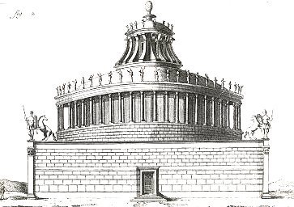

  
[Intangible Textual Heritage](../../index)  [Earth Mysteries](../index.md) 

------------------------------------------------------------------------

[Buy this Book at
Amazon.com](https://www.amazon.com/exec/obidos/ASIN/0486435199/internetsacredte.md)

------------------------------------------------------------------------

<table width="75%">
<colgroup>
<col style="width: 50%" />
<col style="width: 50%" />
</colgroup>
<tbody>
<tr class="odd">
<td width="50%" data-valign="TOP"></td>
<td width="50%" data-valign="CENTER"><h1 id="architecture-mysticism-and-myth" data-align="CENTER">Architecture, Mysticism and Myth</h1>
<h2 id="by-w.r.-lethaby" data-align="CENTER">by W.R. Lethaby</h2>
<h4 id="section" data-align="CENTER">[1892]</h4></td>
</tr>
</tbody>
</table>

------------------------------------------------------------------------

[Contents](#contents)    [Start Reading](amm00.md)

------------------------------------------------------------------------

|                                                                                                                           |
|---------------------------------------------------------------------------------------------------------------------------|
|  |

This delightful book describes the symbolism of real-world architecture,
as well as architecture described in fiction, myth and folklore. Lethaby
believed that architecture reflected the macrocosm. He speculated that
many of the seemingly ornamental details of classical buildings actually
represented aspects of the land, the sea and the sky. This is one of
those books like the [Golden Bough](../../pag/frazer/index.md) or the White
Goddess (albeit shorter and a less challenging read) that will turn you
on to the mythopoetic side of reality, no matter whether you agree with
its conclusions.

------------------------------------------------------------------------

 [Title Page](amm00.md)  
[Preface](amm01.md)  
[Contents](amm02.md)  
[Introductory](amm03.md)  
[Chapter I. The World Fabric](amm04.md)  
[Chapter II. The Microcosmos](amm05.md)  
[Chapter III. Four Square](amm06.md)  
[Chapter IV. At the Centre of the Earth](amm07.md)  
[Chapter V. The Jewel-Bearing Tree](amm08.md)  
[Chapter VI. The Planetary Spheres](amm09.md)  
[Chapter VII. The Labyrinth](amm10.md)  
[Chapter VIII. The Golden Gate of the Sun](amm11.md)  
[Chapter IX. Pavements Like the Sea](amm12.md)  
[Chapter X. Ceilings Like the Sky](amm13.md)  
[Chapter XI. The Windows of Heaven and Three Hundred and Sixty
Days](amm14.md)  
[Chapter XII. The Symbol of Creation](amm15.md)  
