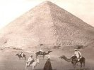

  
[Intangible Textual Heritage](../../index)  [Earth Mysteries](../index.md) 
[Index](index)  [Previous](ams01)  [Next](ams03.md) 

------------------------------------------------------------------------

[Buy this Book at
Amazon.com](https://www.amazon.com/exec/obidos/ASIN/B002EEP30M/internetsacredte.md)

------------------------------------------------------------------------

  
*A Miracle in Stone: The Great Pyramid*, by Joesph A. Seiss, \[1877\],
at Intangible Textual Heritage

------------------------------------------------------------------------

p. 7

### CONTENTS.

|          |                            |
|----------|----------------------------|
| PREFACE, | Page [3](ams01.htm#page_3.md) |
| DIAGRAM, | [10](ams04.htm#page_10.md)    |

LECTURE FIRST.

GENERAL FACTS AND SCIENTIFIC FEATURES.

INTRODUCTION, p. [13](ams05.htm#page_13.md); The Chart, p.
[15](ams05.htm#page_15); The History, p. [21](ams05.htm#page_21.md); Modern
Scientific Theory, p. [32](ams05.htm#page_32.md); Pyramid Form and
Proportions, p. [41](ams05.htm#page_41.md); Pyramid Numbers, p.
[45](ams05.htm#page_45.md); Size of Great Pyramid, p.
[50](ams05.htm#page_50.md); Standard of Linear Measure, p.
[57](ams05.htm#page_57.md); Weight and Capacity Measure, p.
[65](ams05.htm#page_65.md); The Coffer and the Ark of the Covenant, p.
[68](ams05.htm#page_68); Temperature, p. [70](ams05.htm#page_70.md); A
Metrological Monument, p. [71](ams05.htm#page_71.md); The Pyramid's
Astronomy, p. [74](ams05.htm#page_74.md); The Pyramid's Chronology, p.
[79](ams05.htm#page_79.md); Septenaries and Sabbaths, p.
[87](ams05.htm#page_87.md); The Centre of the Universe, p.
[90](ams05.htm#page_90); Whence this Wisdom, p. [91](ams05.htm#page_91.md).

LECTURE SECOND.

MODERN DISCOVERIES AND BIBLICAL CONNECTIONS.

Our Era, p. [102](ams06.htm#page_102.md); Egypt's Past, p.
[105](ams06.htm#page_105.md); The Great Pyramid's Disclosures, p.
[107](ams06.htm#page_107.md); The Pyramid and the Prophets, p.
[108](ams06.htm#page_108.md); The Pyramid and the Book of Job, p.
[114](ams06.htm#page_114.md); The Pyramid

p. 8

and Christ, p. [120](ams06.htm#page_120.md); The Pyramid and the Christian
Dispensation, p. [128](ams06.htm#page_128.md); The Pyramid and Theology, p.
[137](ams06.htm#page_137.md); The Pyramid and the Day of Judgment, p.
[150](ams06.htm#page_150.md); The Pyramid and the Jew, p.
[153](ams06.htm#page_153.md); The Pyramid and Heaven, p.
[159](ams06.htm#page_159.md); The Pyramid and the Spiritual Universe, p.
[163](ams06.htm#page_163.md); The Pyramid and Jerusalem, p.
[166](ams06.htm#page_166.md).

LECTURE THIRD.

ANALYSIS OF TRADITIONS, OPINIONS, AND RESULTS.

The Ancient Traditions, p. [172](ams07.htm#page_172.md); More Modern
Opinions, p. [178](ams07.htm#page_178.md); The Tomb Theory, p.
[180](ams07.htm#page_180.md); Something more than a Tomb, p.
[185](ams07.htm#page_185.md); Not a Temple of Idolatry, p.
[192](ams07.htm#page_192.md); Historic Fragments, p.
[194](ams07.htm#page_194.md); Who was Melchisedec, p.
[203](ams07.htm#page_203.md); The Primitive Civilizers, p.
[210](ams07.htm#page_210.md); Job and Philitis, p.
[217](ams07.htm#page_217); Results, p. [221](ams07.htm#page_221.md);
Primeval Man, p. [227](ams07.htm#page_227.md); Use of the Pyramid
respecting Faith, p. [231](ams07.htm#page_231.md).

APPENDIX.

EXTRACTS FROM RECENT WRITERS.

Rev. Joseph T. Goodsir, p. [233](ams08.htm#page_233.md); J. Ralston
Skinner, p. [238](ams08.htm#page_238.md); Charles Casey, p.
[240](ams08.htm#page_240); John Taylor, p [241](ams08.htm#page_241.md);
Prof. Piazzi Smyth, p. [243](ams08.htm#page_243.md); J. G., in Edinburgh
Courant, p. [248](ams08.htm#page_248.md).

------------------------------------------------------------------------

[Next: Quotes](ams03.md)
