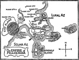

  
[Intangible Textual Heritage](../../index)  [Earth Mysteries](../index) 
[Index](index)  [Next](atec01) 

------------------------------------------------------------------------

[Buy this Book at
Amazon.com](https://www.amazon.com/exec/obidos/ASIN/B0027P88BE/internetsacredte)

------------------------------------------------------------------------

  
*At the Earth's Core*, by Edgar Rice Burroughs, \[1914\], at Intangible
Textual Heritage

------------------------------------------------------------------------

# At the Earth's Core

## By Edgar Rice Burroughs

#### Chicago: A.C. McClurg & Co.

#### \[1914\]

Created by Judith Boss, Omaha, Nebraska

  [  
Click to enlarge](img/pellmap.jpg)  
Map of Pellucidar  

------------------------------------------------------------------------

[Next: Prologue](atec01)
