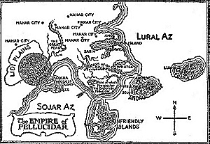

  
[Intangible Textual Heritage](../../index)  [Earth Mysteries](../index.md) 

------------------------------------------------------------------------

[Buy this Book at
Amazon.com](https://www.amazon.com/exec/obidos/ASIN/B0027P88BE/internetsacredte.md)

------------------------------------------------------------------------

<table width="75%">
<colgroup>
<col style="width: 50%" />
<col style="width: 50%" />
</colgroup>
<tbody>
<tr class="odd">
<td width="50%" data-valign="TOP"></td>
<td width="50%" data-valign="CENTER"><h1 id="at-the-earths-core" data-align="CENTER">At the Earth's Core</h1>
<h2 id="by-edgar-rice-burroughs" data-align="CENTER">by Edgar Rice Burroughs</h2>
<h4 id="section" data-align="CENTER">[1914]</h4></td>
</tr>
</tbody>
</table>

------------------------------------------------------------------------

[Contents](#contents)    [Start Reading](atec00.md)    [Text
\[Zipped\]](atec.txt.gz.md)

------------------------------------------------------------------------

|                                                                                                                           |
|---------------------------------------------------------------------------------------------------------------------------|
|  |

Burroughs set this classic Scifi/Fantasy novel in a version of the
Hollow Earth which can only be reached by an advanced tunneling machine.
Breaking through into the inner core, the adventurers find a world
(Pellucidar) which physically resmbles Cyrus Teed's [Cellular
Cosmology](../cc/index.md), except that we are on the *outside*. *Inside*
is a primitive world where dinosaurs still exist, and humans are not at
the top of the food chain...

------------------------------------------------------------------------

 [Title Page and Map](atec00.md)  
[Prologue](atec01.md)  
[I. Toward The Eternal Fires](atec02.md)  
[II. A Strange World](atec03.md)  
[III. A Change of Masters](atec04.md)  
[IV. Dian the Beautiful](atec05.md)  
[V. Slaves](atec06.md)  
[VI. The Beginning of Horror](atec07.md)  
[VII. Freedom](atec08.md)  
[VIII. The Mahar Temple](atec09.md)  
[IX. The Face of Death](atec10.md)  
[X. Phutra Again](atec11.md)  
[XI. Four Dead Mahars](atec12.md)  
[XII. Pursuit](atec13.md)  
[XIII. The Sly One](atec14.md)  
[XIV. The Garden of Eden](atec15.md)  
[XV. Back to Earth](atec16.md)  
