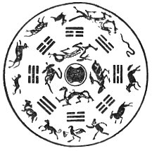
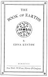
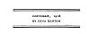

  
[Intangible Textual Heritage](../../index)  [Earth Mysteries](../index.md) 
[Index](index)  [Next](boe01.md) 

------------------------------------------------------------------------

p. iii

# THE BOOK OF EARTHS

 

###### By

## EDNA KENTON

#### New York: William Morrow & Company

#### \[1928, No renewal\]

NOTICE  
This text is posted for research purposes only, as this book is still
under a formal copyright in the United States. If you are the copyright
holder and wish it to be removed please contact this site and we will
comply promptly. **Do not reproduce this material commercially**.

[  
Click to enlarge](img/pl36.jpg.md)  
PLATE XXXVI. Map of the World, by Petrus Apianus. printed 1530. From the
original in the British Museum. (From Periplus; A. E. Nordenskiöld,
1897, Plate XLIV)  

[  
Click to enlarge](img/title.jpg.md)  
Title Page  

[  
Click to enlarge](img/verso.jpg.md)  
Verso  

p. v

To

M. R. K. R.

------------------------------------------------------------------------

[Next: Acknowledgements](boe01.md)
