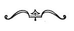

  
[Intangible Textual Heritage](../../index)  [Earth Mysteries](../index) 
[Index](index)  [Previous](boe08)  [Next](boe10) 

------------------------------------------------------------------------

### The Primæval Earth

"BECAUSE IT PLEASETH more and makes a greater impression upon us," wrote
the old English Platonist Thomas Burnet, "to see things represented to
the Eye, than to read their description in words, we have ventured to
give a model of the Primæval Earth, with its Zones or greater Climates,
and the general order and tracts of its Rivers. Not that we believe
things to have been in the very same form as here exhibited, but this
may serve as a general Idea of that Earth, which may be wrought into
more exactness, according as we are able to enlarge or correct our
thoughts hereafter . . . . The Rivers of that Earth, you see, were in
most respects different, and in some respects contrary to ours, and if
you could turn our Rivers backwards, to run from the Sea towards their
Fountain-heads, they would more resemble the course of these
Antediluvian Rivers; for they were greatest at their first setting out;
and the Current thereafter, when it was more weak, and the Chanel more
shallow, was divided into many branches, and little Rivers, like the
Arteries in our Body, that carry the Blood, they are greatest at first,
and the further they go from the Heart, their Source, the less they grow
and divide into a multitude of little

p. 52

branches, which lose themselves insensibly in the habit of the flesh as
these little Floods did in the Sands of the

[  
Click to enlarge](img/fig034.jpg)  
FIGURE 34. *The Primæval Earth, with its Zones or greater Climates, and
the general order and tracts of its Rivers*.  
(From *The Theory of the Earth*; Thomas Burnet, 1697.)  

\[paragraph continues\] Earthe." This is a very curious conception of
the counter-course of "primæval" rivers; it is exactly as if we
conceived of the Missouri-Mississippi system, for instance, as rising in
the Gulf of Mexico and flowing north until it

p. 53

begins to divide and subdivide into dozens of lesser streams, all of
which finally dwindle away into the Earth instead of rising from it.

What was the state of the primæval Earth before man appeared, and with
him, trouble? All the Creation stories

   
FIGURE 34A. *Zones or Climates of the Earth, with the Zodiac*.  
(From *Sphæra emendata*; Joannes Sacro Bosco, Cologne, 1601.)

give a common answer--harmony; harmony of all the spheres. It is in the
song to Mahat, with its ordered account of the separation of the five
great Elements from Chaos, and their recombinings into the bodies of the
universe. "He made them all to move evenly," says the Creation legend of
the Lenape, after the Great Manito had formed land and sky and moon and
stars; and in the pictograph the even movement is a spiral line. In
Sebastien Muenster's *Cosmographia Universalis* (1559), at the beginning
of the chapter on "The creation and disposing of the primordial Earth
and Sea," is an old drawing evidently intended to show the paradisaical
state of terrestrial affairs at the end of the Fifth Day of Creation,
with the

p. 54

great stage built and the great scene set and lighted for the entrance
of man and the beginning of his drama ([Plate VI](boe10.htm#img_pl06)).
It is a picture in successive planes of the Genesis story, with a
charming addition--the boat with sails, floating in the foreground; and,
on it, a little three-storied house--the Ark, perhaps, whose part in the
coming drama had been already foreseen by the Creator, and which was to
become, of all the vanished treasures of a drowned and broken Earth,
man's single precious possession.

 

------------------------------------------------------------------------

[Next: The Babylonian Universe](boe10)
