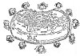

  
[Intangible Textual Heritage](../../index)  [Earth Mysteries](../index) 
[Index](index)  [Previous](boe19)  [Next](boe21) 

------------------------------------------------------------------------

### Systems of the Universe

WHEN THE GREEKS IN THE SIXTH CENTURY B.C. took up the study of the
universe, its systems multiplied. The order of the orbits of the
heavenly bodies, above all, their disorder, fascinated the Greek mind.
Eclipses occurred, but how? A Comet fled through the

 

[  
Click to enlarge](img/pl32.jpg)  
PLATE XXXII. (Frontispiece to *Almagestum Novum*; Ioannes Riccioli,
1561)  

 

p. 161

sky, and did not collide with a sister body--why? How were the Earth,
Sun, Moon, and all the stars supported in space? What are the relative
distances of the spaces between them? Which were the larger bodies? the
smaller? What were the divisions of Space? What were the major
combinations of the great elements? How were these combinations
effected--and a hundred other questions.

Homer was the first poet of the Greek universe, but Thales was its first
philosopher (640-572 B.C.). He believed the Earth was a disc floating
"like a piece of wood or something of that kind," on the waters which
were the origin of all things, including fire and air as well as Earth;
and his interest in eclipses led him into a protracted study of the
movements of the Sun and the Moon and their relation to the Earth.

Anaximander (c. 611-545 B.C.) was his contemporary. He gave up the idea
that the water was the origin of everything, any more than any other
substance known to man. Everything originated "from the nature of the
infinite," and to it returned. Hence it followed that this world was not
eternal, but merely one of a procession of worlds. He described the
figure of Earth as either flat or convex on the surface, but much more
like a cylinder or stone column than the thin disc of Thales. Eventually
he called it cylindrical, with a height equal to one-third of its
breadth. This cylinder, being in the centre of the universe, was stable,
in equilibrium, since it had the same relation to every part of- the
universe. Above it were a series of heavens, the first of air, the
second of all the stars, the third of the Moon, above that the heaven of
the Sun

p. 162

 

[  
Click to enlarge](img/fig066.jpg)  
FIGURE 66. *The Systems of the Universe*.  
(From *Iter exstaticum cæleste*; Athanasius Kircher, 1660, Plate II.)  

 

p. 163

and above all the heaven of the heavenly fire. He had an extremely
complicated theory to account for a motionless heaven and moving bodies;
he appears to have imagined the Sun, for instance, to be an enormous
wheel filled with fire, its rim pierced by a single hole the size of the
Earth.

   
FIGURE 67. *The Universe according to Anaximander*  
(*c. 611-545 B.C.*)  
(From *Dante and the Early Astronomers*; M. A. Orr (Mrs. John Evershed),
1913.)

\[paragraph continues\] So, too, the Moon and stars rolled through their
heavens; eclipses came from the holes in the Sun-wheel's rim and that of
the Moon being partially or wholly stopped up. Quite exactly, his Sun
and Moon were vessels filled with fire.

Of course only the upper surface of Anaximander's Earth was habitable;
below it the heavenly bodies had their underworld course; for the rest,
the horizon marked the limits of the known and the knowable.

He seems to have held too the curious idea that the series

p. 164

of worlds which come out of the infinite and go back into it may be also
called gods, since, like gods, they are created, they live, they die,
and are again created.

For a hundred years following Anaximander's death, the Greeks were still
asking how the Earth was held in balance, and why the heavenly bodies
did not fall from their places in the sky and destroy the Earth.
Empedocles and Anaxagoras offered this explanation--that a great
whirl-wind swept continuously round the Earth, serving the double end of
holding the heavenly bodies aloft and of driving them across the sky.
Anaxagoras believed that this same whirlwind was responsible for the
stars themselves; that they were fragments of the Earth, torn off by the
violence of the whirlwind, and that their light came from no more than
the heat produced by friction. He also believed that the "heaven of the
stars" was far beyond that of the Sun.

As for Empedocles, he re-asserted that everything consists of the four
elements, Earth, air, fire, and water, either in a pure, or a combined,
or a mixed state merely; and he said further that all these combinations
and mixings were brought about by two forces alone, one attracting, and
one repulsing, one Harmony, the other Disharmony, one Cord, the other
Discord. He had also a very individual idea of the Moon and the Sun; the
Moon is air rolled together with fire--it is flat like a disc and gets
its light from the Sun. But the Sun, he said, is a reflection of the
fire surrounding the Earth; it is not itself of a fiery nature, but
merely a reflection of fire, "like that which is produced in water."

p. 165

Leucippus (c. 450 B.C.) changed Anaximander's figure of the universe
considerably. He still held that the Earth's flat upper surface was its
only habitable area, but he gave

   
FIGURE 68. *The Universe of Leucippus* (*c. 450 B.C.*)  
(From *Dante and the Early Astronomers*; M. A. Orr (Mrs. John Evershed),
1913.)

the whole mass of the Earth the shape of a tympanum or kettle drum,
flat, with a slightly raised rim--according to this idea man was living
on the flat top of the southern hemisphere. Above the hemisphere of
Earth was the hemisphere of air, the two surrounded by the crystal
sphere which held the Moon. Above the Moon's sphere was the

p. 166

planetary sphere; above this the sphere of the Sun, with the star-zone
last, "perhaps outside." He accounted for the inclination of the axis to
the horizon by saying that the Earth had sunk towards the south, which
is merely

   
FIGURE 69. *The Universe of Democritus* (*c. 430 B.C.*)  
(From *Dante and the Early Astronomers*; M. A. Orr (Mrs. John Evershed),
1913.)

the other half of the ancient saying that the Earth is raised towards
the north.

Leucippus had a disciple, Democritus (c. 430 B.C.), who retained the
thin Earth-disc of Thales, but added to it the surrounding rim of his
master's Earth-drum. He changed Leucippus's Air-Earth sphere into a
sphere of Air, divided horizontally through its centre by the
Earth-disc. Thus, like the cylindrical Earth of Anaximander,

p. 167

it rested on nothing but air. Next the Air sphere he placed the Moon and
the Morning Star, then the spheres of the Sun, the planets and the fixed
stars.

The Sun, he said, was ignited stone or iron, and the Sun and Moon, each
a large solid mass, were none the less smaller than the Earth.
Originally, he said, the Sun and the Moon had been two Earths, like this
of ours, and each of them, like ours, at the core and centre of a world.
But these two worlds had encountered our world, which had absorbed them
both, and had taken possession of the "Earth" of each. Comets, he said,
are caused by two planets approaching each other closely. The Moon was
not only a solid body, but, having once been the "Earth" of another
world, it still has mountains and plains and chasms, which cause the
markings on its face. Anaxagoras however had said this before him, and
had also asserted that the Moon was still inhabited. Democritus also
taught that the light of the Milky Way was caused by a great multitude
of very faint stars. Later it was said that the Milky Way was a former
path of the Sun, which for some obscure reason had changed its course.

It was Pythagoras who numbered and measured and named for the Greeks the
five great planets of our system, and who gave them places in the
heavens equal in importance to the greater heavenly bodies. And it was
Pythagoras who taught that the Earth was a perfect sphere, hanging, if
not moving, freely in space, with its whole surface habitable, and with
men moving freely on all its sides. For the Earth, he said, balanced in
the centre of the world, cannot fall, nor can it let anything which

p. 168

belongs to any part of it fall. There is no below, there is no above,
for our North is South to the men of the antipodes; there is nothing but
the Centre, where we are, and it is illusion to believe otherwise.

   
FIGURE 70. *The Universe of Pythagoras* (*c. 540 B.C.*)  
(From *Dante and the Early Astronomers*; M. A. Orr (Mrs. John Evershed),
1913.)

Number played the principal part in the universe of the Pythagoreans,
for, said they, everything in nature is governed by number, since number
is the beginning and the end of all relations. There are cosmic
principles, they declared, and these cosmic principles are mathematical
principles, which are living principles; numbers are the

p. 169

essence of the universe, the very substance of things, the cause and
effect of all that is in nature.

Pythagoras separated the planets and affirmed that their distances are
in exact proportion to the intervals between musical notes. Combined
with the Sun and Moon into a running scale, they make up the sacred
number seven, and these seven notes of the cosmic scale constitute, with
the mysterious star-sphere, the cosmic octave. As each of the heavenly
bodies moves in its path, different to, yet harmonious with all the
others, it sounds its own individual note in the great octave that is
"the music of the spheres." This music, said the Pythagoreans, is all
about us and has been since our infancy, but we live beside it "as one
lives beside the cataracts of the Nile"--we never know we hear it.

According to Aristotle, the Pythagorean universe was divided thus:

The Earth was, first of all, a sphere situated in the centre of the
universe, and was surrounded by many spheres.

Ouranos or Sky stretched between the Earth and the Moon. It was the
region of illusion and change, always filled with whorls of air and
shifting clouds.

Cosmos was the region of "the celestial octave," the appointed place for
the Sun, the Moon, and the planets. It consisted of seven concentric
rings or spheres, in which these heavenly bodies, or "divine beings,"
lived their conscious, joyous lives.

Olympos was the Star-sphere, the pure-elemental region which completed
the cosmic octave.

Beyond Olympos stretched the region of celestial fire.

p. 170

Beyond the region of celestial fire was Apeiron, Infinite Air, Infinite
Space, from which and into which the Cosmos breathes, and through which
and by which only it lives.

The Pythagoreans did not fail to take into account the five great
elements, from which they believed all things were fashioned. They
fitted these five "Causal Beings"

[  
Click to enlarge](img/fig071.jpg)  
FIGURE 75. *The Five Great Elements*.  
(From *Sphæra Mundi*; Orantius Fineus, 1542.)  

into the five regular solids ([Figs. 2-6](boe06.htm#img_fig002) and ),
to whose forms, they said, the component particles of the different
elements correspond. The component particle of Earth, for instance,
corresponds to the cube; of water,

p. 171

to the icosahedron; of air, to the octahedron; of fire, to the
tetrahedron; of ether, to the dodecahedron--the form which had been
God's model for the whole universe.

"A Figure of the Whole World" ([Fig. 72](#img_fig072)) is the
Pythagorean-Ptolemaic

[  
Click to enlarge](img/fig072.jpg)  
FIGURE 72. ''*A Figure of the whole world, wherein are set forth the two
essentiall Parts, the eleven heavens, and the foure Elements*.  

system, much elaborated. It begins by taking into account the "foure
Elements," but it extends the number of the imaginable heavens beyond
the "cristaline" to two--this was an invention of the mediæval
astronomers. These two additional heavens were the

p. 172

\[paragraph continues\] *Primum Mobile*, or the "First Movable," and
"The empyreal heaven, the habitation of the blesed." This last was

[  
Click to enlarge](img/fig073.jpg)  
FIGURE 73. *System of the diverse spheres*.  
(From *Cosmographia*; Petrus Apianus, 1660.)  

the Heaven of Heavens, motionless, incorruptible, the place of the
eternal mysteries. None of these spheres consisted, of course, of any
materially palpable substance; they were great spherical zones of
aethereal space, arranged one

p. 173

within the other, which circled about the motionless Earth at differing
rates of speed. Perhaps, instead of "spheres," or "shells," or "zones,"
these moving regions are better expressed by the term "velocities."

[Fig. 73](#img_fig073) represents again the same system, even more
elaborately inscribed with "correspondences." By aid of these two guides
through the "two essentiall Parts" of the whole world--that is to say
the eleven heavens and the four elements, the six systems of the
universe shown in [Fig. 66](#img_fig066) can be more or less easily
followed.

ONE DEVELOPMENT OF THE PYTHAGOREAN SYSTEM might be mentioned here--the
attempt of an otherwise unknown astronomer, Philolaus, to remove the
motionless Earth from its place in the centre of the universe and give
it an orbit of its own. His reasons, except that he hoped by this to
account better for the seemingly contrary movements of the heavens, do
not concern us here. But it is a transition-picture. For by moving the
Earth from the centre and letting her move in Space, he may have solved
one problem, but he raised two new ones. He had left the sacred place,
the Centre of the World, empty, and he had disturbed the cosmic octave
by adding to it another moving body. Heretofore the Earth had been mute
because it was motionless; now movement gave it its own note in a
disturbed scale. So in the sacred place he put the purest of the
elements, Fire, forerunner of the Central Sun. Then, more to restore the
harmony of number,

p. 174

quite likely, than to explain Night and Day, he created another moving
heavenly body, the planet Antichthon, or Counter-Earth, and gave it an
orbit between the Earth and the Central Fire with one of its faces
turned always to the Fire. This gave nine moving bodies, and with the
star-sphere as another, the number was increased from the sacred number
seven to the sacred number ten. The Earth revolved with one face turned
always away from the centre; Antichthon, the new planet, was therefore
always invisible. After this rearrangement was completed, explanations
purporting to reconcile a geocentric with an ignicentric system were
invented plenteously, some of them very interesting ones. "Those who
partook of a greater knowledge," wrote Simplicius, "called the fire in
the middle the creating power, which from the middle gives life to the
whole Earth and again warms that which has been cooled. . . . But they
called the Earth a star because it also is an instrument of time, for it
is the cause of days and nights, for it makes day to the part illumined
by the Sun, but night to the part which is in the cone of the shadow."
And he ends by saying that the moon was called the *antichthon*, because
it is "an aethereal Earth."

Some modern students of this confusion have suggested that the Earth and
the Counter-Earth or Antichthon might have been intended to be the two
halves of a single sphere, cut through a meridian and separated very
slightly, with the flat sides toward each other, but with the convex
side of Antichthon turned always towards the Central Fire, and the
convex side of the Earth turned always away from it. This may be so, but
no one knows. For the

 

[  
Click to enlarge](img/fig074.jpg)  
FIGURE 74. *The System of Philolaus*.  
(From *Dante and the Early Astronomers*; M. A. Orr (Mrs. John Evershed),
1913.)  

Upper figure: Night on Earth. Only the side turned away from the centre
is inhabited; consequently the Central Fire and Antichthon are
invisible.

Lower figure: Twelve hours later; Day on Earth. Earth has made half a
revolution, and her outer side is now lighted by the sun, which has only
moved about half a degree forward in its yearly orbit. Antichthon has
also made half a revolution, therefore remains invisible.

 

p. 175

\[paragraph continues\] Pythagorean teachings were at the best obscure,
and the Pythagorean text that has come down is scanty and corrupt. One
Pythagorean, Hicatus of Syracuse, is said to have believed and taught
that the heavens, the Sun, Moon, stars, and all the heavenly bodies are
standing still, and that nothing in the universe is moving except the
Earth, which, while it turns and twists itself with the greatest
velocity round its axis, produces all the same phenomena as if the
heavens were moving and the Earth were standing still."

As above, so below! Philolaus placed the planet Antichthon or
Counter-Earth in the heavens, perhaps five hundred years before the
Christian era. In the first century A.D. Pomponius Mela, a Latin
cosmographer, convinced that a spherical Earth must have a more or less
balanced distribution of land and water, drew the first map on which the
mysterious continent of Earth appears in the unknown half of Earth--our
antipodes. This continent he inscribed with the name Antichthones, the
Unknown. His pen had leaped over the impassable equatorial zone, and had
drawn below it a solid, bowl-shaped mass of land which no man had seen,
and which no man might ever see. And yet it must be there! It had been
long known through travellers that from Greece or from Italy the
eastwardly land stretched much farther than the land to the west, and it
was therefore quite possible, with no proof of the existence of a great
western ocean, that the northern continent of Europe-Asia-Africa might
wrap around the sphere until its eastern edge touched the western shore
of the known Atlantic. But it was implicitly believed that

p. 177

the known land stopped at the equator; the balancing continent must be
therefore at the antipodes. When Pomponius

[  
Click to enlarge](img/fig075.jpg)  
FIGURE 75. *Pomponius Mela's Map of the World, with Antichthones* (*1st
century A.D.*)  
(From *De situ Orbis*; Pomponius Mela, 1536.)  

\[paragraph continues\] Mela dropped his second continent to the south,
he was a mistaken man, but his Antichthones lingered in the imagination
of men--lingered for nearly fifteen hundred

p. 178

years, until Columbus, sailing west--to India--came upon the West Indies
and the Americas. The great astronomer and geographer, Claudius

[  
Click to enlarge](img/fig076.jpg)

Ptolemy, lived in the century after Pomponius Mela. There is a legend
that he was a descendant of the Egyptian kings, and knew their secret
science of the heavens; certainly he brought about a revival of
mathematical geography that had not been in the world since the great
Alexandrian

p. 179

period, and he drew his maps upon a form that was to be the model of the
Earth up to and through the Middle Ages.

Ptolemy believed the Earth to be a globular body, but the form on which
his maps were modelled was one slightly depressed at the north, and
sharply cut off a little below the equatorial line by a supposedly
continuous Southern Ocean which circled the equator and flowed below it.
His historians do not seem to doubt that his knowledge of the regions of
the Earth extended as far as the equator, and that he himself knew this
fabled zone of fire was both habitable and inhabited. But he confined
himself to a map-form that included neither the unknown Polar regions
nor the hemisphere of Antichthones.

------------------------------------------------------------------------

[Next: The Square Earth of Cosmas Indicopleutes](boe21)
