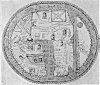

  
[Intangible Textual Heritage](../../index)  [Earth Mysteries](../index) 
[Index](index)  [Previous](boe24)  [Next](boe26) 

------------------------------------------------------------------------

p. 199

### Maps of the Earth

THE SPANISH PRIEST BEATUS who in the year 798 died in a Benedictine
convent in the Asturias, is recognised as the original draughtsman of a
remarkable world-map lost except for "copies," ten of which are known
to-day. This map-group is known as the Beatus Maps; they all appeared
between the tenth and the thirteenth centuries, and obviously derive
from one common source, but the source-map has disappeared completely.

It came out originally in Beatus's *Commentary on the Apocalypse*, about
776, and its aim was, probably, to portray the spread of the Christian
faith over the Earth, after the analogy of the world and the kingdom of
heaven to a field sown with seed. It was divided into parts or fields,
each ruled over by one of the Apostles, whose locality was more or less
fixed by tradition, and who was at once the sower of the seed, the
tiller of the field, and the reaper of the harvest.

The Osma Beatus map ([Plate XXXIV](#img_pl34)), although one of the
latest (1203), is regarded as one which is in many of its important
features most like its prototype. It gives, for instance, alone of all
the copies, the pictures of the Twelve Apostles in the regions over
which they ruled. It also gives a realistic picture of the inhabitants
of the Southern continent or Antichthones, still unknown--those
monstrous beings known as Skiapodes or Shadow-footed men, who must
always lie or sit in such fashion that their great feet were as
umbrellas shading them from the otherwise deadly Sun. There were other
fabulous races of this austral land; one whose huge lips, instead of
feet, protected

p. 200

them from the scorching fire of the Sun; another whose heads had sunk to
a plane almost level with their shoulders; and still another whose heads
had sunk quite below the shoulders and had become absorbed in the trunk
of

   
FIGURE 83. *Monsters of the Antipodes*.  
(From *Margarita philosophica*, 1517.)

the body. There were Dog-headed men; Ape-headed men; men without ears;
men without tongues; men without noses; men without mouths, or with
mouths so small that they sucked their food with great difficulty
through a reed. Some never walked at all, but crawled along the ground
like serpents, and ate serpents. Of these monstrous races of the
Antipodes there were fourteen, we are told.

In portioning out the Earth to the Twelve Apostles, to Peter was given
Rome; to Andrew, Greece or Achia; to

 

[  
Click to enlarge](img/pl34.jpg)

\[paragraph continues\] Thomas, India; to James, Spain; to John, Asia;
to Matthew, Macedonia; to Philip, Gaul; to Bartholomew, Lycaonia; to
Simon Zelotes, Egypt; to Matthias, Judæa; to James the brother of the
Lord, Jerusalem; and to Paul, the whole world. All these localities are
indicated, and also the place of Paradise, this last by a rectangle from
whose centre spring four rivers.

   
FIGURE 84. *A* T-O *map of the XIIth century*. *In* ''*Imago Mundi*.''  
(From Santarem's *Atlas*, 1849, Plate XIII.)

The division of the continents was usually that of the so-called T-O
maps, with Asia filling the upper or eastern half (the tops of many of
the mediæval maps were at the East); and with the lower half divided
into Europe, on the left, and Africa, in the right-hand quarter. But in
the Beatus maps shown here, Southern Asia and Africa were cut by a
narrow strip of ocean, below which was supposed to lie the Austral
continent, the Antipodes, or Antichthones, source of romance and fable
run mad for hundreds of years.

Another of the Beatus maps is the famous one known as the Turin Beatus,
of the twelfth century. Unlike the Osma Beatus, its shape is a pure
circle--quite likely a departure

p. 202

from the form of the lost source-map, which is believed to have had the
ovoid form. There is no attempt made here at any division of the world
among the Twelve

[  
Click to enlarge](img/fig085.jpg)  
FIGURE 85. The Turin Beatus World-map, c. 1150.  
(From Santarem's Atlas, 1848, Plate IX.)  

\[paragraph continues\] Apostles, but the Garden of Eden, the First
Parents, the tempting serpent twined about the tree, and Mount Sinai are
in evidence. The unknown continent is indicated, but its inhabitants are
not shown. In many ways this copy deflects from the original; but the
Turin Beatus is famous for its "Wind-blowers," seated on their inflated

p. 203

bags and keeping the universe to its course as they float through the
aerial ocean.

 

IN THE LIBRARY AT STOCKHOLM, among the manuscripts of Marco Polo,
fantastic traveller and man of the world of the fourteenth century, lies
his own *mappa-mundi*. It is a combination of the first-century
world-map of Pomponius Mela ([Fig. 75](boe20.htm#img_fig075)), where the
continent of Antichthones was first shown, and the T-O maps of the
Middle Ages, but with the odds in favour of Pomponius Mela's division,
for Marco Polo gives rather more than half the land of the Earth to
Antichthones. Strange to think of this as the travelling map of a
tourist of the then known world! But Marco Polo's *Travels*, glorious
romancing, glorious lying as much of it is, did more to popularise the
notion that the whole world was habitable, including its unknown areas,
than any writer since has succeeded in doing. For we still have unknown,
impassable, uninhabitable areas of the Earth, and by what we
think--perhaps rightly--of the Polar zones, we can gauge a little the
opinions of the ancient world and even of the Middle Ages regarding
Antichthones.

In any case, thanks to the Crusades, the habit of travel had laid strong
hold of man, and a race of new adventurers sprang up over night. Marco
Polo's contemporaries began to doubt the myths they had been bred on,
and they hurried towards new ones, some of them Marco's own. His
*Travels* paved the way for travel, and the new adventurers

p. 204

dared farther and farther the still impassable ocean that separated them
from what they did not know, and brought back many tales, if not of
continents, of groups of islands newly found, and the wildest rumours

   
FIGURE 86. *The World-map of Marco Polo. From one of his manuscripts in
the Library at Stockholm*.  
(From Santarem's *Atlas*, 1849, Plate I, No. 3.)

concerning the strange lands and races that lay beyond them. Less than
two centuries after Marco Polo's map was drawn, Ptolemy's model of the
Earth, which left out of account its unknown areas, was to be discarded
for that of a "true sphere."

For in 1509 a scrap of a book called *Globus Mundi* was printed at
Strassburg by an author unknown--probably he will never be known. It was
published in Latin and

p. 205

 

[  
Click to enlarge](img/fig087.jpg)  
FIGURE 87. *Title-page of Globus Mundi, originally printed at
Strassburg, 1509, showing a trace of the Americas*.  
(From *Globus Mundi*, reprinted at Milan (n.d.)  

 

p. 206

\[paragraph continues\] German, and it seems to have been no more than
an expository pamphlet or tract to accompany or to be sold with a real
globe. This is implied by its amplified title: *The World Globe.
Exposition or description of the world and of the terrestrial sphere
constructed as a round globe like to a solid sphere, whereby every man
even of moderate learning can see with his own eyes that there are
antipodes whose feet are opposite ours*. What makes this extremely
interesting is that only seventeen years after Columbus discovered the
Americas, a tiny bit of land to the south-west of Africa, labelled *Nüe
Welt*, appeared on a spherical world-map. Another interesting thing
about this map is the enormous size given to the African continent,
under the lingering influence of the long-time belief in the impassable
equatorial zone.

"This device proves the Earth to be a Globe" ([Fig. 88](#img_fig088)) is
a self-explanatory seventeenth-century attempt at popularising a
scientific theory; no better but no worse than modern devices for
popular education. The proof offered here is the outline of the shadow
cast on an eclipsed Moon; if the Earth were an hexahedron, a
tetrahedron, or a cube, its shadow on the Moon would not be circular in
outline. But we know the shadow cast by the Earth is a circular one;
therefore the Earth is a globe! That a cubical, tetrahedral, or
hexahedral body rotating in Space at the Earth's supposed speed and in
the diverse directions of its movements might tend to trace a curved
line was not suggested.

p. 207

 

[  
Click to enlarge](img/fig088.jpg)  
FIGURE 88. ''*This device proves the Earth to be a Globe*.''  
(From *Cosmographia*; Petrus Apianus, 1640.)  

 

------------------------------------------------------------------------

[Next: The Earth of Columbus](boe26)
