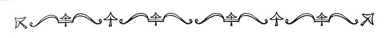

  
[Intangible Textual Heritage](../../index)  [Earth Mysteries](../index.md) 
[Index](index)  [Previous](boe34.md) 

------------------------------------------------------------------------

p. 263

 

# BIBLIOGRAPHY

A list of some of the books which were helpful in this study of man's
conceptions of the figure of Earth and its relation to the Universe.

ARISTOTLE, De Coelo. Tr. by Thomas Taylor. On the Heavens. London, 1807.

------ De Mundo. Tr. by Thomas Taylor. On the World. (In the
Metaphysics, pp. 585-621. London, 1842.)

 

BEAZLEY, C. RAYMOND, The Dawn of Modern Geography. John Murray, London,
1897-1906. 3 vols.

BERRY, ARTHUR, A Short History of Astronomy. Charles Scribner's Sons,
New York, 1899.

BEUCHAT, H., Manuel d'Archeologie américaine. Paris, 1912.

BLUNDEVILLE HIS EXERCISES. London, 1606. 3rd edition.

BRINTON, DANIEL G., The Lenape and Their Legends. (In Brinton's Library
of Aboriginal American Literature, No. 5. Philadelphia, 1885.)

------ A Primer of Mayan Hieroglyphics. Univ. of Penna. Publ. ser. in
Philology, Literature and Archeology, Vol. III, No. 2, 1894.

------ The Myths of the New World. D. McKay, Philadelphia, 1896. 3rd
edition.

BUDGE, E. A. WALLIS, The Egyptian Heaven and Hell. (In Books on Egypt
and Chaldea, Vols. XX-XXII. Kegan Paul, Trench, Trubner & Co., London,
1906.)

------ The Babylonian Legends of the Creation. British Museum, London,
1921.

------ The Babylonian Legends of the Deluge. British Museum, London,
1920.

BURNET, THOMAS, The Theory of the Earth. London, 1697.

 

CHURCHWARD, JAMES, The Lost Continent of Mu. William Edwin Rudge, New
York, 1926.

CICERO, Somnium Scipionis. Tr. by C. R. Edmonds. The Dream of Scipio.
(In Of Offices or Moral Duties. Bohn's Classical Library. London, 1853.)

p. 264

CODEX FERJÉRVÁRY-MAYER. An old Mexican picture manuscript in the
Liverpool Free Public Museums. Elucidated by Eduard Seler. Berlin,
1901-1902.

COLUMBUS, CHRISTOPHER, Select Letters. Tr. by R. H. Major. (In Hakluyt
Society Works, No. 11, London, 1847. 2nd edition.)

COOK, THEODORE ANDREA, *Spiral Forms in Nature and in Art*. John Murray,
London, 1903.

------ The Curves of Life. Henry Holt and Co., New York, 1914.

COSMAS INDICOPLEUSTES, Topographia Christiana. Tr. by J. W. McCrindle.
Christian Topography. (In Hakluyt Society Works, No. 98, London, 1897.)

CUNEIFORM TEXTS from Babylonian Tablets, etc., in the British Museum.
Pt. XXII, Plate 48. British Museum, London, 1906.

 

DANTE, The Divine Comedy. Various editions.

DELAMBRE, J. B. J., Histoire de l’Astronomie ancienne. Paris, 1817.

------ Histoire de l’Astronomie du Moyen-Age. Paris, 1819.

DIXON, ROLAND B., Maidu Texts. (In American Ethnological Society
Publications, Vol. 4. Leyden, 1912.)

DREYER, J. L. E., History of the Planetary Systems from Thales to
Kepler. University Press, Cambridge, 1905.

DU BOSE, HAMPTON C., Dragon, Image and Demon. A. C. Armstrong & Co., New
York, 1887.

 

EDDA, THE PROSE OR YOUNGER, of Snorre Sturleson. Tr. by G. W. Dasent.
Stockholm, 1842.

EVERSHED, MARY A. ORR, Dante and the Early Astronomers. Gall and Inglis,
London, 1913.

 

FLAMMARION'S ASTRONOMICAL MYTHS. Edited by John Blake. Macmillan & Co.,
London, 1877.

FLUDD, ROBERT, Utriusque Cosmi Majoris scilicet et Minoris Metaphysica,
Physica atque Technica Historia. 1617-1629.

------ Microcosmi Historia. 1619.

------ Medicina Catholica. Frankfort, 1629.

------ Summum Bonum. 1629.

FOLKARD, JR., RICHARD, Plant Lore, Legends and Lyrics. Sampson Low,
Marston, Searle and Rivington, London, 1884.

FONVIELLE, W. DE, Histoire de la lune. Paris, 1886.

 

GARDNER, MARSHALL B., A Journey to the Earth's Interior, or Have the
Poles Really Been Discovered? Aurora, Ill., 1920. 2nd edition.

p. 265

GREEN, WILLIAM LOWTHIAN, Vestiges of the Molten Globe. Edward Stanford,
London, 1875.

 

HAKLUYT SOCIETY WORKS. 1847-

HOMER, Iliad. Various editions.

------ Odyssey. Various editions.

HOMMEL, FRITZ, Der Babylonische Ursprung der Ägyptischen Kultur. Diagram
of Babylonian Universe, p. 8. Munich, 1892.

------ Diagram of Babylonian Universe. (In Aufsätse und Abhandlung, th.
iii, p. 346. Munich, 1901.)

 

INTERNATIONALES ARCHIV FÜR ETHNOGRAPHIE. Bd. IX, S. 265. Leyden, 1896.

 

JENSEN, P. C. A., Die Kosmologie der Babylonier. Diagram of Babylonian
Universe in Appendix. Strassburg, 1890.

JOB. The Book of Job.

JOURNAL ROYAL ASIATIC SOCIETY of Great Britain and Ireland, 1908. "The
Babylonian Universe Newly Interpreted," by William Fairfield Warren, pp.
977-983.

 

KEPLER, JOHANN, Harmonices Mundi. 1619.

KINGSBOROUGH, EDWARD KING, Antiquities of Mexico. London, 1830-1848. 9
vols.

KIRCHER, ATHANASIUS, Mundus Subterraneus. Amsterdam, 1678. 2 vols.

------ Iter exstaticum coeleste. Norimburg, 1660.

------ Arca Noë. Amsterdam, 1675. 3 vols.

------ Physiologia Kircheriana Experimentalis. Amsterdam, 1680.

KIRFEL, W., Die Kosmographie der Inder. Bonn, 1920.

 

LENORMANT, FRANÇOIS, Les origines de l’histoire, etc. Tr. by Mary
Lockwood. The Beginnings of History According to the Bible and the
Traditions of Oriental Peoples from the Creation of Man to the Deluge.
Charles Scribner's Sons, New York, 1882.

LEWIS, GEORGE CORNEWALL, An Historical Survey of the Astronomy of the
Ancients. London, 1862.

LITCHFIELD, MARY ELIZABETH, The Nine Worlds. Ginn & Co., Boston, 1890.

LOCKYER, J. NORMAN, The Dawn of Astronomy. Cassell & Co., London, 1894.

LUCRETIUS, De Rerum Natura. Tr. by H. A. J. Monroe. On the Nature of
Things. (In Bohn's Classical Library, London, 1864.)

p. 266

MCBRIDE, JAMES, The Symmes Theory of Concentric Spheres. Cincinnati,
1826.

M’CLATCHIE, THOMAS, Confucian Cosmogony. Shanghai, 1874.

MAHABHARATA, THE. Tr. from the Sanskrit by Pratap Chandra Roy. Calcutta,
1883-1893. 18 vols.

MALLERY, GARRICK, Picture-Writing of the American Indians. Extracted
from the Tenth Annual Report of the United States Bureau of Ethnology.
Washington, D. C., 1894.

MASPERO, GASTON, The Dawn of Civilization. Diagram of Babylonian
Universe, p. 543. D. Appleton & Co., New York, 1894.

MEAD, G. R. S., Fragments of a Faith Forgotten. Theosophical Publishing
Society, London, 1906. and edition.

MEISSNER, BRUNO, Die Kultur Babylonien und Assyrien. Diagram of
Babylonian Universe, Vol. II, p. 109. Heidelberg, 1920. 2 vols.

MEMOIRS OF THE AMERICAN MUSEUM OF NATURAL HISTORY. Vol. II, pp. 163-392.
New York, 1900.

MILL, HUGH R., The Siege of the South Pole. Frederick A. Stokes Co., New
York, 1905.

MILLER, KONRAD, Mappa Mundi: Die ältesten Weltkarten. Stuttgart,
1895-1898. 6 vols.

MILTON, Paradise Lost.

MOREAUX, THÉOPHILE, Astronomy To-day. Tr. by C. F. Russel. Methuen &
Co., London, 1926.

------ L’Atlantide, a-t-elle-existe? Paris, 1924.

------ Un jour dans la lune. Paris, 1912.

MYER, ISAAC, Qabbalah. Philadelphia, 1888.

MYTHOLOGY OF ALL RACES. Edited by Louis Herbert Gray. Marshall Jones
Company, Boston, 1916-1928. 13 vols.

 

NARRIEN, JOHN, An Historical Account of the Origin and Process of
Astronomy. London, 1833.

NEWBROUGH, JOHN BALLOU, Oahspe, A New Bible in the Words of Jehovih.
Oahspe Publishing Co., Boston, 1891.

 

NICHOL, JOHN, Thoughts on Some Important Points Relating to the System
of the World. Edinburgh, 1848.

NORDENSKIÖLD, A. E., Periplus, An Essay on the Early History of Charts
and Sailing Directions. Tr. by F. A. Bather. Stockholm, 1897.

 

OLCUTT, W. T., Starlore of All Ages. G. P. Putnam's Sons, New York,
1911.

ORCHARD, THOMAS N., Milton's Cosmogony. Longmans, Green & Co., London,
1913. See also 2nd edition, 1915.

p. 267

 

PHILPOT, MRS. JOHN H., The Sacred Tree, or The Tree in Religion and
Myth. Macmillan & Co., London, 1897.

PLATO, Timaeus and Critias. Tr. by H. Davis. (In Bohn's Classical
Library, London, 1849.)

PLOTINUS, Select Works. Tr. by Thomas Taylor. (In Bohn's Philosophical
Library, London, 1 895.)

PLUTARCH, On the Apparent Face in the Orb of the Moon. (In his Moralia.
Various editions.)

PORDAGE, JOHN, Theologica Mystica, or the Archetypous Globe. London,
1683.

 

RADAU, HUGO, The Creation Story of Genesis. Diagram of the Babylonian
Universe, p. 56, 1902.

RAFINESQUE, CONSTANTINE S., Wallamolum or painted traditions of the
Linipe Indians, translated by C. S. Rafinesque in 1833; with a fragment
on the history of the Linipi since about 1600 when the Wallamolum
closes. A transcript from the original manuscript, in the MSS. Division
of the New York Public Library.

RECORDE, ROBERT, The Castle of Knowledge. London, 1556.

 

SANTAREM, V. DE, Atlas composé de mappemondes et de cartes
hydrographiques et historiques depuis le XIe jusqu’ au
XVIIe siècle. Paris, 1849.

SCOTT-ELLIOT, W., The Story of Atlantis and the Lost Lemuria. With Maps.
Theosophical Publishing Society, London, 1925.

SELER, EDUARD. See CODEX FERJÉRVÁRY-MAYER.

SINGER, CHARLES. The Scientific Views and Visions of Saint Hildegard.
(In Studies in the History and Method of Science, edited by Charles
Singer, Vol. I. Clarendon Press, Oxford, 1917. 2 vols.)

SPENCE, LEWIS, Atlantis in America. Ernest Benn, London, 1925.

STEVENSON, EDWARD LUTHER, Terrestrial and Celestial Globes. Published
for the Hispanic Society of America by the Yale University Press, New
Haven, 1921. 2 vols.

SWEDENBORG, EMANUEL, The Earths in the Universe. The Swedenborg Society,
London, 1875.

SYMMES, AMERICUS, The Symmes Theory of Concentric Spheres. Louisville,
1878.

 

TEED, CYRUS REED, The Cellular Cosmogony, The Earth a Concave Sphere.
Guiding Star Publishing House, Estero, Fla., 1905.

TEIT, JAMES, The Thompson River Indians of British Columbia. (In Memoirs
of the American Museum of Natural History, Vol. II, pp. 163-392. New
York, 1900.)

p. 268

 

UNITED STATES BUREAU OF AMERICAN ETHNOLOGY, Annual Reports, 1879.

 

WADDELL, L. AUSTINE, The Buddhism of Tibet, or Lamaism. Luzac & Co.,
London, 1899.

WARREN, WILLIAM FAIRFIELD, Paradise Found. Houghton, Mifflin & Co.,
Boston, 1885.

------ The Universe as Pictured in Milton's Paradise Lost. Abingdon
Press, New York, 1915.

------ The Babylonian Universe Newly Interpreted. (In Journal Royal
Asiatic Society of Great Britain and Ireland, 1908, pp. 977-983.)

WEGENER, ALFRED, Die enstehung der continente und ozeane. Tr. by J. G.
A. Skerl. The Origin of Continents and Oceans. Methuen & Co., London,
1924.

WHISTON, WILLIAM, A New Theory of Earth. London, 1690.

WHITEHOUSE, OWEN C., Diagram of the Babylonian Universe. (In his article
on "Cosmogony" in Hastings's Dictionary of the Bible, Vol. I, p. 503.
Edinburgh, 1898.)

WRIGHT, JOHN K., The Geographical Lore of the Time of the Crusades.
American Geographical Society, New York, 1925.
