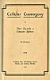
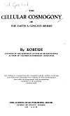
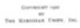
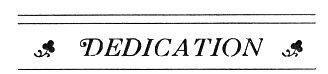
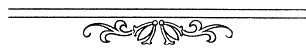

  
[Intangible Textual Heritage](../../index)  [Earth Mysteries](../index.md) 
[Index](index)  [Next](cc01.md) 

------------------------------------------------------------------------

p. 1 p. 2 p. 3 p. 4

##### THE

# CELLULAR COSMOGONY

##### OR

### THE EARTH A CONCAVE SPHERE

## By KORESH

\[pseudonym of Cyrus Reed Teed\]

##### FOUNDER OF THE KORESHAN SYSTEM OF RELIGIO-SCIENCE

##### AUTHOR OF VOLUMES OF KORESHAN LITERATURE

This Edition is compiled from the wonderful articles written on the
subject by KORESH, extending over a number of years, to which have been
added the experiments and investigations conducted by the Koreshan
Geodetic Staff

#### THE GUIDING STAR PUBLISHING HOUSE

#### ESTERO, LEE COUNTY, FLORIDA

#### \[1922\]

#### A. K. 82

Scanned at Intangible Textual Heritage, June 2005. Proofed and formatted
by John Bruno Hare. This text is in the public domain in the United
States because it was published prior to 1923, per the 1998 Digital
Millennium Copyright Act. These files may be used for any non-commercial
purpose, provided this notice of attribution is left intact in all
copies.

[  
Click to enlarge](img/fcover.jpg.md)  
Front Cover  

[  
Click to enlarge](img/bcover.jpg.md)  
Back Cover: The Cellular Cosmogony Discovered by Koresh In 1870  

[![Frontispiece: Koresh \[Cyrus Reed Teed\]](tn/front.jpg)  
Click to enlarge](img/front.jpg.md)  
Frontispiece: Koresh \[Cyrus Reed Teed\]  

[  
Click to enlarge](img/title.jpg.md)  
Title Page  

p. 5

COPYRIGHT 1922

BY

THE KORESHAN UNITY, INC.

[  
Click to enlarge](img/verso.jpg.md)  
Verso  

p. 6

<table data-border="0" width="25%">
<colgroup>
<col style="width: 100%" />
</colgroup>
<tbody>
<tr class="odd">
<td data-valign="top" width="655">
 

<em>This little work is part of the skirmish line of the Army of Revolution. It shall never cease its influence until every vestige of the fallacies and evils of a perverted science and religion shall have been relegated to oblivion</em>.

... <em>To the</em> ...

<em>First fruits of the Resurrection</em>,

<em>Offspring of the Lord</em>,

<em>I supremely dedicate it</em>;

<em>thence to all men in all grades of progress in their liberation from the thraldom to ignorance and the hells of the competitive system</em>.

--<em>KORESH</em>.

 
</td>
</tr>
</tbody>
</table>

 

------------------------------------------------------------------------

[Next: Table of Contents](cc01.md)
