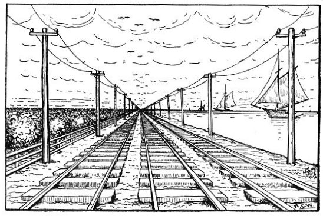

  
[Intangible Textual Heritage](../../index)  [Earth Mysteries](../index) 
[Index](index)  [Previous](cc03)  [Next](cc05) 

------------------------------------------------------------------------

p. 31

# Optical Factors and Illusions

### The Proofs of Cellular Cosmogony Contrasted With Assumptions

IT IS ASSUMED by those who profess to believe in and advocate the
Copernican system of astronomy, that the earth is convex because it
appears so from optical observation. A person standing upon a tower and
looking out in every direction will see the vanishing point at an equal
distance, and the horizon (the limit of geolinear vision) describes a
circle around this center of observation. This fact in appearance is
taken as an assumption of the earth's convexity, because it is claimed
that nothing but a globe would thus respond to and impress itself upon
the organs of vision.

We maintain that an assumption predicated upon an optical illusion is
not sufficient ground for the establishment of a rational conviction. If
the earth were a perfectly flat surface extended illimitably, an
observation from a tower looking out in every direction would assume, to
the eye, the appearance of a circular horizon, for the simple reason
that geolinear fore-shortening would provide for a vanishing point at a
given distance from the observer, proportionate to the elevation of the
point from which the observation is taken.

If a person will stand upon a railroad track equidistant between two
rails, the rails will seem to approach each other in the distance, the
apparent contact, or vanishing point, being proportioned to the

p. 32

space between the rails and the height of observation.. If they are five
feet apart, the vanishing point is less than if they were six or seven
feet apart.

Suppose we take a geolinear extense on the surface of the earth as one
rail, and an imaginary line through the air as the other, placing the
eye two and one half feet from the earth's surface. Now, the same law
obtains in looking parallel along this surface, as

   
Deceptive Appearances

in looking parallel to the rail and along its side. Making our
observation by the side of the rail, the vanishing point is reached and
the rail disappears, although extended in a straight line far beyond the
vanishing point. The line over which observation is taken along the
surface of the earth is the geolinear extense; it corresponds to the
rail, and disappears by the same law; namely, that of foreshortening.

### Appearances vs. Facts

The phenomenon of the disappearance of a ship, hull first, as it recedes
from view, is caused by the same law of foreshortening as that which
governs the disappearance of the rail, or causes the two rails to appear
to approach each other. If we should make calculations on the basis of
the *appearance* instead of on the basis of the *fact* that the rails do
not approach, but only seem to, we necessarily draw false conclusions.
This is precisely what the astronomers do. They conclude from
appearances rather than from facts.

A balloon six or seven miles distant, appearing about the size of a pin
head, if it be sixty feet in diameter, occupies as much space in the
distance as when near the subjective point of observation. The law by
which the balloon appears to diminish in size as it recedes from view,
is the same as that which produces geolinear foreshortening, or which
makes the surface of the earth diminish longitudinally as extending from
the point of observation.

This phenomenon belongs to the organ of vision, and cannot be
comprehended only as we possess a correct knowledge of the laws and
phenomena of optics. Owing to this fact, the student cannot comprehend
the principles involved in the phenomena of optical appearances and
illusion without a thorough comprehension of the principles and laws of
optics.

In another part of this volume the reader will find a complete record of
the mechanical apparatus and processes by which we have so absolutely
demonstrated the concavity of the earth as to over-shadow the fallacious
conclusions of the mountebanks,--Copernicus, *et al*, and their deluded
followers.

p. 34

\[paragraph continues\] We place a brief study of optics before the
reader, merely to show wherein the fallacious conclusions of modern, so
called science, while conflicting with the discovered and projected
truth, are drawn not from facts but from appearances.

### The Laws of Visual Impression

It might appear, as we proclaim the fact that a thorough knowledge of
the Koreshan Cosmogony demands a thorough knowledge of optics, that it
is our purpose to set forth a complete optical treatise preparatory to
an understanding of the Koreshan Cosmogony. A thorough knowledge of
Koreshanity must necessarily be a question of growth. A slight knowledge
of the laws of optics will enable the student to see the discrepancies
of modern astronomy, as predicated upon a misinterpretation of
appearances.

What we behold through the organs of vision depends entirely upon the
imprint of objectivities upon the retina of the eye. What we see is
merely a picture placed upon the lining coat of the eyeball, and thence
carried through the optic nerve, optic commissure, and optic tract, to
that cortical area upon which the final function of vision depends.

We refer to a diagram setting forth some of the correlated facts of
vision. The reader's attention is again called to the explicit study of
the effects of subjective impression, or the imprint or picturing of the
objective world upon the retinal coat. (See retinal coat in Diagram 1,
Plate 1, with the area b b as the film upon which the imprint is laid.)

The picture upon the retina includes whatsoever is embraced in the
obtense between the two lines 1, 2, 3, 4; a a a is the optical axis, d
is the point of the appearance of the ship when the hull vanishes, as it

 

[  
Click to enlarge](img/03400.jpg)  
DIAGRAM No. 1. Illustrating ''The Laws of Visual Impression.'' Pages
34-36.  
This Diagram Illustrates a Principle, not Measurements True to Scale;
the Height of the Objects Is not Proportioned to the Distance.  

[  
Click to enlarge](img/03401.jpg)  
DIAGRAM No. 2. The Rectilineator Used in the Koreshan Geodetic Survey.
Page 39.  

[  
Click to enlarge](img/03402.jpg)  
DIAGRAM No. 3. Illustrating the Illusions of Optical Phenomena. Pages
39-40.  

[  
Click to enlarge](img/03403.jpg)  
DIAGRAM No. 4. Comprehensive View of the Air Line, Showing Use of the
Rectilineator in Survey of Chord of Arc by the Koreshan Geodetic Staff
at Naples, Fla. Pages 39-42-181.  

 

p. 35

recedes from view, as observed from the subjective x. The dotted lines
indicate the appearance of the actual lines 1, 2, 3, 4, while d is the
apparent position of the ship observed from x (the subjective point),
and c, the ship as it actually is, viewed from its location in fact, not
in appearance as at d. The perpendicular space 1, 1, implants the
picture f h; the space 2, 2, implants the picture e g.

It will be noticed that the picture imprinted from 2, 2, at e g, is
shorter than the one imprinted from 1, 1, at f h, proportionately as the
distance from 1, 1, to 2, 2, in the objective. It follows that if a
picture is imprinted from 3, 3, at b b, the ratio of shortening at b b
will correspond to the imprints, 1, 1, and 2, 2. If lines were drawn
from the points 4, 4 to the film b b through the focus at B, the
subtense of the angle from 4, 4 to B would be so acute as to obliterate
the space at the center of the film b b.

The point of obliteration at the film or retina, b b, corresponds to the
vanishing point in the objective at d. At d the hull of the ship
disappears, because there is no longer room for the picture upon the
retina.

The lower line 1, 2, 3, 4 is the geolinear extense; the line upon the
ground appearing at d, the vanishing point and the horizon. The upper
line may represent a cloud covering the sky. The two points 4, 4, appear
to join at d because of the distal foreshortening, which it must be
remembered is merely the result of changes upon the retina, effected by
distance. Any object beyond the ship c, as seen at d, will settle out of
sight on the geolinear surface, proportionately to its distance beyond
4, 4.

By comparing the spaces w w with the spaces y y, it can readily be seen
how the area of a given space

p. 36

appears to shorten, and narrows itself upon the retinal coat. Now if we
remove the upper line 1, 2, 3, 4 and open up the space above, an object
at P may imprint itself upon the retina; but an object at Q could not be
seen because it is below the ground surface, which, though it might
extend a thousand miles in a straight line, can make no further imprint
upon the retina because the space between the lower line 4 and d is the
obliterated space, as affecting the retinal film.

We have presented some optical facts upon which depend the appearances
upon which rest the fallacies of the Copernican system; facts, a want of
the understanding of which places the so called scientists in the
catalogue of the incompetents, which graces the contradictory systems of
astronomy that arise spontaneously, subserve their purpose, and die the
death of the fallacious in the various careers of mental transformation,
as the human mind gropes its way in darkness.

------------------------------------------------------------------------

[Next: Koreshan Application of Geodesy](cc05)
