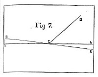

  
[Intangible Textual Heritage](../../index)  [Earth Mysteries](../index) 
[Index](index)  [Previous](cc09)  [Next](cc11) 

------------------------------------------------------------------------

# An Absolutely Indisputable Premise

THAT the perpendicular pole forms a right angle in both directions with
a chord, the extremities of which meet the verge or horizon, is given as
the first fact,--supported by the statement of every scientist, and
corroborated by thousands of experiments. When a man views the horizon
he does so along what is called a horizontal line, which is always at
right angles with a perpendicular one. Now let us compare the above
facts with the diagrams and theory given by the advocates of the
accepted theory of cosmical form.

[No. 1](#img_06900) is the usual diagram employed as the first step in
the demonstration of the convex rotundity of the surface of the earth.
The subjective point, the 

<table data-align="LEFT">
<colgroup>
<col style="width: 100%" />
</colgroup>
<tbody>
<tr class="odd">
<td data-valign="CENTER"> 
Fig 1</td>
</tr>
</tbody>
</table>

point of vision, is at A. The horizontal line, or line of vision, is at
B, and C is at the objective point. The subjective point usually
represents a man, and the objective point a ship in the distance. Let
the reader carefully note the relative angles of the line representing
the man at A, and the horizontal line B.

p. 70

It will be observed that the man at A stands obliquely to the
horizontal. If this relation of the two lines is compared with the facts
as actually observed in natural phenomena, there is discovered a
disagreement. Man stands perpendicular to the earth, and at right angles
to the horizontal line. No scientific man living can reconcile this
disagreement with the commonly accepted cosmical theory.

In [diagram 2](#img_07000) is shown a continuation of the horizontal
line C B to G. The vertical line A forms an 

<table data-align="LEFT">
<colgroup>
<col style="width: 100%" />
</colgroup>
<tbody>
<tr class="odd">
<td data-valign="CENTER"> 
Fig. 2</td>
</tr>
</tbody>
</table>

acute angle with the horizontal line C, but an obtuse one with its
extension B G. These angles as represented in the diagram are contrary
to facts as observed in Nature.

The physicist has but one escape from the dilemma he has gotten himself
into, and that is the denial of the fact of the horizontal direction of
vision toward the point where the earth and sky, or water and sky, seem
to meet.

Let the reader hold the book in such a position as to give the axis A B,
[diagram 3](#img_07100), the vertical direction,--A up and B down. C
will be a horizontal line, forming an acute angle with D, which
represents the point and relation usually given in the diagrams
presented

p. 71

<table data-align="LEFT">
<colgroup>
<col style="width: 100%" />
</colgroup>
<tbody>
<tr class="odd">
<td data-valign="CENTER"> 
Fig. 3</td>
</tr>
</tbody>
</table>

to school children, as a rudimental step in their study of cosmogony.
While C is a horizontal line, and D an oblique one, and while a spirit
level would indicate the horizontal toward C, the spirit level would
indicate a declining line toward E. This is not true according to fact.

If a man place his point of vision ten, twenty, thirty, forty, fifty, or
a hundred feet above the surface of the earth, and it be unobstructed by
natural or artificial interferences, he can observe the horizon on a
level with his eye.

A, in [diagram 4](#img_07101), represents the visual point, B B the line
of vision in both directions, C C the points indicating the verge at
horizon, D the base of his 

<table data-align="LEFT">
<colgroup>
<col style="width: 100%" />
</colgroup>
<tbody>
<tr class="odd">
<td data-valign="CENTER"> 
Fig. 4</td>
</tr>
</tbody>
</table>

position, resting upon the earth, which. describes a curve downward from
C to C. The straight line, C C, forms a chord, and the curved line, C D
C, the arc of the chord.

From certain cognized and indisputable, collected factors we have
formulated a premise as absolutely indisputable, upon which we establish
the great and

p. 72

cardinal scientific truth of Koreshanity; namely, the concavity of the
earth's surface. The first factor is, that a man standing plumb with the
"center of gravity" (base of gravity, which is on the circumference of
the sphere, and center of levity, which is at the center of the sphere)
maintains a perpendicular or vertical relation to the surface of the
earth.

The second factor is, that a line drawn from the eye, or point of
vision, at any given distance from the surface of the earth, in opposite
directions. from the visual center, touches the verge or horizon on a
level with the visual center, and that the chord thus described from
horizon point to horizon point is at right angles with the perpendicular
line maintained by the vertical posture of the man. These are absolute
facts, easily verified by any person who may take the pains to inquire
into the physical phenomena. These facts are in direct contradiction to
the cosmological theory of modern science.

### The Koreshan Premise

The premise, then, from which we demonstrate the concavity of the
surface of the earth may be stated as follows: A horizontal line drawn
in opposite directions from any visual center touches the earth's
horizon at the two extremities of the chord, and the arc of the chord
forms a depression from the center of the chord, equal to the depth of
the perpendicular radius-vector.

The extension of the curve necessarily completes the circle of the
earth, which comprises the circumferential sphere of the solar system.
The astral center, or central star, is at the nucleus of this sphere,
around it being the luminous sphere comprising what forms

p. 73

the sun proper, from which proceeds the projected sun at the limit of
our atmosphere.

Between the earth's concave surface and the solar sphere there are three
atmospheres. The first one is composed of oxygen and nitrogen; the
second one of hydrogen, and the third one of aboron. These atmospheres
occupy the first dimension in space. Occupying the same space but
comprising a second dimension, is a series of spheres composed of
physical spirit located at seven distinct distances between the astral
center and the circumference of the earth.

The earth constitutes a circumference, the focus of which is the astral
center. The diameter of this circumference is about eight thousand
miles. The distance, therefore, from the center to the circumference is
four thousand miles. From the center there constantly flow toward the
circumference the physical spirit-substances generated within the sun,
or at the astral center.

These spirit-substances: flow toward the circumference, and are met by
co-ordinating spirit-substances flowing toward the center from the
circumference. At the point where the outflowing and inflowing
substances meet, a new substance is generated from the action of the
two, which comprises the potency of revolution. (This sphere of
spirit-substance is one of the spheres already noted above.)

The earth's crust or shell is composed of seven metallic layers and five
mineral or earth deposits. The location of the metallic strata may be
determined by taking common atmosphere as the zero point, water as the
ratio, and the given specific gravity of any one of the metals as
indicating the point of location

p. 74

of the aggregate and static sphere of the metal. The metallic layers
form a compound pile or battery, of which the voltaic pile answers as a
sort of representative.

Between these spheres, that is, between each pair of metallic strata,
there is generated a spirit-substance which flows toward the center.
There are as many kinds of spirit thus generated, as there are spaces or
conjunctives between the layers. These seven qualities of
spirit-substance meet as many outflowing substances, and at the points
of meeting in space produce seven spheres. These are the planetary
spheres, the planets being the focal points. There are seven metallic
planes, from which are focalized seven planets in the physical heavens.

### The Law of Visual Deviation Accounts for Certain Phenomena

Thousands of objections will be urged outside of the argument thus far
instituted, against our cosmological theory; but such objections, not
coming within the logical steps of our argument already taken, do not
demand any reply. We have opposed an insurmountable argument so far,
founded upon indisputable factors. We need not, therefore, urge further
demonstration of our Cosmogony until these objections are overcome.

We will, however, answer the very common objection in the mind of almost
every person not willing to accept the Koreshan theory of Cosmogony. The
objector urges the fact that a ship seen approaching in the distance,
first presents the top-mast to the perception of the observer. If the
old cosmogony were true, that is, if the earth were convex, the point of

 

[  
Click to enlarge](img/07400.jpg)  
Staff Headquarters, Operating Station  

 

p. 75

observation would be vertical to the center of gravity, this being at
the center of the earth.

Such being the case, the vertical point A, represented in [diagram
5](#img_07500), would be perpendicular to the 

|                    |
|--------------------|
|  |

earth. This describes and locates the center of observation, which is
the subjective point of vision; B B, objective point or top-mast; and
C C declining, not horizontal lines. The letters C C are located where
the lines touch the circumference, but these would not be horizon
points, because not on a line level with the center of observation.

Any reasonable person can see that [diagram 5](#img_07500) (barring
exaggerations of diagram) would be the correct description of facts if
the convex theory be the true one. School children should be presented
with this diagram instead of the one usually employed. The diagram
cannot be used because the line of vision is horizontal, looking toward
and observing the horizon point, and because the deflection of the B C
A, A C B lines, as shown in the diagram, is not true to Nature.

How, then, shall we account for the phenomenon which has so long
deceived the "scientist;" namely, the observation of the top-mast of an
approaching ship, on an apparently horizontal line from the subjective
visual point? The law of visual deviation,

p. 76

which determines upward curvilineation of the visual line, accounts for
the deceptive phenomenon, and settles the question of the concavity of
the surface of the earth.

[Diagram 6](#img_07600) represents the earth as a concave sphere. A
represents a man standing vertical to the 

<table data-align="LEFT">
<colgroup>
<col style="width: 100%" />
</colgroup>
<tbody>
<tr class="odd">
<td data-valign="CENTER"> 
Fig. 6</td>
</tr>
</tbody>
</table>

center of the sphere. The horizontal line of vision extends to E, the
point where the line of direct vision touches the curve of the earth
called the horizon. From this point the visual line . curves upward. The
visual curve is decidedly marked at this point. The curve of the concave
earth is designated by the letter D, and the visual curve by E E. The
theoretical and deceptive visual line is designated by F, and the
theoretical and deceptive earth curve by G. The line A F is the
apparent, but not the real line of vision. The top-mast of the ship
appears to be in a straight line, for the obvious reasons given below.

### A Commonly Accepted Law of Optics

It is a commonly accepted law of optics, that any observed object is
seen apparently in a line corresponding to the direction of the ray
entering the eye; as, for instance, let the vision be directed toward a
surface of water, shown in [fig. 7](#img_07700). A A is the water
surface, B D, the line of vision, broken at C by the

p. 77

<table data-align="LEFT">
<colgroup>
<col style="width: 100%" />
</colgroup>
<tbody>
<tr class="odd">
<td data-valign="CENTER"> 
Fig. 7</td>
</tr>
</tbody>
</table>

reflecting power of the water. D is an object in the air, but apparently
seen at E, in a straight line from B. The perception is not conscious of
the reflection. The rational faculty has therefore to be applied, to
reconcile the facts with observation, and reach the real truth regarding
the phenomenon.

If by any law there be a curvilineation of the visual line so as to make
it deviate from the earth's curve upward toward the top-mast of the
ship, the vision would be deceived in proportion to the amount of the
curve from the horizontal or straight line, because the mere perception
.could not appreciate the curve; this appreciation belonging solely to
the office of the reason as founded upon the facts of optics.

There is an upward curve of the visual line when perception is directed
horizontally. This curvilineation depends upon a number of factors in
optical law. The elucidation of this part of the subject involves a
study of optics, as specially applicable to our Cosmogony. Vision does
not depend solely upon the entrance of light into the eye from without.
It is produced by the action of extraneous spirit-substance entering the
globe of the eye through the pupil and lens, merging to a focal point in
the center of the posterior chamber, whence it is radiated in all
directions.

p. 78

This substance stimulates the retinal coating of the globe, acting upon
the retina (the expanded portion of the optic nerve), whence the
impression is conveyed over the optic nerve and tract to the portion of
the cortical substance of the brain upon which the substance of vision
depends.

The cells of the visual cortex are stimulated, whereby they transmit
visual substance back to the eye, through the optic tract and nerve,
focalizing at the center of the globe, again radiating in all
directions. The rays passing toward and through the double convex lens
are brought to a focus just outside of the eye. From this focal point
they diverge in every direction, passing out from the eye and touching
objective points wherever there exists an obstructive point to reflex,
or send back the impression of an object.

The rays passing out from the focal point act as telegraphic wires, so
to speak, to carry back to the point of vision the return flow of
substance, by which objective things are rendered visible by the
impression these objects make upon the cortex of the brain. The real
cause of visual curvilineation, technically stated, is refraction of
gravity. It is the reaction of visual substance with gravic substance.

### Cellular Cosmogony Dispels Idea of Illimitability

One of the first objections arising in the mind to the Koreshan
Cosmogony is the apparent impossibility of sun, moon, stars, planets,
etc., being limited to so small a space as the area of a sphere, the
diameter of which is . only about 8,000 miles. Our system being true,
the circumference of the sphere is about 25,000 miles, and its diameter
8,000. This, of course, would be an impossibility if these objects had
the dimensions

p. 79

usually ascribed to them. The science of Koreshan Cosmogony dispels this
hallucination, bringing the mind back to its rational conception of
physical form.

According to the Mosaic description of creation God made two great
lights; the greater light to rule the day, and the lesser light to rule
the night; he made the stars also, and set them in the firmament of
heaven to give light upon the earth, and it was so. Koreshan Cosmogony
fixes the astral center at about 4,000 miles from the circumference of
the solar system, this .circumference being the earth.

Around the astral center is the solar sphere, which we call the sun.
Outside of this sun are three atmospheres; aboron, hydrogen, and our
common atmosphere, composed of oxygen and nitrogen. These three
atmospheres extend from the sun to the circumference; namely, the earth,
filling the entire space; and within these three atmospheres are the
planets, stars, moon, etc.

The stars are the focal points of physical spirit, produced by its
reciprocal reflection and refraction, flowing from the astral center
through the solar sphere which surrounds it. The focalization of the
stellar (star) points is produced by two systems of radiation and
convergence, by which the transmitted "energies" of the sun, by virtue
of the activity of the astral (star) center, are broken and converged to
stellar points.

Material creation is the outmost expression of the thought of God. The
Creator projects into outermost form and function only that which
obtains in the divine mind, and that which he expresses represents the
divine character and purpose when correctly interpreted.

A false translation of cosmical form, which is the expressed form of
both God's desire (will) and

p. 80

wisdom, and the manifest phenomena of that form, is the basis of a
fallacious theology; for man's conception and comprehension of Deity
must agree with his interpretation of God's manifest expression in the
physical universe, which is the unfolded cosmical speech or language of
the Creator.

Astronomy is the law of astral or stellar motion and relation, and the
concept we entertain of the physical universe, which is God's expression
of himself, must correspondentially be the concept we entertain of
Deity.

The sun is supposed to be the great center of the solar or sun's system.
The emplacement of the "heavenly bodies," according to the modern
physicist, is supposed to depend upon axillary and orbital revolution,
and centripetal and centrifugal energy \[so called\]; that is., motion
toward and from the center. If axillary and orbital revolutions are law
of emplacement; in other words, if every heavenly body depends for its
maintenance in its position upon the two motions, the one upon its axis,
and the other upon its revolution in an orbit, then no center, no matter
how aggregate the universe depending upon it and reciprocally related to
it, could maintain its emplacement without both axillary and orbital
motion.

------------------------------------------------------------------------

[Next: Solving an Incalculable Problem](cc11)
