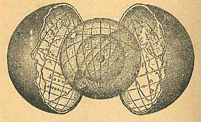

  
[Intangible Textual Heritage](../../index)  [Earth Mysteries](../index) 

------------------------------------------------------------------------

<table width="75%">
<colgroup>
<col style="width: 50%" />
<col style="width: 50%" />
</colgroup>
<tbody>
<tr class="odd">
<td width="50%" data-valign="TOP"> 
</td>
<td width="50%" data-valign="TOP"><h1 id="the-cellular-cosmogony" data-align="CENTER">The Cellular Cosmogony</h1>
<h2 id="by-koresh-pseud.-cyrus-reed-teed" data-align="CENTER">by Koresh [pseud. Cyrus Reed Teed]</h2>
<h4 id="section" data-align="CENTER">[1922]</h4></td>
</tr>
</tbody>
</table>

------------------------------------------------------------------------

[Contents](#contents)    [Start Reading](cc00)

------------------------------------------------------------------------

We start our series of etexts of alternative theories of the shape of
the earth with this masterpiece of pseudoscience by Cyrus Teed. Why Teed
was so adamant about our entire universe being inside an 'inside-out'
sphere is unknown. Martin Gardner, in Fads and Fallacies, has suggested
that it was based on a desire to return to the womb, and that this
psychological aspect was key in recruiting new members to Teed's belief
system.

Teed, born in 1839 in upstate New York, served with the Union Army, and
later became a herbalist and studied alchemy. In 1869 Teed had a vision
in his laboratory, in which a beautiful woman spoke to him and revealed
that he was to become a messiah, and reveal the true cosmogony to the
world. Teed took the name Koresh (not to be confused with David Koresh
of Waco). He preached that belief in the concavity of the Earth is
equivalent to godliness. He proclaimed, "All that is opposed to
Koreshanity is antichrist". After touring widely preaching Koreshanity,
he settled in Chicago, and started a communal society, as well as a
periodical, The Flaming Sword. Koreshanity, at its height, had a few
thousand followers. In the 1890s Teed founded the town of Estero,
Florida, near Ft. Meyers, and declared it the coming capital of the
world. His followers prepared for eight million believers to show up.
Only two hundred did.

Teed wrote a book called The Immortal Manhood, in which he taught that
after his death he would rise to heaven and take all of his followers
with him. Alas, when he died in 1908, nothing of the sort happened.
After weeks, the county health officer finally had to step in to force
the colony to bury the rotting body of their leader. Teed was buried in
a tomb which was later washed out to sea in a hurricane in 1921. The
Flaming Sword continued to be published until 1949, although it never
mentioned that Teed had died. As a matter of fact, nowhere in this book
is it mentioned that the author had been dead for fourteen years when it
was published.

The Cellular Cosmogony was Teed's *magnum opus*. Teed propounded that
the surface of the earth is concave, not convex, and that the entire
universe is contained within the 25,000 mile circumference of the
inside-out earth. The Sun is in the exact center of the 'cosmic egg,'
4,000 miles away, and is actually a helix. However we never see this
directly, only some kind of reflection of it. The Sun is dark on one
side, which produces day and night. The moon is a reflection of the
Earth, and Teed believed he could see outlines of the Earth's continents
and seas on it! Other astronomical phenomena are essentially optical
illusions. Besides geology, he also denounces the scientific method, the
Copernican theory, the atomic theory, modern chemistry, conventional
surveying techniques, and last but not least, optics. Truly, 'everything
you know is wrong.'

Teed and his followers devoted much time and energy to practical
experiments to prove the concavity of the earth. Whether there was some
deception involved, or *self-deception*, it is difficult to tell at this
late date. Their surveying methodology and the device they used to take
the measurements with (the 'rectilineator') have both been called into
question.

The obvious problems with his cosmology are either not covered at all or
brushed aside with a flurry of invented (and often semantically null)
polysyllabic words. Why does the sun rise and set each day? What is the
horizon and why is it about five miles away at sea level? How come we
can't see locations hundreds of miles away just by looking up a bit? And
what the heck is outside???

*--John Bruno Hare, June 7, 2005.*

------------------------------------------------------------------------

[Title Page](cc00)  
[Table of Contents](cc01)  
[Introduction](cc02)  
[The Cellular Cosmogony](cc03)  
[Optical Factors and Illusions](cc04)  
[Koreshan Application of Geodesy](cc05)  
[Laws Which Determine the Form and Function of the Universe](cc06)  
[Universal Form and Function Are Persistent](cc07)  
[Koreshan Principles of Optics](cc08)  
[Koreshan Cosmogony in Contrast with Modern Astronomy](cc09)  
[An Absolutely Indisputable Premise](cc10)  
[Solving an Incalculable Problem](cc11)  
[The Earth Is a Shell; the Sun Is the Center](cc12)  
[Central and Circumferential Limitation. A Universe Within a
Universe](cc13)  
[Life Develops and Matures in a Shell, Egg, or Womb; Hence We Are Inside
of It](cc14)  
[Forces and Factors Which Perpetuate Universe](cc15)  
[The Only True Science Is Founded on a Demonstrated Premise](cc16)  
[Plumbline Is First Step in Rational Demonstration](cc17)  
[Telescopes more or less Imperfect at Best; Likewise the Lens of Every
Human Eye](cc18)  
[The Geodetic Survey](cc19)  
[Tests That Cannot Be Ignored](cc20)  
[Experiments on Lake Michigan](cc21)  
[Objections by Illogical Critics](cc22)  
[Preparations for the Geodetic Survey](cc23)  
[Levels, Plumbs, Appurtenances, and Records](cc24)  
[Results and Inevitable Conclusions](cc25)  

### Addenda

[Cause of Variation of the Pendulum](cc26)  
[The Wonderful Properties of Radium](cc27)  
[Astronomical Mysteries and Hypotheses](cc28)  
[Force of Vibration Applicable to Aerial Navigation](cc29)  
[Synoptical Outline of the Universal Egg or Shell](cc30)  
[Important Admissions](cc31)  
[Principles of the New Geodesy](cc32)  
[Copernican Hypothesis in the Schools](cc33)  
[Advertisements](cc34)  
