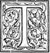

  
[Intangible Textual Heritage](../../index)  [Earth Mysteries](../index.md) 
[Index](index)  [Previous](ct00)  [Next](ct02.md) 

------------------------------------------------------------------------

**Cosmas Indicopleustes, Christian Topography (1897) Title Page,
Contents, Editor's Preface**

WORKS ISSUED BY

# The Hakluyt Society

------------0------------

### THE CHRISTIAN TOPOGRAPHY

OF

### COSMAS.

  

FIRST SERIES.NO. XCVIII-----MDCCCXCVII

**  
**  
ΚΟΣΜΑ ΑΙΓΥΠΤΙΟΥ ΜΟΝΑΧΟΥ ΧΡΙΣΤΙΑΝΙΚΗ ΤΟΠΟΓΡΑΦΙΑ.

----------------

THE

# CHRISTIAN TOPOGRAPHY

OF

### COSMAS, AN EGYPTIAN MONK.

 

Translated from the Greek, and Edited, with Notes and Introduction

BY

J. W. McCRINDLE, M.A., M.R.A.S., F.R.S.G.S.,  
LATE PRINCIPAL OF THE GOVERNMENT COLLEGE AT PATNA, AND FELLOW OF  
CALCUTTA UNIVERSITY;  
AUTHOR OF A SERIES OF WORKS ON ANCIENT INDIA, AS DESCRIBED BY THE
CLASSICAL AUTHORS,  
INCLUDING THE "INDICA" OF CTESIAS, MEGASTHENES AND ARRIAN ; THE
PERIPLÛS  
OF THE ERYTHRAEAN SEA"; PTOLEMY'S "GEOGRAPHY OF INDIA", AND THE  
"INVASION OF INDIA BY ALEXANDER THE GREAT".

COUNCIL  
OF  
THE HAKLUYT SOCIETY.  
---------

> SIR CLEMENTS MARKHAM, K.C.B., F.R.S., *Pres. R.G.S.,* PRESIDENT.  
> THE RIGHT HON. THE LORD STANLEY OF ALDERLEY, VICE-PRESIDENT.  
> REAR-ADMIRAL SIR WILLIAM WHARTON, K.C.B., VICE-PRESIDENT.  
> C. RAYMOND BEAZLEY, ESQ., M.A.  
> COLONEL G. EARL CHURCH.  
> THE RIGHT HON. GEORGE N. CURZON, M.P.  
> ALBERT GRAY, ESQ.  
> ALFRED HARMSWORTH, ESQ.  
> THE RIGHT HON. LORD HAWKESBURY.  
> EDWARD HEAWOOD, ESQ., M.A.  
> ADMIRAL SIR ANTHONY H. HOSKINS, G.C. B.  
> VICE-ADMIRAL ALBERT H. MARKHAM.  
> A. P. MAUDSLAY, ESQ.  
> E. DELMAR MORGAN, ESQ.  
> CAPTAIN NATHAN, R.E.  
> ADMIRAL SIR E. OMMANNEY, C.B., F.R.S.  
> CUTHBERT E. PEEK, ESQ.  
> E. G. RAVENSTEIN, ESQ.  
> HOWARD SAUNDERS, ESQ.  
> CHARLES WELCH, ESQ., F.S.A.  
> WILLIAM FOSTER, ESQ., B.A., *Honorary Secretary.*

### CONTENTS

<table data-border="0" data-cellpadding="4" width="100%">
<colgroup>
<col style="width: 50%" />
<col style="width: 50%" />
</colgroup>
<tbody>
<tr class="odd">
<td data-valign="top"></td>
<td style="text-align: right;" data-valign="bottom">PAGE</td>
</tr>
<tr class="even">
<td data-valign="top">EDITOR'S PREFACE</td>
<td style="text-align: right;" data-valign="bottom"> ix-xii</td>
</tr>
<tr class="odd">
<td data-valign="top">INTRODUCTION: 
Sources of the Text ----Biography of the Author; His system of the world; Opinions about his work; His place in history </td>
<td style="text-align: right;" data-valign="bottom">i-xxvii</td>
</tr>
<tr class="even">
<td data-valign="top">THE AUTHOR'S SUPPLICATION FOR DIVINE AID </td>
<td style="text-align: right;" data-valign="bottom">1</td>
</tr>
<tr class="odd">
<td data-valign="top">PROLOGUE I </td>
<td style="text-align: right;" data-valign="bottom">2</td>
</tr>
<tr class="even">
<td data-valign="top">PROLOGUE II </td>
<td style="text-align: right;" data-valign="bottom">3</td>
</tr>
<tr class="odd">
<td data-valign="top">BOOK I: 
The Places and Figures of the Universe; the heresy of affirming that the Heavens are spherical, and that there are Antipodes; Pagan errors as to the causes of rain and of earthquakes </td>
<td style="text-align: right;" data-valign="bottom">7</td>
</tr>
<tr class="even">
<td data-valign="top">BOOK II: 
The position, figure, length and breadth of the earth; the site of Paradise; the Greek inscriptions at Adulê; extract from Ephorus; the ancient empires; the Fall of Man and its effect on the Angels; the circumscription of angels, demons and souls </td>
<td style="text-align: right;" data-valign="bottom">23</td>
</tr>
<tr class="odd">
<td data-valign="top">BOOK III: 
The Tower of Babel; the Mission of Moses to the Israelites; comments on his history of the Creation of the World; the conversion of the nations to Christianity </td>
<td style="text-align: right;" data-valign="bottom">91</td>
</tr>
<tr class="even">
<td data-valign="top">BOOK IV: 
A recapitulation of the views advanced; theory of eclipses; doctrine of the sphere denounced</td>
<td style="text-align: right;" data-valign="bottom">129</td>
</tr>
<tr class="odd">
<td data-valign="top">BOOK V: 
Description of the Tabernacle: Patriarchs and Prophets who predicted the coming of Christ and the future state; the agreement of these with the Apostles</td>
<td style="text-align: right;" data-valign="bottom">138</td>
</tr>
<tr class="even">
<td data-valign="top">BOOK VI: 
The size of the Sun; a dissertation on the two states </td>
<td style="text-align: right;" data-valign="bottom">244</td>
</tr>
<tr class="odd">
<td data-valign="top">BOOK VII: 
The Duration of the Heavens</td>
<td style="text-align: right;" data-valign="bottom">263</td>
</tr>
<tr class="even">
<td data-valign="top">BOOK VIII: 
Interpretation of the Song of Hezekiah; the retrogression of the Sun; ancient dials; predictions referring to Cyrus </td>
<td style="text-align: right;" data-valign="bottom">304</td>
</tr>
<tr class="odd">
<td data-valign="top">BOOK IX: 
Courses of the Sun and Moon and other heavenly bodies; their movements effected by the angels </td>
<td style="text-align: right;" data-valign="bottom">321</td>
</tr>
<tr class="even">
<td data-valign="top">BOOK X: 
Passages from the Christian Fathers confirming the Author's views</td>
<td style="text-align: right;" data-valign="bottom">331</td>
</tr>
<tr class="odd">
<td data-valign="top">BOOK XI: 
Description of certain Indian animals and plants, and of the island of Taprobane (Ceylon) </td>
<td style="text-align: right;" data-valign="bottom">358</td>
</tr>
<tr class="even">
<td data-valign="top">BOOK XII: 
Old Testament narratives confirmed by Chaldaean, Babylonian, Persian and Egyptian records; the island Atlantis </td>
<td style="text-align: right;" data-valign="bottom">375</td>
</tr>
<tr class="odd">
<td data-valign="top">APPENDIX: 
Plates with figures illustrative of the Text, and explanations of them </td>
<td style="text-align: right;" data-valign="bottom">387</td>
</tr>
<tr class="even">
<td data-valign="top">INDEX</td>
<td style="text-align: right;" data-valign="bottom">393</td>
</tr>
</tbody>
</table>

---------------------

ERRATA  

> Page ix, line 17, *for Theodosius, read* Theodorus  
>  ..  5, line 24,   „ *vail  ,,* veil  
> ,, 23, note 2, ,, ἐγκύκλιον   ,, ἐγκύκλιος*.*  
> „ 43, line 19, „ *each of,   ,, * each pair of   
> „ 76, line 4, ,, *diameter,  ,,* dimensions  
> 154, note 1, ,, pavilio, '' papilio  
> „ 213, line 5, „ *Appolinarius,* „ Apollinarius

### EDITOR'S PREFACE.

------------------

 H E
*Christian Topography* of Cosmas Indicopleustes is one of the prodigies
of literature. The boldness and perverse ingenuity with which its
author, from a long array of irrelevant scripture texts, seeks to
construct an impossible theory of the universe can scarcely fail to
astonish everyone who reads it. It made its appearance at that period in
the world's history, when Christendom, fast losing the light of Greek
learning and culture, was soon to be shrouded in the long night of
mediaeval ignorance and barbarism. The work reflects with singular
distinctness this prominent characteristic of the age which produced it;
for while Cosmas, on the one hand, held the principles of the Christian
faith combined with others pervading the theology then current which led
to the darkening of all true knowledge, he had, on the other hand, a
somewhat considerable, if inexact, acquaintance with the philosophical
and scientific speculations of the Greeks. He may thus not inaptly be
compared to a two-headed Janus, with one face turned to the light of
departing day, and the other to the shadows of the coming night. \|x 

In our Introduction will be found a statement showing the sources whence
the text of this unique work has been derived. A biography of its author
then follows; next, a synopsis of his cosmological views, and finally,
citations of the opinions which have been passed upon his *system of the
world* and the contents of his work generally.

The translation here presented is literal, as far as the exigencies of
idiom would permit. It is the first that has been made of the whole work
into English, or, indeed, into any other language except Latin and
Norwegian. In its preparation we have lacked the advantage, generally
enjoyed by translators of classical texts, that of having at hand for
reference a variety of translations and commentaries to throw light on
passages that are dark, dubious, or disputed, or otherwise perplexed. We
have had, indeed, the assistance of Montfaucon's Latin version, but no
commentary whatever to give us light where we found Cosmas dark. That
good and learned Father is generally accurate, but, like the good Homer,
he sometimes nods, and we give at the foot of the page a list of notes
which refer to passages whereof his interpretations differ from our
own.[1](#1.md) Another list of notes follows, in
which suggestions are offered for the correction of the Greek
text.[2](#2.md) \|xi

Cosmas tells us, in the outset of his work, that he has inserted notes (
παραγραφαί) for the clearer exposition of the text (τὸ κείμενον).These
notes he seems to have placed, not in the margin, but in the body of the
work, after the text to which they refer. In our translation they appear
in a similar position, but printed in a type somewhat smaller than that
of the text.

Our rendering of the word ̔́Ελληνες requires a word of explanation. In
the days of Cosmas it was used, not so much to designate persons of
Hellenic descent, as persons who clung to the old superstitions of
Greece and Rome and rejected Christianity. Montfaucon's rendering is
*Graeci,* but we have considered *Pagans* as
preferable.[3](#3.md) This class of persons Cosmas sometimes
calls also οἱ ἔξωθεϝ*,* those *without the pale of the Church,* an
expression which we render mostly by *pagans.*

Cosmas had some skill in drawing, and seems to have taken as much
delight in covering his MSS. with illustrative sketches as was taken,
according to his showing, by the Israelites of old in covering the rocks
of Mount Sinai with inscriptions when once they had been taught by Moses
the art of writing. Montfaucon, having made a selection from these
sketches, relegated them *en masse* to the end of \|xii his work. His copies of them, which are not
always quite exact, have been reproduced for the present work, by
photographic processes, in a way which leaves nothing to be desired, and
will be found, with explanatory notes, in the Appendix.

The passages of Scripture to which Cosmas refers are very numerous, and
the words are cited at length both in the Greek text and in the Latin
version. We have, however, given only the references, in cases where
this could be done without inconvenience to the reader.

In conclusion we have to express our obligations to Mr. J. Coles,
Map-Curator of the Royal Geographical Society, and to Dr. James Burgess
of Edinburgh, for their kindness in writing for us those mathematical
notes to Book vi, in which they show how egregiously Cosmas erred in his
calculations of the size of the sun;[4](#4.md) while to Mr. C.
Robertson of Edinburgh, late of the Indian Civil Service, we stand
greatly indebted for valuable suggestions and criticisms made while he
had the goodness to hear us read over our translation to him. Mr.
Foster, the Secretary of the Society, must permit us further to say how
much the work has profited by his careful correction of the final
proofs, and the suggestions which he was kind enough on occasion to
offer.

J. W. McC.

32, LAURISTON PLACE, EDINBURGH,  *  
November* 1897.

\[Footnotes have been renumbered and placed at the end\]

1. 1 N. 2, p. 2; n. 1, p. 19; n. 3, p.
24; n. 3, p. 71; n. 1, p. 85; n. 2, p. 92; n. 1, p. 94; n. 2, p. 106; n.
5, p. 119; n. 1, p. 123; n. 2, p. 131; n. 1, p. 138; n. 2, p. 183; n. 4,
p. 192; n. 1, p. 264; n. 2, p. 277; n. r, p. 279; n. 1, p. 322; n. *2,*
p. 336; n. 3, p. 341; n. 2, p, 361; n. 1, p. 363; n. 2, *ibid.;* n. 3,
p. 364.

2. 2 N. 1, p. 12; n. 1, p. 13; n. 1, p.
16; n. 1, p. 29; n. 1, p. 50; n. 4, p. 120; n. 1, p. 138; n. 1, p. 170;
n. 2, p. 190; n. 1, p. 202; n. 1, p. 212; n. 1, p. 224; n. 2, p. 305: n.
4, p. 321; n. 1, p. 329; n. 3, p. 347; n. 1, p. 355; n. 7, p. 366; n. 2,
p. 369; 11. 2, p. 383.

3. 1 This point will be found further
explained in n. 2, p. 3.

4. 1 For the note with diagrams on pp.
247-8, we are indebted to Mr. Coles; and for n. 2, p. 249, n. 1, p. 250,
and n. 1, p. 252, to Dr. Burgess.

------------------------------------------------------------------------

[Next: Introduction](ct02.md)
