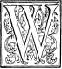
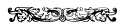

  
[Intangible Textual Heritage](../../index)  [Earth Mysteries](../index) 
[Index](index)  [Previous](ct04)  [Next](ct06) 

------------------------------------------------------------------------

**Cosmas Indicopleustes, Christian Topography (1897) pp. 91-128.  Book
3**

  

# BOOK III.

> > *That the divine scripture is firm, sure and trustworthy, both in
> > the Old and the New Testament, and in accordance with itself in the
> > details which it gives, while it also shows the utility of the*
> > *figures representing the whole world.*  

 HEN men at first
after the Deluge were high up in the air, building the tower in their
warfare with God, they suspected from their constantly observing the
heavenly bodies, but erroneously, that the heaven was spherical; for
since the city where they were building the tower belonged to the
Babylonians, an invention such as this must have originated with the
Chaldaeans; whence also the descendants of Abraham who were Chaldaeans
elaborated a barbaric sphere, and when they went down to Egypt
communicated this notion to the Egyptians. The Egyptians in turn having
grasped it as a basis for much active investigation developed it still
further, until the Greek philosophers who visited Egypt----Pythagoras,
Plato and Eudoxus the Cnidian----became acquainted with it, and basing
their study of it on what they had learned \[160\] from preceding
enquirers elaborated it still further.

*Note.*

After the Deluge, when men had multiplied in the interior parts of the
East, where, as has been recorded, the Ark rested, they removed a little
way from their first seats and found a plain in \|92 the land of Sennaar (Shinar). Now, as they were all
of one speech, they talked together with one accord, saying: The men who
were before us God has destroyed with a deluge; if he shall again think
fit to be wroth with us and seek to destroy us even with a deluge, we
shall *all* perish to a man. But come, let us prepare bricks and burn
them with fire, that they may withstand the waters, and building them
together with asphalt, let us make a high tower the top of which shall
reach to heaven, in order that being delivered from the deluge we may
find safety in the tower. And we shall readily be able to array
ourselves against him in battle, being very near him, as long as we are
all of us together, before being scattered in different directions, for
this is shown by their saying: *And let us make unto ourselves a name
before we are dispersed over the face of the earth*.[1](#1)
When they had therefore begun to build, and in their rebellious
mood[2](#2) wanted to mount up into heaven, God, who is full
of kindness and compassion, knowing and foreknowing man whom he had
created with freedom both of will and action----knowing, I say, the
strength of reason which he possessed, but at the same time the weakness
of his flesh, was moved with compassion rather than with anger towards
him, and made again a grand dispensation, and suffered them not to
labour nncl toil in vain. For, besides being crushed with hard labour,
they were dashed to pieces, if when high up in the tower they were
hurled down from the top by the violence of the winds, or tumbled down
if scorched by heat through their nearness to the sun, and blinded by
terror at the dizzy height. He therefore confounded their language and
divided it into many kinds, and put an end to their impious madness. He
scattered them besides, and settled them over the whole earth. This was
the cause of the dispersion of the nations, and of every country
becoming inhabited. In the last days therefore God being well pleased
with men, according to what is written: *Good pleasure towards
men*,[3](#3) of his own counsel and goodness resolved to lead
them up into heaven, and after forty clays from his resurrection led
(Christ) our first-fruits up into heaven. And further, in order that
\|93 he might indicate beforehand the ascension of
the rest of mankind, he on the day of Pentecost, having through the Holy
Spirit joined together the tongues which he had formerly divided, gave
them from heaven to the Apostles, and they spake with tongues the mighty
works of God. as the Spirit gave them utterance, so that all who stood
around gathered together from all the nations heard, each of them in his
own speech, the mighty works of God, and knew the good-will he was
pleased to show to men, because when of old men had rebelliously sought
to go \[161\] up into heaven, their design proved abortive; whereas now
by the good pleasure of God, the faithful are carried up into heaven.
Glory to the wise and compassionate God who has granted these favours to
men. Amen!

*Further Note.*

When the first men were there at a great height engaged in building the
tower, and frequently turned their eyes upward to the heavenly bodies
and saw some of the stars ascending and others descending, they
suspected that the heaven was somehow made to revolve on some kind of
mechanical contrivance, so that it was spherical. For they were ignorant
of the figure of the earth and were not aware that the heavenly bodies
are moved in the air by angels. Under the influence of this suspicion
they made those gates which gave passage through the tower in all
directions, contriving that the tower might not be of course thrown down
by the waters of the deluge. In like manner also they built it with
bricks that it might withstand the waters; for it was thus the tower was
constructed. They say, moreover, that its foundations occupy a breadth
in every direction of three miles, and also affirm that the steps by
which it is ascended are arranged circle-wise in the exterior walls, in
order that they may receive light through the windows made in them.

*Text.*

While the Israelites were still sojourning in Egypt Moses was born, and
being reared in the palace of the Egyptian king was instructed in all
the wisdom of the Egyptians. Having also from his own observations
accepted the sphere \|94 and made himself
acquainted with astronomy, or even with magic and hieroglyphic
letters----or as I should rather say, the symbols of letters, for as yet
letters were unknown; and, to speak briefly, having become a participant
of all this wisdom, as the divine scripture informs us, when he reached
manhood he preferred to side warmly with his own ancestral race, and he
slew the Egyptian; and being afraid fled into the land of Midian, where
he married and became the father of two sons. And when he was feeding
the flocks of his father-in-law and led them up to Mount Sinaï, he saw
that wonderful vision of the bush----the bush which burned with fire and
yet was not consumed. Then, when he was making haste to see the great
marvel, the angel of God called to him in the name of God, and commanded
him to go to King Pharoah in Egypt for the purpose of leading the
children of Israel out of their bondage to the Egyptians. And when he
begged to be let off on account of the impossibility of the thing (for
he saw that as he was a mere man he could not fight against such a
mighty king), God through the angel filled him with confidence,
reminding him of his forefathers: how that through a barren woman and
aged parents he had raised \[162\] up a great and numerous people. At
the same time he prepared him beforehand for working wonders by means of
the rod which Moses held in his hand. By these wonders Moses was quite
astounded, and was persuaded to go away into Egypt. When he had gone
thither, and had several times conversed with Pharoah, since he was
going to show him how God had produced the whole creation----what
creatures first and what second, and so on in proper
order[4](#4) . . . And these things were incredible to men,
even as they are also now to those very clever men----yea, they \|95 were even incredible to Moses himself, for he had
not as yet acquired experience of these matters; but in agreement with
the Egyptians, he also conjectured that the heaven was of a spherical
figure.

God therefore prepared him to work wonders, and in the name of God to
change the elements, and to show to all the Egyptians and to the
Israelites, and through them to the whole of mankind, that he was
faithful to God in all that he said and did, disposing them and
preparing them beforehand to accept him with readiness. The enchanters
also by whom he had been educated combined to contend with him, and in
the divine power he enters the lists against them, instructed to hold
such opponents in contempt, so that they cry off and say: *This is the
finger of God*.[5](#5)  When he had changed
accordingly the constitution of the waters into blood and killed the
fish, and changed the blood back into water living and productive, and
had divided the Red Sea and made it stand as a wall on this side and
that side in presence of the Israelites and the Egyptians, he was fully
believed by them when he afterwards said:----*God said let there be a
firmament in the middle of the water, and it shall divide in the middle
water from water, and it was so*.[6](#6) In like manner
again, when he had made darkness for three days successively among the
Egyptians, while the Israelites had light, he was again fully believed
when he said:----*And there was darkness over the abyss, and God said
let there be light, and God divided the light from the darkness;* and he
assumed that the first and second and third day had passed without the
sun, moon and stars running their course, saying:----*God divided the
light from the darkness*.[7](#7) Then again he brought frogs
out of the river and fleas out of the earth, and therefore he was
trusted when saying:----*God said let the waters bring* \|96 *forth living creatures, and it was so;* and again
he said:----*Let the earth bring forth this and that, and it was so;*
and other things in like manner marvellous. Last of all, when he had
slain all the first-born he was entitled to belief when saying last of
all:----*God made man*.[8](#8) And, as we have said above, he
so prepared him beforehand that the Israelites could readily believe
what he said and did, since they saw with their own eyes what he
performed.

When again he had led them out of Egypt and had \[163\] brought them
through the Red Sea on dry land, and conducted the people to Mount
Sinaï, in which he had seen the divine vision, God still working wonders
before the people filled the mountain with flames of fire and with
smoke, while there were heard the notes of trumpets resounding from
heaven and waxing louder and louder; and when with gloom and darkness
and tempest he had made them tremble with exceeding great fear, he began
to speak to Moses in sight of the people out of the cloud. Then, having
taken him up into the mountain to remain for forty days without food, he
hid him in a cloud and in a manner abstracted him from all earthly
things, and made him oblivious of all, including even what he had
learned from the Egyptians, giving him birth anew as if he were a child
in the womb. But at the end of the forty days he gave him a new form and
a new soul, and revealed to him all that he had done in the making of
the world in six days, and showing him in other six days by means of
visions the making of the world, performing in his presence the work of
each day, namely, on the first day the first heaven, and the earth a
most spacious house, and within it water, air, fire commingled with the
earth, darkness and angels, having produced everything singly and
collectively from nothing whatever; employing, \|97 moreover, his voice alone for the instruction of
the angels, he created the light for the house itself, thus giving light
to everything as by a lamp. Then on the second day he constructed out of
the water the firmament, which in the middle of the height of heaven
binds all firmly together, dividing the waters above from the waters
below, as it is placed in the middle between them. There are therefore
two places----an upper and a lower story, so to speak; the lower he made
fit to be a dwelling-place for this mortal and changeful life; the upper
he has made ready beforehand for the coming deathless and unchanging
life.

*Note.*

The great Moses, after relating that on the second day God had created
the firmament, and by dividing it had made one place into two, explained
nothing further about the future state----that is, the upper
place----but turned his discourse entirely upon this state-----that is,
upon the lower place----relating that God gathered together the waters,
and brought forth out of the earth the green herbs and the trees, and in
like manner adorned the heaven with stars, and again from the waters
produced the winged fowl and aquatic animals, and in like manner again
made from the earth brute animals and man. Then again, when he had been
commanded to make the Tabernacle in imitation of the form of the world,
he divided the one tabernacle by means of the veil, and made it into
two----an inner and an outer----within the outer of which the priests
continually discharged their sacred offices as being in this world,
while into the inner the high priest alone once a year entered, as if
into the upper place, that is, into heaven. \[164\] On this account the
inner Tabernacle was entirely inaccessible to them, being a type of the
things in heaven. He was, moreover, believed when with the same
authority he suitably prescribed the laws, and burdens, and punishments,
and the correction of transgressors, having prepared himself for
prescribing what was conducive to discipline and the working of wonders,
as when he involved the Egyptians in plagues and chastisements of
various kinds, and likewise made the Israelites suffer so sorely in the
wilderness for their repeated sins and transgressions, that he \|98 destroyed all the men of that generation except two
only that were left alive, while even he himself came to his end with
that generation.

But when the Lord Christ for the salvation of the whole world had
appeared among us to bring to a close the present state and proclaim the
one to come, and announced expressly that the kingdom of heaven was at
hand, he also, appropriately to his proclamation, wrought wonders for
the benefit of men, and not in a single instance for the punishment of
any man. He freed those that were possessed with devils, healed the
sick, strengthened the weak, made the lame walk erect, restored sight to
the eyes of the blind, opened the ears of the deaf, loosened the tongues
of the dumb, cleansed lepers, restored the withered to a well-tempered
life, cured withered hands, stanched by his power issues of blood,
reanimated the dead even when corrupt and stinking, prepared the living
for finishing their course, brought good tidings to the poor of
treasures of which they could not be robbed, stilled by his rebuke the
rage of the winds and the fury of the sea, and did all things else which
are in harmony with the proclamation of the Gospel and with the future
state; for in that state no devil gives trouble, no debility exists, all
sickness has been banished, with disease of limbs and distempers, and
penury, and issues of blood and commotions of the elements, and the last
enemy----death----is destroyed. When the Jews considered all
this----when they saw that he had not wrought a single miracle for the
punishment of men, except only two, and these not inflicted on man, but
upon the swine and the fig tree, upon brutes and an inanimate object, in
order to show that these also were subject to his power ----they
attempted to bring a charge against him, saying to him in turn: *We wish
to see a sign from thee,* that is, a sign such as that of Moses, which
was for the punishment of men. But the Lord, knowing the thoughts of
their hearts answered, saying: *An evil and adulterous generation
seeketh after a sign, and no sign shall be given it except the sign of
the prophet Jonas.*[9](#9) *For as Jonas remained shut up in
the belly of the whale for three days, and afterwards came out therefrom
alive and uncorrupted, so I also being dead, after remaining* \[165\]
*in the earth three days shall rise up from the dead living and
incorruptible.* At another time, again, when he had made a \|99 scourge of small cords and cast out all from the
temple, they said to him: *What sign shewest thou that thou dost these
things?*[10](#10) and this although many signs had
been given by him. But he in turn said to them: *Destroy this temple,
and in three days I will raise it up
again*[11](#11)----thus giving the same answer
both times and speaking of the resurrection of his body as if he should
say: When ye see me risen from the dead and see miracles wrought in my
name, then shall ye know our power and our proclamation of good tidings;
that my coming is not for the punishment of men, but for conferring upon
them the resurrection, and immortality, and incorruption, and
immutability, and blessedness. Accordingly, in consistency with his
teaching, he wrought also his miracles. And this very thing Matthew also
shows when speaking thus: *And Jesus went about their cities and
villages teaching in their synagogues, and preaching the Gospel of the
Kingdom, and healing all manner of disease and all manner of
sickness*,[12](#12) thus implying that he wrought
miracles of a nature consistent with what he preached. But John the
Evangelist thus speaks: *Many of his disciples went back, and walked no
more with him.* Jesus said, therefore, unto the twelve: *Would ye also
go away?* But Peter immediately answering on behalf of all said: *Lord,
to whom shall we go away? Thou hast the words of eternal life, and we
have believed that thou art the Holy One of
God*;[13](#13) meaning this: What thou teachest us
we see even by the works which are done by thee, for thou promisest us
life and a heavenly kingdom, and we see all things that are done by thee
to have regard to the life of men. How then can we leave thee and attach
ourselves to another? Our portion is therefore with thee, Lord Jesus
Christ. Amen!

But some one may raise a difficulty and ask: Since he had given not even
one sign with a view to the punishment of men, how then did he, taking,
as has been said, a scourge, beat those that were selling in the temple
and cast them out of the temple? Answer: What is alleged is false, for
it was not at all to the human being he applied the scourge, but he
adopted an admirable and becoming and appropriate course, for he
scourged the brute beasts only, as it is written: *And having made a
scourge of small cords he drove all out of the temple, both the sheep
and the oxen,*[14](#14) as \|100 much as to say: He scourged animals, but only the
irrational, driving also out of the temple even those that were brought
for sacrifice according to the law, showing by this means that the
Judaic dispensation was coming to an end. Things, again, that had
neither life nor sensation he pushed away and overthrew, as it is
written: *And he poured out the money-changers' money and overthrew
their tables.* The rational beings, however, he neither scourged nor
drove away, but he chastised the irrational, as it is written: *And to
those that sold doves he said: Take these* \[166\] *things hence, and
make not my Father's house a house of
merchandise*[15](#15)----showing by all these
words and acts that the things offered for sacrifice in the first
tabernacle according to the law were to cease, and that another
dispensation would be introduced in its place, harmonising with the
inner tabernacle, which was a type of the things in heaven----that is,
of the future dispensation. But the Jews having perceived how he was
shadowing forth to them the cessation of the Jewish dispensation,
questioned him, saying: *What sign showest thou that thou dost these
things?*[16](#16) But taking appropriate advantage of the
question, he promised them that he would do something darkly to
foreshadow the answer. I refer to the destruction of the temple and to
its renovation, because the destruction of the temple----that is, of his
body----is the destruction of this world, while the renovation and
change made upon the temple----that is, upon his body----is a
manifestation of the future state. My argument, accordingly, good
reader, holds sure that he never wrought for the punishment of man but
for his benefit, and he himself elsewhere exclaims: *For the Father hath
not sent the Son to condemn the world, but that the world through him
might be saved.*[17](#17)

*Text.*

Then he collected the water into one mass and exposed to view the dry
land, which he called earth and which was before hidden by the waters;
and he made the seas, that is, the ocean, as it is called, which
encircles this earth, and is itself encircled by the earth beyond it,
and also made \|101 the four gulfs which run up
into this earth of ours----in order that he might render the air of the
ocean which is interposed between the earth here and the earth beyond
salubrious to those at any time inhabiting either the one or the other.
He also so prepared the gulfs that they could be navigated and afford a
means of transit to different parts of the world, thus always uniting
the dispersed nations in the bonds of amity through the facility with
which commodities might be transported from nation to nation. And he
commanded all kinds of fruits and trees and green herbs to spring up out
of the earth. And again on the fourth day he divided the light, and with
its purer portion made the sun, and with the remainder the moon and the
stars, embellishing these heavenly bodies with the harmonious beauty
which adorns all nature, giving order and harmony to the universe, while
assigning to the invisible powers as their function and their law to
administer, rule, and adjust these bodies to the service of God, that
is, of man, and of all that exists on his account; thereby accustoming
and training even these exalted powers to be under law, and calling into
play the good or evil qualities of their rational powers, whence some of
them having transgressed were hurled down from heaven and deprived of
their dignity. For, *I* *saw,* saith the Lord, *Satan like lightning
fall from heaven;*[18](#18) for being puffed up
because of the service entrusted to him by God for the good of men, and
because it was his office to move the air for man and regulate its
motion for his uses, and deeming that he had of himself advanced of his
own will \[167\] to this height, he usurped to himself the worship due
to God, and was forthwith hurled down. For the Apostle again when
instructing Timothy not to be hasty in conferring office on a
neophyte----one, that is, who has but \|102
recently been converted to the faith, thus addressed him: *Not a
neophyte, lest being puffed up he fall into the condemnation of the
devil* [19](#19); which, says the Apostle, the
devil suffered through being puffed up, and has hereby clearly shown why
he was hurled down, namely, by his being puffed up, deeming himself to
be God, whence also he had the wish to communicate his own disease to
man, saying: *Ye shall be as Gods.*

*Note.*

When God Almighty had along with the heaven and the earth produced all
the angels, who had not hitherto existed, they stood all of them mute
with surprise, being distinguished by the possession of reason from all
around them, and were at once filled with amazement, and bent on
considering who he was, the Creator who had called themselves and
everything with them into existence. For they saw themselves existing in
the midst of these things, and that they did not exist before them, and
further reflected: The Creator of these and those things is surely one,
or each must have had a different creator----or again: Were all things
produced spontaneously of themselves, or who then is greater than the
other? But when they were revolving such thoughts in their minds for the
space of that night (for, as it is written, *God called that darkness,
night*) God entering into their thoughts, all at once without being
visible, said in clear tones: *Let there be light;* and the production
of the light from nothing, following instantaneously with the word,
struck them all with astonishment, and at the same time taught them that
he who had produced this light out of nothing had produced also
themselves and the things existing with them out of nothing. Then all
bending down worshipped the invisible God, who had produced themselves
and all things out of nothing. This, moreover, divine scripture declares
in Job speaking in the. person of God: *When I made the stars all my
angels praised me with a loud voice and celebrated me with
hymns,*[20](#20) from one indicating all
successively. It must, however, be observed that in the sight of the
angels he called into existence out of non-existence two
substances----the one first \|103 of all and the
other last of all----the one first created being the light, and the
other our soul; the one visible, perceptible and devoid of reason, the
other invisible, intelligent and rational. All other things, however, he
produced from things that are; intending thereby to teach them in turn
that he was the maker of all creatures, both rational and non-rational,
both those discernible by sense and those by intelligence, both those
visible and those invisible----having called them into existence from
the state of non-existence. Nor is it unlikely that they on that day and
night, since they possessed reason, considered with themselves whether
he who had produced this light had also produced the heaven. Then by a
further word of command, he made before their eyes \[168\] the second
heaven, forming it from waters and like in its appearance to the first
heaven. And by this they were once more taught that he is the maker both
of this and of the first heaven----and so he brought to an end the work
of the second day. Then when they were again engaged in thinking and
looking to the things of the earth, he, in like manner \[as when making
the second heaven\] gathered the water together, and having exposed the
dry land itself to view named it the earth, for, being its lord, he gave
it its name just as he also named the firmament heaven Then he produces
from the earth seeds and plants and green herbs and trees, teaching them
that he uses each of his creatures to effect his purposes, since they
were created by him. Then, when on the third day he had produced plants
and seeds, thereafter on the next----that is, on the fourth day,
inasmuch as such productions had need of temperature and arrangement, he
makes out of the light, which he had before produced, the great
luminaries and the stars----and having placed in the firmament of heaven
the host of the invisible powers he directed them to move these bodies
in order, on rational principles, and to make them revolve for the
supply of temperature to the plants and all that would use them, in
order that after their setting the plants might be refreshed by the
coolness and motion of the air, and be again warmed by the presence of
the luminaries. Accordingly some of the invisible powers, having from
the beginning remained till now wavering in their mind, and ungrateful
to their maker, entered on the office with which he had entrusted them
in forgetfulness of his goodness, and being inflated with pride in their
natural acumen, and in the power and the reason bestowed on them, and
\|104 valuing nothing, but even despising the
voice and the command which had come forth from God----yea, not so much
as understanding that they had been, like the other creatures, produced
along with the darkness, they were overcome by the delirium of their
folly, and fancied they had of themselves by their own free act advanced
to their high estate. I refer, of course, to the devil, who had been
entrusted with the power of the air, and his associates, who had been
entrusted some with this and others with that office, who having usurped
for themselves the worship and glory due to God, and having been puffed
up with pride and become insubordinate, were promptly----to prevent them
misleading the others----hurled down from on high and from their
dignities to go wandering about the earth. Whence also on the sixth day
and after man had been formed, Satan, who was going about in the earth
and envying the great care shown by God towards man, wished by affecting
him with his own disease to drag down man along with him.

*Text.*

On the fifth day again he ordered animals after their kind to issue
forth from the waters----the monsters of the deep and the other sorts of
fish, and along with them the winged fowl of every species that pass
through the air. Then again on the sixth day he made out of the earth
all cattle and wild beasts and creeping things after their kind. And
after he had prepared the whole house and fully furnished and adorned
it, then, just as a king, when he has founded a city and completed it,
places there his \[169\] own image, tinting and embellishing it with
various colours, so also the all-wise God, when he had as it were
gathered together the manifold and diversified works of his hands----the
rational and non-rational----the mortal and the immortal ----the
corruptible and the incorruptible----the sensible and the
intelligible----he completed and adorned one particular animal
constituted with every natural quality, namely, Man, and in the house
which had been prepared he installed him in the rank of his own image
which makes \|105 known that he who is the
Creator of all is one. Hence those angels, who are well-affected towards
God, admire his image, and hover as guardians around it, and minister
thereunto. In like manner also the whole creation----the sun on high
shining and making day for man, the moon and stars which impart some
light amid the deepest gloom, accomplish their course by night for man;
while all the months and seasons and tropics and years furnish signs to
those who traverse the open seas or pursue their way through the desert;
the air again serves the image for respiration, coolness and warmth;
fire, for baking bread, heating water, giving light by night, cooking
food and for other purposes; water, for drinking, washing, fermentation,
irrigation and many other useful purposes; the earth, for habitation and
the production of all kinds of fruit and for ministering to many other
wants. Then the clean quadrupeds minister to his pleasure and supply him
with clothing, the cattle labour for him and afford him leisure, the
wild beasts contribute the delight and terror of the chase, and so also
do the reptiles; while all things serve for the exercise of his rational
powers and supplying what is useful for man, who is the bond uniting all
the creation in friendship----who walks upon the earth, and yet flies on
the wings of thought and surveys the universe, who is upright of stature
and with ease confronts face to face the heavens as his dwelling-place,
who is the king of all things on earth and reigns along with the Lord
Christ in the heavens, and becomes a fellow-citizen of heavenly beings,
and unto whom as the image of God all creation ministers while it is
under subjection to God, and preserves its affection and gratitude
towards its Creator.

*Note.*

When on the fifth day again animals were produced from the waters, the
angels were taught that God is the Maker of this water, \|106 which was produced simultaneously with
themselves. In like manner again when on the sixth day animals were
produced from the earth, they were still more effectively taught that
God is the Maker both of animate and of inanimate creatures. Accordingly
all the angels again looked around them, gazing at all the things made
by God which had sprung into existence before their eyes in the six
days, and concluded that all things were \[170\] varied, and wonderful,
and fitted to excite astonishment, but among them they did not see
anything like themselves----rational and invisible and intelligent.
There was here ground for suspecting whether after all the Creator of
the rational, invisible and intelligent beings is one person, and the
Creator of the objects that are irrational, perceptible and visible, a
different person. God, however, wishing to remove this supposition of
theirs, produced last of all one living being constituted with all the
natural qualities, namely, man----constituted with reason and sensation
and intelligence, and with visibility and invisibility, and appoints him
to serve as his image, which makes known that the Creator of the
universe is one. Whence the angels being lost in wonder were taught by
their own eyes through man the glory and the power and the greatness and
the wisdom and the goodness of the one and only God, and that all the
elements and what had been brought into existence after themselves had
been prepared before on account of man. With alacrity therefore did they
obediently serve and minister in moving everything that conduced to
assist the image of God as being themselves members thereof, whence
again they greatly rejoice over the welldoing and the righteousness of
men, but are on the other hand greatly distressed by his evil-doing and
by his sinning, as saith also the Lord himself: *For there is great joy
in heaven over one sinner that
repenteth.*[21](#21)

It must, however, be here observed that just as God produced first in
the sight of the angels out of non-existence the sensible, visible and
non-rational light, and afterwards that which is rational and
intelligible[22](#22) and invisible, so also in the case of
man he \|107 made first, according to Moses, his
body, and afterwards his soul. Hence it was possible for some to fancy
that if there had been another day after the six days, God would have
made some other things, but since there is not another day after the
six, he would not have been able to produce more. But God to remove this
supposition of theirs, makes also a seventh day over and above, and does
no work therein, thus showing that the world is quite finished and
without any defect left in its structure to be afterwards supplied, for
if he had left such he would have completed on the seventh day what was
defective. But since nothing had been left defective in it, he rested on
the seventh day from all his works which he had undertaken to make.
Perhaps again some one will ask: Why did he make the whole creation not
in one, or two, or three, or four, or five, but in six days? Such an one
will learn this to be the truth of the matter----that, inasmuch as the
angels are rational and mutable, one day would not have sufficed for
their instruction if the whole had been produced in one day, for they
would certainly have thought that things had been confusedly brought
into existence like so many phantasms and been produced in disorder. But
God Almighty having set apart one day for each single work, in due order
formed the universe in parts, that it might be discriminated and thus
better understood by the angels. First of all on the first day after
they had been produced along with the heaven and the earth and the
elements, he made the light before their eyes. On the second day he made
the firmament: on the third day he gathered together the waters and
produced from the earth trees and green herbs. On the fourth day he
adorned the heaven with the luminaries; on the fifth he produced fish
and fowl from the waters; and on the sixth he made from the earth
animals and man, and accomplished the whole of those works in the six
days. On this account therefore he made the whole world by parts in the
six days for the discrimination and instruction of the angels, who from
their acute intelligence were able each day to discriminate each
separate part of the work and the Maker thereof. Whoso wishes can hence
learn that along with the heaven and the earth the angels were also
produced, because as they were present at all his works, God uttered his
voice in their presence for their instruction, saying: Let this and let
that be; but when he created the heaven and the earth he did not utter
his voice \|108 nor say: Let heaven and earth and
the things in them be; for there were none to hear and be instructed.
But since in the case of all the other works, there were present those
who could be instructed, the voice was opportunely uttered.

Since the angels therefore were produced along with the heaven and the
earth, the historian Moses, inspired by the Holy Spirit began his
narrative with them, as they contained the angels, saying: *In the
beginning God made the heaven and the
earth*.[23](#23) And further the Apostle, knowing
well what pertains to man and how he is figured, in his Epistle to the
Romans has placed man, as destined in the future for heaven, superior to
all, for he says: *And they changed the glory of the incorruptible God
for the likeness of an image of corruptible man, and of birds, and of
four-footed beasts and creeping things;*[24](#24)
mentioning man as superior to all, then the birds as inferior to him,
then again the four-footed beasts as inferior to the birds, and as
inferior to these again the creeping things which lurk underneath the
earth, mentioning them according to their rank in the scale of being.
But further, of all the quadruped brutes which walk upon all fours and
turn their looks earthward, not one is capable of observing the heaven
with ease. In like manner with regard to creeping things which with
their whole body wriggle along the earth, not one of these is able to
observe the heaven. All birds again, being bipeds, and in consonance
with this having their legs in the middle of their body, direct their
eyes towards the earth when they are high up \[172\] on the wing; but
when they are standing they find it difficult to turn their eyes upwards
unto the heaven. Man alone, of all the animals on the earth, being
rational and destined for heaven, received from the Creator a figure in
congruity with such a destiny. For he is a biped, being destined to fly
away and walk in heaven. In figure he is erect, as if he were ready and
destined to ascend on high.[25](#25) And it is
easy for him to behold with his eyes both the earth and the heaven as if
he were hastening to ascend from the earth into heaven, conscious that
\|109 earthly and heavenly things were bound
together through him. Moreover, all the brute animals copulate without
seeing each other face to face, and have commerce in a brutal and
shameless manner. But man alone as rational proceeds to the act face to
face, so that the pair seeing each other may embrace with reason,
modesty, and reverence, and may thankfully sing the praises of their
Maker for his goodness in giving to their nature help and mutual impulse
for the propagation and multiplication of our race. God moreover made
the woman from the man's side, because the two sides bind the whole body
close together; for he neither made her from the front of man lest the
woman should exalt herself above him, nor from his back parts that he
might not exalt himself above the woman; but from his side, as being in
her nature his equal, although the man, as the cause, is first in point
of time, but not, however, in his nature itself. And still
further----since the hand always protects and guards the side to which
it belongs, so when he had made the female from the male, and the male
from the earth, God pronounced the two to be one flesh, both from the
constitution of the two sides, and from the fruit that springs from
their connection. Wherefore the fornicator sins by estranging his own
flesh and sowing illegitimate progeny; nay, he that commits adultery is
ranked with the homicide, since he divides what is one flesh, and thus
perpetrates murder.

Some one again may perhaps propose a question and say: Why was it that,
while all the irrational animals were created by God, male and female at
the same time, man alone was not created with the female, but remained
quite solitary until the female was made later on? To this enquirer I
shall reply that since all the animals were created by God without
either the gift of reason, or the capacity of knowing anything, while
all the angels, the instant they were created, were rational and knew
the Maker of all things from those things which had been produced, one
by one, that is, in the six days, it was necessary that man who had been
created by God possessed of reason, and as the bond uniting all the
creation, should himself be taught to know the Creator of all; but
since, as he was not the first but the last of all to be produced, he
could neither from the things made before him, nor from himself know
God, it was God's pleasure to produce \[173\] the female not along with
him, but afterwards out of him, that he might thereby know that he who
had taken out from him a \|110 being like himself
was his Creator. Wherefore also he threw him into a
trance[26](#26) and a deep sleep, in order that by
taking his rib from him without trouble and pain as in sleep, he might
by the grace of God gain a perception of what had occurred, and
celebrate the praises of his Maker, confessing and saying: *This is now
bone of my bones and flesh of my flesh*----*she shall be called woman,
because she was taken out of man.*[27](#27) As
then the angels had been created rational, and from the works produced
in the six days had been taught to know him who was the cause of them,
so of necessity man also was taught through the female, and learned that
God was the Maker both of himself and of the universe; but especially as
he had beforehand heard God say: *Let us make a helpmeet for
him.*[28](#28)

*Text.*

Then again on the seventh day, after he had revealed to Moses how the
whole world had been made, and had honoured him with such mystic
visions, he then held converse with him, and having given him the law
written with the finger of God on tables of stone, and instructed him in
the knowledge of letters and made his countenance shine with glory, he
let him descend from the mountain.

*Note.*

Here men, having first received the Law from God in writing, were taught
letters and communicated them to all the nations.

*Text.*

He then afterwards directed him to construct the Tabernacle according to
the pattern which he had seen in the mountain----being a pattern, so to
say, of the whole world. He therefore made the Tabernacle, designing
that as far as possible it should be a copy of the figure of the world,
and thus he gave it a length of thirty cubits and a breadth of \|111 ten. Then, by interposing inside a veil in the
middle of the Tabernacle, he divided it into two compartments, of which
the first was called the Holy Place, and the second behind the veil the
Holy of Holies. Now the outer was a pattern of this visible world which,
according to the divine Apostle, extends from the earth to the
firmament, and in which at its northern side was a table, on which were
twelve loaves, the table thus presenting a symbol of the earth which
supplies all manner of fruits, twelve namely, one as it were for each
month of the year. The table was all round wreathed with a waved
moulding symbolic of the sea which is called the ocean, and all round
this again was \[174\] a border of a palm's breadth emblematic of the
earth beyond the ocean, where lies Paradise away in the East, and where
also the extremities of the first heaven, which is like a vaulted
chamber, are everywhere supported on the extremities of the earth. Then
at the south side he placed the candlestick which shines upon the earth
from the south to the north. In this candlestick, symbolic of the week
of seven days, he set seven lamps, and these lamps are symbolic of all
the luminaries. And the second Tabernacle which is behind the veil and
called the Holy of Holies, as well as the Ark of Testimony, and the
Mercy-seat, and above it the Cherubim of glory shadowing the Mercy-seat,
are, according to the Apostle, a type of the things in heaven from the
firmament to the upper heaven, just as the space from the veil to the
wall of the inner Tabernacle constitutes the inner place.

*Note.*

That the first historian in the world was Moses, both Eusebius, *the son
of* Pamphilus,[29](#29) and Josephus in their writings
testify; for \|112 they have clearly
shown that of all writers Moses was the most ancient.

*Text.*

When Moses had accordingly been instructed in letters by God, having
with his very eyes perceived the beginning of all things revealed to
him, and when his countenance had been glorified so that he could not be
beheld by his people without a veil, then as one who could claim belief
and who had been glorified by God, he, the first among men, wrote the
Book of Genesis in these words: *In the beginning God made the heaven
and the earth*,[30](#30) showing that when the
world was created by God heaven and earth were produced at the very
beginning, comprising as they did all existing things, while all the
other creatures which he made either along with them or after them one
by one, were contained within them. Then having ended his account how
all things existing within heaven and earth had been successively
created from the first day onwards to the sixth, and having then spoken
of God as having rested on the seventh day and made nothing more,
because the whole creation had been completed, and nothing been left
defective in the harmony of the world to mar its supreme beauty, he
again adds: *This is the book of heaven and earth;* thinking these words
sufficient to indicate collectively all things within heaven and earth.
And again in another place he says: *For in six days he finished and
rested from all his works which God had begun to
make;*[31](#31) always speaking to the same
effect, namely, that all things are contained within heaven and earth,
and that before these seven days \[175\] he had made nothing whatever,
but began on the first day \|113 and finished on
the sixth, and rested on the seventh without making anything else, and
that he made only two heavens, the first along with the earth, while
placing the second in the middle and preparing two states----the present
and the future----just as in the Tabernacle he had ordered two places to
be formed in imitation of the world, for he says: *According to the
pattern shown to thee in the mount*;[32](#32)  for
the Apostle in his Epistle to the Hebrews explains with regard to this
Tabernacle that the outer was a pattern of this world, and the inner of
the heavens.

When therefore a describer of the world so great and so divine as Moses
had been attested and glorified, in the Old Testament by God and in the
New by the Christ, while other divinely inspired prophets and apostles
along with him bear witness about all things and about the figure of the
whole creation as we have set forth in the preceding book, and they
agree with him in every particular concerning the creation itself, who
can be so obtuse, so foolish, and so far led astray, especially if he
calls himself a Christian, as to disbelieve such truth as this,
confirmed by such sacred testimony, and would not rather, bending lowly
to earth, reverence the crowd of testimonies, the selection, the
revelations, the wisdom, the glory, the predictions, the astonishing
signs, the great wonders, the fulfilments of prophecies, the testimony
of God himself, who spake with Moses face to face as a friend with a
friend, while in the New Testament the Lord Christ frequently bears
witness to him? In very truth, to express myself more warmly, I assert
that, unless one fights against God, he shall not find it in his power
to gainsay these things. For afterwards repenting he shall say: the
finger of God is in it; and he will confess his defeat, just as the
Egpytian enchanters and sorcerers Jannes and Jambres spoke concerning
him. \|114 Since therefore according to the great
cosmographer Moses, and according to Paul, that most divine teacher of
the Church, in whom the Lord Christ speaks, two heavens, and two only,
were created by God, and not seven or eight, or nine, how is it possible
to listen to the pagans advocating views based on conjecture,
sophistries, and arrogant assumptions, and inventing fables, not from
the old but chiefly from certain recent writers, who, to meet the
difficulties of their own doctrines, have devised apologies more foolish
even than the doctrines themselves. And how can those who listen to
these pagans maintain and yet be in accordance with scripture, that
there are waters above the heaven, or that the first, the second, and
the third day passed without the sun, moon and stars running their
course? Or how in the deluge of Noah did the waters cover the whole
earth and again retire? Or how can they say that there will be a final
consummation of the world----that the heavenly bodies falling will cease
to run their courses, and no longer cause the succession of day and
night; and that the present state will altogether end, and that another
state will be exhibited quite strange and far superior to this; and that
the righteous will enter into the upper heaven beyond this the visible
heaven, where is the kingdom of the heavens----the second Tabernacle
called the Holy of Holies, of which the inner place in the Tabernacle
was a pattern, into which also the Lord Christ entered, having been
taken up into the heaven above the firmament, having become the
forerunner on our behalf, and having prepared for us a new and living
way? Or how can they say that, after the consummation, the seven or
eight or nine heavens, or the heaven again which is by them called the
sphere, will revolve? For what useful purpose will this revolution be?
let them tell us and not grudge us this information; or how can such
persons believe the stupendous miracles of which we have often spoken,
that were wrought in the \|115 time of the great
Moses? And likewise that miracle wrought in the time of Joshua, the son
of Nun, when he made the sun and moon stand still, and added greatly to
the length of the day, until he put the enemy to rout? And that other
miracle performed in the time of Hezekiah, the going back of the sun ten
degrees, which struck the Babylonian with consternation and induced him
to send an embassy to Hezekiah?

*Note.*

Some have said that up to the present day a feast is celebrated by the
Persians to Mithras, that is, the sun,[33](#33) in
commemoration of the sign in the time of Hezekiah.

*Text.*

Why need I speak of the all-devouring fire in the time of
Nebuchodonosor, which burnt the bonds of the three children, but did not
consume so much as a hair of their head, or any of their garments? Or of
the renowned Elijah, who in a chariot of fire sped his way through
heaven, who raised the dead, and who by his word withheld rain for two
and forty months? Or of his disciple Elisha, who threw the wood into the
water and brought back iron, and whose dust raised up the dead? In like
manner why should I speak of the miracles wrought under the Lord Christ:
his marvellous birth from a virgin; the attestation of the Star that
then appeared; the adoration of the Magi; the good tidings brought with
joy to the shepherds by the angels; the doxology of the whole angelic
host; the prayer of Simeon conjoined with the giving of thanks; the
confession of Anna; the first miracle of Christ himself in Cana of
Galilee, who at a marriage miraculously provided a liberal supply of
wine for drinking; the giving of sight to the eyes of the man born
blind, by clay wrought with spittle; \[177\] \|116 the restoration to life of Lazarus after he had
been four days dead and his intestines were stinking; the host of
opposing demons trembling at his power and exclaiming: *Thou hast come
before the time to torment us*[34](#34)*;* the
command and the bridle imposed on the raging sea; the walking upon the
surface of the waves, when he invited Peter to walk with him upon them;
and when Peter was seized with distrust and began to sink and cried out:
*Lord, save me!* [35](#35) his drawing him up from
the deep, and his again going with him and placing him safe and sound in
the boat; the eclipse of the sun at the time of the Passion which
continued for three hours, and that too in the fourteenth day of the
moon: an occurrence quite contrary to worldly philosophy, for according
to the adepts therein an eclipse cannot result except at the time of new
moon; the quaking of the earth, the rending of the rocks and of the veil
of the temple? But passing over all the other miracles which cannot now
conveniently be enumerated, I hasten to speak of the resurrection
itself, which is the renovation of men and of all the world; the gift of
incorruption, immortality and immutability bestowed by God upon the
whole world; of the ascent again of men into heaven, into which the
first who entered in flesh was the Lord Christ; of the shadows of the
Apostles which gave strength to the weak; of the rapture of the Apostle
Paul even into the third heaven,[36](#36) that is,
to a third of the distance of the height of heaven from the
earth----namely, as far as the firmament; then his rapture into Paradise
where he was privileged to be the \|117 hearer of
the unspeakable words which it is not lawful for a man to utter. All
which things are marvellous and transcend our nature or our state.

*Another Note.*

In the days of Joshua, the son of Nun, the sun stood still. In the days
of Hezekiah, through the agency of Isaiah, it went back. At the Passion
of the Christ, contrary to the law of the pagan philosophers, it was
altogether eclipsed. The credentials of the prophets and Apostles and of
Christ himself are great and amazing miracles, and the prophecies; while
Plato and Aristotle, Ptolemy and the others, challenge our belief on the
ground of their knowledge of eclipses of the sun and moon derived from
calculations ---- if even thus they speak what is true.

*Text.*

The occurrence of these marvels prepared the men of those days to place
belief in the prophecies also, while the fulfilments of the prophecies
prepare ourselves to believe in the signs and in all things of which the
prophets spake, as was the case also in the time of the Lord Christ, who
in those days when he had come down from the Mount of Olives, and beheld
Jerusalem and wept over it as it lay opposite, said: *How often would I
have gathered thy children even as a hen* \[178\] *gathereth her
chickens under her wing, and ye would not. Behold, your house is left
unto you desolate.*[37](#37) Then when he had
passed sentence on the temple, his disciples who were still under the
influence of Judaic sentiment were sorrow-struck; and scripture
afterwards says: *When descending from the Mount they showed him the
building of the temple,*[38](#38) in order no
doubt that they might move him to pity, and that he might recall what he
had said with regard to the temple, for they knew and believed that
everything spoken by him would come to pass. But he knowing \[what would
be\] said to them: *Do you see all these things? Verily, I* \|118 *say unto you, there shall not be left here one
stone, upon another that shall not be thrown
down.*[39](#39) Then were they possessed with
fear, and remained silent, and said nothing further on this matter.
Accordingly thereafter came the Romans, and levelled with the ground the
temple and the city, and made it an utter desolation, executing as if by
compact what had been commanded by the Lord. And up to this day we see
with our very eyes that lo! for more than five hundred years it has lain
so desolate that it cannot be renovated. Moreover he said to his
disciples: *Be of good cheer, I have overcome the
world.*[40](#40) And again: *The gates of hell
shall not prevail against the church;*[41](#41)
and again he declares that all the world shall be filled with his
doctrine, even as the three measures of meal, in which the woman hid the
leaven, were all leavened throughout and made one by that leaven. And
again: *The Gospel shall be preached throughout the whole
world:*[42](#42) and along with it shall the woman
too be told of who did him a kindness----and we see that all these
predictions have been fulfilled. For the Christians who were at one time
persecuted by the Greeks and Jews have conquered, and drawn their
persecutors over to their own side. In like manner we see that the
Church has never been destroyed, but that its adherents have been
greatly multiplied, and that similarly the whole earth has been filled
with the doctrine of the Lord Christ, and is still being filled, and
that the gospel is preached throughout all the world. This I avouch to
be the veritable fact, from what I have seen and heard in the many
places which I have visited.

Even in Taprobanê,[43](#43) an island in Further India, where
the Indian sea is, there is a Church of Christians, with clergy \|119 and a body of believers, but I know not whether
there be any Christians in the parts beyond it. In the country called
Malê,[44](#44) where the pepper grows, there is also a
church, and at another place called Calliana[45](#45) there
is moreover a bishop, who is appointed from Persia.[46](#46)
In the island, again, called the Island of
Dioscoridês,[47](#47) which is situated in the same Indian
sea, and where the inhabitants speak Greek, having been originally
colonists sent thither by the Ptolemies who succeeded Alexander the
Macedonian, there \[179\] are clergy who receive their ordination in
Persia, and are sent on to the island, and there is also a multitude of
Christians. I sailed along the coast of this island, but did not land
upon it. I met, however, with some of its Greek-speaking people who had
come over into Ethiopia.[48](#48) And \|120 so likewise among the Bactrians and Huns and
Persians, and the rest of the Indians, Persarmenians, and Medes and
Elamites, and throughout the whole land of Persia there is no limit to
the number of churches with bishops and very large communities of
Christian people, as well as many martyrs, and monks also living as
hermits. So too in Ethiopia and Axôm, and in all the country about it;
among the people of Happy Arabia----who are now called
Homerites----through all Arabia and Palestine, Phoenicia, and all Syria
and Antioch as far as Mesopotamia; among the Nubians and the
Garamantes,[49](#49) in Egypt, Libya,
Pentapolis,[50](#50) Africa[51](#51) and
Mauretania, as far as southern Gadeira,[52](#52)
there are everywhere churches of the Christians, and bishops, martyrs,
monks and recluses, where the Gospel of Christ is proclaimed. So
likewise again in Cilicia, Asia, Cappadocia, Lazica[53](#53)
and Pontus, and in the northern \|121 countries
occupied by the Scythians, Hyrcanians,
Heruli,[54](#54) Bulgarians,
Greeks[55](#55) and Illyrians, Dalmatians, Goths, Spaniards,
Romans, Franks, and other nations, as far as Gadeira on the ocean
towards the northern parts, there are believers and preachers of the
Gospel confessing the resurrection from the dead; and so we see the
prophecies being fulfilled over the whole world.[56](#56)

Among the famous philosophers who flourished among the pagans, which of
them, Socrates, or Pythagoras, or Plato, or Aristotle, or any other, was
held worthy to foretell or announce any thing of such advantage to the
world as the resurrection of the dead, and the free gift to men of the
Kingdom of Heaven, which cannot be shaken? For they can announce nothing
except only that, by means of calculations and secular learning, they
declare when eclipses of the sun and the moon will occur, whereby, even
if they predict them truly----as in fact they do----no benefit will
accrue to the world, but rather the evil of pride; while should they say
nothing about them they will do no manner of harm. For what boy who
learns arithmetic will be found ignorant of this knowledge? or what old
woman or country-bred yokel has not an acquaintance with some of the
works and ways of nature? or what nation or what barbarian knows not
these things----astronomy I mean, and geometry and the various practical
arts, medicine, carpentry, stone-cutting, weaving, smithwork,
agriculture, and others of which the Greeks have no conception? or what
nation \|122 between east and west, between north
and south, that believes in Christ, does not by various methodical
calculations fix for many years beforehand when the Easter festivals are
to be celebrated? In fact, they correctly determine the dates in
advance, since they all with one consent, from one end of the earth to
the other, on one and the same day, celebrate Easter according to their
different calculations and methods of computing the time.

For since God has endowed man with wisdom and reason he has rendered him
capable of finding out whatever mind can attain to, and whatever he can
acquire from education; for such is the nature of that rational
animal----man. For when the men of early times had invented an art, they
made many mistakes; but afterwards either they or their successors
rectified these mistakes under the teaching of experience, time and
practice. In like manner those who received the art from them firmly
retained what had been transmitted to them. On the other hand the divine
teachings, be they doctrines or be they arts, are not in this manner
brought to perfection by human intelligence; but being at first given by
God, one receives them with full assurance, even as did those whom God
inspired with wisdom for the preparation of the Tabernacle in the time
of Moses, namely, Beseleêl himself the son of Urias, the son of Ôr, of
the tribe of Judah, and Eliab, the son of Achisamach of the tribe of
Dan, and all to whom he gave understanding, and filled with the Spirit
of God and knowledge to devise all manner of workmanship, both of
carpentry and of working in gold and silver and brass----and blue and
purple and scarlet thread, and fine twined linen----and stonework and
woodwork, according to all the works which the Lord commanded them to
make for the Tabernacle of testimony, both the Ark of the Covenant and
the Mercy-seat over it, and the furniture of the Tabernacle, its altar
and its table and all its vessels, and the laver and \|123 its base, and the official robes of Aaron and his
sons when ministering as priests before God, and the anointing oil and
the sacred incense composed of sweet aromatics, according to all things
which God commanded him to make. And beyond question you will find that
up to this very day the most of these arts are most zealously cultivated
among the Jews.

*Note.*

When the first man had sinned and had come to a sense of his \[181\]
transgression, and was fittingly convicted thereof by God and filled
with confusion and shame, he began to consider next by what contrivance
he could cover his nakedness, and being stimulated by God to exert his
faculty of reason, he invented the art of sewing, and with the thorns of
shrubs stitched together for himself leaves of the fig tree. And being
at the same time instructed by God as to the preparation of tunics, he
learned to make them from the bark of trees.[57](#57) It is
attested by scripture that Cain discovered the art or science of
agriculture, and Abel that of the keeping of sheep. Then again, when
Cain after the murder of his brother had been cast out by God, as it is
written: *Cain went out from the presence of God and dwelt in the land
of Naïn.*[58](#58) as much as to say, that Cain was cast out
by God and banished from his home to a wretched country, for they
thought that Paradise was God's dwelling-place, as he was wont to go
forth therefrom and ofttimes showed himself there. The sons therefore of
Sêth who lived near Paradise, and were so to speak under God's care, and
ofttimes conversed with him, were always called the sons of God, while
the sons of Cain who were settled somewhere far away from Paradise, and
were not constantly under the care of God, but lived in a wild and
wretched country, and were under their own care rather than God's, were
called the sons of men. Since Cain therefore and his offspring lived in
fear, they invented other arts for their security, as, for instance,
carpentry, \|124 stone-cutting, metallurgy and
music. Carpentry----for making tents and doors and roofs for the
protection of themselves and their cattle; masonry----for building
houses and cities by way of providing for their safety and defence;
metallurgy----for the tilling of the soil, and breaking it up with the
ploughshare, and reaping the crops with hooks, and for making flutes and
many other articles; lastly----music to keep them awake by night with
the flute and the lyre and the singing of songs, and to protect
themselves and their cattle from the attacks of wild beasts. So then
they lived on in fear, and in exile they devised all kinds of expedients
to ensure their safety, for scripture thus speaks of them, saying of
Cain: *And he built a city and named it Enoch after the name of his
son;*[59](#59) then of Thobel (Tubal), the son of Lamech by
Ada, it says: *He was the father of such as dwell in the tents of
shepherds;*[60](#60) and of Jubal, the brother of Thobel, it
says: *It was he who taught the use of the psaltery and
harp.*[61](#61) Scripture speaks also of metallurgy when it
says concerning Thobel whom Sella (Zillah) bare: *He was the forger of
cutting instruments of brass and iron.*[62](#62)

\[182\] God having thus from the first given man ingenuity, fitted him
to invent arts, and while the first men at the outset invented them,
their successors, starting from where they left off, by dint of
assiduous practice, brought them to greater perfection. It will be well
therefore if we here take up an argument against those sophists who say
that the world is eternal and without beginning, and remind them how far
they are in error, understanding neither from the things themselves
----namely, from the arts, that it is not eternal and without beginning,
but of recent production. For if the arts were discovered gradually, and
all human society subsists through art and rational science, how is it
possible for the world to subsist without art and rational science? For
without the art of stone-cutting, how can houses, fortifications and
cities be reared for the protection of men and civic communities? In
like manner, without the art of weaving, whence could men obtain
coverings sufficient to protect them from cold and from frost. In like
manner, were there not an art of working in metals, how would \|125 it be possible for men to till the soil, and
break up the earth with ploughs, or reap the crops with sickles, in
order to provide themselves with food? If again there was no art of
medicine, how could the sufferings to which men are liable be cured and
their illnesses be mitigated?

From all this it is quite manifest that the world is not eternal, but a
recent production, just like the inventions and the arts and the
sciences of men. For where will they find among astronomers one equal to
or greater than Ptolemy; or among philosophers, than Plato and
Aristotle; or what greater geometricians and arithmeticians will they
find than Euclid and Archimedes, who alone discovered the quadrature of
the circle?[63](#63) But if these learned men were
more exact than their predecessors, is it not most manifest that the
arts were gradually discovered through the ingenuity which was bestowed
by God upon men? Wherefore also the scripture, referring everything to
God, exclaims: *All wisdom is from God.*[64](#64) They are
therefore either liars or consummate fools in supposing the world to be
eternal, when they are convicted of being in error by actual facts. But
sacred scripture speaks more truly when it says: *In the beginning God
made the heaven and the earth.*[65](#65) I should like again
to put to those wise men this question: since the hammer, the anvil and
the forceps precede the entire art of metallurgy, who was it prepared
these instruments? Let them tell us and not begrudge us a reply. They,
however, not having the sense to take refuge in God, the maker of the
universe, who endowed the race of mankind with wisdom, and gave them the
faculty of invention, but wishing after the ways of their own heart to
construct and to demolish theories, on finding themselves beset with
difficulties and the most formidable perplexities of reasoning, presume
next to declare that the world is eternal and had no beginning, for such
assertions show to what straits they are reduced. How hard, for
instance, are they pressed both with respect to man and bird, since the
one is produced from seed and the others from eggs; and if this opinion
of theirs is true, the question arises did men and birds ----the
products respectively of seed and of eggs----exist at the same \|126 \[183\] time with God, or did they not? And if
they did exist, the seed and the eggs will of necessity be found
existing before God, and before men and birds; but if they did not exist
they must submit to divine scripture, when it informs us through Moses:
*God said, Let us make man in our image,* and through the Apostle at
Athens on the Areopagus \[tells us what we read in Acts xvii, 24-28\].
So then, as has already been said, the sons of Seth, those namely who
are called the sons of God, went in against the will of God but in
obedience to their own self-will, to the daughters of men ----that is,
to the women of the race of Cain----and joined themselves to them in
marriage. Wherefore God, taking occasion from this, made a new
dispensation and destroyed those who had sinned by means of the Deluge,
but him that was righteous he preserved by the Ark, and transferred to
this earth of ours, which was a better one and almost equal to Paradise.

*Text.*

But to continue,----the divine doctrines, the structure of the world,
and the prophecies cannot possibly be explained unless one learn them
from divine revelation, or receive them from men divinely inspired, the
Prophets themselves, and the Apostles, and all divinely inspired
scripture; for it is impossible to acquire such learning from
conjectures or arrogant assumptions or human wisdom. But that the
structure of the world coincides with the doctrine of the Christians,
the whole of divine scripture, as has been said, proclaims, namely,
Moses and the Prophets, the Lord Christ and the Apostles, as we have
repeatedly explained. For God divided the one place which extends from
the earth to the higher heaven by interposing in the middle the second
heaven, and thus made two places; and to this mortal and mutable state
he assigned the lower place, and to the immortal and immutable state the
higher, which is called also the Kingdom of Heaven, and about which the
Lord Christ speaks thus in the Gospel of Matthew: *For in the
resurrection they neither marry nor are given in marriage,* \|127 *but are as the angels of God in
heaven;*[66](#66) and again: *He shall to those on
the right hand say*----*Come, ye blessed of my father, inherit the
kingdom prepared for you before the* \[184\] *found-ation of the
world,*[67](#67) as if he should say prepared from
that time; \[see also\] John xii, 32; Matt, xiv, 40; viii, 11, 12; Heb.
iv, 11; Philipp iii, 20; Rom. viii, 17; Ephes. ii, 6; Philipp. iii, 14;
Galat. iv, 26; Heb. iii, I; Ephes. ii, 19; Heb. xi, 9, 10; *Ibid,* v,
16; *Ibid,* xii, 22-24; *Ibid,* xiii, 14; Luke xxiv, 51; Acts i, 10, 11;
Heb. ix, 24; *Ibid.*\[185\] vii, 26; *Ibid,* vi, 18-20; *Ibid,* x, 19,
23.

Can any one then be so infatuated, so lost in misery as to disbelieve
such promises and such true prophecies, which both from the two places
created in the beginning and made ready so to speak by God from the
foundation of the world, and from such preparations are shown to be true
and in harmony with the doctrine of the Christians? And this with regard
both to the principles and the ends, namely, that when God had set apart
the present mortal and mutable state of existence for the exercise of
the reasoning faculty, and had led it through its trial, he at last
releases the world from its toil and discipline, and reveals the future
state, graciously bestowing everlasting benefits, exemption from penury
and the sway of the passions, immortality, incorruption, immutability,
perfect knowledge, righteousness, sanctification, redemption and
blessedness for evermore, Amen! For the present state will not remain
for ever, as the pagans are foolish enough to assert, supposing that God
delights in evil, or rather that he is deficient in power or gives
grudgingly, so that he is unable to grant the world release from its
struggles and from corruption; yea, that day after day he adds
destruction and sufferings, and death and trials, and is not strong
enough to give the prizes of contests, or to award crowns, \|128 or to bring the toils with which men are
exercised to an end. For as they suppose him to be merely the artificer
who shapes the material which he has at his command, so even now they
suppose that he is not able to make it better, disbelieving the
resurrection of the body as a thing impossible, and disbelieving also
the whole of divine scripture. Wherefore those miserable men admit the
spherical form of the heaven to be true, disbelieving, yea, rather
execrating, the whole of divine scripture, and turning away from the
truth as from old wives' fables. Far however be it from us to boast
except in the whole of divine scripture, through which the outside world
is crucified to us and we to the outside world. Be it ours, O most
\[186\] pious Father Pamphilus, along with a good life, to embrace the
divine oracles, and to repudiate those of our adversaries, according to
the will of Him that is mighty, and by the help of Christ the saviour of
us all, with whom to the Father, together with his holy and adorable
Spirit, be glory now and evermore, world without end.----Amen! 

 

\[Footnotes moved to the end and renumbered\]

1. 1 Gen. xi, 4.

2. 2 Gr. τυραννικῳ̃ τρόπῳ*.* In later
Greek the adjective was used in this sense. Montfaucon, however,
translates: *tyrannico more.*

3. 3 Luke ii, 14.

4. 1 There is evidently here a hiatus.
Montfaucon has passed without notice.

5. 1 Exod. viii, 19.

6. 2 Gen. i, 6.

7. 3 Gen. i, 2.

8. 1 Gen. i, 20.

9. 1 Matt. xi, 38.

10. 1 John ii, 18. 

11. 2 John ii, 19.

12. 3 Matt, i.x, 35. 

13. 4 John vi, 67.

14. 5 John ii, 15.

15. 1 John ii, 16.

16. 2 John ii, 18.

17. 3 John iii, 17.

18. 1 Luke x, 18.

19. 1 I Tim. iii, 6.

20. 2 Job xxxviii, 7.

21. 1 Luke xv, 7.

22. 2 Gr. τὸ νοητὸν*.*----Montfaucon
translates this by *intelligentum,* but what Cosmas means is that the
soul is discerned by the intellect and not by the senses.

23. 1 Gen. i, i.

24. 2 Rom. i, 23.

25. 3 Compare Ovid, *Metamorph.,* Book
i, 11. 84-86:

> Pronaque cum spectent animalia caetera terram,   
> Os homini sublime dedit, coelumque tueri   
> Jussit, et erectos ad sidera tollere vultus.

26. 1 Gr. ἔκστασιν.

27. 2 Gen. ii, 23.

28. 3 Gen. ii, 18.

29. 1 This is Eusebius, the father of
ecclesiastical history, who succeeded Agapius as Bishop of Caesareia in
315. He was a native of Palestine, and took the surname *Pamphili* as a
token of his great affection for the martyr Pamphilus, who had been the
bishop of the same See, and of whom he wrote a life, now lost.

30. 1 Gen. i, 1. 

31. 2 Gen. ii, 3.

32. 1 Exod. xxv, 40.

33. 1. See Strabo, xv, iii, 13

34. 1 Matt, viii, 29. 

35. 2 Matt, xiv, 30.

36. 3 "The expression ἕως τρίτου
οὐρανου̃ is founded on *Jewish* phraseology, by which heaven was
considered as threefold, consisting of: 1. the *aerial* (or skyey); 2.
the *sidereal* (or starry); and 3. *heaven itself,* the abode of God and
the angels."----Bloomfield, Note on II Corinthians xii, 2. The
interpretation put upon the expression by Cosmas is manifestly
disingenuous.

37. 1 Matt, xxiii, 37, 38.

38. 2 Matt, xxiv, 1.

39. 1 Matt, xxiv, 2. 

40. 2 John xvi, 33.

41. 3 Matt, xvi, 18. 

42. 4 Matt, xxiv, 14.

43. 5 For a description of Taprobanê
(Ceylon) see Book XI.

44. 1 Malabar, see below, Book xi. 

45. 2 *Ibid.*

46. 3 Gr. ἀπὸ περσίδος χειροτονούμενος.
This is the verb used in the Acts of the Apostles, xiv, 23: *ordained by
the laying on of hands.*

47. 4 Dioscoridês is the island now
called Socotra. The name, though in appearance Greek, is in reality
Sanscrit, from Dvîpa Sukhâdâra, that is, *Island Abode of Bliss.* A
description is given of it in c. 30 of the *Periplûs* of the Erythraean
Sea, which was writtten about the middle of the first century. It is
described as "of great extent but désert, and very moist, and as having
but a scanty population, which was settled on its north side, and
consisted of an intermixture of foreigners----Arabs, Indians, and even
Greeks----engaged in commerce." The people of the interior are still of
distinct race, with curly hair, Indian complexion, and regular features,
while the coast people are of mixed descent. Abulfeda says the people
were Nestorian Christians and pirates, but the late Sir H. Yule says
that "some indications point rather to a connection of the island's
Christianity with the Jacobite or Abyssinian church. Thus they practised
circumcision .... and De Barros calls them Jacobite Christians of the
Abyssinian stock. Barbosa speaks of them .... as Christian only in name,
having neither baptism nor Christian knowledge .... Now not a trace of
former Christianity can be discovered, and the social state of the
people could scarcely be lower." See his edition of *The Book of Ser
Marco Polo,* vol. ii, pp. 401-2.

48. 5 Gr. ἀνδράσιν τω̃ν ἐκει̃ . . . .
έλθου̃σιν έν τῃ̃ ̕Αιθιωπίᾳ.----Montfaucon translates: qui in Aethiopian
*proficiscebantur.* Cosmas had probably met them at Adule or at Axum.

49. 1 The Garamantes were the
inhabitants of the great oasis in the Libyan desert called Phazania, and
now Fezzan, but the name was often used in a wider sense to denote the
people of northern Africa who lived to the south of the Syrtis.

50. 2 Pentapolis, the name for any
association of five cities, denotes here the five chief cities of the
province of Cyrenaica in north Africa. These were Cyrênê, Berenice,
Arsinoê, Ptolemais, and Apollonia, the port of Cyrênê.

51. 3 Africa, in its narrow sense,
meant the regions between Mauretania and Cyrênê.

52. 4 Gr. Γαδείρων, τὰ πρὸς νότον*.*
Cosmas slips here in his grammar, using τὰ for τω̃ν*.* A little below he
speaks of another Gades----Γαδειρα του̃ Ωκεανου̃, that is, Gades in Spain.
Southern Gades, Yule thinks, may be Tingis, or Cape Spartel, called by
Strabo Kôteis.

53. 5 "In the time of Pliny, Arrian,
and Ptolemy", says Gibbon, "the Lazi were a particular tribe on the
northern skirts of Colchos. When the Romans stationed on the Phasis were
either withdrawn or expelled, the tribe of the Lazi, whose posterity
speak a foreign dialect, and inhabit the sea-coast of Trebizond, imposed
their name and dominion on the ancient kingdom of Colchos. Their
independence was soon invaded by a formidable neighbour .... In the
beginning of the sixth century their influence was restored by the
introduction of Christianity, which the Mingrelians still profess with
becoming zeal, without understanding the doctrines or observing the
precepts of their religion."----*Decline and Fall,* Chap. xlii.

54. 1 The Heruli under Odoacer, who is
styled their king, in A.D. 476 overthrew the western empire. Their seats
lay to the north of the Euxine.

55. 2 Gr. ̔Ελλαδικω̃ν.

56. 3 Towards the end of the
seventeenth chapter of the *Decline and Fall,* Gibbon has summarised
what Cosmas here says regarding the wide spread of Christianity.

57. 1 Gr. ἐκ δερμάτω̃ν
ξύλων-----Montfaucon translates *ex pellibus ovium,* taking ξύλων to be
a mis-reading of the MS. ξύλον, however, has sometimes, especially in
Alexandrian Greek, the meaning of *live-wood,* or a *tree. *

58. 2 Gen. iv, 16.

59. 1 Gen. iv, 17. 

60. 2 Gen. iv, 20. 

61. 3 Gen. iv, 21.

62. 4 Gen. iv, 22.

63. 1 Cosmas refers here to the work of
Archimedes, which is still extant, on the Quadrature of the Parabola.

64. 2 Eccl. i, 1.

65. 3 Gen. i, 1.

66. 1 Matt, xxxii, 30.

67. 2 Matt, xxv, 34.

------------------------------------------------------------------------

[Next: Book 4](ct06)
