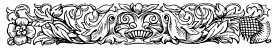
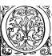
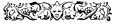

  
[Intangible Textual Heritage](../../index)  [Earth Mysteries](../index.md) 
[Index](index)  [Previous](ct06)  [Next](ct08.md) 

------------------------------------------------------------------------

**Cosmas Indicopleustes, Christian Topography (1897) pp. 138-243.  Book
5**

 

# BOOK V.

*In which is contained a description of the Tabernacle, and in which the
harmony is exhibited of the Prophets and Apostles.* \[192\] 

  F the Tabernacle
which was prepared by Moses in the wilderness, it is now time to give a
description, as we have received it from that most divine man and
teacher. And having made divine scripture our [1](#1.md)
starting point and accepted its testimonies, we begin with the exodus
from Egypt, when the first-born of the Egyptians died, suffering the
last of the plagues brought upon them through Moses----when also the
Israelites, after having sacrificed, ate the Passover standing, having
their loins girt, and holding staffs in their hands, ready prepared for
their departure, on the first day of the first month at evening on the
fourteenth day of the moon, which things were a shadow and type of the
things that would be under the Lord Christ, namely, the deliverance from
tyrannical bondage, the renovation of the world, accomplished by the
resurrection from the dead, and \|139 the
everlasting rest into which men shall enter. For at that very season of
the year the world appears to have been created by God, and to have had
its beginning. Likewise also in the time of Noah after the Deluge, there
was again at that season a beginning of the world. It was the season
again when there took place the deliverance of the Israelites from
Egypt; and it was then also that there occurred the conception by the
Virgin of the Lord Christ according to the flesh----of him who is the
second Adam, the Chief Captain of the second state. In it again also
occurred the resurrection from the dead of our Lord Jesus Christ
according to the flesh, and it is said further that the general
resurrection also shall then take place. The pagans moreover bear
witness to the season, thieves that they are, deeming it to be an
opinion of their own, and regarding Aries as the beginning of the Zodiac
circle. In this sign there is, according to divine scripture, the first
month of the year, and herein is a clear proof of their being
plagiarists, especially as they assign a beginning to a circle----an
idea scouted even by themselves as ridiculous. In fact they have nothing
that is good but what they have purloined from divine scripture; but
being puffed up with pride, and wishing to set themselves up as quite
superior persons, they use as their own what is the property of other
people.

But that the Law serves the purpose of foreshadowing some things that
are future the Apostle testifies, exclaiming: *For the Law having a
shadow of good things to come, and not the very image of the things*
[2](#2.md)----speaking of a shadow as when one draws
a rough sketch of a man without taking a full likeness of him, that is
without representing his features and all his different members, so that
it can be \[193\] known what sort of a man he is, whether old or young,
\|140 whether comely or uncomely, but merely
sketches an outline of his bodily figure; so by what he calls an image
he means the characteristic features, that is, the mysteries celebrated
by us, namely the regeneration through baptism, and participation in the
mysteries.[3](#3.md) But what he calls the real things
themselves are the resurrection from the dead, the transformation of our
bodies, the change from corruption to incorruption, the immutability of
the soul instead of its mutability, perfect knowledge for that which is
in part, an habitation, a rest, and an entrance into heaven, instead of
earthly things heavenly, and instead of temporal things eternal. And all
these boons have been secured for the human race through our Lord Jesus
Christ. He therefore calls the Law the shadow of these things while the
image and its characteristics are the mysteries celebrated by the
Christians, as for instance, the lamb offered in sacrifice----a type of
the Passion of Christ, in accordance with what the Apostle Paul says:
*For Christ our Passover was sacrificed;*[4](#4.md) and John the
Baptist thus speaks: *Behold the Lamb of God which taketh away the sin
of the world.*[5](#5.md) Then after this, for the
Israelites of that time there was their deliverance from the destroying
angel and from the bondage to Pharaoh; for us, our deliverance from the
devil and from our bondage to the very burdensome law. Then for them,
their passage through the sea \|141 and their
sojourning in the wilderness, and the giving of the law and the setting
up of the Tabernacle; for us, our passage through baptism and our
sojourning in the Church, and the gift of the Holy Spirit. For them, a
copious supply of water from the rock to sustain their life; for us, the
life-giving mysteries; for them, the land of promise as a place of rest;
for us, heaven not made with hands as our place of rest; for them,
temporal life; for us, life eternal and righteousness, and
sanctification, and redemption and blessedness. The former things
therefore serve the purpose of a rough sketch, but those that are ours
are the images and characteristic features of the things themselves. And
we are not yet within the things themselves, but it shall come to pass
that we shall rise from the dead; for no one, save only the Lord Christ
in the flesh, has been within the things, having been the first of all
to rise from the dead.

When the Egyptians were accordingly hastening the departure of the
Israelites from Egypt, these carried away on their shoulders the flour
itself, which with their hands they had kneaded into cakes without any
leaven, and without the dough being baked. So when they had taken their
departure and were drawing nigh to the Red Sea, the Egyptian Pharaoh who
had repented and collected an army, pursued after them and overtook them
near the sea opposite the encampment in the midst of Migdol and right
opposite Beelsephon. Then evening at length coming on, the pillar of
cloud or of fire, which always went before them and guided them on their
way, that night came behind them and prevented the Egyptians from
attacking \[194\] ** the Israelites. Then afterwards when the day was
about to dawn, and when the Israelites cried to God, God commanded Moses
to smite the sea with his rod and to divide it. Moses, having therefore
done as he was commanded, smote the water and divided it, so that it
stood up as a \|142 wall on this side and on that
side, and the Israelites passed through. But when the Egyptians with
their chariots were in the midst of the sea pursuing the Israelites, the
waters, driven by the anger of God, were turned back upon them and they
were all overwhelmed in the sea and perished. Now that very place is in
Clysma,[6](#6.md) as they call it, on the right hand as you go
to the mountain, where also the tracks of the wheels of their chariots
are visible, and can be traced for a considerable distance as far as the
sea, and are preserved even to the present day, as a sign to unbelievers
and not to believers.

*Note. Regarding the conception of the Lord.*

When Zacharias on the tenth day of the seventh month had gone into the
temple, according to the tradition of the law, and it had been announced
to him that John would be born to him by Elisabeth, word also came to
the Virgin in Elisabeth's sixth month that her own first month had
begun. For as Zacharias had received word on the tenth day of the month,
and Elisabeth had conceived in that very month, it is evident that six
months of the year had elapsed, and that six months were still left with
the exception of those ten days, with two or three or seven others
added, until Zacharias returned to his house, so that there would remain
161 or 167 or 163 days. The beginning therefore of the conception of the
Lord, that is, the beginning of the first month, was Elisabeth's sixth
month according to what is handed down in the Gospels. For God has
always observed this order and continues to observe it. This we can know
for certain, since \|143 we all celebrate the
Nativity of Christ when the ninth month has been completed, reckoned
from the beginning of the first month, that is Choiac 28. But the
Christians of Jerusalem, as if on the authority of the blessed Luke, who
says that Christ was baptised *when he began to be thirty years of
age,*[7](#7.md) celebrate his nativity on
Epiphany.[8](#8.md) And both the evangelist and they of
Jerusalem say what is true, but their reckoning is not accurate, for on
the day of his nativity fell also his baptism, as both Luke and the
Christians of Jerusalem say. But from ancient times the Church, lest by
observing the two festivals together one of them should be forgotten,
ordained that twelve days, after the number of the Apostles, should be
interposed, and that the Feast of Epiphany should then be celebrated;
just as it also ordained that the fast of forty days, which the Lord
endured before he entered on his contest with the devil, should be
concluded by the resurrection of the Lord, in order that we also, taking
example, should by fighting to the utmost of our power and imitating
him, become recipients of the \[195\] Passion and the Resurrection of
the Lord, although the fasting did not take place on the self-same days.
In like manner the Church therefore ordained that the Epiphany of our
Lord Jesus should be observed twelve days subsequent to his nativity.
But the Christians of Jerusalem alone, guided by probable conjecture but
inaccurate calculation, celebrate his birth at Epiphany. But on his
birthday they celebrate the memory of David and the Apostle James----not
because they both died on that very day, but all, as I think, celebrate
their memory lest they should remain excluded from the feast dedicated
to all who were kinsmen of Christ according to the flesh, while
glorifying God in all things. Amen!

*The passage of the Israelites into the Desert after their departure
from Egypt.*

When the Israelites passed over to the other side to the place called
Phœnicôn [9](#9.md) they began to traverse the desert of Sur
(Shur), God expanding a cloud over them by day to protect them from
\|144 the scorching heat of the sun, and guiding
them in it, while by night he appeared in a pillar of fire and led them
on their way through all the wilderness, as it is written: *He spread a
cloud for a covering: and fire to give light in the
night.*[10](#10.md) And all this can be thus
depicted.[11](#11.md)

Then again setting out from Merrha (Marah) they came to Elim which we
now call Raithu, where there were twelve springs of water which exist to
the present day.[12](#12.md) But at that time the
number of palm-trees was far greater than it is now. Up to this point
they had the sea on their right hand, and on their left the wilderness,
but thenceforth they advanced into the interior towards the mountain,
leaving the sea behind them as they marched forward into the wilderness.
When they were half way between Elim and the Mount Sinai, then the manna
descended upon them, and there for the first time they observed the
Sabbath, according to the commands which God gave to Moses at Marah, but
not in writing. This also you can see thus
depicted.[13](#13.md)

When they had advanced to Elim from Marah, and had again journeyed into
the wilderness in that place half way between Elim and Mount Sinai, the
quails descended upon them at evening, and the manna in the morning.
There again they began to keep the Sabbath, the manna not corrupting
from the sixth day till the Sabbath, while on the other days it could
not be kept, but it stank and was corrupted, and they were thereby
taught to observe the Sabbath; for some wished to gather it even on the
Sabbath but did not find it, according to what is recorded.

Then again they pitched in Raphidin (Rephidim), in what is now called
Pharan (Paran). And when they thirsted, Moses according to the
commandment of the Lord went with the elders \[196\] (and his rod was in
his hand) to Mount Horeb, which is in Sin near Pharan, being only about
six miles off. And when he had there struck the rock, abundance of water
gushed out, and the \|145 people drank, as David
in the Psalms exclaims: *He clave the rock in the wilderness and gave
them drink as out of the great depths;*[14](#14.md)
and again: *He opened the rock and the waters gushed out; they ran in
the dry places like rivers;*[14](#14.md) and again:
*He brought water out of the rock, and caused waters to run down like
rivers.*[15](#15.md) But the Apostle says: *For they
drank of that spiritual rock which followed them, and that rock was
Christ;*[16](#16.md) by which he meant that, just as the flood
of water from the rock which followed them gave them without stint water
to drink, so Christ supplies to us life-giving waters, through the
mysteries of which the rock was a type. And in that place again, they
routed Amalek in battle, and there also Iothôr (Jethro) met his
son-in-law Moses, to whom he brought his two sons and his wife; for
Moses had sent back to him his wife and his children.

*This hiatus is followed by a citation of the Ten Commandments.*

*Text.*

Then when he had come down from the Mountain he was ordered by God to
make the Tabernacle, which was a representation of what he had seen in
the Mountain, namely an impress [17](#17.md) of the whole world.
*For see,* said He, *that thou make all things according to the pattern
shown thee in the Mount.*[18](#18.md) Now the blessed Apostle
Paul in the Epistle to the Hebrews has declared that the first
Tabernacle was a pattern of this world, for he says: *For the first had
also ordinances of divine service and a worldly sanctuary; for there was
a tabernacle made; the first wherein was the candlestick, and the table
and the shew-bread, which is called the Sanctuary.*[19](#19.md)
In calling it *worldly* \[197\] he indicated that it was, so to speak, a
pattern of the world, *wherein was also the candlestick,* by this
meaning the luminaries of heaven, *and the table,* that is, the earth,
*and the shew-bread,* by this meaning the fruits which it \|146 produces annually: *which,* he says, *is called
the Sanctuary,* by this meaning the first Tabernacle. Afterwards he
speaks of the second in these terms: *We have such an high priest who is
set on the right hand of the throne of the Majesty in the heavens; a
minister of the sanctuary and of the true tabernacle which the Lord
pitched and not man;*[20](#20.md)  and again: *But
Christ being come a high priest of good things to come, by a greater and
more perfect tabernacle, not made with hands, that is to say, not of
this building; neither by the blood of goats and calves, but by his own
blood he entered in once into the holy place, having obtained eternal
redemption for us;*[21](#21.md) and again: *for Christ is not
entered into the holy places made with hands, which are the figures of
the true, but into heaven itself, now to appear in the presence of God
for us.*[22](#22.md) In this last passage he says that heaven is
the true tabernacle, while the things which were prepared by Moses are
antitypes. He therefore calls the things of Moses things *made by
hands,* but the real things *not made with hands.* Having then been
commanded to make the Tabernacle he made it according to the pattern
which had been shown to him, and also its appurtenances according to
their pattern, the Ark of testimony, and the Mercy-seat above, and the
two Cherubim stretching out their wings, and overshadowing the
Mercy-seat above, and in like manner the veil and the table and the
candlestick, and the hangings of the Tabernacle (namely the first
coverings) and curtains made of goats' hair (that is stypta
[23](#23).md) and these again were the second coverings of the
Tabernacle. In like manner also the third coverings made of skins dyed
red and sky-blue, that is, of what is \|147
called leather, and all things cunningly worked and wonderful. We have
depicted the Tabernacle thus.[24](#24.md)

*Note.*

We must here again observe that he (Paul) speaks of the Tabernacle which
was pitched by God, namely heaven, as the true. Moreover he calls heaven
that perfect Tabernacle not made with hands, as it was created by God.
For he calls the Tabernacle which Moses prepared *made with hands.* And
further in contrast with the Tabernacle prepared by Moses, he calls the
other the true, because it abides for ever, while the former is
dissolved. Then again he calls the curtains αὐλαία, and it is thus the
pagans who use the Attic dialect call them, meaning by αὐλαία a large
and variegated piece of tapestry. Hyperides the orator
[25](#25.md) in his speech against Patrocles speaks thus: *But
the nine Archons were feasting in the portico, having fenced off that
part of it from being seen, by* \[198\] *means of an αὐλαια* (or
curtain). Menander also uses the word \[in the line\]: Στυπτει̃ον,
ἐλέφαντα, μύρον, οἰ̃νον, αὐλαίαν.

The twenty pillars are twenty boards standing upright, one cubit and a
half being the breadth of each of the boards, so that in the twenty
pillars there are thirty cubits, and this is the length of the
Tabernacle. But their sockets were double within and without, being
placed on both sides of the board, and the sockets were of silver. The
capitals again were simple but of gold, and in like manner the boards
and the bars and the tenons. The tenons were two planks joined together
and overlaid with gold and nailed to each board, turned to and falling
against each other, in order that they might bind together all the
boards. And the tenons and the bars, which passed through the rings
called *psalides,* bound the whole Tabernacle securely together; but the
fifth bar in the middle was not borne up by passing through the rings,
but was made to pass through the boards for the greater safety of the
Tabernacle. The height again of each board was eleven cubits, and the
breadth of the Tabernacle was likewise \|148
eleven cubits, and the wall opposite to this wall was similar to it.
When the veil of the temple was rent in twain at the Passion of the Lord
three things were indicated by this circumstance. First it proved the
audacity of the Jews against the Lord, the divine temple, as it were,
mourning and rending its garments; next, it showed the approaching
dissolution and abolition of the Judaic ritual, by the taking away of
the first Tabernacle; and it showed thirdly that the inner Tabernacle,
which was invisible and inaccessible to all, and even to the priests,
had become visible and accessible to men. Glory for all to Christ the
King for ever and ever, Amen!

*Text.*

Here is a delineation of the Tabernacle without its pertinents. Its
first coverings were woven of diverse colours, blue and purple and
fine-twined linen, and scarlet, as was also the veil
[26](#26.md) which scripture calls hangings. And they were of
similar length with the curtains.[27](#27.md) The length of a
curtain was eight and twenty cubits, and its breadth four cubits. But he
says that five curtains were coupled together one to another, and
likewise other five curtains, and that the couplings of the five with
the five from the middle at the edge of the one set were loops, and at
the edge of the other, clasps. And they put the clasps into the loops,
and fastened the ten curtains together just as what are called
*sigistropylai,* the bags for holding slaves'
bedding,[28](#28.md) or saddle-bags, are
fastened.[29](#29.md) But when they marched carrying the
Tabernacle with its furniture, the five curtains were detached from the
other five and were carried separately. This they did also in the case
of the coverings of the second Tabernacle, which were made of goat's
hair woven, and were called \[199\] leather screens.[30](#30.md)
They were eleven in number, each being thirty cubits long, and thirty
also broad. Five of them \|149 were coupled
together, and likewise the other six. They were joined together by
clasps and loops, and the whole of them again became one. The length of
the Tabernacle was therefore thirty cubits. For there were twenty
pillars, that is, boards; each of which was one cubit and a half in
breadth, thus making altogether thirty cubits. Then also there were the
six pillars, each of them one cubit and a half in breadth, making nine
cubits. Then there were at the corners two pillars of one cubit and a
half each, and thus there were eight pillars of ten \[twelve\] cubits
collectively, and these were made secure with bars on all sides. The ten
curtains accordingly, when conjoined, made a breadth of forty cubits,
and covered all the length of the Tabernacle, and the wall at the back
which was ten cubits in height, altogether forty cubits. But the
curtains, which together were eight-and-twenty cubits long, covered the
breadth of the Tabernacle which was ten cubits. The two side-walls were
ten cubits in height, the others twenty cubits, making together thirty
cubits. There were besides curtains of eight-and-twenty cubits, and with
the exception of one cubit, these covered the one wall, and also the
other wall with the exception again of one cubit; but the screens of
leather covered the other two cubits; for they were each thirty cubits
in length, while the one leather screen which remained over was let down
for the door of the Tabernacle. We therefore delineate their appearance
along with the three coverings of skins and they are as you
see.[31](#31.md)

*Note.*

Here Moses, after he had been privileged to witness the terrible scenes
on the Mount, is commanded by God to make the Tabernacle according to
the pattern which he had seen in the Mount, this being a pattern of the
whole world. *For see,* saith He, *that* \|150
*thou make all things according to the pattern which was shown thee in
the Mount.*[32](#32.md) Since therefore it had been
shown him how God made the heaven and the earth, and how on the second
day he made the firmament in the middle between them, and thus made the
one place into two places, so he, in like manner in accordance with the
pattern which he had seen, made the Tabernacle and placed the veil in
the middle, and by this division made the one Tabernacle into two, an
inner and an outer. The Apostle therefore declared the outer to be a
pattern of this world, saying thus: *For the first Tabernacle had
ordinances of divine service and a worldly sanctuary. For there was a
Tabernacle prepared, the first, wherein were the candlestick and the
table and the shew-bread* \[200\] *which is called the Holy
place,*[33](#33.md) as if he said, it exhibits a
pattern of the world, in which are the earth, and the monthly fruits and
the luminaries (of heaven). And then when explaining the second
Tabernacle he speaks thus: *But Christ having come a high priest of the
good things to come, through the greater and more perfect Tabernacle,
not made with hands, that is to say, not of this creation, nor yet
through the blood of goats and calves, but through his own blood,
entered in once for all into the Holy place having obtained eternal
redemption;*[34](#34.md) as if he said: Just as the high priest
once a year enters into the inner Tabernacle through the blood of goats
and calves, making propitiation for the people, so also Christ entered
into the Tabernacle not made with hands, that is, into heaven, having
once for all procured eternal redemption. And again: *For Christ is not
entered into the Holy place made with hands which is an image of the
true, but into heaven itself;* and again he says: *For the law had a
shadow of good things to come;*[35](#35.md) for, as
in an outline, by the inner Tabernacle he has signified the ascension of
Christ after the flesh, and the entrance into it of just men. Wherefore
he again admonishes us in these words: *Having therefore, brethren,
boldness to enter into the Holy place by the blood of Jesus, by the way
which he dedicated for us, a new and living way through the veil, that
is to say, his flesh; and having a great high-priest over the house of
God, let us draw near with a true heart*;[36](#36.md)
and again in declaring that Christ is in heaven he says: *Whom God set
forth to be a propitiation by his blood;*[37](#37.md) since the
\|151 Propitiatory (Mercy-seat) was placed within
the second Tabernacle. And many other such references are contained in
the Epistles of the Apostle, and throughout divine scripture.

But perhaps again some one will still ask: Why did Moses ordain that the
entrance to the Tabernacle should be in the east, and that the inner
Tabernacle, that is the Holy of Holies, should be in the west? Such an
enquirer will be answered very concisely, that since he was commanded by
God to make the whole Tabernacle as an image of the whole world,
according to the pattern shown to him in the Mount, he so made it, and
at the same time has recorded that God, when he had created man,
introduced him into the world in the east, and so commanded him, when in
course of time he had increased and multiplied, to extend himself and to
fill the earth towards the west. For this reason the door of the
Tabernacle was placed in the east. And further, since the Tabernacle was
an image of the heavenly mansions, at the end of the times it was
determined that, through the high priest and the universal King our Lord
Jesus Christ, it should be declared that the last dispensation had come.
And since the human race had its origin in the east, and in the course
of its progress advanced westward as it multiplied, for this reason the
\[inner\] Tabernacle, as being the second and placed last, looked
\[201\] towards the west. From this circumstance also the Church has a
tradition that Christians everywhere when worshipping God should turn
towards the cast, as it was there that He was first manifested to men.
For she remembered the days of old, and now renders thanks to Him who
has multiplied and extended the human race from the east unto the west.
But the Jews, whose notions of the Deity were too anthropomorphic,
worshipped God towards Jerusalem, where the temple
stood.[38](#38.md) On this point we can gain light from the
story of Daniel, who, when he had opened the window of his chamber which
looked towards Jerusalem, worshipped with his face turned towards the
temple. One who finds himself in a place lying to the east of Jerusalem
turns as a matter of course to the west when he worships; but if he be
in the west, he turns to the cast, if in the north to the south, and
\|152 if in the south to the north, so that in a
manner the four are shown as facing each other when worshipping. But the
practice of the Christians is different, for in one and the same manner
they offer to God, as being uncircumscribed, one spiritual worship with
faces turned eastward, since it was from the east that in the beginning
He was manifested to them, and that He multiplied them towards the west.
To Him be glory for ever, Amen!

*The seven lamps, tongs*,[39](#39.md) *and
oil-vessels.*

This candlestick which had seven lamps and stood in the south of the
Tabernacle [40](#40.md) was a type of the luminaries, for,
according to the wise Solomon, the luminaries rising in the east and
running to the south, shine upon the north of the earth, and again, they
are seven after the number of days in a week, seeing that all time,
beginning with weeks, completes both months and years. He ordered them,
however, to be lighted on one side, since the table was placed towards
the north, in order that their light might from the south shine on the
north; for Solomon speaks thus with reference to the luminaries: *The
sun ariseth and goeth towards the south and moveth round to the north;
the wind whirleth about continually and returneth again according to its
circuits.*[41](#41.md) Thus both Solomon and Moses
have expressed themselves alike concerning the luminaries, in their
general relations.

*Note.*

The table itself [42](#42.md) is a type of the earth,
and the loaves signify its fruits, and being twelve they are symbolic of
the twelve months of the annual cycle. The four corners of the table
signify the four tropics of the year, one occurring every three months;
the waved border with which it is wreathed all round signifies the
entire sea, or the ocean, as it is called by the pagans; and the crown
which is round it indicates the earth that \[202\] lies beyond the ocean
where Paradise is.

*Text.*

The veil again he ordered to be made of blue and purple and fine linen
and scarlet, variegated like the four elements, \|153 or perhaps in order to produce a beautiful
effect. For they were made evidently to serve not only for symbols, but
evidently also for decorative and liturgical purposes. And he placed the
veil in the middle of the Tabernacle, which he thus divided into two
places. In the inner place was set the Ark of the Propitiation, which
was concealed behind the veil, and was not seen by any one. The
Propitiatory was a type of the Lord Christ according to the flesh, as
saith the Apostle: *Whom God set forth to be a propitiation by his
blood;*[43](#43.md) and again the high priest was
himself a type of the Lord Christ, according to the Apostle: *For,*
saith *he, just as the high priest once a year entereth into the inner
Tabernacle, so Christ, having come a high priest of the good things to
come through his own blood, entered in once for all into the Holy place,
having obtained eternal redemption,*[44](#44.md) as
methinks I have frequently mentioned. Here is a delineation of the Ark
of propitiation \[or the Mercy-seat\].[45](#45.md)

*Note.*

Zacharias then and Abia were both of them priests who alternately year
by year entered *into the temple* to effect the remission of sins. It
fell accordingly to the lot of Zacharias at the time of the Lord's
conception to be exercising the priest's office; and having entered, as
Luke records: *He saw a vision of an angel which also said unto him:
Fear not, Zacharias, because thy supplication is heard, and thy wife
Elizabeth shall bear thee a son;*[46](#46.md) as if
he had said, "Thou hast entered here to ask for the people remission of
their sins, lo! I bring to you the good tidings that your prayer will be
fulfilled, for there shall be born to thee a son by Elizabeth to be the
forerunner of Him who of his grace will bestow upon the world a complete
remission of their sins." John himself verily, pointing out with his
finger the Lord Christ, exclaimed: *Behold the Lamb of God which taketh
away the sin of the world,*[47](#47.md) as if he
said: Him who takes away and abolishes \|154
mortality and corruption and mutation, and makes us immortal and
incorruptible and immutable and no longer capable of sinning.

*Text.*

The court of the Tabernacle had a length of one hundred cubits with
twenty pillars, and a breadth of fifty cubits with twelve pillars. But
to form the breadth of the Tabernacle on the east He ordered that there
\[203\] should be three pillars on this side, and three on that side,
and that the veils like vestures of fine linen, alone measuring fifteen
cubits, should be stretched over the three pillars. He ordered further
that the four other pillars should be made the gate of entrance into the
court, and that the veils should be variegated with four colours. But
all the veils of the court were to be made of fine linen and of that
alone. They were five cubits in height and were furnished with loops and
pegs and cords, on which were stretched the coverings of the Tabernacle
and the veils of the court. And the whole structure of the Tabernacle
was at once awe-inspiring and of highest excellence. I must therefore to
the best of my ability delineate these also, representing them in the
form of what are called pavilions.[48](#48.md)

*Concerning the garments of the priest.*

The garments of the priest were the following: an embroidered tunic, and
an ephod and a long robe and a turban and a girdle and a mitre and a
plate, two shoulder-pieces [49](#49.md) for the shoulders of the
priest joined together the \|155 one to the other
and with the ends folded back from the left to the right and from the
right to the left, and covering the bareness of his neck. These
shoulder-pieces were interwoven with threads of gold and wrought and
variegated with genuine purple, and with a blue dye and fine linen and
scarlet. In the shoulder-pieces upon the two shoulders were set two
stones of emerald [50](#50.md) on which were engraved the names
of the twelve tribes, six names on one stone and six on the other. But
the oracular plate of judgment,[51](#51.md) which was woven, was
a square piece of cloth of a palm's breadth, doubly wrought with gold
thread, variegated in the weaving with the four colours already
mentioned, and set with four rows of stones, three stones being in each
row, so that they were twelve in all.[52](#52.md) The stones
were enchased in gold, and were inserted in the oracular plate of
judgment, and each of them had engraved upon it the name of one of the
twelve tribes. He ordered also two small shield-shaped clasps of gold
[53](#53.md) to be placed \|156 upon the
two shoulders in the front, and fringes intertwined with gold and
coloured tissues, to depend from these, and the oracular plate to hang
suspended thereby upon the breast; as well as by means of two wreathen
chains of gold drawn back from the two sides of the oracular plate
underneath, and fastened together behind alternately at the two tips of
the two shoulder-pieces at the back of the priest, so that the wreathen
chains might be on the back of the priest, and serve to join diagonally
the oracular plate to the shoulder-pieces before and behind. The
undergarment was all of a blue colour, from the breast down to the
ankles,[54](#54.md) where a border was woven with it. But the
hem underneath, being widened by a fringe of various colours, had golden
bells and golden pomegranates adorned with flowers suspended around it,
and so disposed that a bell alternated with a pomegranate. He had also a
turban of fine linen,[55](#55.md) and a girdle of various
colours which at the top girt the under garment around under the breast.
The \[204\] priest wore the mitre on his forehead, and above the mitre a
blue lace, having on its border a gold plate, on which was the seal of
*Holiness to the Lord,*[56](#56.md) namely, what is
called a tetragram, and thus arrayed he entered into the Holy place. He
wore also to cover his legs linen drawers [57](#57.md) from his
loins to his thighs for the sake of decency. The figure of the priest
moreover can be thus delineated.[58](#58.md)  \|157 

It is evident therefore that the different parts of the attire were
types of certain things, and that they were intended both for ornament
and to impress the mind with awe; for instance, the two stones of
emerald which the priest wore on his shoulders, on which were the names
of the twelve tribes, signify the twelve tribes which were descended
from one ancestor Abraham, for this is shown by the fact that the
emerald stone had been made into two, that there might be one for each
shoulder. But he ordained that on the shoulders of the priest should be
laid the burden of the twelve tribes, as it was he who wore the stones
and went into God's presence on behalf of the tribes. But the oracular
plate which was worn on the breast and was twofold, signifies the soul
and the body. It was therefore twofold, and was placed upon the heart.
The twelve stones were different from each other, because each man has
his own peculiar mode of thinking, and because there were so many
different tribes. Then, as there was one \[common\] ancestor, he
commanded one stone, an emerald, to be set upon the shoulders, as one
ancestor. But because the tribes and the ways of thinking are different,
he commanded different stones to be placed upon the breast. And on the
plate of the seal of *Holiness to the Lord,* which was on the forehead,
he says that there were letters engraved. These letters formed the name
of God, and what is called in Hebrew the tetragram. In fine, the other
things were designed to please the eye by reason of their beauty. But
the golden bells and the pomegranates were made to produce sound, a
symbol by which the priest was instructed that he should not presume to
enter into the Holy place until he had made the sound to be heard. For
just as one who intends going into the presence of men of exalted rank,
when he finds no one to announce him, begins to knock, not daring to
enter without warning, so here the priest is enjoined to advance with
the bells and \|158 set them
ringing.[59](#59.md) And such is our description of the
Tabernacle and of the priest

A cloud by day rested over the Tabernacle and fire by night, in the
sight of all Israel as often as they resumed their march----according to
what is recorded in scripture----and when merchants, chiefly Ishmaelites
and Midianites, came to them with their loads, all their wants were
through divine providence abundantly supplied, as is written in \[205\]
Deuteronomy ii, 7, and viii, 4; and also xxix, 5, where it is said: *He
hath led you forty years in the wilderness: your clothes were not waxen
old upon you, and your shoes were not worn off upon your feet;* for it
is not the fact, as some marvelmongers, and especially they of the
circumcision, have supposed, that their garments and shoes did really
and truly not wear away, though Moses seems to say so, while, what he
means is, that they lacked for nothing in the desert, since the
merchants continually brought them necessary supplies; for how was it
possible for the children born to them in the wilderness to wear the
garments and shoes of their fathers, who were full-grown men while they
were very small? And how could they have been ordered to make every day
the twelve new loaves of shew-bread, unless the merchants had brought
them corn? For ye know that with regard to this matter they murmured,
saying: *Is he able to give us bread also, or to prepare a table for his
people?* [60](#60.md) Or how could they have procured
the fine flour for making the cakes, or the skins for making the scarlet
and blue leather curtains of the Tabernacle, unless they had purchased
them from the merchants? And because, while the merchants, through the
providence of God, supplied their wants, they still murmured both \|159 against God and against Moses, even though they
possessed the wealth of the Egyptians, he wrought wonders for them,
ungrateful and unbelieving as they were, supplying them now with
abundance of water from the rock, now with manna from heaven, now with
quails from the sea for thirty days----and further, in teaching them to
curb their lusts, he chastised them with plagues, at one time consuming
a portion of their encampment with fire, at another visiting with death
four and twenty thousand of them, at another sending serpents among
them, while at yet another, under the wrath of heaven, the earth
swallowed up the company of Dathan, Abiram and Korah, with all their
families and their cattle, thus teaching them not to be distrustful and
ungrateful to God, but to live soberly. And when they had received the
law from God in writing, and had learned letters for the first time, God
made use of the desert as a quiet school, and permitted them for forty
years to carve out letters on stone. Wherefore, in that wilderness of
Mount Sinai, one can see, at all their halting-places, all the stones,
that have there been broken off from the mountains, inscribed with
Hebrew letters, as I myself can testify, having travelled in these
places. Certain Jews, too, who had read these inscriptions informed me
of their purport, which was as follows: *The departure of so and so of
such and such a tribe, in stick and such a year, in such and suck a
month,* just as with ourselves there are travellers who scribble their
names in the inns where they have lodged. And the Israelites, who had
but newly acquired the art of writing, continually practised it, and
filled a great multitude of stones with writing, so that, all those
places are full of Hebrew inscriptions,[61](#61.md)
which, as I think, \|160 have been preserved to
this day for the sake of unbelievers. \[206\] Any one who so wishes can
go to these places and see for himself, or at least can enquire of
others about the matter, when he will learn that it is the truth we have
spoken. When the Hebrews therefore had been at the first instructed by
God and had received a knowledge of letters through those tables of
stone, and had learned them for forty years in the wilderness, they
communicated them to their neighbours the Phoenicians, at that time
first when Cadmus was King of the Tyrians, from whom the Greeks received
them, and then in turn the other nations of the world.

The Israelites encamped in the desert, arranged in an order prescribed
by God, as thus: the priests and the Levites encircled the Tabernacle
and the twelve tribes were disposed around them----three on the east
side of the Tabernacle, the tribe of Judah with Moses and Aaron being in
the middle, as that tribe had the precedence of the others. Then there
were three tribes on the south, three on the west, and three on the
north side. And in this order they halted----and still observing it
resumed their march, and went forward in the manner here represented.

In this manner then they encamped each day in the desert until at last
when Moses and Aaron were dead, and Jesus the son of Nanê (Joshua the
son of Nun) had obtained the leadership, and in a miraculous manner had
\|161 conducted them over the Jordan, he gave
them for inheritance the land of promise in accordance with divine
predictions and arrangements. Then the tribe of Judah obtained the
Metropolitan city of Jerusalem, until from that tribe He should come
forth who was expected and foretold by the law and the prophets----He
through whom God wrought the great and eternal salvation and renovation
for the world----I speak of the Lord Christ according to the
flesh----according, that is, to the promises made by God to Abraham, and
according to his purpose from the very beginning, as the Apostle also
says in the Epistle to the Galatians, where, as if in answer to the
question *What then is the law?* meaning, *Why was the law given?* he at
once replies and says: *It* *was added because of transgressions till
the seed should come to whom the promise hath been made; and it was
ordained through angels by the hand of a
mediator;*[62](#62.md) whereby he means, that the
reason why the law was added was this, that by means of it and of the
priesthood the people which had received the promise should be under
safe guardianship----the people, namely, sprung from Abraham----and that
there should be no intermixture of this people with any other; so that
thereby he who had been foretold might be recognisable by all----he, by
whom the world is being renovated, and by whom also the purpose and
economy which God had from the first designed is being fulfilled. For it
was the purpose of God from the very beginning to make others
participants of existence, and to give them a share of his
goodness----reason and knowledge and immortality and blessedness, and of
every good thing as far as the capacity of the participant might admit.
And since the Deity, being by intuition in possession of all true
knowledge, cannot be \[207\] taught, while it is the proper nature of
the brute creatures \|162 to be moved by
instinctive impulses without reason and true knowledge; and while again
in like manner inanimate objects are altogether destitute of
self-motion, of instinctive impulse, and of knowledge, God, having in
his goodness been pleased to make, what was possible, an intermediate
class of beings, endowed with reason and capable of acquiring knowledge
by teaching and experience, subjected them to probation, and in
accordance with his purpose from the beginning, made the future state,
that is, the place on high. So when in the first place he had set apart
this present state, employing it as a school suitable for our needs, he
made it mortal and mutable, in order that we, possessing the power of
judging and reasoning, might enjoy our share of its blessings, and avoid
its evils. Wherefore also the present dispensation has its joys and its
sorrows, that we, who are every day living in the midst of them, might
shun the one, and adhere to the other. For the same reason laws have
been ordained, accompanied by threats and chastisements, to curb our
vicious appetites; and lastly, death itself, which seems a token of his
anger, but which in reality brings to a close this troubled life and our
term of discipline, just as God also in his providence brought it upon
the first man, to make his sin hateful to him and to make righteousness
the object of his desires, thus encouraging him and all through him, to
enter into the life prepared for us beforehand, and into the eternal
Kingdom, and into righteousness, sanctification, redemption and
blessedness, which the purpose of God from the beginning contemplated.
God accordingly, as if moved by anger, wisely, yea most wisely,
inflicted death upon the first-made man on account of his sin, that he
might render sin a thing hateful to him. Then again afterwards, in order
that the man might not sink into despair under his misery, he took care
of him as a father takes care of his child, and made raiment for him.
Then he avenged the blood of \|163 Abel, and
translated Enoch, that the sentence of death might have no power over
him; he saved Noah from the shipwreck of the world; he chose Abraham by
whom and his seed he accomplished the renovation of the world, Isaac
also and Jacob, the patriarchs, and the children of these, and the
twelve tribes sprung from them, which with a high hand he redeemed from
Egyptian bondage and guided miraculously through the wilderness, and
presented with a written law; and when he had distributed the nation
into ranks of war, he gave them the land of Palestine distributed into
lots; and he raised up for them prophets, David their first king, and
Samuel, the great Elijah, his disciple Elisha, the twelve prophets, and
the four great prophets who foretold the coming of the Lord Christ, who
was to arise from among them according to the flesh, in whom and through
whom is, and is fulfilled, God's purpose from the beginning, and his
great scheme of salvation. For just as he ordained to introduce death on
account of \[208\] the sin of the first man, so also, through the
obedience of the Lord Christ according to the flesh, he ordained the
resurrection and the renovation and the gathering together of the whole
creation. For, as Paul says, *as by man came death, so by man the
resurrection from the dead* [63](#63.md) has been
brought into the world. This is the great salvation, and dispensation
and wisdom of God, who has produced all things and has again restored
them. Wherefore also he made the two states from the beginning, and the
whole scope of divine scripture has regard to the future life which
succeeds this present life, as have also the Christian preaching and the
hope of the Christians. For this reason in baptism the rite is not
administered to any one unless he first confess his belief in the Holy
Trinity and the resurrection of our flesh. Without doing this, he is
neither \|164 accounted a Christian, nor
pronounced to be one of the faithful. This is the scope of the whole of
the divinely inspired scriptures both of the Old and of the New
Testament, pointing out that, according to the pattern of the Tabernacle
prepared by Moses in the wilderness, God made the whole world into two
places, this world, namely, in which he thought fit that we, mortal and
mutable creatures, should first spend our days as at school, and have
experience of pain and of pleasure, for without education it is not
possible there can be learning. *For no chastening,* saith scripture,
*seemeth for the present to be joyous but grievous:*[64](#64.md)
On those accordingly, who have been rationally tested, he" has decreed
to bestow afterwards in the future state his good things that are
everlasting, and to fulfil what has been his primary purpose from the
beginning----having taken, as God, a providential care of what concerns
us, as became him, and as was for our advantage. We sketch the
encampment [65](#65.md) of the Israelites in the
wilderness, and their passage of the Jordan with Joshua the son of Nun
after the death of Moses, and their rest in the land of promise, and
Jerusalem, and how they got the land by lot and how they held it in
possession.

While they dwelt in this land God at times raised up prophets to
announce the advent of the Lord Christ according to the flesh, through
whom the future state was to be revealed, while they also called to the
remembrance of the people the promises which God gave to Abraham Let us
therefore sketch each of the men of old and each of the prophets, to
show how each of them was thought \|165 worthy to
predict something about the coming of the Lord Christ, whether recording
it by means of his words or by means of his deeds ---- if only he be
deemed worthy to speak or do anything with reference to him, for this is
in consonance with the argument of our work, wherein we would show from
first to last what is the purpose which all divine scripture ever keeps
in view.

*Adam.*

This is Adam,[66](#66.md) the first-made man, who was held
worthy \[209\] to make a prediction concerning himself and his wife, who
with the divine benediction were both through copulation united into one
flesh, to which the Lord bears witness in the Gospels, saying that God
had spoken this by the mouth of Adam, unto whom he had himself brought
his bride; and the Apostle Paul has used this as an illustration,
explaining it in a mystical manner, concerning the Lord Christ and the
Church, saying: *This mystery is great, but I speak of Christ and of the
Church.*[67](#67.md) For just as Adam is the head of
all men in this world, as being the cause of their existence, and their
father, so also the Lord Christ according to the flesh is the head of
the Church, and the father of the future age. Adam also was the first
who had the honour to be, and to be called, the image of God, but with
respect to the Lord Christ, this is in a still higher degree the case,
as the Apostle says: *Who is the image of the invisible
God.*[68](#68.md) Adam again was the first and only
one of men who from his side, through God, produced the female without
seed, and the Lord Christ according to the flesh was, as a male,
produced from the female without seed, thus preserving the equality of
privilege and satisfying the debt of
nature.[69](#69.md) Adam was the first of men who
\|166 sinned, having been beguiled by the devil.
The Lord Christ on his account paid the debt, having opportunely
annulled the bond and trampled the. enemy under his feet.

*Note.*

In the first epistle to the Romans the Apostle has declared Adam to be a
type of Christ, saying: *Who is a figure of him that was to
come;*[70](#70.md) and in like manner he has called
Adam the first man, and Christ the second. Since God threatened the
first man with death that very day should he transgress the commandment,
and yet when he did transgress did not immediately visit him with death
in accordance with the threatening, but was long-suffering towards him,
and having disciplined him by means of the law, and cast him out of
Paradise, and permitted him to live to a good old age before he died,
God showed great forbearance and kindness towards man, particularly in
having provided him with clothing, and in that he did not in wrath
inflict death upon human nature, but instructed man in prudence and
wisdom, and made sin hateful to him, and righteousness the object of his
desires. Then, through the guarding of the tree of life, he taught men
to love and hope for immortality. Glory to him who from the beginning to
the end has bestowed his provident care upon man.

*Note.*

\[210\] Any one who so wishes can learn that, in dispensing his lot to
the man, God was not actuated by anger, but rather by benevolence and
wisdom, and that after his transgression he not only treated him with
forbearance, and provided for his wants, but even endowed him with the
power of prophecy. For he said concerning his wife: *And he called her
name Zôè (Life), because she was the mother of all
living*.[71](#71.md) For he could not possibly have
foreseen that he would make the world of men from his wife, had he not
been inspired with divine power and grace. And again when Cain had
murdered Abel who had not yet begotten \|167
offspring, but was still in immature youth, Adam, foreseeing that Cain
who survived and his seed would be destroyed by a deluge, named the
third son that he begat, Sêth, as if calling him the foundation of the
human race----for such is the interpretation of the name *Seth.* In one
and the same prophecy he uttered two, both that the seed of Cain is to
perish, and that he who had been begotten is, so to speak, a beginning
and a new foundation of the human race. And not only Adam but his wife
also herself speaking of her son, gave him his name, for it is of her
that it is said: *And when she had conceived, she bare a son and called
his name Sêth, for, said she, God hath raised me up another seed instead
of Abel whom Cain slew;*[72](#72.md) implying by this
that Abel has died childless, and the seed of Cain is to perish; this
hath God given me as a new foundation for the human race. So far Eve.

After the sacred historian had related the birth of Sêth and of his son
Enoch he took up again the account of Adam and says: *This is the book
of the generation of mankind. In the day that God created Adam, in the
likeness of God made he him; male and female created he them. And he
blessed them and called his name Adam in the day when he created them.
And Adam lived 230 years and begat a son in his likeness and after his
image, and called his name Sêth*.[73](#73.md) In this
place likewise he called his name Sêth, as being the foundation of the
human race, and as bearing his own characteristics and the proper
dignities. And here it must be observed that the historian says that it
was God who gave the first man his name, and the man who gave the woman
hers, and that they both gave the name to their son. By the merciful
dispensation under which man was placed even the unseen powers, endowed
as they are with reason, are instructed in the things which pertain to
God. For since man is the bond which unites the whole creation, and is
also the image of God, the dispensation under which he lives is a school
for his own instruction, and for that of all rational beings. For when
he had sinned and had received the sentence of death, these other beings
began to lament, deeming all hope to be lost both for themselves \[211\]
and for the universe; but when again they saw that God cared for him,
they were led to conceive a good hope both for him and \|168 for themselves. This, moreover, the Lord declares
in the Gospels when he says: *There is joy in heaven over one sinner
that repenteth,*[74](#74.md) as on the other hand it
is clear there is sorrow when any one sins. Nay, the Apostle even says
that the angels were subjected to be under bondage to vanity on account
of man, from a hope that God would also give them deliverance when men
should receive the hope laid up for them when installed as the sons of
God in glory. . And again the Apostle testifies that the angels are
taught the things that pertain to God by the dispensation under which
man has been placed, for he says: *To the intent that now unto the
principalities and the powers in the heavenly places might be made
known, through the Church, the manifold wisdom of
God:*[75](#75.md) thus clearly showing that they are
taught through the Church the wisdom of God.

*Abel.*

This is Abel the righteous, who, having been unrighteously put to death,
was the first of all men who showed that the foundations of death were
unsound. Wherefore also he being now dead yet speaketh, announcing the
resurrection of the dead, which the Lord Christ the first of all, showed
in his own person, and overthrew the supposed power of death. This is
that Abel who is figuratively a representative of the Passion of Christ,
seeing that, through the ill-will excited by his good works, he was
unrighteously put to death by his brother. Of him the Apostle Paul also
thus speaks in his Epistle to the Hebrews: *But ye have come into the
Mount Zion and unto the city of the living God, the heavenly Jerusalem,
and to innumerable hosts of angels, to the general assembly and Church
of the first-born who are enrolled in heaven, and to God the Judge of
all, and to the spirits of just men made perfect, and to Jesus the
mediator of a new covenant, and to the blood of sprinkling that speaketh
better than Abel.*[76](#76.md) \|169 

*Note.*

Here it is shown more clearly, when the righteous Abel came to his end
that death was not brought upon man in anger, since he, who did not sin,
died before him who did sin. Wherefore also an inquiry was made by God
about the life of Abel, and vengeance was inflicted for his death. And
since after his death he speaks, it is from this evident that he will
come back again to life. And again, since death was not permitted to
come first upon him who had sinned, but upon him who had not sinned, it
is shown that death will be destroyed, inasmuch as he made his first
assault not righteously but unrighteously----for he laid his \[212\]
foundations upon a righteous man and not upon a sinner, whence we can
learn that death laid foundations that were unsound. Wherefore he was
very quickly to be destroyed, and this came to pass under the Lord
Christ, by whom his seeming power was destroyed. Glory be to him who
from the beginning to the end has made the good of man his special care!
And again, that death is not sent in anger is shown by this fact, that
those who are acknowledged to be righteous come untimely to their end,
while those who are acknowledged to be sinners, after fulfilling the
number of their days, come to their end in a good old age. For *It* *is
appointed by God unto all men once to die,*[77](#77.md) as saith
the Apostle, speaking of them in general; for neither do all die, nor
did Lazarus and others whom the Lord raised die only once, but he refers
to all men that are in this state of existence, and are mortal as God
created them. Hereafter another and a better state will be introduced in
which the righteous shall be discriminated from the unrighteous, the
godly from the ungodly----a state wherein death no longer prevails. Some
have further said that when the first man had sinned and received the
sentence of death without being as yet invested with immortality, his
lot was changed to mortality. And by way forsooth of explaining this
they say: When God said: *In what day thou eatest of the tree, thou
shalt surely die,*[78](#78.md) he pronounced him to
have become mortal, for we sec that he did not die immediately according
to the threat, so that it is evident the words hinted this: Immortal
though thou art, thou shalt become \|170 mortal,
and, say they,[79](#79.md) in order that the sentence pronounced
by God may be proved true. Wherefore also his offspring, having fallen
under the condemnation of their father, are born mortal. Well then, if
all this be true, why was Abel, who, according to them, had fallen under
this condemnation and was born mortal, but was declared to be righteous
and virgin, why was he not only involved in this condemnation, but, as
if it had not been sufficient, subjected also to a further punishment,
that, namely, of an untimely death? Why was this punishment superadded
to him, a righteous man and virgin, and more especially since, though he
was born, as it is said, under the condemnation of his father, that is,
was born mortal, mortals that are righteous can be exempted from death,
as we see exemplified in Enoch, who also, as ye say, had fallen under
the condemnation of his father, and had a wife and children, and yet did
not taste of death, while Abel did so who had neither wife nor children.
And why, when Cain petitioned for death through horror at his
fratricide, did God not give it, but rather delivered him over to a
still heavier punishment, namely, to remain on the earth lamenting and
trembling----an evil from which he said death would be a deliverance?
God therefore said: *Whosoever slayeth Cain, vengeance shall be taken on
him sevenfold,*[80](#80.md) thereby signifying that
whosoever should slay him would take away from him many penalties, and
would \[213\] himself suffer his punishment. From this also we can see
that, since God permitted a man who was righteous and virgin to be
slain, death was not brought upon man in anger, as those marvel-mongers
represent, but rather in benevolence and wisdom on the part of the
merciful God for our discipline, as we have just said. And further, how
came it, we ask, that when the first man had sinned by eating the fruit
of a single tree, God according to them condemned him with all his
posterity to mortality, while, when he had condemned the first murderer
to lamentation and trembling, he did not condemn succeeding murderers to
the same, but to a different punishment, which the first of such
criminals asked to be inflicted on him, but without obtaining what he
asked? \|171 

*Enoch.*

This is Enoch on whom the sentence of death did not take effect, for he
was translated by God that he should not see death, as is recorded in
divine scripture, in order that thereby it might be declared to us that
death shall not have power over man, but that his power over him shall
be dissolved, as was exhibited in the case of the Lord Christ, when his
power was entirely broken. This is Enoch who was translated to life, as
a proof of the power of God to after generations, a power capable of
warding off death from mortals, yea even of permitting them while living
to undergo the change to a better state. This is he who along with Elias
will in the last days withstand the Antichrist, and refute his error,
according to the ecclesiastical tradition. This is he who through faith
escaped the way of death.

*Note.*

In this case also it is shown still more distinctly that death has not
been brought on man in wrath, nor even the sentence of death; but in
order that, as we have said, God might make sin hateful to him, and
righteousness the object of his desire. Wherefore neither the sentence
of death, nor death itself has had power over him, nor will have power,
for *By faith,* saith the Apostle, *Enoch was translated that he should
not see death;*[81](#81.md) clearly showing that he
did not see death, yea even that while living he underwent the change to
a better state, as shall also all those that are left alive at the
coming of the Lord, and do not die before the resurrection and the
future state. Then further, let those marvel-mongers who say that death
is sent to us by the anger of God, and not by his providence and wisdom,
tell us how conies it that, while all men ought once to die under the
sentence passed upon their father, this man did not incur this penalty? 

> \[*Here there is a gap in the text.*\]

Now the length of the ark was 300 cubits, and its \[214\] \|172 breadth below, as has been said, 50 cubits, and
at the top one cubit, for in summing up he saith: *Thou shalt make it,
and in a cubit shalt thou finish it.*1 The height then was 50
cubits. Those 50 cubits he therefore divided into three stories, each of
which was 10 cubits in height----for saith he: *Of two stories and of
three stories shalt thou make it;* [82](#82.md) as if
he said, make within two chambers, and above make the third chamber that
there may be three stories. And in the lowermost story he placed the
wild beasts, and the venomous reptiles, because they were always wont to
lurk in dens and holes under the earth. Then next he placed in the
second story four-footed animals and those that bounded over the hills,
because they lived on the surface of the earth and on the mountains. But
the winged creatures and man he placed in the third story, because the
former were denizens of the air, and the latter would become celestial.
This is Noah who was a perfect man and righteous in his generation, who
unwittingly made himself drunk, and when in that state had mysteries
revealed to him. For the scripture saith: *And Noah awoke from his wine
and knew what his younger son had done unto
him.*[83](#83.md) And after this statement, by way of
cursing him, he tells the things to come, and to his other sons, by way
of blessing them, he predicts the future and says: *Blessed be the Lord,
the God of Shem;* and again: *Let God enlarge Japhet and let him dwell
in the homes of Shem;*[84](#84.md) for in a manner he
did not curse the first, and bless those others, but uttered a
prediction of the mysteries to be fulfilled through the Lord Christ. For
the sons of Canaan did not serve their brethren, but rather it was the
latter who served the former in Egypt. Nor did even the Gideonites, as
some have supposed, serve them, but it was God whom they served. For the
Israelites \|173 appointed the Gibeonites to be
bondsmen and carriers of water to the temple of God, and not to
themselves. What else then is it but just a prediction that they
themselves also shall serve Christ, who according to the flesh was
descended from Shem? But the exclamation: *Blessed be the Lord, the God
of Shem;* is it only his God that is blessed? No, for Noah further says:
*Let God enlarge Japhet and let Him*----that is God----*dwell in the
tents of Shem;*[85](#85.md) here making a
transposition of the clauses, so that what he says is this: *Blessed be
the Lord, the God of Shem, and let Him dwell in the tents of Shem,* and
then: *Let God enlarge Japhet,* for he did enlarge both Japhet and
Canaan, and again both of them serve Christ who sprang from Shem. For
God made his dwellings among men partly in the prophets, but has now
made them wholly and uninterruptedly and universally in the Lord Christ,
who according to the flesh was descended from Shem, in the same way as
it is written concerning the Lord Christ according to the flesh: *In
whom dwelleth all the fulness of the Godhead* \[215\]
*bodily.*[86](#86.md) By these visions therefore Noah
was privileged to predict what was fulfilled in the dispensation of the
Lord Christ.

*Note.*

And in the case of this man it is shown still more clearly that it was
not in anger that death was brought upon man. For, though on a cursory
view all men seemed to have perished in the deluge by the anger of God,
yet in truth they so perished that, by their premature death, the burden
of the sins which they had to commit might be lightened, and while this
man like a jewel of great price was so carefully guarded and in this way
provided for, the truth is, as we have said, that death has not been
brought upon man in wrath, but for the benefit and discipline and
cessation of this miserable life. For Noah himself, whom God so
carefully protected and provided for, did not escape the way of \|174 death. And those who perished by the death which,
as mortals, they would have had to suffer not long afterwards, suffered
it as if, through its being premature, it had been sent in anger,
whereas it rather benefited them, and relieved them of the burden of the
many sins which, if living, they would have added to the account. But to
Noah God renewed, and that in even greater measure, the same honour and
blessing and promise which he had bestowed on the first man, saying:
*And the Lord blessed Noah and his sons and said to them: Be fruitful
and multiply and replenish the earth; and the fear of you and the dread
of you shall be upon every beast of the earth, and upon every fowl of
the air, upon all that moveth upon the earth, and upon all the fishes of
the sea; into your hands are they delivered. Every moving thing that
liveth shall be food for you; as the green herb have I given you all;
but flesh with the blood thereof shall ye not
eat.*[87](#87.md) And a little afterwards: *Whoso
sheddeth man's blood, by man shall his blood be shed, for in the image
of God have I made man.*[88](#88.md) Hence it is
manifest that God, both before the transgression and long after its
occurrence, gave to man the same honour and power and dominion. Nay, he
now gave even more, because before the transgression in the garden he
commanded the man to eat of every tree except one, and after his
expulsion from the garden, he no longer commanded him to eat of the tree
but of the seeds (fruits) of the earth. God accordingly, having
disciplined those ten generations in the earth beyond (the ocean) which
was overrun with thorns, and where he subjected them to an altogether
austere and miserable existence, conveyed such of them as survived into
this earth by means of Noah, and commanded them to dwell there as in a
better country, and one that \[216\] was nearly equal to Paradise,
permitting them to eat of everything----of the fruits of trees and
plants and still farther to eat even flesh.

Who is there that, on considering this wonderful providence and care on
the part of the wise and compassionate God, would not find great
difficulty in asserting that death has been inflicted on man by the
anger of God, but would not rather wisely and with thankfulness reflect,
that, since God wished to discipline the human race, he wisely brought
death upon the first man for his \|175 sin, in
order that he might make sin hateful to him, and having expelled him
from the garden where the tree of life was guarded, again brought him by
discipline to entertain a longing after immortality? For when God said:
*Lest he should put forth his hand and take of the tree of life and eat,
and live for ever,*[89](#89.md) he inspired man with
a longing desire, and a love, and a good hope of immortality, and
through him similarly inspired the invisible powers. For he did not
exclude man from any of the promises given before the transgression, nor
deprive him of them; nay, after having chastised him, he even gave him
more, and through Noah augmented the dignity of his title as the image
of God, for he said: *Because in the image of God made I
man.*[90](#90.md) For this, therefore, has God made
man, that in the present life he should pass his days mortal and
mutable, and after his course of discipline here should be rendered
immortal. And this again you can more clearly see, because, from the
beginning to the end, God gradually has led and is leading man to a
better condition by discipline and instruction, while he also imparted
to the first men the gift of prophecy. And Noah has some similitude to
the Lord Christ according to the flesh. For just as, from out the mass
of the first men, he was preserved and transferred to a better earth, in
order that men might not suspect that the Lord God, as if repenting and
reprobating his own handiwork, had destroyed men with the deluge, so
also the Lord Christ according to the flesh was taken out of the mass of
men for the salvation of the whole world, and was translated to a better
and a heavenly kingdom. ---- Glory to God, Amen!

*Melchisedek.*

This is Melchisedek ---- that so great priest of God most high, who
received tithes from the priests under the Mosaic law. This is the King
of peace and righteousness, and at the same time a priest of God most
high, who was made like to the Son of God ---- who neither received the
priesthood in succession to other priests, nor transmitted it to other
priests. This is he who did not perform the rites \|176 of divine worship
according to the law of Moses, but exercised his priestly office with
other and more excellent symbols. This is he who blessed the patriarch
Abraham, he who was without father and without mother and did \[217\]
not trace his descent from them; the only person who was priest and
king, who was made like to the Son of God, and was held worthy to be the
revealer of so many good things.

*Note.*

After the deluge, when men had again multiplied, he, alone of them all,
was by special choice appointed the priest of God most high and king of
Jerusalem, after the likeness of the Son of God; and to God he presented
sacred offerings, the choicest of all created things by which the human
race is always sustained and gladdened, as scripture says. This is the
king who habitually instructed the people under his rule to lead a
religious life in the enjoyment of these things, whilst officiating
himself in the order of his priesthood and making propitiation for his
people. Though he was no doubt a Canaanite and king of the Canaanites
and not of the race of the patriarchs, yet was he known to the
patriarchs of the Abrahamic stock, and being such was declared to be a
righteous man, a king, and a priest. He was the first who, when as a
priest he had blessed Abraham and had given thanks to God, received
tithes of all that Abraham possessed. Now I think, and perhaps shall be
saying what is true, that Rebecca when she had gone, as is written, to
inquire of the Lord concerning the twins then in her womb, heard through
him the response: *The elder shall serve the younger*
[91](#91.md)----for to him as the priest of God was
she wont to go, according to the custom of that time, to inquire of the
Lord. The Apostle has declared him to be without father, without mother,
and without pedigree, and to have neither beginning of days nor end of
life, since he was not one of those men who were lineally descended from
Abraham. In this respect, however, he had a likeness to the Lord Christ,
who was without a father with respect to the flesh, and without a mother
with respect to his divine nature, in virtue of which \|177 again he had no end of life, while in like manner
in his human nature, he became immortal and immutable. God is therefore
always reminding men, whether by words or by symbols, that after the
life here there is a second state laid up in store for men.

*Abraham.*

This is the patriarch Abraham, the first of men who left his country,
his kindred and his people and put his trust in God, and who for this,
and for the promises which God made unto him, was declared righteous.
This is he who from a body as good as dead and a womb also dead,
produced myriads of men----who, as its root, produced for the world the
blessed fruit by which the world is blessed and renovated; who by his
works and the promises made to him revealed to the world the
resurrection of the dead---- \[218\] by promises and works \[such as are
mentioned in the following passages\]: Gen. xxviii, 14; Gal. iii, 16;
John viii, 56; Heb. xi, 17-19; Rom. iv, 17-25. Now the journey which
Abraham made for three days until he reached the place which God showed
him as that where he should offer up his son as a sacrifice on one of
the mountains, as is written, and his showing the father a ram which he
might offer instead of his son who was born to him in wedlock and in the
course of nature----these were all symbols and types of the mystery of
the Passion and Resurrection of Christ, for all scripture keeps this
object in view.

*Note.*

Henceforth God begins with Abraham first to reveal both by words and by
signs the future state of existence, for the great Abraham at the
bidding of God meditated offering up his beloved son, in the belief that
God was able to raise him up from the dead, and to bestow such boons
upon him as are intimated in scripture. Wherefore also in the Gospels
the Lord mentions the typical bearing of the sacrifice of Abraham, when
he called it a type of his own day. And through the promises he showed
it to \[219\] Abraham himself, saying: *In thee and in thy seed shall
all the * \|178  *nations be
blessed;*[92](#92.md) a promise which showed to him
the dispensation according to Christ. Moreover, since God foresaw and
from Abraham knew that He would come forth through whom the resurrection
and the renovation of the universe are effected, He chose the faithful
Abraham whom He had proved by every test, so that he was not chosen
prematurely ; and having found him the most faithful among the
Chaldaeans, a people versed in astronomy and astrology, he transferred
him to the enchanters called *Karênoi,*[93](#93.md)
and having there shown himself faithful, he was commanded to inhabit the
land of the idolatrous \[Canaanites\]. And since, while he dwelt there
he was found to be superior to its inhabitants, and did not incline to
any of the three ways that have been
mentioned,[94](#94.md) but rather submitted himself
to the worship and to the commandments of God, he was thought worthy to
receive the great promises and gifts of God, and to hear it said that
from his seed should He come forth, who should first show to the world
the blessing and the promise through him; He through whom also the
creator and renewer of the world graciously bestows upon the world the
resurrection and the promise. And they say that Abraham made the
sacrifice of Isaac on that very mountain, where also the Lord Christ was
offered up as a sacrifice for the whole world, and where he endured the
saving cross.

*Isaac.*

This is Isaac the co-heir of the promises and the blessings of God given
to Abraham his father----who was a type of the sacrifice of the Lord
Christ, since for three days he travelled on to death, and afterwards
returned alive----who on his own shoulders carried the wood for his own
sacrifice, as also the Lord Christ carried his own cross on his
shoulder----who died in intention and was given his life by God ; he in
exchange for whom a ram was slain, and whose father heard these words
from God: \|179 

*Because thou hast not spared the son whom thou
lovest,*[95](#95.md) so in like manner it has been
said with reference to Christ the son of God: *Who spared not his own
son but has given him up for us all*;[96](#96.md)
although the flesh alone is that which has been given for the life of
the world, since it is impossible for deity to die; but since the flesh
has thus been given, scripture saith that his own son hath been given,
because the flesh is a substitute for and a
counterpart[97](#97.md) of the son, after the example
of the blessed Isaac. For thus saith the Lord: *Abraham rejoiced to see
my day, and he saw it, and was glad.*[98](#98.md)
This is Isaac who involuntarily transmitted to Jacob the blessing
promised by God \[220\] to himself and his father, saying: *Let peoples
serve thee, and let their princes bow down to thee, and be thou Lord
over thy brethren, and let thy father s sons bow down to thee; cursed be
every one that curseth thee, and blessed be every one that blesseth
thee.*[99](#99.md) But we see not all these things
accomplished upon Jacob, but see rather that Jacob, having prostrated
himself seven times upon the ground, made obeisance to Esau. And thirty
kings, sprung from Esau, reigned before ever a king reigned in Israel;
so that these blessings await Him who was expected to descend from them,
namely, the Lord Christ, whom the whole scope of divine scripture has in
view.

And this man who was co-heir of the gifts and promises of Christ, and a
type of the Lord Christ himself, was he who transmitted the blessing,
which he himself had received from his father, not to the son whom he
wished to inherit it, but to him to whom God ordained it should be
given. Glory to our God who in supreme wisdom administers the affairs of
men, Amen! \|180 

*Jacob.*

This is Jacob, himself also a co-heir of the promises of God, and one
who looked for the city which hath the foundations, whose builder and
maker is God----that is, the heavenly Jerusalem, into which, as our
forerunner, Christ has entered----and to which state of existence the
whole scheme of Christian worship looks, which new and living way the
Lord Christ first of all instituted for us, which also the great Jacob
predicts in transmitting it to Judah his own son, when he was blessing
him; by whom also Jesus Christ is announced as the Lord of the promises
in these words which he spake: *Judah, thee shall thy brethren praise:
Thy hand shall be on the neck of thine enemies; thy father's sons shall
bow down before thee; Judah is a lion's whelp; from the
branch,*[100](#100.md) *my son, hast thou ascended,
he stooped down, he couched as a lion, and as a lions whelp; who shall
rouse him up? A ruler shall not fail from Judah nor a leader from his
thighs until what is laid up in store for him shall come, and he the
expectation of the nations. Binding his foal unto the vines, and to the
tendril of the vine his ass's colt. He shall wash his garment in wine,
and his vesture in the blood of the grape. Wine shall make his eyes
sparkle with joy, and his teeth shall be whiter than
milk.*[101](#101.md) But the sons of his father did
not bow down before him, nay, on the contrary he made obeisance to
Joseph, even after the death of his father. It is evident therefore that
the whole of this prophecy had its fulfilment in the Lord Christ who
descended from him according to the flesh, and that it sets before the
mind his kingly power, and his Passion, and his blessed Resurrection
after his Passion. \|181 

*Note.*

And this Jacob, who is the third patriarch, being reckoned \[221\] with
the other two, married a wife whom he did not from the first himself
wish to marry, namely Leah; and on the fourth son whom he begat by her,
that is, on Judah, he conferred the blessings and the promises; so that
from this it is manifest, that the blessing did not accrue to any chance
person but to those from whom the Lord Christ according to the flesh,
the Prince of the second life, was to spring. And from Judah himself we
can learn, that it was not from his own wife, but from his
daughter-in-law Thamar that the line of descent of his posterity, from
which sprang the Lord of the promises, was reckoned. Most clearly still,
when the patriarchs had received such great promises from God, namely,
that in them and in their seed all the nations should be blessed, and
this promise in like manner: *Unto you I will give this land, and unto
your seed,*[102](#102.md) and when they had received
not so much of it as they could set their foot on, but dwelt in tents,
they, being full of faith, showed themselves to be expecting and hoping
for another dispensation in which they would receive the promises.
Wherefore also each one of them in his dying moments transmitted the
blessing to him whom God had ordained to receive it. Wherefore also
again scripture, laying up, as it were, the fathers in a treasure-house,
says with reference to each of them: *And he was gathered unto his
fathers,* meaning that all of them together being treasured up for the
future state, will receive possession thereof.

*Moses.*

This is that great Moses by whom marvellous signs and wonders were
wrought, and by whom the history of the Creation was written; he, who
was honoured to receive the shadows [103](#103.md) of
our true shepherd Christ; who by words and deeds announced beforehand
the nature of the dispensation of the Lord Christ; by deeds, as, for
instance, by redeeming Israel from the bondage of the Egyptians----
\|182 by instituting the Passover and the
shedding of blood----by making the passage through the sea, as in
baptism----by foretelling through the cloud the setting of the law
[104](#104.md)----by pre-figuring under his
sojourning [105](#105.md) in the wilderness, our
abiding in the Holy Spirit and in the Church; by his predicting the
Passion of the Lord Christ on the cross, by lifting up on high the
brazen serpent; by his describing beforehand the habitation in the
heavens, when he procured an entrance into the land of promise by
Joshua. O wondrous office of Mediator! by manifold miracles announced!
And what need is there to speak of the Tabernacle which was an image of
the whole world, in which was placed the mercy-seat, holding the office
of the Lord Christ? But that we may not lengthen out the \[223\]
discourse, having before repeatedly said these things, let us come to
the prophecy itself which was expressed by words----so then, he speaks
thus: *A prophet shall the Lord your God raise up unto you*----*him ye
shall hear. And that man* [106](#106.md) *who shall
not hear what ever that prophet shall speak in my name, that soul shall
be cut off from his people.* [107](#107.md) And again
he records what was spoken by Balaam: *A star shall arise out of Jacob,
there shall be raised up a man out of Israel*----*and he shall smite the
princes of Moab*----*and destroy all the sons of
Seth.*[108](#108.md) By the sons of Sêth he means the
whole world. And this is not applicable to anyone except \|183 the Lord Christ, for *Sêth* is by interpretation
*a foundation* Since therefore Cain and his seed perished utterly in the
deluge, while Abel the younger died childless, Sêth was posterior to
these, from whom both Noah and all the world are descended, and who is
thus a foundation as it were of mankind. Moreover for this reason Adam,
inspired by the deity, addressed him by the name of *Sêth,* that is,
*foundation;* and therefore he said: *And he will subdue all the sons of
Seth,* that is, the whole world. Now this is applicable to Christ, and
to Him alone, whom all scripture ever keeps in
view.[109](#109.md)

*Note.*

This Moses, who was a comely man bom for
God,[110](#110.md) was brought up in the royal court
of Egypt and instructed in all the wisdom of the Egyptians; and in after
days, having been taken up to Mount Sinai, he was taught also the wisdom
of God, and was sent back to Egypt in the character of a type of him who
redeems the world from bondage, and graciously bestows freedom and
adoption into sonship. For he redeemed the Israelites from their bondage
to the Egyptians, having prescribed beforehand the shedding of blood and
the Passover. Having led the people through the Red Sea, he thus
prefigured baptism. By the giving of the law he foreshowed the descent
of the Holy Spirit. By the sojourn in the wilderness, he signified
beforehand the discipline of the Church. By the entrance into the land
of promise, effected by his successor, he foretold the dwelling-place of
heaven. By the glory wherewith God made his face to shine, he
foreshadowed in part the future
glories.[111](#111.md) It was. however, not only by
types that he prophesied concerning the mystery as to Christ, but he did
so also by words: and again he was the first who communicated to mankind
and to the world the \|184 knowledge of letters
and the practice of writing. Having seen the creation of the whole
world, and the delineation of it revealed to him in mysteries, he
committed what he had seen to writing, and showed the types of the first
and of the second state of existence. Glory be to him who, through those
whom he has reared up, has wisely provided for the interests of mankind.

*Text.*

\[223\] After Moses and his successor Joshua the son of Nun, and after
those who became Judges in Israel, and after Saul had been invested with
the sovereignty and been rejected as unworthy, God raised up to them a
King virtuous, righteous, and a prophet, who composed the book of 150
psalms, when moved by the Holy Spirit. These psalms were written
metrically in accordance with the metre proper to the Hebrew language,
and he chanted them with melody and rhythm, accompanied with the music
of different instruments, and with dances and melodies. For he himself
handled the harp, and he had under him a number of choirs of the minor
prophets, for so they called those who attached themselves to the
prophets, and who were also frequently designated the sons of the
prophets. The instruments upon which they played were various: one part
of the choir had cymbals, another flutes, another drums, another
trumpets, another a psaltery and harp, while another played on what are
called shepherd's pipes.[112](#112.md) Each of the choirs had
its leader;[113](#113.md) one was called Asaph,
another Idithum, others the sons of Core, another Aetham an Israelite,
another Moses, a man of God.[114](#114.md) When David therefore
was moved by the Spirit, he would then predict something as to the
captivity \|185 of the people, or as to their
return therefrom----or he would inculcate lessons of morality, or take
Providence for his theme, or the Lord Christ Each psalm he composed in
metre----and it turned upon a single subject----on which account some
psalms are short and others long. On composing a psalm he would hand it
over to one of the choirs which he had proved, or to the one which it
fitted best, and that choir sang it first. And if again in the middle of
a psalm he considered that he should make over the rest of the psalm to
another choir, then that succession of the measure was called a
*diapsalma;*[115](#115.md) because those singers
received in succession the rest of the psalm to be sung by them. But any
one who so wishes can learn about this from what is written in the
Chronicles of the Kings, namely: *And he sung this song by the hand of
Asaph the prophet.*[116](#116.md) But when the psalm had first
been handed over in the manner stated, then each choir afterwards, both
by itself and in conjunction with all the other choirs in responsive,
joyous, and measured strains, some with these instruments and others
with those, sang the psalm, along with dancing to the glory of God. But
again we can learn with regard to this matter that David himself, when
he had received the Ark from aliens, danced before it, and when
reproached for so doing by his wife Melchol (Michal), said: *I* *will
play and laugh for gladness before the* \[224\]
*Lord.*[117](#117.md) For not only did he not cease
doing so, but promised that he would long persist in the practice. But
some, neither understanding this ordinance and the real truth of the
matter, nor wishing to be instructed by those who know, have betaken
themselves to allegorical interpretations, and have maintained that all
the psalms are not David's, but allege that they are manifestly the
\|186 compositions of those who received them
from David to be sung. But never did either the Apostle or the Lord
himself mention them as being the psalms of any other than David.

*David.*

This is that great David, the King and prophet----the man after the
Lord's own heart, to whom, as to Abraham, God again correspondently gave
the promises that his seed should remain for ever, and that the throne
of his kingdom should likewise be perpetual. For when Abraham, having
left his country and his kindred, trusted God, God correspondently
promised that he would make him the father of nations, and that he would
bless all the nations through him and through his seed, that is, through
Christ. And to David also, since he was a king, and one with whom He was
well pleased, He promised that both his seed and the throne of his
kingdom should remain in perpetuity----and here again Christ is meant.
This David was privileged to prophesy under inspiration of the Spirit
concerning the Lord Christ, having composed four psalms which refer
entirely to him, namely, psalms ii, viii, xlv and
cx.[118](#118.md) I say so because both the Lord Christ and the
Apostles appear to have taken testimonies concerning him from these four
psalms; as for instance, it is related in the Acts of the Apostles that,
when the whole company of the Apostles were praying to God, they said:
*For of a truth against Jesus whom thou hast anointed both Herod and
Pontius Pilate have been gathered together in this
city;*[119](#119.md) accepting the second psalm as having
reference to Christ. In like manner in the Acts themselves, Paul when he
was discoursing in the synagogue of Antioch in Pisidia spoke thus: *And
we bring you good tidings of the promise made unto the fathers,* \|187 *how that God hath fulfilled the same unto us
their children in that he raised up Jesus, as it is also written in the
second psalm, Thou art my son, this day have I begotten
thee.*[120](#120.md) Paul here, by Christ's having
been begotten, understands his resurrection, and he too has decided that
the second psalm has been spoken concerning him, as all the Apostles
also have affirmed. And these things have been said about his humanity,
for it is about his deity that in this very psalm it has been said:
*Thou shalt rule them with a rod of iron; as a potters vessel shalt thou
dash them in pieces;*[121](#121.md) as if at the same time
making known the force and might of his divinity, and indicating the
renovation or regeneration of the human race----for the potter's vessel,
though dashed to pieces, provided it has not as yet been subjected to
the furnace, admits of being refashioned.

In like manner also David composed the eighth psalm \[225\] with
reference to Christ, speaking of his divine nature in the first verses
of it, as the Lord Christ himself also testifies of it in the Gospel,
when they strewed his way with branches and praised him with shouts of
welcome, saying: *Hosanna to the son of David! Blessed is he that cometh
in the name of the Lord!*[122](#122.md) And when the
Jews, finding themselves powerless to rebuke the multitudes and the
children, (for it was a marvellous spectacle----to see boys, babes and
sucklings, and the disciples and the multitudes joining in shouts of
applause, and with loud voices praising him in song), took in hand to
throw questions at him, and said to him: *Hearest thou not what these
are saying?*[123](#123.md) But another evangelist says: *Some
from among the crowd said to him: Rebuke thy
disciples;*[124](#124.md) as if they would say----Why
dost thou blaspheme, accepting a hymn which can be suitably applied to
God alone? each of the parties who \|188
addressed him having the same purpose in view. Unto them the Lord
said----to the one party: *Yea, have ye never read; Out of the mouth of
babes and sucklings thou hast ordained praise?*[125](#125.md)
clearly indicating that the eighth psalm had reference to him; and at
the same time obscurely hinting that he did not take by robbery the
things which belonged to God, since he was God; as the Apostle also
declares: *He counted it no robbery to be on an equality with God, but
emptied himself, taking the form of a servant;*[126](#126.md) to
the other party he said: *Why do ye wonder at the children and the
disciples? If these should hold their peace the stones will cry
out.*[127](#127.md) But these men, knowing it had so
been written, and seeing in very deed babes and sucklings in an
astonishing manner with loud voices chanting the hymn, they reflected
that if he could make babes beyond their natural capacity sing the hymn
with loud voices, he could also make inanimate things cry out ----and
thus reflecting, they for very shame put a bridle on their tongues. O
how amazing the power of the Lord Christ! O how amazing his
loving-kindness! O how amazing his merciful condescension! How by his
teaching regarding the form of a servant which he took upon him, did he
deign to show mildly glimpses of his divinity, to receive accusations
preferred against him by his own creatures, and to answer them, not with
anger but with mildness and forbearance? O the excess of his
long-suffering! as David was privileged still further to make such
prophecies, for he speaks also concerning his human nature in the same
psalm from the passage: *What is man that thou art mindful of
him?*[128](#128.md) on to the end, unto which the
divine Apostle Paul bears witness in \[226\] the following passages:
Heb. ii, 9; ii, 5; ii, 6-8; Acts xvii, 30, 31; as does also Peter in
Acts x, 42. \|189 

In like manner David again spake of him in the forty-second psalm (our
43rd) in which we again find him speaking both of his divine and his
human nature. To whom again the blessed Paul in his Epistle to the
Hebrews bears witness in these words: *And of the Son he saith, thy
throne, O God! is for ever and ever; the sceptre of uprightness is the
sceptre of thy kingdom.*[129](#129.md) Having said
this concerning his divinity, he forthwith speaks of his humanity and
says: *Thou hast loved righteousness and hated iniquity, wherefore God,
even thy God, hath anointed thee with the oil of gladness above thy
fellows.*[130](#130.md) For it is not his divinity
which is anointed on account of his loving righteousness and hating
iniquity, nor is it in any case anointed, nor has it another God \[for
fellow\], for God exists by himself. But it is his humanity which is
anointed with the oil of gladness (by which is meant, with the Holy
Spirit) above its fellows----that is, above all the anointed. For his
divinity has no other fellow, for God is one, the Father and the Son and
the Holy Ghost, but the humanity of Christ has for its fellows all men,
especially those who have been anointed. For by reason that the humanity
of Christ was anointed above all others, since it was anointed with the
Holy Spirit and with power, a distinction accorded to none of the others
who were anointed, he used the words: *Above all thy fellows.* The whole
psalm, moreover, he wrote with reference to Christ and the Church,
speaking of the one as a royal bridegroom and of the other as a royal
bride.

And in like manner also he uttered the 109th psalm (our 110th) with
reference "to him, as the Lord himself testified when he addressed the
Jews in these words: *How then does David in the spirit call him Lord,
saying: The Lord* \|190 *said unto my Lord, sit
thou on my right hand till I put thy enemies underneath thy feet; if
David then calleth him Lord, how is he his
son?*[131](#131.md) The expression, *his Lord,*
clearly indicates that he was God, and that other, *sit thou at my right
hand,* is clearly suited to his humanity. For, the word *sit* he said to
him who was not sitting. But Deity is established in its own
blessedness, and honour and glory, and is neither conceded by one who is
greater to one who \[227\] is less, nor is one who is less invited to
assume it. But the humanity of Christ is, by the Deity which is
inseparably united, invited[132](#132.md) in the
words: *Sit thou at my right hand,* that is, in my dignity----for God
being uncircum-scribed has neither right hand nor left. But he says this
to his humanity, sit in my dignity----that is, in my person, as the
image of God, shown to all the world. For thus also Daniel speaks: *And
there was given to him a kingdom and
dominion,*[133](#133.md) et cetera; and the Lord
himself says: *There hath been given to me power in heaven and on
earth.*[134](#134.md) Farther down again in the same psalm he
saith with reference to his deity: *Out of the womb before morning have
I begotten thee,* as if the Father were saying to the Son, with
reference to his deity, Thee before all creation have I brought forth
from the womb (thus showing him to be con-substantial) and not
afterwards, but having thee in myself without beginning and without
limit, as if from the womb, from my own substance have I begotten thee,
being with me and co-existing with me. Then immediately again with
reference to his humanity he says: *The Lord hath sworn and will not
repent, Thou art a priest for ever after the order of
Melchisedec;*[135](#135.md) for deity does not
exercise the priestly office or render worship, but is rather itself
\|191 worshipped and the recipient of sacred
services. The Apostle also mentions this passage, saying in the Epistle
to the Hebrews: *Even as Aaron, so Christ also glorified not himself to
be made a high priest, but he that spake unto him, Thou art my son, this
day have I begotten thee; as he saith also in another place, Thou art a
priest for ever after the order of
Melchisedec;*[136](#136.md) thus extracting all that
referred to the humanity of Christ.

Thus then the blessed David spoke these four psalms with reference to
the Lord Christ and to him alone, for he did not confound the things of
the Lord Christ with those of servants, but he spake of the things which
properly belong to the Lord as the Lord's, and of the things of servants
as those of servants. But whatever other passages the Apostles quoted
from the psalms, they did not extract them because they were specially
spoken of him, but because they suited their argument. For example:
*They parted my garments among them,*[137](#137.md)
and again: *They gave me gall for my
meat,*[138](#138.md) and: *I have set the Lord always
before me,*[139](#139.md) and: *Thou hast ascended on
high leading captivity captive;*[140](#140.md) and
other such like passages they extracted, when they suited the argument
they had in hand. The blessed Paul in *like manner* did this,
transferring the passage of Moses in Deuteronomy to his own argument
which it suited: *Say not in thy heart, Who shall ascend into heaven?
(that is, to bring Christ down) or, Who shall descend into the abyss?
(that is, to bring Christ up from the
dead),*[141](#141.md) thus accommodating the passage
to suit the requirements of his argument. For the remaining parts of the
psalms from which they \[228\] quoted are not applicable to the Lord
Christ. For instance, the passage: *They parted my garments among them,*
occurs \|192 in the 21st (our 22nd) psalm. Is
that psalm then speaking of him where it says: *Far from my safety, the
words of my transgressions?* [142](#142.md)
No----that is out of harmony and at variance with divine scripture, and
to cite such a passage as referring to Christ would be clear madness. As
regards however those four psalms which speak concerning the Lord
Christ, each of them is entirely throughout applicable to Him. For, as
we have just observed, the blessed David discriminated what was said
with reference to the Lord Christ from what was said with reference to
any one else. For even the Saviour himself manifestly did this when the
Jews accused him, saying: *Why workest thou on the Sabbath day?* and he
replied to them saying: *My Father worketh even until
now.*[143](#143.md) And when they accused his disciples, he
said: *Know ye not what David did when he was an-hungered and they that
were with him, how he entered into the house of God and did eat the
shew-bread, which it ivas not lawful for him to eat nor for those who
were with him, but for the priests
alone?*[144](#144.md) thus expressly
contradistinguishing[145](#145.md) himself from the
Father, as a son relatively to his father, and his disciples from the
prophets, or, at any rate, the priests, as servants relatively to
servants. When the Lord was transfigured on the mountain before Peter
and James and John in great glory, and Moses and Elias talked with Him,
the disciples, witnessing the exceeding glory, were thrown into
amazement and rapturous delight, and desire and ardent longing \|193 for that wondrous beauty. *But Peter,* after a
manner identifying himself with the others in their common astonishment
at the spectacle, *answered* and said to Jesus: *Lord, it is good for us
to be here*,[146](#146.md) as if he said, Lo!
beautiful is the sight, and the place, the splendour and the
transcendent glory. Wherefore should we go down hence, putting ourselves
again into the hands of those who wish to plot against us and to oppress
us, while we have to remove from place to place, and are persecuted? *If
thou wishest therefore, let us make here three tabernacles, one for
thee, and one for Moses, and one for
Elias*.[146](#146.md) And because Peter considered
Moses and Elias to be equal in honour to the Lord, seeing that with
reference to their equality he reckoned the number of the tabernacles,
assigning one to each, the evangelist Luke notes this and in these
terms: *Not knowing what he said,*[147](#147.md) that
is, Peter not knowing what he said with reference to the Lord.
Straightway moreover a cloud overshadowed them, and separated Moses and
Elias from them and hid them from the disciples, and as for Jesus, who
was left alone in the midst, the Father pointed out and showed him to
the disciples saying: *This is my son in whom I am well pleased, hear ye
Him.*[148](#148.md) Ye are mistaken, he says, in putting Him on
an equality with the others, for He is my Son. They, like yourselves,
are servants. Him therefore as Lord and as my Son, hear \[229\] ye in
all things.

Thus then the prophet David also, being moved by the Holy Ghost, did not
indiscriminately confound what had an underlying reference to the Lord
with what had an underlying reference to servants, but those four psalms
which had a special reference to the Lord he was privileged to compose
with prophetic foresight; while all the other psalms he gave out to the
whole world for useful \|194 instruction with
regard to other persons or things or histories, in order that they might
be held fast and well remembered by all as calculated to delight. And
this is abundantly clear that, in all the churches of the world, we
shall find that the Psalms of David are sung, and that they are on the
lips of nearly all men, whether small or great, and are more studied and
remembered than the other prophets and scriptures. But bringing this
subject also to an end, let us pass on to the great Elias and supply a
worthy delineation of him also. Here then you see him thus delineated.

*Elijah.*

This is Elijah the first of men who showed to men the path to
heaven----the first of men who showed to angels and to men the one
way----who though his lot was to be an inhabitant of earth, all at once
penetrated into heaven----who though a mortal yet vies even with the
immortals----who walked upon the earth, and yet, as a spirit, treads
with the angels the paths of heaven; who with his mantle of sheep-skin
imparted to his disciple Elisha a double share of his own gifts----a man
who has lived for ages and is from old age exempt----who is reserved to
be leader against Antichrist, standing up against him and convicting him
of deception and overweening pride----who from the error into which he
has seduced them, leads back all men to God at the consummation of the
age. This is he who is deemed worthy to be the fore-runner of the second
and glorious advent of the Lord Christ. O the wondrous measure of his
services, in which he competes with the angels! Glory to God who
graciously bestows these gifts upon men. Amen! \|195 

*Note.*

This is the great Elijah, who having been taken up as into heaven shows
to men and angels how highly human nature has been honoured, and by
means of him God has again laid the foundations of a good hope, that it
is possible for men, if God will, to ascend into heaven. For it is a
great and wondrous thing to see this man, bridle in hand, riding his
fiery chariot as he sweeps the fields of air. Oh! what wondrous kindness
on his \[230\] part who has bestowed the honour. Let those be ashamed of
themselves who do not extol the mighty dispensation of God----who do not
praise and admire how wisely and how dispassionately God, on the one
hand, awards to men their punishments, and on the other, preserves the
honour of man who was made in his image. Glory and nraise to him for
ever and ever, Amen!

*The Prophet Hosea.*

This is Hosea, the first of the twelve prophets who was privileged to
speak concerning the Lord Christ in these terms: *When they are
afflicted, let them rise early to seek me saying, Come and let us return
unto the Lord our God, for he hath smitten us and he will heal us; he
that hath struck us will bind us up. After two days will he heal us. On
the third day we shall be raised up again and we shall live!*
[149](#149.md) With reference to this passage the
Apostle Paul says to the Corinthians: *For I delivered unto you first of
all that which also I received, how that Christ died for our sins
according to the scriptures.*[150](#150.md) For that he was
buried, and that he was raised up on the third day according to the
scriptures, is not to be found anywhere else. The prophet still further
says what is applicable to Christ: *My flesh is of them;* and again he
says: *Ephraim compasseth me about with falsehood, and the house of
Israel and Judah with ungodliness. Now God knoweth them, and there shall
be called a holy people of God, from the
tribe,*[151](#151.md) \|196
through him who appeared out of it, namely, the Lord Christ according to
the flesh----the prophet calling Judah the holy people of God. Yet again
the same prophet says: *From the power of the grave will I ransom them.
Where is thy victory, O death! Where is thy sting, O
grave!*[152](#152.md)----a passage which the Apostle
has used concerning the resurrection.

*Note.*

This prophet also clearly predicted the resurrection on the third day,
saying: *On the third day we shall rise up.* In like manner also he
foretold the destruction of death and the vengeance upon the sting of
the grave. How should we not be lost in astonishment at the ineffable
benevolence of God, which is at all times making provision for the human
race. Glory to him for his unspeakable gift!

*The Prophet Joel.*

This is Joel the second in order who was privileged to prophesy
concerning the mystery of the Lord Christ, for he speaks thus (chap. ii,
28-32): *And it shall come to pass afterward that I will pour out my
spirit upon all flesh; and your sons and your daughters shall prophesy,
your old men shall dream dreams, your young men shall see visions;*
\[231\] *and also upon the servants and upon the handmaids in those days
will I pour out my spirit. A nd I will show wonders in the heavens and
in the earth, blood and fire, and pillars of smoke. The sun shall be
turned into darkness, and the moon into blood, before the great and
terrible day of the Lord come. And it shall come to pass that whosoever
shall call on the name of the Lord shall be delivered----*-a passage
which the blessed Peter mentions in the Acts of the Apostles as having
been fulfilled when the descent of the Holy Spirit upon the Apostles
occurred on the day of Pentecost. \|197 

*Note.*

This prophet also foretold the wonderful things that took place in the
time of the Lord Christ through the Holy Ghost, such as prophesyings,
dreams and visions under his influence; likewise the day of the great,
terrible, and glorious advent of the Lord Christ. For examples we may
point to the revelations made, in different ways, to Joseph and to the
Wise Men in sleep, as the Gospels relate; and to the revelation made by
the Holy Ghost through visions to Symeon (Simeon) who took up the Lord
Christ in his arms. Anna again the daughter of Phanuel gave thanks to
the Lord because of him. There were also those who prophesied, such as
Agabus and the daughters of Philip. Arid the women who were at the
Passion of the Lord saw visions of angels, as did also the disciples.
And why need I speak of the descent of the Holy Ghost upon the Apostles;
yea, even upon Cornelius and upon all the faithful of whom the Apostle
writes (I Cor. xii, 8-14): *For to one is given the word of wisdom; to
another faith in the same spirit; to another gifts of healings in the
same spirit; to another workings of miracles; to another prophecy, and
to another discernings of spirits, and to another divers kinds of
tongues, and to another interpretation of tongues; but all these worketh
the one and the same spirit, dividing to each one severally even as he
will!* Glory to God who through all the prophets foretold these things,
glory for ever and ever, Amen.

*The Prophet Amos.*

This is Amos the third in order, who also was privileged to tell of the
coming of the Lord Christ and in these words: *Lo! I am he that confirms
the thunder and that creates the wind and that announces to men his
Anointed.*[153](#153.md) And again he says (ix, 11,
12): *In that day will I raise up the tabernacle of David that is fallen
and close up the breaches thereof; and I will raise up his ruins, and I
will build it as in the days of old, that the rest of men and all the
nations may enquire who have been called by my name, saith the Lord*
\|198 *who doeth these things.* A passage of
which James the Apostle makes mention in the Acts of the Apostles.

*Note.*

\[232\] This Prophet, in agreement with the first, announces Christ,
through whom the salvation of the whole world is effected. And through
him God promises that he will raise up again the Tabernacle of David
which had fallen, and will extend help to all the nations. And these are
the same tidings which all the prophets proclaim.

*The Prophet Obadiah.*

This is Obadiah (Abdiou) the fourth in order, who also was privileged to
prophesy concerning the mystery regarding Christ, and who speaks thus:
*Because the day of the Lord is near upon all the
nations.*[154](#154.md) This taken in its obvious
meaning is spoken of the Scythians, that is, of Gog and Magog, but it is
most properly applicable to the Lord Christ, for the prophet shortly
afterwards says: *But on Mount Zion there shall be
salvation.*[155](#155.md)

*Note.*

This prophet also again clearly proclaims that the day of Salvation in
Zion is near at hand and upon all the nations. Glory to God evermore.
Amen!

*The Prophet Jonah.*

This is Jonah the fifth in order, who not by words, but by what he did
and by what he typified, predicted the resurrection of Christ. For the
Lord says: *as Jonah was three days and three nights in the belly of the
whale, so shall the Son of Man be three days and three nights in the
heart of the earth.*[156](#156.md) For as the whale vomited out
Jonah uncorrupted, so also did the sepulchre vomit out the Lord to a
better life. \|199 

*Note.*

This prophet prefigured through his actions the sepulchre and the
miraculous resurrection and incorruption of Christ, through whom is
dispensed the renovation of man and his summing up in him. Glory to God
who doeth these things. Amen!

*The Prophet Isaiah.*

This is the great Isaiah the son of Amos, who in a figure foresaw the
things concerning the mystery of Christ, when he saw the Lord sitting on
a throne high and lifted up, while the Seraphim stood in a circle around
him, the one having six wings, and the other six wings, with which they
did cover themselves, and the one cried out to the other and said:
*Holy, holy, holy Lord of Sabaoth! the whole earth is full of his
glory.*[157](#157.md) Thereupon one of the Seraphim
\[233\] was sent to him who with the tongs took \[a live coal\] from the
altar, and touched his lips saying: *This will take away thy
sins.*[158](#158.md) Isaiah by the vision which was
shown to him, and by the hymn of praise, and by the figure was
instructed to prophesy the mystery concerning Christ, and further again
in words he thus speaks: *He was led as a sheep to the slaughter, and as
a lamb before the shearer, so was he
dumb.*[159](#159.md) The Ethiopian eunuch on reading
this passage asked Philip to interpret it to him, and he at once
explained that it was spoken by the Prophet with reference to the Lord
Christ. And again he says: *A man who is under chastisement and knows
what it is to bear sickness;*[160](#160.md) and so in
other passages----Isaiah liii. 9-11; xxviii. 16; lxi. 10; and in lxi.,
1; *The spirit of'the Lord is upon me*----a passage which the Lord
having read in the synagogue on the Sabbath said: *Verily I say unto
you, to-day is this scripture fulfilled in your
ears.*[161](#161.md) \|200 

*Note* 1.

Isaiah, that prophet of sublimest
strain,[162](#162.md) by his words and visions
proclaimed beforehand to men the confession even of the Holy Trinity,
that is, of the one God, and the resurrection of human nature which the
Church of God also now proclaims. Glory to God who wisely dispenses all
things for the good of the human race!

*Note* 2.

But he too did not prophesy things strange and unusual, but like the
other prophets predicted the things that would be through Christ, and
among them again that great day of the Lord on which he would send the
Prophet Elijah still surviving. Glory to God who created all things and
again created them anew!

*The Prophet Micah.*

This is Micah the seventh in order, who also was privileged to prophesy
concerning the coming of the Lord Christ, and he says: *And thou
Bethlehem, the house of Ephratha, art the least to be among the
thousands of Judah. From thee, there shall come forth to me one who
shall be for a ruler over Israel, whose goings forth have been of*
\[234\] *old from everlasting.*[163](#163.md) The
chief priests and scribes of the Jews, taking this passage, when Herod
asked them where the Christ should be born, replied, *In Bethlehem of
Judaea,* upon which he sent the Wise Men away to Bethlehem. This prophet
further says: *He will turn again and have compassion upon us; he will
tread our iniquities under foot, and all our sins shall be cast into the
depths of the sea. He will perform the truth to Jacob and the mercy to
Abraham, as he hath sworn unto our fathers from the days of
old.*[164](#164.md)

*Note.*

This prophet also in harmony with the others, predicts that he who was
raised up from of old to be a ruler over Israel should \|201 come out of Bethlehem and Judah, he through whom
absolution is given to the world, the taking away of our sins and
conducting us into the better state. Glory to God who all things
dispenses wisely and foretells the things which concern man!

*The Prophet Nahum.*

This is Nahum the eighth in order who was also privileged to prophesy
concerning the resurrection of the Lord Christ, and he says: *Feast, O
Judah, keep thy feasts, perform thy vows, for they shall add to pass
through thee no more.*[165](#165.md) *It has been consummated,
it has been taken away. He went up breathing upon thy face, delivering
thee from affliction.*[166](#166.md)

*Note.*

See how this prophet also exhorts us to rejoice over the resurrection of
Christ and over our own, showing beforehand that we shall never grow
old, proclaiming, that is, our incorruption and our immortality. Glory
to God, Amen!

*The Prophet Habakkuk.*

This is Habakkuk the ninth in order, who was also privileged to speak
concerning the resurrection of Christ in these terms: *Behold, ye
despisers, and regard, and wonder marvellously, and vanish for ever,
because I work a work in your days which ye will not believe though it
be told you.*[167](#167.md) This passage Paul cited at Antioch
of Pisidia as having reference to the resurrection of the Lord Christ.

*Note.*

In like manner also this prophet is commanded to predict marvellous and
incredible things to men, and especially to despisers, things namely
concerning the resurrection. Glory to God, Amen! \|202 

*The Prophet Jeremiah.*

\[235\] This is Jeremiah the tenth in order, who was also privileged to
prophesy concerning the mystery respecting Christ, saying thus: *And
they took the thirty pieces of silver, the price of him that was priced,
whom certain of the sons of Israel did price, and they gave them for the
potter s field as the Lord appointed
me.*[168](#168.md) The evangelist Matthew mentions
this passage as having been fulfilled at the time of the passion. The
same prophet again says: *Lo! the days are coming, saith the Lord, and I
shall make a new covenant with the house of Israel and with the house of
Judah.*[169](#169.md) etc. This passage is cited by
the Apostle in the Epistle to the Romans.

*Note*

This prophet in like manner predicts things which have reference to the
Lord Christ who is the Prince of the second dispensation----for he
describes in the clearest manner the first and second dispensation, the
second whereof had its beginning in the Lord Christ. Glory to Cod for
ever, Amen!

*The Prophet Saphonias (Zephaniah).*

This is Zephaniah the eleventh in order who was also privileged to
prophesy concerning the Lord Christ, and he speaks thus: *The Lord will
come suddenly upon them, and will utterly destroy all the gods of the
nations of the earth, and men shall worship him, every one from his
place, even all the isles of the nations!*[170](#170.md) *From
beyond the rivers of Ethiopia shall they bring offering to
me;*[171](#171.md) and again: *Rejoice greatly, O
daughter of Sion; shout, O daughter of Jerusalem; be glad and rejoice
with all the heart, O daughter of Jerusalem; the Lord hath taken away
thine* \|203 *iniquities. The King of Israel,
even the Lord, is in the midst of thee; thou shalt not see evil any
more*.[172](#172.md) All things are more especially
applicable to the Lord Christ.

*Note.*

This prophet most plainly points to the manifestation of the \[236\]
Lord, to the destruction of idols, and the conversion of the nations to
God through the Lord Christ. Glory be to God for ever, Amen!

*The Prophet Ezekiel.*

This is Ezekiel who prophesied in Babylon, and who was also privileged
to predict concerning the dispensation of Christ, and he says: *I will
redeem them from all their transgression, wherewith they have sinned,
and I will purify them, and they shall be to me a people, and I the Lord
will be their God. And my servant David shall be ruler in the midst of
them, he alone shall be the shepherd of them all, because they shall
walk in my precepts;*[173](#173.md) and again: *And he said unto
me, This water, issuing forth into Galilee which lies towards the East,
was going down into Arabia and came even to the sea, to the water at the
outlet,*[174](#174.md) *and it shall heal the waters. And it
shall come to pass that every living creature which swarmeth in every
place whither the river comes shall
live.*[175](#175.md)

*Note.*

This prophet, like the others, under a figure foreshows the great
founder and ruler of our second state, and foreshows also its
constitution. Glory to God for the wisdom of all his dispensations,
Amen! \|204 

*The Prophet Daniel.*

This is Daniel who prophesied in Babylon and who was also privileged to
utter predictions concerning the Lord Christ, and he speaks thus: *And
thou shalt know and discern that from the going forth of the commandment
to the response and the building of Jerusalem, until the anointed one a
prince, shall be seven weeks and three score and two
weeks*,[176](#176.md) and so forth. And again: *A
stone was cut without hands, and it brake in pieces the clay, the iron,
the brass, the silver and the gold, and it filled the whole
earth;*[177](#177.md) and again: *Behold one like unto the Son
of Man coming with the clouds of heaven, and he came even unto to the
Ancient of days, and he was brought near before him. And there was given
unto him dominion and glory and a kingdom, and all the peoples and
nations and languages shall serve him. His
dominion,*[178](#178.md) and so forth.

*Note.*

And this prophet spoke out more clearly concerning the conning of
Christ, intimating both his time and the power belonging to him, and his
birth from a virgin and the propagation of his gospel throughout all the
earth, which things have all come to pass with God's help and will still
come to pass. Glory to God who through all the prophets has revealed
these things beforehand, Amen!

*The Prophet Haggai.*

This Haggai was also privileged to utter predictions concerning the Lord
Christ, as, under the person of Zerubabel, he says things which are
applicable to the Lord Christ: *And I will make thee as a signet,
because I have chosen thee, saith the Lord
God.*[179](#179.md) \|205 

*The Prophet Zechariah.*

This Zechariah was also privileged to prophesy concerning the coming of
the Christ, saying thus: *Rejoice greatly O daughter of Sion, shout O
daughter of Jerusalem; behold thy King cometh unto thee; he is just and
having salvation; lowly and riding upon an ass*----*even a young
colt.*[180](#180.md) This passage he uttered with
reference to Zerubabel, in a strain of hyperbole as regards him, for it
had properly its accomplishment in the Lord Christ, whom Zerubabel as it
were, personified. He further says: *And I will say unto him, What are
these wounds between thine hands? And he shall say, wounds which I
received in the house beloved by me.*[181](#181.md) And shortly
afterwards again he says: *I* *will smite the shepherd and the sheep of
the flock shall be scattered.*[182](#182.md) Of this passage
also the Lord made mention at the time of his Passion, applying it to
himself when he was on the point of being betrayed.

*Note.*

This prophet, while he said nothing alien to the utterances of the other
prophets, indicated the sovereignty of the Lord Christ in the future
state.

*The Prophet Malachi.*

This is Malachi, who also was privileged to prophesy concerning the
things relating to the dispensation of the Lord Christ. And it is thus
he speaks: *For, from the rising of the sun even unto the going down of
the same, my name is great among the nations; and in every place incense
is offered unto my name and a pure offering, for my name is great among
the nations, saith the Lord Almighty;*[183](#183.md)
and again he says: *Behold I will send my messenger, and he* \|206 *shall prepare, the way before thy
presence.*[184](#184.md) This passage the Lord applied to
himself and to John the Baptist. The same prophet further says: *But
unto you that fear my name shall the sun of righteousness arise with
healing in his wings, and ye shall go forth and gambol as calves
released from the stall. A nd ye shall tread down winds; for they shall
be ashes under the soles of your feet, in the day that* \[238\] *I do
make, saith the Lord Almighty. And behold, I will send you Elijah the
Tishbite before the great and notable day of the
Lord.*[185](#185.md) As the Lord said to the Jews,
and if ye are willing, receive it of John the Baptist: *This is Elijah
who was to come.*[186](#186.md) And now at last
having finished with God's help the twelve prophets we shall proceed to
the four great prophets.[187](#187.md)

*Note.*

Now this prophet did not utter predictions respecting what would be done
by Christ different from the other prophets, but predictions of a
similar nature; and he again prophesied the great and notable day of the
Lord, in which he says that he will send before him the Tishbite Elijah,
who is still surviving. Glory to God who created all things and who
again creates them anew. Amen!

*Text.*

All the prophets predicted, and reminded the Jews of the promises of God
which he had made to their fathers; how he promised to bless all the
nations in the seed of Abraham through the dispensation of the Lord
Christ. They reminded them how God in former times had \|207 redeemed them with a high hand from bondage to
the Egyptians and given them the land of promise, and predicted how they
would be led away captives to Babylon by Nabuchodonosor and would return
again with glory; and again, how they would suffer great miseries at the
hands of Antiochus and the nations around them, and how by the divine
power they would overcome them; and then He, who was expected from the
seed of Abraham, would come for the salvation of the whole world
according to the promises earlier given. This was the work of the
prophets. Some of them accordingly wrote their own books. David, for
instance, composed the Book of Psalms, and Daniel at the time of the
Captivity was commanded to write what was revealed to him through
visions, and there were others besides. But the rest did not write their
prophecies with their own hands, but in the temple there were scribes
who wrote the words of each prophet as in a diary.[188](#188.md)
And when a prophet was sent by God to proclaim anything, either
concerning Jerusalem, that it would be led away into captivity, or
concerning Samaria, or other places, or concerning the return from
captivity, or concerning Antiochus, or the surrounding nations, or
concerning the Lord Christ himself, on the day in which they prophesied,
the scribes wrote, in the book of that prophet, what he announced, that
is, concerning a single subject; and again after some time had elapsed,
if he wished to announce anything about another matter, the scribe again
committed it to writing, recording it in its order among \[239\] the
sayings of the same prophet, and inserting what he announced as the
beginning of a new chapter; and so in this manner they compiled the
whole of his book. Hence we may find in their books a chapter relating
to the Captivity at Babylon, or to the Return, and \|208 immediately thereafter another chapter which has
reference to Christ, and then once more a chapter speaking again of the
Captivity and the Return. And to speak briefly, unless one reads with
close observation, he will find very much apparent confusion. And not
only the books of the prophets, but the books of the kings were in this
manner written in the temple, part by part. Thus the events under Saul
were recorded for Saul in his time, part by part, until the end of his
reign. The events in the time of David were thus also recorded to the
end of his reign, and similarly the events under each king were
committed to writing during his period. In like manner they wrote also
in the records[189](#189.md) of the Kings what we
call *Paralipomena.*[190](#190.md) It was Moses who wrote the
Pentateuch----which is a history of things past, present and future.
Joshua again wrote the book which bears his name. The book of Judges was
written in the temple, or it may be, in the Tabernacle, and the same may
be said of the book of Ruth. Solomon again wrote his own works,
Proverbs, the Song of Songs, and Ecclesiastes. For though he had
received the gift of wisdom from God, and counselled every man to
conduct himself wisely in this life, he did not receive the gift of
prophecy. As many, therefore, as we have found to have been privileged
to prophesy concerning the dispensation of the Lord Christ, we have
arranged in their order. And we further write concerning the four other
prophets whatever things they were commissioned to predict----whereunto
the whole scope of divine scripture has respect. We bring forward
therefore first the sublimely eloquent
Isaiah,[191](#191.md) who both by figure and \|209 by word was privileged to see and prophesy
concerning the mystery of Christ.

*John the Forerunner.*

This is the greatest of all men----John the Baptist, who was filled with
the Holy Ghost while he was yet in the womb, and leaped in joy and
eagerness to be the forerunner of his Lord----a man great in the sight
of God, the forerunner of Christ, preparing for him a people put in
readiness to receive him----a man superior to the prophets, born into
the world before the Apostles, intermediate between the Old and the New
Testament, the last under the law, the receiver of the new
dispensation----the man who showed to all the Lord Christ as present
among them, who surpassed all men in the austerity of his manner of
life, and outdid all men in service rendered----who went before in the
spirit and power of Elias, and surpassed Elias, in that he baptized the
Lord----a lamp that was lighted before the sun of righteousness. He
\[240\] proclaimed the presence of the Lord, saying: *Behold the lamb of
God which taketh away the sin of the
world,*[192](#192.md) calling him a lamb as being a
sacrificial victim, and taking away the sin of the world----as
delivering the world from sin, rendering men incorrupt, and immortal and
immutable through the resurrection. This great John was privileged to be
the herald of such a ministry and of such great things.

*Note.*

This is John the greatest of all men, who had both his father and his
mother as fellow-prophets, who not only shows the Lord Christ to be
present as the Prince of the second state, but proclaims him to be the
Judge of all, saying: *Whose fan is in his hand, and he will thoroughly
cleanse his threshing-floor, and will gather the wheat into his garner;
but the chaff he will burn with* \|210
*unquenchable fire.*[193](#193.md) He again proclaims beforehand
the kingdom of heaven, and prepares the way for Him who comes after him,
and who shows in himself in very deed the kingdom of heaven, which is
the second state. Glory to God who has produced all things out of
nothing, and again creates them anew in Christ. Amen!

*The Prophet Zachariah.*

This Zachariah the priest, who was himself thought worthy of the power
of prophecy, spoke both concerning his own son and the Lord Christ
together, in these words: *And thou, child, shalt be called the Prophet
of the Highest; for thou shalt go before the face of the Lord to prepare
his ways.*[194](#194.md)

*The Prophetess Elisabeth.*

This is the prophetess Elisabeth, who by the Holy Spirit was privileged
to prophesy both concerning the Lord Christ and the Holy Virgin,
speaking thus: *And whence is this to me that the mother of my Lord
should come to me?*[195](#195.md) Thus both the
father and the mother of the forerunner were privileged to announce
beforehand the Lord Christ. To him be glory with the Father and the Holy
Spirit for ever. Amen!

*The Virgin Mary.*

This is the holy virgin, Mary, who brought forth her blessed offspring
to the world without seed by the Holy Spirit, who even before his birth
announced with great joy the dignity of her son, and said: *For behold,
from henceforth all generations shall call me
blessed;*[196](#196.md) and again: *He hath holpen
Israel his servant, that lie might remember* \[241\] *mercy, as he spake
to our fathers, to Abraham and his seed for ever.*[197](#197.md)
To him be glory for ever and ever. Amen! \|211 

*The Prophetess Anna, the daughter of Phanuel.*

This is Anna the daughter of Phanuel, who gave thanks to God concerning
Him in the temple, when His parents brought Him up into the temple in
the days of their purification, *to present Him to the Lord, as it is
written.*[198](#198.md)

*Simeon.*

This is the righteous Simeon who, when he had taken up the Lord Christ
in his arms, prayed to God to let him depart this life, as it had been
revealed to him by the spirit, saying thus: *Lord, now lettest thou thy
servant depart, in peace, according to thy word, for mine eyes have seen
thy salvation, which thou hast prepared before the face of all
people*----*a light for revelation to the gentiles, and the glory of thy
people Israel.*[199](#199.md)

*The Lord Christ.*

This is the Lord of all, Christ, concerning whom all prophecy made its
predictions to men, unto whom all creation turns its eye, and to whom
every tongue shall confess, bending the knee to the glory of
God----Christ, in whom all prophecy terminates, the judge of the quick
and the dead, the light from the light, the Son of the living
God----unto whom the whole creation is subjected both of things in
heaven, and things on earth and things under the earth, who also spoke
through His own lips: *The law and the prophets until John predicted
Christ.*[200](#200.md) To Him be glory with the Father and with
the Holy Ghost for ever. Amen.

*Introduction concerning the Apostles.*

We have now fulfilled our promise in accordance with the obligations it
imposed upon us, namely to show that \|212 the
men of primitive times and all the prophets uttered predictions
concerning the mystery of Christ, and that they all, from the
first-created man, Adam, until John the Baptist, had the future state
full in their view; which also the Lord Christ and his disciples and
Apostles afterwards explicitly proclaimed, setting forth that there is a
future state far better than the present state, which the Lord Christ
first showed in himself to us when he rose from the dead and ascended
into heaven, which also the men of old with some purpose in
view[201](#201.md) \[obscurely?\] announced, and
which those who came afterwards clearly set forth. We have also shown
that not one of them whether of the later or the earlier ever proclaimed
or imagined that \[242\] besides those two states there was any other
state at all either before or after them; but that when God began to
make the whole creation, he made these two states and these only,
ordaining that this present state, in which we live as citizens, should
be first, and then the future state, whereunto the whole purpose of God
and of his prophets has respect. Let the Pagans then take shame to
themselves, who suppose the world to be co-eternal with God, while they
both advocate the doctrine of a previous life, and deny the resurrection
of the body. And let those too take shame to themselves who are their
followers, and who, while they regard themselves as Christians,
nevertheless think as do the Pagans who assert that the heaven is
spherical. For their views differ not at all from those which the Pagans
proclaim; as for instance, that the bodies of which the world is made
are always in corruption, and that there is no resurrection of the body,
nor any other state than the present Let the Manichaeans \|213 and the
Marcionists[202](#202.md) take shame to themselves,
who reject the flesh, and maintain that it is the production of the evil
principle. Let all be ashamed who contemn our souls with their
intelligence, Eutychês to wit, Arius, and
Appolinarius[203](#203.md) and all their followers.
Let all the heretics take shame to themselves who acknowledge not one
God the Maker of heaven and earth, known and worshipped in three
persons, and who acknowledge neither the resurrection of our flesh, nor
the existence of angel or spirit. Let the unbelieving Jews take shame to
themselves who have not received Him who was expected, and confess not
the Christian resurrection, but only such a condition of life as our
present, in which there is marrying and being given in marriage. But
well-done! well-done! ye who are truly Christians, to you be joy and
exultation, to you who believe all divine scripture, both the Old and
the New Testament, who have been led by the law and have believed in
Christ and all that he has proclaimed, especially when saying: *The law
and the prophets prophesied until
John;*[204](#204.md) and: *From the days of John the
Baptist the kingdom of heaven suffereth violence, and the violent take
it by force;*[205](#205.md) meaning that as many as
do violence to themselves, and live righteously, and are not guided by
their own notions, but have faith in God, all obtain that kingdom. \|214 And to be sure, when the mother of John and James
asked the Lord that one of them should sit on His right hand and the
other on His left hand in His Kingdom, He answered her saying: *It is
not mine to give, but it is for those for whom it has been prepared by
my Father;*[206](#206.md) that is, the gift of God is
extended to all, the rising again from the dead, and becoming
incorruptible, and immortal and immutable----but to be preferred in
honour to another, this is not a gift, but what is prepared by God for
those who believe and act aright. For the Lord again saith: *Come, ye
blessed of my Father, inherit the Kingdom prepared for
you;*[207](#207.md) and when it was prepared he tells
us by adding: *from the foundation of the world.*

\[243\] Since Moses then, who describes the world, and all the other
prophets, and the men of old have spoken of these two states and of
these only, without making mention of any others, but proclaiming only
these and committing them to writing----and since not these only but
also the Lord when he came among us, and his disciples, Evangelists and
Apostles have proclaimed nothing else than only these two states and
these alone, what is there further wanting to confute the belief that
these things are not true? Who will not pay regard to the multitude of
predictions----to the fulfilment of prophecies----to the multitude of
signs and astonishing miracles----to the very walk and conversation of
all the saints and of the Lord Christ and his Apostles----to the harmony
of the Old and the New Testament? Which of these dissented from the
others, and maintained that the heaven was spherical, or proclaimed the
pre-existence of this world, or represented that the world was eternal,
or denied the resurrection of the body, or the dispensation of Christ,
under which righteous men go up to heaven? But all of them, \|215 as being guided by one divine Spirit, predicted
the same things by words and by acts and by figures, and all of them
direct their view to the future state. And the Lord Christ himself shows
in the Gospels in what place perfect righteous men, intermediate men,
and impious men shall have their abode. And concerning the perfect
righteous, he shows their place when he calls them to himself saying:
*Come, ye blessed of my Father, inherit the Kingdom, prepared for you
from the foundation of the world;*[208](#208.md) and
concerning the impious he shows theirs, when he says to those on his
left hand: *Depart from me, ye cursed, into everlasting fire prepared
for the devil and his angels,*[209](#209.md) as if he
said, to the righteous, come above to the inner heaven beyond this
visible firmament, and to the impious, go down to the place about the
earth,[210](#210.md) into which the devil also was
hurled down. We are left under the necessity of seeking the place of the
intermediate men. Christ says then in the parable of the ten virgins,
that the five who were wise went in with the bridegroom into the
bride-chamber, that is, into heaven, because, since they were wise, they
chose virginity and alms-giving----but the foolish virgins who had,
chosen the one of these but despised the other, remained outside of the
bride-chamber, having found the door shut, and heard these words:
*Depart from me, I know you not;*[211](#211.md) being
neither permitted to enter, nor condemned along with the impious, but
remaining outside of the bride-chamber.

Thus then each one who has right and unfeigned faith and a worthy life
enters with confidence into the Kingdom, but such, on the other hand, as
have not even one of them, neither right faith nor an honest life, are
condemned ta spend their time along with the devil about the earth. But
\|216 those who have one and hot the other, are
the intermediate \[244\] men, condemned to remain outside the
bride-chamber, that is, the firmament. The particular nature, however,
either of the good things or of the punishments, it is impossible for us
to know, except by our actual experience of them; but by what was merely
an example taken from the punishments and the good things of life here,
He indicated what would be hereafter. For, since it was not possible for
us before we had as yet acquired experience, to hear new things
otherwise than in so far as they were figuratively stated, He said: *The
Kingdom of heaven is likened unto a certain King who made a marriage
feast for his son*,[212](#212.md) having selected the
highest of the good things of this life, and likened them to the good
things of the future life. In like manner also to the worst
things----fire, the undying worm, Tartarus, the gnashing of teeth,
darkness and things similar to these, because they are the most
frightful forms of earthly punishments, to these he likened the
punishments of the hereafter. But it is possible to estimate neither the
good things of the future life, nor its terrible things, nor the things
that are intermediate. But that other state is far better than the
present, and is altogether very far superior, just as this present life
is far better than that when we were within our mother's womb. For we
must consider what was our condition within the womb, where we existed
in a confusion of darkness, blood, bad humours, bile and all kinds of
impurity, while we were in ignorance of everything. But having emerged
into this life we see things quite different, of which we had gained no
previous experience----an extension of freedom, inspiration of the air,
the enjoyment of the beautiful light, the framework of nature, the
workmanship of an all-wise artificer, and this too while we are filled
with the knowledge of God; \|217 not one of which
things it was possible for us either to know, or to conceive, or to
hear, or to enjoy, while we were still in the womb. In like manner also
it is impossible for us, while we are still in this life, to understand
or to conceive or to picture to our minds the future state which is
altogether better than this, unless we are in the midst of the things
themselves, for, saith He: *Things which eye saw not, and ear heard not,
and which entered not into the heart of man, whatsoever things God
prepared for them that love him.*[213](#213.md) Just
as God then has in this life freely bestowed a common gift upon all,
making the sun rise upon just and unjust, and sending his rain upon good
and bad, so also in the future state he bestows a common gift upon all,
immortality and incorruption and life and immutability, but each one,
according to his former deeds, procures for himself either the Kingdom,
or the punishment due to him, or ascent into heaven, or remaining about
the earth, or in the intermediate condition. All these things, moreover,
are eternal and infinite, both the good things and the very worst. And
altogether that state differs much, yea as much as can be, from the
state here. In contrast to the good things which have been prepared for
the righteous are set the things of the impious, punishment of the
utmost \[245\] severity, and judgment without mercy; for the judgment
and punishment of this present state have their analogy in the future
state. Let us then now come to the Evangelists and Apostles and show
that they also speak in harmony with the ancients, declaring that these
two states and these alone have been made by God: the first, being this
in which we now exist, and the future, that unto which all we Christians
direct our gaze. Let us therefore delineate Matthew the first of the
evangelists who speaks concerning such things. \|218 

*Matthew the Evangelist.*

This is the first of the evangelists who wrote a Gospel. A Gospel
(̕Ευαγγέλιον) is so called because it is an announcement (ἀγγελία) of
good things. When upon the outbreak in Jerusalem of the persecution in
which Stephen was stoned to death, he was on the point of quitting the
city, and certain of the faithful requested him to leave them his
teaching in writing; he, who knew by personal experience the manner of
life of the Lord incarnate upon earth, wrote for them an account
thereof, for the purpose of setting before them an image of virtuous
social intercourse, of a heavenly life, and of a divine walk and
conversation. In carrying out this design he begins the narrative which
he composed in these words: *The book of the generation of Jesus Christ
the son of David, the son of Abraham,*[214](#214.md) as if he
said, addressing to you, O most faithful, my discourse of the miraculous
generation, of our highest duty to others, of the heavenly life, and of
the new state, I lay my book before you. And, seeing that God made
promises to David and to Abraham that all the nations of the world
should be blessed through their seed, and that their seed should reign
for ever, I set forth the genealogy of Him who sprang from their seed,
of Him, through whom God blesses the world and creates it anew, and on
whom He bestows an everlasting Kingdom, and I show that He is the Prince
of the future state, conceived and born in a new and becoming way, and
that He directed His life in all righteousness and holiness and without
sin. For just as the first-made man Adam was produced by divine power
from earth which had not been sown nor tilled by man, so also the Prince
of the second state was \|219 produced from human
kind, that is to say, He was produced from the virgin earth without
seed, without man, by the power of the Holy Ghost And just again as
formerly the female was produced from the male, so too in this case the
male was produced from the female; and just as the former, having been
worsted by the devil, brought death upon the human race, so too the
latter, having proved victorious, destroyed the power of death over the
race, and procured for it, besides, immortality and life without end.
The blessed Matthew, having in view to tell these and such like things,
gave forth the work which he had written, wherein he showed how Christ
had been conceived without seed by the Holy Ghost, and how, as He
advanced in \[246\] years, He lived without sin among His fellow men,
and fulfilled the requirements of the law and gospel, and all other
righteousness; and how, when He was delivered over to the tempter, He
came off victorious, having remained invincible, and having hurled out
of the arena[215](#215.md) the adversary of human
nature; and how when the Jews plotted against Him and delivered Him over
unjustly to death, He submitted willingly even to this, for the sake of
our race----in order that having, as reason required, torn up the old
bond, He might nail it to the cross, and might, as a reasonable
sacrifice, pay the penalty of death that was due for all, by offering
Himself to God spotless. Then afterwards, having after three days risen
from the dead, He showed to all the destruction of death, and exhorted
all to rejoice because He had taken away henceforth the power of death.
Matthew also mentions the ascent into heaven, if not at the end of his
book, yet in the course of his narrative, when he speaks concerning John
the Baptist thus: *And in those days came John the Baptist* \|220 *preaching in the wilderness of Judaea and
saying, Repent, for the kingdom of heaven is at
hand;*[216](#216.md) as if he said, the mansion in
the heavens is now ready to be revealed, as the Christ is now near. But
even in the Beatitudes and everywhere in his book, he mentions the
kingdom of heaven, but more especially when the Lord in arguing with the
Pharisees and Sadducees concerning the resurrection he speaks thus: *For
in the resurrection thcy neither marry nor are given in marriage, but
arc as the angels of God in heaven.*[217](#217.md)
This is the design which the blessed Matthew the Evangelist had in view
when composing his narrative.

*Mark the Evangelist.*

This is Mark, the second who composed a Gospel, a work which Peter in
Rome enjoined him to undertake. He described, as the beginning of the
Gospel or the Gospel dispensation, the baptism which was a type of the
resurrection from the dead, through which we are born again into an
immortal and unchangeable life. Then, after he had given an account of
the temptations and the victory, and likewise of the plotting against
Him, and the death, and the resurrection, he brought his composition to
a close. He too mentions John the Baptist as proclaiming that the
kingdom of heaven was at hand----and all that he announced was in
harmony with the blessed Matthew.

*Note.*

And he also, being a preacher of the New Testament, wrote for us the
same things as his predecessor, beginning with the account of the
baptism, which is a type of the resurrection from the dead----that is,
of the new and heavenly dispensation. He showed how Christ was baptized,
and what was His manner of life, and how He was put to death, and rose
again and ascended \|221 into heaven, where there
is the seat and the polity of the second state. Glory to God who from
the beginning has prepared it, \[247\] and announced it beforehand and
has fulfilled it, and is fulfilling it. Amen!

*Luke the Evangelist.*

This is Luke the third of the Evangelists, who, having seen that many
had taken in hand to write Gospels, and invented many things out of
their own head, at once wrote to his own disciple Theophilus, warning
him not to be carried away with their fictions, and not to be turned
away from what he had learned at first: *That thou,* he says, *mightest
know accurately the certainty of those things wherein thou wast
instructed.*[218](#218.md) He relates therefore to
him what he had already delivered to him, beginning from the birth of
John, announcing this, that the birth of the Forerunner also was
miraculous. He then related the birth of the Lord Christ according to
the flesh which was also miraculous, and, following the design of
Matthew, who had preceded him, he enumerated his ancestors
retrogressively, showing that he was descended from David and Abraham,
and going still farther back he derived him from Adam. As he found no
remoter ancestor he then at length fell back upon God, saying: *who was
the son of God,* that is, of Him who, according to the sacred historian
Moses, originated the creation, and made the first man Adam. Then again
after having narrated things similar to the other evangelists,
concerning the baptism and the temptations, and still further concerning
His death and resurrection, he relates after these, both in the Gospel
itself and in the Acts, His ascension into heaven, and states that He
will in like manner come back again. And so he also closes his work
directing his eyes to the object of \|222 desire
which all expect, and instructing in this also his disciple the
God-beloved Theophilus.

*Note* 1.

This preacher of the New Testament also said the same things with the
others, beginning from the generation of the Forerunner, and coming to
the birth of Jesus, and showing what was the manner of His life. In like
manner he also discoursed of the evangelical life----I mean baptism,
death, resurrection, and finally of the ascent into heaven, which is the
place of our habitation in the second state. Glory to God who from the
beginning prepared these things and announced them beforehand, and who
has now fulfilled and is fulfilling them. Amen!

*Note* 2.

It was he again who noted down the doxology of the multitude of the host
of the angels, who were rejoicing and exulting at the birth of the Lord
Christ according to the flesh, and saying: *Glory to God in the highest,
and on earth peace, good pleasure among
men,*[219](#219.md) now putting away from themselves
the old dejection brought upon them through the first-made man, and
rejoicing at the birth of the second Adam.

*John the Theologian.*

This is the Theologian John, the Chief of the Evangelists, who was the
most loved of all by Christ, who leaned upon the breast of the Lord, and
who from thence as from an ever-flowing fountain drew forth the
mysteries, to whom, when resident in Ephesus, there were delivered by
the faithful the books composed by the other three evangelists, having
received which he expressed his approbation of them. Some things,
however, he said, had been omitted by them which it was necessary should
be narrated. And having been requested by the faithful, he also gave to
the world his book, which in a manner supplied what had been \|223 omitted; as for instance, the account of the
marriage in Cana, the account of Nicodemus, of the Samaritan woman, of
the nobleman, of the man who was blind from his birth, of Lazarus, of
the indignation of Judas at the anointing of the Lord with myrrh, of the
Greeks that came to him, of the washing of feet, and of further
doctrines concerning the Comforter stated in the course of the
narrative; but in particular he made clear proclamation also concerning
the divinity of Christ, which he set forth in the outset of his work as
its foundation----all which subjects had been omitted by the other
Evangelists. Having begun therefore with the divinity of Christ he
forthwith passed to his humanity also, stating such things as had been
recorded before by the others, the baptism, temptations, death and
resurrection. Then again he added such things as Christ had done after
the resurrection, how He entered when the doors were shut, how He showed
His hands and His feet and His side to His disciples, how He ate and
drank with them, how He journeyed with them, how He held their eyes that
they should not see Him, how, as often as He wished, He at once vanished
from them, how by way of instructing her He said to Mary: *Touch me
not,*[220](#220.md) teaching her by these words that
intercourse between immortals and mortals is not fitting, but rather
intercourse with immortals must be in heaven. Wherefore also He directed
her to go away and tell the disciples: I ascend into heaven into which
ye also are to ascend. So when he also had written all these things, he
brought to an end the book which he had written, having the same object
in view as the other Evangelists, namely, to teach us that we ought to
look away from this state to that which is to come, unto which all
inspired scripture both of the Old and of the New Testament has
reference. \|224 

*Note.*

This illustrious preacher of the New Testament, having committed to
writing the omissions of the other Evangelists, and filled up what they
left defective, discoursed in like manner with the
others[221](#221.md) of baptism, manner of life,
death, resurrection and ascent into heaven, which is the abode of
immortal and righteous \[249\] men and of angels, that is, it is the
seat of the second state. Glory to Him who has prepared these things,
and announced them beforehand and is still fulfilling them. Amen!

*Peter the Apostle.*

This is Peter the Chief of the Apostles, who was entrusted with the keys
of heaven, who has the Church founded on his own confession, who thrice
denied, and thrice confessed, who nobly prayed that he might sustain
crucifixion with his head downward ---- and he, keeping in view the same
object as the other evangelists, thus spoke in the Acts (see Acts ii,
22-24 and 32-36). Here I would have it to be observed, that within the
compass of merely a few lines, he has described the whole of the
argument of the Evangelists, making mention, when speaking concerning
Him (Christ), of Nazareth where He was brought up, and saying that He
was a man from God, as being the second Adam, and that through Him God
wrought wonderful works; also that with His own consent He was put to
death by lawless men, and that God raised Him up immortal and immutable
(for so he said) having loosed the pangs of death, and that, having been
exalted by divine power, He ascended into heaven, and sent down from
thence the Holy Spirit. For no one else, not even David himself,
ascended into heaven, but the Lord himself, concerning whom David said:
*The* \|225 *Lord said unto my Lord, Sit thou at
my right hand until I make thine enemies the footstool of thy
feet.*[222](#222.md)

He says again when he addresses Cornelius----\[For the \[250\] words see
Acts x, 38-43\]. In like manner when he healed the lame man, he said
(what is recorded in Acts iii, 19-21). He mentions also the passage in
Moses: *A prophet shall the Lord God raise up unto
you.*[223](#223.md) In several passages the blessed
Peter bears his testimony in like manner as the Evangelists, arid
declares that all the Prophets had announced all these things
beforehand----that God had made, and is making, a second new state,
which also he announced beforehand by the mouth of all the Prophets, but
neither said that before this state there existed another, nor did he
declare that after the future state there would be another, but along
with all the Prophets and Apostles he asserted that there were only two
states----the present and the future.

*Note.*

At the time of the building of the Tower, when the men who fought
against God wished to ascend into heaven, God, by dividing their
tongues, frustrated their designs. But when, at the end of the times He
had come for the salvation of men, and led up our nature into heaven,
then on the day of Pentecost, by way of announcing beforehand the ascent
of the rest of mankind, He brought the tongues together again, through
the Holy Spirit from heaven, and gave them to the Apostles. And Peter,
who was appointed to be the great preacher of the New Testament, when he
was discoursing to the multitude, and carrying the keys of the heavens,
which had been entrusted to him by Christ, proclaimed confidently the
things which the Evangelists also had taught in their
writings----baptism, holiness of life, death, resurrection, immortality,
grace and incorruption. For this is the import of the saying: *Having
loosed the pangs of death;*[224](#224.md) and in like
manner he calls the future state the ascent into heaven and \|226 \[251\] the times of refreshing, and this he
calls the blessing which had been promised beforehand to Abraham, and
says that it had been preached to all the nations by all the Prophets,
and that the Prince of it was the Lord Christ, through whom all. the
nations will be blessed and honoured by God. Glory to Him who has
prepared these things!

*Stephen.*

This is Stephen the first martyr of the New Testament and the first
Deacon, who had for his slayer the great Paul while he was as yet
zealous for the law----who alone by himself contended against the whole
synagogue and made the Judge of the contest
[225](#225.md) rise from his seat to witness the
spectacle. This is he who saw the heavens opened and the Son of Man
standing on the right hand of God. For while the whole of divine
scripture speaks of Him as sitting, this man saw Him standing; for the
vehemence of the contest made the Judge rise up for the
view.[226](#226.md) Wherefore also on being invited
to ascend to that glory, he prayed for those who were stoning him,
saying: *Lord, lay not this sin to their charge, but do thou thyself
receive my spirit.*[227](#227.md) Lo! he also saw and
preached the same things with the others, namely that Christ, the Prince
of the second state, is in heaven, and of Him he entreated that He would
receive him into that place.

*Note.*

And this man, who was a preacher and a zealous champion of the New
Testament, with his very eyes saw within the firmament Jesus
spiritually, whom also he entreated to receive his spirit. While
addressing at great length an assembly of the Jews, he accused them of
having been the murderers of Jesus. Wherefore he also has exhibited to
us as trustworthy what those who \|227 had
preceded him had taught----death, resurrection and ascension into
heaven. Glory to Him who prepared these things and announced them
beforehand, and has now fulfilled and is fulfilling these things. Amen!

*Paul the Apostle.*

This is the great Paul the Apostle, the leader of the heavenly phalanx,
who has Christ speaking within him, who carries about the marks of
Christ in his body----the great teacher of the Church, who endured daily
ten thousands of deaths for the Church, who gloried in the Lord and in
his own infirmities, who had the grace of Christ flowing in him, who
spoke to all nations in their tongues, who was once a persecutor, but is
now persecuted, who was once a sinner, but has now obtained mercy, who
was caught up into the third heaven, and again into Paradise, who was
the hearer of unspeakable words, the occult judge of spiritual
gifts----Paul who prescribed the regulations of divine service, and
surpassed the other teachers of \[252\] the Church; whose salutation in
all his epistles, to serve as a token, is *the grace of the Lord.* In
all his epistles generally, as if he were already in the second state,
he continues always rejoicing and full of assurance, saying: *He hath
raised us up with Him and made us sit with Him in the heavenly
places;*[228](#228.md) and: *By hope have we been
saved,*[229](#229.md) and countless other expressions
he uses which we cannot now conveniently cite. Some however we will
mention that we may not too far prolong our discourse, I Cor. xv, 19;
Heb. vi, 17-20; Heb. x, 34; xii. 28; xiii, 14; I Cor. vii, 31; I Tim.
iv, 8; Philip, iii, 13-15; and 20, 21; Tit. ii, 13; \[253\] Coloss. iii,
1, 2; I Thess. iv, 14-17; Heb. xi, 14, 15, 10; viii, 2; Acts xxvi, 7, 8,
and 21-23. And if we cared to collect all the utterances of the Apostle
on this subject, \|228 we shall find references
thereto in nearly all his fourteen epistles, namely, that we are
hastening to run from this present state towards that which is to come,
whence also he exhorts us in these words: *Let us be eager to enter into
that rest;*[230](#230.md) speaking of that rest as if
there is no other after it, but a kingdom that cannot be shaken, meaning
one that has no successor.

*Note* 1.

What need is there to speak of this chosen vessel----a new and mighty
trumpet, sounding among the Gentiles, gathering together Jew and Gentile
into one Church; since the choice of him at first was made by Jesus
calling to him from heaven, and when he was instructed, he was not
disobedient to the heavenly vision? He again when still sojourning in
this present state was caught up into the third heaven, and saw the
ranks of the angels, and beheld the worship observed by the invisible
Virtues, the Principalities, the Powers and the Dominions----and having
entered in and viewed, as in a glass, the ministrations of all the
Virtues that have been named, he exclaimed: *Are they not all
ministering spirits, sent forth to do service for the sake of them that
shall inherit salvation?*[231](#231.md) So also he spoke of the
rank which the adversary once held, how he had the power of the air, and
he announced his fall from heaven in consequence of his pride. He again
exclaimed: *Know ye not that we shall judge angels?*
[232](#232.md) \[254\] And again; *The saints shall
judge the world.*[232](#232.md) This is he who in all
his Epistles exhorts us to think of heavenly things and to seek heavenly
things and to make haste to run to heaven, and to press forward in order
to obtain the things above. This is he, who, when he had declared that
heaven was the city and habitation of the righteous, angels and men, and
in a word of the whole Church, declared besides that the Lord Christ
after the flesh was the supreme Head of the whole body. For he said that
He was above all Principalities and Powers and Virtues and
Dominions----and above every name that is named, not only in this world
but in that which is to come. \|229 And, to speak
briefly, this Apostle is the great teacher and interpreter of the
heavenly hosts, and of the Church, and he makes mention of the present
and the future state only, and of immortality and immutability and ot
all the good things in the world above----the power of which we are not
able to reckon. To God who has prepared these things beforehand, and
announced them beforehand and who has now fulfilled and is still
fulfilling them, be glory for ever, Amen!

*Note* 2.

Paul at the very outset (of the Epistle) commends the faith of the
Romans which was proclaimed throughout the whole world, and calls them
his fellow-believers. But the Corinthians he reproves, because, as being
recently philosophers of this world, after already believing in the
resurrection of the Lord Christ, they make this as of no use to them,
seeing that they do not believe our own resurrection. The Athenians
therefore were right in calling him *a picker-up of sown
seeds*,[233](#233.md) since he tore up by the root
the tares of their superstition. The Galatians he calls senseless both
because they readily changed their opinions like insensate things, and
because after baptism they had been deceived, and submitted to
circumcision. To the Ephesians he reveals the whole counsel of God, and
declares that in their city he had fought as it were with wild beasts,
prophesying and saying to them that afterwards there would come some to
them as wolves, and would tear them asunder; and therewith he said that
from themselves would arise some who would, like wolves, ravage the
Church. The Philippians he regards with the utmost admiration, praising
them as those who alone displayed their great care and love for him in
his bonds, and in his defence, and who often sent him supplies for his
wants. The Colossians again he praises for their faith; if they continue
in the same, having love to all the saints. The Thessalonians he calls
lovers of the brethren, and speaks of them as being persecuted, and as
suffering on account of their godliness. He calls them, in like manner
as the \|230 Hebrews, faithful, and confirms
them, in like manner as the Corinthians, in the belief of the
resurrection of the dead, along with the belief of the second coming of
the Lord. As a Hebrew and as a member of the Hebrew community, regarding
its \[255\] interests as his own, he designates them holy brethren, and
called, and partakers of heavenly things, and speaks of them as
persecuted and suffering for that godliness, *only however,* he adds,
*if we hold fast the beginning firm unto the end;*[234](#234.md)
and he cautions them not to become faint-hearted from the fear of
persecution, and not to run back again to the unbelievers. To Timothy
again, who was then in Ephesus, he sends a message in writing, warning
him against the teachers of a different doctrine, and against his giving
heed to their fables, while he confirms him in the doctrines and
delivers to him ecclesiastical canons, *That thou mayest know,* he says,
*how men ought to behave themselves in the house of
God.*[235](#235.md) He says also that some heresies would show
themselves at the last, and would subvert the truth. And he predicts
that they would not make progress to what is better, but that they would
become manifest, and that their foolishness would be evident to all. To
Titus again, who was in Crete, he delivers ecclesiastical canons and
confirms him in the doctrines, and administers rebukes to the Cretans,
as being liars, and frivolous, and crafty, and led astray by those of
the circumcision. Writing to Philemon, he bears witness to his abundant
faith, to his piety, and to the love which he has for the saints, whose
slave, Onesimus, when unprofitable, he had changed for the better, and
made a pious man; and the great Apostle exhorts the master of this slave
to receive him no longer as a slave but as a brother. In all his
Epistles moreover he urges it upon all men to enter into the habitation
in the heavens, through right faith and a good life, and not to miss the
good things kept in store for the righteous----along with whom, unworthy
as we are, deign, O Lord God, Maker of the Universe, in thy
compassionate goodness, to number us. Amen! I must observe further that
Paul being a Hebrew wrote to the Hebrews in the Hebrew language, but his
Epistle was translated into the Greek tongue, as they say, by Luke, or
by Clement, in like manner as the Gospel according to Matthew. \|231 

*Text.*

It behoves us, O most beloved of God, to observe the harmony that exists
between Moses, the historian of the world, and all the Prophets and the
Evangelists and Apostles, how they all harmoniously assert that God made
the whole world divided into two states. For to this end, when God began
the work of creation, he made on the second day the firmament, and bound
it together with the first heaven, having placed it midway between the
earth below and the heaven above, thus dividing the one place into two
places, and the lower of the two places he ordained to be this world,
but the higher he prepared from the beginning to be the future world,
according to his previous design. For it is not in this transitory life
that our hope lies, but in that future life which hath no end, wherein
is our adoption as sons, and redemption and immutability, and
righteousness, and sanctification, and blessedness, and perfect
knowledge and glory, and \[256\] whatever other blessings are laid up
for us to be received from God, after we have had here experience of
things both good and bad, in order that as far as possible we may know
the full strength of the good things reserved for us, who in a certain
sense become the sons of God, and are exalted to glory and joy
unspeakable. On this account, even here, we the faithful, after baptism,
become partakers of the mysteries of the body of the Lord
Christ,[236](#236.md) in order that after the resurrection, by
devoting ourselves to the Lord Christ, we may become partakers of His
glory, attracting to ourselves glory from the glory that is His.
Wherefore also the term *partaking* [237](#237.md) is used
according to what is written by the Apostle when he says: \|232 *But we all with unveiled face beholding
reflected as in a mirror* [238](#238.md) *the glory of the Lord,
are transformed into the same image from glory to glory even as from the
spirit of the Lord;*[239](#239.md) as if he said,
when the Lord is nigh, all we the faithful, in the most manifest manner,
without any veil, behold the glory of the Lord as in a mirror----and are
transformed into the same image as the Lord has, partaking of his glory
for our own glory. For the partaking of the mysteries indicates also our
partaking of his glorified body, just as we behold him reflected as in a
mirror and partake his glory. *For out of his fulness do we all
receive,*[240](#240.md) nor does he, in giving
liberally, suffer any diminution of his fulness. But the expression *as
from the spirit of the Lord* is intended to show us, that just as Moses
received \[glory\] from the Lord, so do we receive \[glory\] through the
Holy Spirit.

*Note.*

Just as we who are born in this world are nourished by the milk of our
parents----that is, are organised for living from their flesh and their
blood, so we are commanded to take our nourishment mystically from the
body and blood of the Lord Christ; since in the future state, according
to the view of scripture, He is our Father, from whom and through whom
we receive glory, and are, so to speak, reborn into life eternal. In
this state takes place the initial birth and the nourishment of milk in
the mysteries, organising, suitably for living, him that has been
generated----a type of the regeneration through water and the spirit,
and the mystical nourishment of the body and blood of Christ inviting
and strongly drawing to life eternal him that believes and partakes. In
the future state again is the resurrection from the dead, whereby we
rise up from our graves as from the womb, and are born anew and
refashioned; and especially \|233 there is the
participation of the glorified, immortal and incorruptible and immutable
body and soul of Christ. Glory to God the Creator and Renovator of the
universe for ever. Amen!

*Text.*

Divine scripture is wont to speak of the creation as \[257\] being from
the Father, and the incarnation as being from the Son, and the
regeneration from the dead as being from the Holy Spirit. Not that the
Father does *this* alone, or the Son *that,* or the Holy Spirit
*something else,* but the Holy Trinity conjointly effects the creation,
and the incarnation and the resurrection. For, as has been said, divine
scripture with a view to show that there is one God in three persons
[241](#241.md) is wont thus to distinguish them,
namely----by ascribing to the Father as Cause, the causing the world to
exist, by ascribing to the Son as begotten, the cause of the
incarnation, as possessing a worthy adoption and being the fountain of
knowledge, and by ascribing to the Holy Spirit as proceeding from the
Father, in virtue of His life-giving and sanctifying power, the
regeneration and redemption and sanctification of the future state. For
just as the sun has in himself the power of giving light and heat, and
without these cannot be perceived, so likewise the Father has two powers
proceeding from himself, apart from which He cannot be seen, the Son,
namely, and the Holy Ghost. And just as the sun is a fiery body and has
as one of his powers to give light, and as another to \|234 give heat; and neither the heat-giving is the
light-giving power, nor the light-giving the heat-giving power, while
the sun and his powers are inseparable the one from the other; so in the
Father and Son and Holy Ghost there is one God----the Father with his
two powers existing inseparably the one in the other, and these are seen
by the mind in their proper Persons. For in this case, God is properly
incorporeal, but the similitude, so far forth as it is such, is obscure.
But we may take a further similitude from our own soul. For just as the
soul has inherent in itself *word* (or discourse) and *understanding*
(λόγον καὶ νου̃ν) and the discursive faculty (τὸ λογικὸν) is one thing
and the understanding faculty (τὸ νοερὸν) a different thing, and the
*word* goes forth from the soul inseparably----not dissevered from it,
\[while the same is true of the understanding\], nay, they are in the
soul and from it and with it, so we must think of God.

Wherefore also John the Evangelist employing this illustration called
the Son the Word as proceeding from the Father and being with Him, and
being of the same substance; and the Apostle Paul taking an illustration
from the material world called him the effulgence. But the Old Testament
says: *Let us make man in our image and after our
likeness.*[242](#242.md) Here in both the words
ποιήσωμεν and ἡμετέραν it expresses plurality, but the phrases *in our
image* and *after our likeness* do not mean the same thing, but the
former of them means one thing, and the other a \[258\] different thing.
The expression *in our image* has this sense, that man and man alone, as
having all things in himself----things visible and things invisible,
things perceived by the intellect and things perceived by the senses,
things corruptible and things incorruptible, indicates that there is one
Creator of all things that are, even God, \|235
and man is in this respect the image of God, through his knowing that
there is one Creator of the universe, as the Apostle exclaims: *For a
man ought not to cover his head, being the image and glory of
God;*[243](#243.md) thus expressly declaring that man
was made for the glory of God, and, in accordance with this, calling him
His image, as man alone is capable of knowing that there is one Creator
of the universe, even God, who formed man as the only living creature in
whose composition are found all the natural qualities. But the other
expression *after our likeness* has this sense, that Adam was a father
and not a son, and, from his own substance by procession produced Eve,
who is called neither a son nor a sister, and by generation produced his
own son Sêth, who again was of his own substance, producing him by
generation, and her by procession, thus producing the one, one way, and
the other, another way, out of his own substance. But inasmuch as Adam
had a beginning, those also who spring from him have a beginning, but as
God and the Father has no beginning, those who are of Him proceed from
Him without beginning, and are eternally with Him, just as the
effulgence and heat are with the sun, and just as the word and the
intelligence are with our soul, according to the similitudes of divine
scripture. And some of the Fathers have employed similitudes regarding
the Holy Trinity drawn from the material world, some of them speaking of
two rivers as flowing forth out of an ever-flowing fountain, and others
of branch and fruit produced from a tree as the root. But all, whether
Apostles or Fathers, as being but men, have spoken under the inspiration
of the Spirit, in similitudes drawn from the natural world, which
however fall altogether short of exhibiting the divine substance. But in
the \|236 future state again, when we shall rise
up spiritual beings, we shall know more exactly concerning God.

In this manner therefore divine scripture in these passages, having in
view to set before us the Persons in the Trinity, frequently employs
this phraseology, declaring the Creation to be, so to speak, from the
Father, and the Incarnation to be of the Son, and the Resurrection to be
of the Holy Ghost. But yet it is the Holy Trinity which does all things.
The blessed Moses however, as if God were speaking, said: *Let us make
man*;[244](#244) here the word (ποιήσωμεν.md) though
in the plural number can be understood to refer to two only. Since
therefore it seemed good to God not to deliver to us at the first an
acknowledgment of the Holy Trinity, lest we should think the Persons of
whom it consists to have material bodies, and we should thus suspect
that there are three Gods, when He came to the creation of man, He then
expressed Himself ambiguously in the plural number, yet in such a way
that it could be understood \[259\] that He was speaking only of two.
But after some time had elapsed, He is again found using an expression
more distinctly plural when He says: *Come, let us go down and confound
their language* [245](#245.md)*-*----an expression
which can no longer be thought applicable to two only, but to three or
more. Then again after an interval of a great many years, not to
introduce a host of instances, God again used an expression ambiguously
respecting the Trinity, repeating thrice through Isaiah the word *Holy*
which he made applicable to one God, saying: *The Lord of hosts, the
whole earth is full of His glory;*[246](#246.md)
showing both the number of the three Persons and the unity of the
Godhead. But in the days of the Lord Christ according to the flesh, He
taught this clearly, saying: *Go ye, and make disciples of all* \|237 *the nations, baptizing them into the name of the
Father and of the Son and of the Holy
Ghost*,[247](#247.md) speaking indeed of one name,
but distinguishing them into three Persons. And since he was going to
proclaim these things clearly, giving intimation of them beforehand,
through the form of the bond-servant, on his first making the
announcement at the creation of man, He used the plural number: *Let us
make man.* When therefore the Lord shall come from heaven, He takes with
Himself into the kingdom of heaven the faithful, the righteous, the
worthy, both angels and men; but as for the rest, some of them He
permits to be outside of the firmament, and others He consigns to the
nether parts around the earth, according to what He says in the Gospel
in the account of the consummation of things: *Then there shall be two
men in the field, one is taken, and one is left; two women shall be
grinding at the mill, one is taken, and one, is
left;*[248](#248.md) as if He said *those in the
field,* namely, all those that are in the world whether rich or poor or
middle-class, that is to say whatever be their rank in life, whosoever
is found worthy is taken into heaven; but if he be not worthy, he is
left upon the earth. Then when He speaks of those grinding at the
millstone, He means those that are bond-servants, and such of those
bond-servants as are found worthy are taken into heaven, while those
that are unworthy are left upon the earth. By His using the masculine
form in the first instance, and then the feminine
form[249](#249.md) afterwards, He has indicated the
difference of sex, whether they be males or females, whether they be
righteous or sinners.

The Apostle Paul also, in his second Epistle to the Thessalonians,
expresses himself to the same effect, saying: \|238 *At the revelation of the Lord Jesus, from
heaven*, *with the angels of his power, in flaming fire, rendering
vengeance to them that know not God, and to them that obey not the
Gospel of our Lord Jesus Christ, who shall suffer punishment, even
eternal destruction from the face of the Lord and from, the glory of his
might, when he shall come to be glorified in his saints, and to be
marvelled at in all them that
believed;*[250](#250.md) he also showing that for the
faithful saints, great and unspeakable glory is treasured up, but to the
unbelieving, a doom of destruction,[251](#251.md)
that is, a punishment in congruity with that state. For in destruction,
and sorest \[260\] punishment and deep repentance, is every one found
who does not enjoy the holy delights and glories, and the blessedness
treasured up for the righteous. It is the duty then of every Christian
in this life to bring himself into bondage, and thereby to make himself
obedient unto God, and to believe the whole body of divine scripture
both the Old and the New Testament, and to be a strict guardian of the
doctrines, and to lead a life consistent with the faith; and, in
accordance with what we professed and vowed when going forward to
baptism, to thrust away from us and renounce all Satanic and Pagan
error, and unbelief and folly and groundless hope. For by remaining in
them they will incur the most grievous harm, while calculating and
predicting eclipses as a divine science, without possessing any hope
beyond this, and while leading others into the errors into which they
have themselves been led. Now if any one resorts to these men, as to
prophets, when he has lost a mantle or anything else, he hears from them
of it, or recovers it through them, who deceive him as to the truth, but
if not, then not even this. Such are the hopes of those weak-minded men
who ascribe to the \|239 heaven a spherical form;
nor are they able to hope for anything further, neither a resurrection,
nor a kingdom of heaven, nor a better state, since they both lose the
sphere, and ruin the hope itself which they have. May it be ours, O
honoured head, at the revelation of our Lord Jesus Christ, through the
prayers of our Lady the Mother of God,[252](#252.md) and through
those of all the holy patriarchs, prophets, apostles, martyrs,
confessors and teachers, to be numbered along with those on the right
hand, and to hear with them that surpassing and blessed utterance:
*Come, ye blessed of my Father, inherit the kingdom prepared for you
from the foundation of the world.*[253](#253.md) To
Him be glory for ever. Amen!

*Note.*

The whole scope of this work and of the delineations is to set forth
that from the beginning, God, through all the men of old, and also
through Moses the Cosmographer, and all the Prophets and Apostles, has
shown that there are two states ---- the present state and the future;
and we have exhibited also the figure of the whole world, and have
shown, that Christians prefer to follow their own principles, and that
their ends are in conformity with their principles; and herein we have
proclaimed the goodness of \|240 God, in the
exercise of which He has set an end to this state of discipline, and to
wresthngs, and to corruption and death. And we have set forth that in
the Lord Christ immortality, incor-ruption, immutability, blessedness,
sanctification and righteousness everlasting were prepared for all men,
as he had prepared from \[261\] the foundation of the world the second
place, which is in heaven, and the second state, as again he showed it
to us beforehand typically, by means of the Tabernacle. We have shown
besides that the opinion of the Pagans is one which holds out no hope,
for they neither expect a second state, nor believe that there will be a
resurrection of our bodies, but they lead others into error and are
themselves in error, their minds whirling round and round along with
that sphere of theirs; and they think it to be impossible for God to
raise the bodies of all men, although, as being wise, they ought to know
that, if God is judge of the thoughts and hearts of all men, and can
discern the thoughts of each man since the beginning of time, He should
be able all the more to discriminate the bodies of men. For if he is
able to discriminate the things of the spirit, much more is He able to
discriminate bodies. For He shakes from its foundations the whole frame
of nature, heaven and earth, together with the other elements at the
final consummation, and each of these renders back whatever human body
it possesses, God, by His power, making the discrimination. And just as
one who sifts with a sieve will find the object which he seeks, so, when
the whole creation is shaken, those who are sought for will be found
amidst it; for saith He through the prophet: *For yet once more I shall
shake not the earth alone but also heaven.*[254](#254.md) But
the word, *yet once more,* signifies, as the Apostle shows, the removing
of those things that are shaken, as of things that have been made, that
those things which are not shaken may remain. *Wherefore, receiving a
kingdom that cannot be shaken, let us
show*[255](#255.md) *thankfulness whereby, we may
offer service well-pleasing to God, with reverence and piety and
supplication.*[256](#256.md)

And the Lord referring to the final consummation says: \[The texts here
quoted are Matt. xxiv, 29 *seqq.;* I Thess., 15-17; \|241 I Cor., xv, 52, 53.\] These are the good tidings
of the Christians \[262\] ----these the great and wondrous hopes of the
faithful----the resurrection of the dead, and the kingdom of heaven
prepared from the foundation of the world for men, who, as soon as they
have obtained immortality and incorruption and immutability, together
with Christ shall inherit the kingdom of heaven, treading on high the
paths of air, and shall reign as kings with Christ----shall with Christ
possess heaven as their dwelling-place----being permitted to tread with
Christ the entrance into the Tabernacle not made with hands, being
called, along with Christ and the holy angels, citizens of the heavenly
Jerusalem; rejoicing with Christ, exulting with Christ, exalted with
Christ, wearing crowns along with Christ, glorified with Christ,
enjoying with Christ the throne of grace, enjoying with Christ
righteousness and sanctification and redemption and blessedness, and
every eternal and unspeakable good. What nation, or what sect, can by
believing possess such hopes except Christians alone?

The Pagans do not believe and are without hope, being in love with the
wisdom of this world, which has not the power of itself to take hold of
even one of the things, unless a divine illumination should follow. In
like manner also the Jews, not believing in Christ, when He appeared and
openly proclaimed these things, and confirmed them both by Himself and
by His Apostles, have incurred the loss of all these things. The
Samaritans [257](#257.md) again, and the
Montanists,[258](#258.md) being more stiff-necked than the Jews,
when they could not be taught by Moses and the figures of the world, and
did not believe even the prophets, confessing neither angel, nor spirit,
nor the immortality of the rational soul, but denying the same doctrines
as the Pagans, even the resurrection of the body, suffer the loss of all
these things. \|242 In like manner again the
Manichaeans, who hate the body and do not confess its resurrection, but
suppose it to be the workmanship of an evil deity,[259](#259.md)
and expect that it will be destroyed, these also are deprived of all
good things, being condemned as impious, along with that deity whom they
elected for themselves upon earth. In like manner also all the heretics,
whosoever deny the assumption of our flesh and of our soul at the time
of the Incarnation, and whosoever, by denial, take away the divinity of
the Son, and seek to lessen the divinity of the Holy Ghost, are also
deprived of all these good things. For those alone who acknowledge one
God in three Persons, without beginning, eternal, uncircumscribed,
invisible, intangible, incorruptible, immortal, imperturbable,
incorporeal, unlimited, incomprehensible, uncompounded, indivisible, the
Maker of heaven and earth and of all things visible and invisible, known
and adored in Father, Son and Holy Ghost; who, in the last of the days,
at the time of the \[263\] Incarnation, desiring to renovate the world
which He had created, and having taken again from the holy Virgin Mary
our substance, God the Word, with the Father and Holy Ghost, without
seed, with a view to renovate the microcosm which is the bond of the
whole creation, namely, Man, by His own mere inclination, became united
to him, in a union wondrous and indissoluble, in such a way that the
assumption was not understood to precede the union, but the formation
and assumption and union were simultaneous, and He consented to suffer
and to be put to death; and when He had made man perfect through the
resurrection, He led him up into heaven, and honoured him with a seat at
His right hand, and appointed Him to be judge of all. Those also who, in
like manner with Him, live uprightly, enter into the bride-chamber along
with the bridegroom, those, to wit, who take away neither His divinity
nor His humanity; these with Christ sing together for joy, and reign
with Him in heaven, hearing from Him at the final consummation these
words: *Come, ye blessed of my Father, inherit the kingdom prepared for
you from the foundation of the world.* [260](#260.md) 

But of the day of the consummation no one knows except \|243 God alone. They say however that, until men
become equal in number to the angels, the consummation of the world will
not take place. For Moses says: *He set the boundaries of the nations
according to the number of the angels of
God;*[261](#261.md) as if he said: He set the bounds
in this, in their becoming equal in number to the angels. The Apostle in
point of fact also says: *But when the fulness of the Gentiles has come
in, then all Israel shall thus be
saved,*[262](#262.md) here clearly speaking of the
final consummation. Nay, even the Lord manifestly hints obscurely at
this when He says: *At the resurrection they are equal to the
angels.*[263](#263.md) Ye then, as many as are
Christians, and take hold of this hope, and have the Lord Christ as your
example and model, when reading this book of mine, pray for me a sinner,
that the Lord of all will not disdain me, but will in His mercy make me
to be numbered along with you, in company with those on His right hand,
while He overlooks our transgressions; and that I may not fail to obtain
that blessedness unspeakable, through your prayers and supplications,
and by the compassion and kindness and grace of Christ the Saviour of us
all, to whom with the Father and with the Holy Ghost be glory both now
and evermore world without end, Amen!

A Christian's *Christian Topography* embracing the whole world.

 

\[Footnotes moved to the end and renumbered\]

1. 1 According to the reading of the
Greek text (ποιησαμένου, ἀρξαμένου), which Montfaucon follows in his
Latin version, *his* should be substituted for *our;* but as Cosmas can
neither have meant that *Moses* made divine scripture, which did not yet
exist, his starting-point (τὰς ἀφορμὰς), nor that the narrative of Moses
began with the destruction of the firstborn of the Egyptians, I have
taken as the proper readings ποιησάμενος and ἀρξάμενος*.*

2. 1 Heb. x, 1*.*

3. 1 Gr. μετάληψιν μυστηρίων*.
Metalepsis* is still in the Greek Church the term in use for the Holy
Communion. By the *Mysteries* are meant the symbolic rites of the
Christian faith, chiefly baptism and the eucharist. The mysteries
recognised by St. Theodorus, abbot of the monastery of Studium, in
Constantinople, who flourished towards the end of the eighth century,
were baptism, eucharist, unction, orders, monastic tonsure, and the
mystery of death or funeral ceremonies. The Greek Church now recognises
seven mysteries: baptism, chrism or unction immediately after baptism,
eucharist, priesthood, penance (μετάνοια), marriage and unction
(εὐχέλαιον), administered by seven priests.

4. 2 II Cor. v, 7.

5. 3 John i, 29.

6. 1 The Heroopolitan, or Western Gulf
at the northern extremity of the Red Sea, is called by Eusebius
*Clysma.* As it was said to have been so designated from a town at the
northern extremity of the gulf, Clysma was probably situated at, or
somewhere near, Suez. Orosius mentions the wheel-tracks here spoken of
by Cosmas, as does also Philostorgius in the abstract of his
*Ecclesiastical History* made by Photius (Book in, c. 6). Athanasius,
however, and others, thought Clysma was in Arabia, near the mountain to
which Philo, an Egyptian bishop, was banished by Constantius.

7. 1 Luke ii, 22.

8. 2 The Manifestation of Christ to the
Gentiles, with special reference to the day on which he was worshipped
by the Wise Men of the East.

9. 3 This word means *a palm grove.* See
Strabo's *Geog.,* xvi, ii, 41.

10. 1 Psalm cv, 38.

11. 2 Note by Montfaucon: "This, with
the figures that follow, we have purposely omitted, because they were
either omitted by the copyists, or clumsily drawn and otherwise
useless."

12. 3 See note 2, p. 56.

13. 4 The picture is not given in
Montfaucon.

14. 1 Psalm, lxxviii, 16.

15. 2 Psalm, cv, 41.

16. 3 I Cor. x, 4. 

17. 4 Gr. ἐκμαγει̃ον*.*

18. 5 Exod. xv, 30.

19. 6 Heb. ix, i, 2.

20. 1 Heb. viii, i, 2.

21. 2 Heb. ix, 11, 12.

22. 3 Heb. ix, 24.

23. 4 This word (from στύφω, I
contract) is to be found neither in Liddell and Scott's *Dictionary nor*
in that of Sophocles. It is rendered by *ex tela* in Montfaucon's Latin
version.

24. 1 See the Tabernacle as Cosmas has
depicted it in Pl. 12 in the Appendix.

25. 2 One of the *Ten Attic Orators.*
He was the friend and political ally of Demosthenes. His orations are
lost.

26. 1 Gr. Καταπέτασμα, the inner veil,
the outer being Κάλυμμα.

27. 2 Gr. Κορτίναι, a Latin word.

28. 3 Gr. στρωματοδέσμων.

29. 4 δισσακίων.

30. 5 δέῤῥεις.

31. 1 See Pls. 14 and 17 in the
Appendix.

32. 1 Exod. xv, 30. 

33. 2 Heb. ix, 12. 

34. 3 Heb. ix, 11, 12. 

35. 4 Heb. x, 1.

36. 5 Heb. 19, 21.

37. 6 Rom. iii, 25.

38. 1 Irenaeus (76) and Epiphanius
(Haer., 30, 13) inform us that the Ebionites (Jewish Christians)
maintained the Jewish custom of turning in prayer towards Jerusalem as
to the Holy City.

39. 1 The Greek text has λάβρες, which
Montfaucon has corrected into λαβίδες*.*

40. 2 See Pl. 15 in the Appendix.

41. 3 Eccl. i, 6.

42. 4 See Pl. 19 in the Appendix.

43. 1 Rom. iii, 25.

44. 2 Heb. ix, ii, 12.

45. 3 See Pl. 16 in the Appendix.

46. 4 Luke i, 13.

47. 5 John i, 29.

48. 1 Gr. παπυλεώνων, incorrect for
παπιλεώνων or παπιλιώνων*.* This is a Latin word (*pavilio,* a
butterfly, a tent), and hence Cosmas may be excused for tripping in its
spelling. See Pl. 18 in the Appendix.

49. 2 Gr. Χιτὼν κοσύμβρωτος, καὶ
ἐπωμὶς, καὶ ποδη̃ρες (should be ποδήρης, χιτών being understood), καὶ
κίδαρις, καὶ ζώνη, καὶ μίτρα, καὶ πέταλον. The word ἐπωμίς, as used by
Greek writers, denotes the point of the shoulder where it joins the
collar-bone, and also the part of the women's tunic which was fastened
on the shoulder by brooches. The *ephod,* or vestment worn by the Jewish
high priest over the blue tunic, consisted of two shoulder-pieces, one
covering the back, the other the breast, and was therefore not unlike
the Greek *epomis.*

50. 1 Gr. σμαράγδου*.* The stones,
however, were onyx-stones. See Exod., xxviii, 9.

51. 2 Gr. τὸ λογει̃ον τη̃ς κρίσεως*.
Logeion* denoted the place on the Attic stage from which the players
spoke; *pulpitum* in Latin. Here it is used in the sense of λόγιον, an
oracle. Κρίσις denotes *the judicial sentence by which one is justified
or condemned;* and the wearing of the plate was meant to signify God's
acceptance of Israel, grounded on the sacrificial functions of the high
priest.

52. 3 Some think that in the
breastplate there were inserted two images which personified Lights and
Perfections, the mysterious Urim and Thummim. Others again take Urim and
Thummim to be the breastplate itself, with its rows of precious stones.
After the taking of Jerusalem it was carried to Rome, and with other
spoils deposited in the Temple of Peace.

53. 4 Gr. ἀσπιδίσκας*,* lit. small
shields; the *ouches* of our bible.

54. 1 Hence its name, ποδήρης.

55. 2 Gr. κίδαριν βυσσινὴν*.* Cidarim
Persae regium capitis vocabant insigne; hoc caerulea fascia albo
distincta circumibat.----*Q*. *Curtius,* iii, 3.

56. 3 Gr. σφραγὶς ἁγιάσματος Κυρίου*.*
See Exod. xxviii, 36: " And thou shall make a plate of pure gold, and
grave upon it, like the engravings of a signet, Holy to the Lord." The
plate was worn in the mitre, or upper turban.

57. 4 Gr. βομβωνάρια*.* A very rare
word. It is used by the Byzantine historian Malala.

58. 5 See Pls. 20 and 21 in the
Appendix.

59. 1 According to Josephus, the bells
signified *thunder,* and the pomegranates *lightning,* or were meant to
give notice to the people outside when the priest entered or came forth
from the Holy place.

60. 2 Psalm lxxviii, 20.

61. 1 Numerous inscriptions, partly
Egyptian and partly Nabataean, are still to be found on the rocks of
Sinai. The Egyptian are of great antiquity, even long prior to Moses, as
they contain the names of Egyptian kings from Senefu and Cheops down to
Ramses II.

The discovery, moreover, of the cuneiform tablets at Tel-el-Amarna shows
us that in the century before the exodus people were writing and
corresponding with each other in the east from the Euphrates to the
Nile. The Nabataean inscriptions, again, belong to the early
inscriptions of the Christian aera, and the characters used are the
Western Aramaic or Syriac. Cosmas, with easy credulity, took them to be
as old as the time of Moses. Along with Eusebius and Jerome, he
identified Mount Serbal with Mount Sinai. The famous monastery of St.
Catharine was founded by Justinian in the time of Cosmas.

62. 1 Galat. iii, 19.

63. 1 I Cor. xv, 21.

64. 1 Heb. xii, 11.

65. 2 Gr. Διαγράφομεν . . . τὴν
στρατοπεδαρχίαν. The proper meaning of *stratopedarchia* is *the office
of a military commander.* Cosmas seems to use it here instead of
*stratopedeuma----* a camp. Neither these sketches, nor those of the men
of old and the Prophets mentioned below, are given.

66. 1 See note 2, p. 164.

67. 2 Ephes. v, 32.

68. 3 Coloss. i, 15.

69. 4 Gr. τὴν ἰσοτιμίαν καὶ τὸ χρέος
τη̃ς φύσεως ἀναπληρώσας*.* The debt was that which was due by the woman
to Adam, and which she acquitted by bearing Christ without seed. There
seems to be reference also to the debt which Adam incurred by his sin,
and which Christ paid by His death.

70. 1 Rom. v, 14.

71. 2 Gen. iii, 20.

72. 1 Gen. iv, 25.

73. 2 Gen. v, 1-3.

74. 1 Luke xv, 7.

75. 2 Ephes. iii, 10

76. 3 Heb. xii, 22-24.

77. 1 Heb. ix, 27.

78. 2 Gen. ii, 17.

79. 1 Gr. φησίν*, saith he,* that is,
the Apostle, which I think should be φασὶν -- *say they.*

80. 2 Gen. iv, 15.

81. 1 Heb. xi, 5.

82. 1 Gen. vi, 16.

83. 2 Gen. ix, 24.

84. 3 Gen. ix, 26, 27.

85. 1 Gen. ix, 27.

86. 2 Coloss. ii, 9.

87. 1 Gen. ix. 1-4.

88. 2 Gen. ix, 6.

89. 1 Gen. iii, 22.

90. 2 Gen. i, 27.

91. 1 Gen. xxv, 23.

92. 1 Gen. xxii, 19.

93. 2 Montfaucon has here this note:
"He (Cosmas) calls them *Careni,* from Charan or Carrhae, whither
Abraham withdrew on leaving Chaldaea."

94. 3 Astronomy, Astrology, and
Incantation.

95. 1 Gen. xxii, 10.

96. 2 Rom. viii, 32.

97. 3 Gr. ἀντάλλαγμα καὶ ἀντίδειξιν*.*
The latter is not a classical word. The *Dictionary* of Sophocles gives
*demonstration* as its meaning.

98. 4 John viii, 56.

99. 5 Gen. xxvii, 29.

100. 1 Gr. ἐκ βλαστου̃*----*the reading
of the Septuagint. 

101. 2 Gen. xlix, 8-12.

102. 1 Gen. xxviii., 15.

103. 2 *I.e.,* to receive the things
which foreshadowed Christ.

104. 1 Gr. διὰ τη̃ς ϝεφέλης προμηνύων
τὴν δύσιν του̃ νόμου. The cloud here referred to is the *thick cloud*
which rested upon Sinai at the giving of the law. Such expressions as:
*We are not under law but under grace, We have been discharged from the
law,* and others similar, used by St. Paul in his Epistle to the Romans,
warrant Cosmas in speaking of the setting of the law under the Christian
dispensation.

105. 2 Gr. διαγωγὴν*.* The Latin
version has *commemorationem* by a printer's error for *commorationem.*

106. 3 "We thus," says Montfaucon in a
foot-note "restore the mutilated text, for in the Codex it is unlike the
Greek Septuagint."

107. 4 Deut. xviii, 15, 18.

108. 5 Num. xxiv, 17.

109. 1 The Latin version has
*collimat,* a printer's error for *collinet.*

110. 2 Gr. ἀστει̃ος, τῳ̃ Θεῳ̃
γεννηθεὶς*.* The Latin version has *vir urbanus, Deo natus.* In Exod.
ii, 2, where Moses is described as a *goodly* child, the Septuagint has,
as the corresponding epithet, ἀστείον.

111. 3 τὰς μετὰ ταυ̃τα δόξας μερικω̃ς
προδιεγράφετο*.* The Latin version has: gloriam postea distributam per
partes praenuntius adumbrabat.

112. 1 Gr. του̃ δὲ ᾠδοὺς τους
λεγομένους, βουκολίους*.* lit., "another, the songs called *pastoral*."
βουκολίους is not a classical form.

113. 2 Gr. ἔξαρχον*.* Cf. ̕Αοιδοὶ
θρήνων ἔξαρχοι*.* Homer, *Il*. xxiv, 271.

114. 3 Cosmas takes this to be a
different man from the real author, the great Moses.

115. 1 The word used in the Septuagint
for the Hebrew *Selah.*

116. 2 I Chron. xxv, 6.

117. 3 II Sam. vi, 21.

118. 1 The last two Psalms are
numbered in the Greek text 44 and 109, as in the Septuagint.

119. 2 Acts iv, 27.

120. 1 Acts xiii, 32, 33. 

121. 2 Psalm ii, 9. 

122. 3 Matt. xxi, 9. 

123. 4 Matt. xxi, 16.

124. 5 Luke xix, 39

125. 1 Matt, xxi, 16. 

126. 2 Philip, ii, 6. 

127. 3 Luke xix, 40.

128. 4 Psalm viii, 5.

129. 1 Heb.i, 8.

130. 2 Heb. i, 9.

131. 1 Matt, xxii, 43, 44.

132. 2 The text has ἐπιτρέπεται, but
this must be a mistake for προτρέπεται and I have translated
accordingly.

133. 3 Dan. vii, 14.

134. 4 Matt. xxvii, 18.

135. 5 Psalm cx, 4.

136. 1 Heb. v, 4, 5.

137. 2 Psalm xxii, 18. 

138. 3 Psalm lxix, 21. 

139. 4 Psalm xvi, 8. 

140. 5 Psalm lxviii, 18.

141. 6 Deut. xxx, 12.

142. 1 Psalm xxii, 1.

143. 2 John v, 16, 17.

144. 3 Matt. xii, 3, 4.

145. 4 Gr. ἀντιδιαστέλλων. Montfaucon
translates this by *comparat,* which not only reverses the meaning of
the word, but makes the argument unintelligible. Cosmas means that the
disciples having done, like David and his men, what was unlawful must,
like them, be contradistinguished from the priests, though they were
servants like themselves. In the last of the examples, Peter is rebuked
for not having made a proper discrimination between Christ and the two
prophets.

146. 1 Matt. xvii, 4.

147. 2 Luke ix, 33.

148. 3 Matt. xvii, 5.

149. 1 Hos. vi, 1-3.

150. 2 I Cor. xv, 3.

151. 3 Hos. xi, 12.

152. 1 Hos. xiii, 14.

153. 1 Amos iv, 13.

154. 1 Obad. i, 15.

155. 2 Obad. i, 17.

156. 3 Matt. xii, 40.

157. 1 Isai. vi, 1-3. 

158. 2 Isai. vi, 7.

159. 3 Isai. liii, 7. 

160. 4 Isai. liii, 3.

161. 5 Luke iv, 18.

162. 1 Gr. μεγαλοφωνότατος*.* In the
Greek Anthology this epithet is applied to Pindar.

163. 2 Mic. v, 2.

164. 3 Mic. vii, 19.

165. 1 Gr. διότι οὐ μὴ προσθήσωσιν ἐτι
του̃ διελθει̃ν διὰ σου̃ εἰς παλαίωσιν.

166. 2 Nah. i, 15.

167. 3 Habak. i, 5.

168. 1 This is a quotation from
Zachar. xi, 12; see Matt, xxvii, 9-10. 

169.  2 Jerem. xxxi, 31-34. 

170. 3 Zeph. ii, 11. 

171. 4 Zeph. iii, 10.

172. 1 Zeph. iii, 14, 15.

173. 2 Ezek. xxxiv, 23-25.

174. 3 Gr. ἐπὶτὸ ὕδωρ τη̃ς διεκβολη̃ς*.*
The Revised Version translates this passage thus: These waters issue
forth towards the eastern region, and shall go down into the Arabah: and
they shall go toward the sea; into the sea *shall the waters go* which
were made to issue forth.

175. 4 Ezek. xlvii, 8, 9.

176. 1 Dan. ix, 26.

177. 2 Dan. ii, 45. 

178. 3 Dan. vii, 13 *seqq.*

179. 4 Hag. ii, 24.

180. 1 Zach. ix, 9. 

181. 2 Zach. xiii, 6.

182. 3 Zach. xiii, 7. 

183. 4 Mai. i, 11.

184. 1 Mal. iii, 5.

185. 2 Mal. iv, 2-5.

186. 3 Matt. xi, 14.

187. 4 Montfaucon has here the
following note: Cosmas at first had placed the four great Prophets after
the twelve minor; but afterwards either Cosmas himself or someone else
mixed up the great with the minor as in the present text.

188. 1 Gr. ὡς ἐπὶ ἡμερολογίου.

189. 1 Gr. ἐν τοι̃ς σκρηνίοις*.* This
is an erroneous transcription of the Latin word scrinium, *a chest for
keeping documents.*

190. 2 Gr. Παραλειπομένας sc. βίβλους.
The two Books of Chronicles.

191. 3 See note 1, p. 200.

192. 1 John i, 29.

193. 1 Luke iii, 17. 

194. 2 Luke i, 76.

195. 3 Luke i, 43. 

196. 4 Luke i, 48.

197. 5 Luke i, 51.

198. 1 Luke ii, 22.

199. 2 Luke ii, 28-32.

200. 3 Luke xvi, 16.

201. 1 Gr. σκοπῳ̃ τινι*.* Montfaucon
translates: *aliqua ratione et scopo;* but Cosmas no doubt wrote σκότῳ,
*with some obscurity.*

202. 1 Marcion flourished about the
middle of the second century; Manichaeus, after the middle of the third.

203. 2 Eutychês, who belonged to the
fifth century, was a Presbyter and Abbot at Constantinople, where he
headed the party opposed to the Nestorian doctrines. He asserted that in
Christ there is but one nature----that of the Incarnate Word. Arius
denied that the Son was co-equal or co-eternal with the Father. He
flourished in the earlier part of the fourth century. Apollinarius,
called Apollinaris by Latin writers, was Bishop of Laodicca in 362. He
was condemned as a heretic by the Council of Constantinople in 381, on
the ground that his doctrine denied the true human nature of Christ.

204. 3 Luke xvi, 16.

205. 4 Matt, ii, 12.

206. 1 Matt. xx, 24.

207. 2 Matt, xxv, 34.

208. 1 Matt. xxv, 34. 

209. 2 Matt. xxv, 41. 

210. 3 Gr. κάτω περὶ τὴν γη̃ν.

211. 4 Matt. xxv, 12.

212. 1 Matt, xxii, 2.

213. 1 I Cor. ii, 9.

214. 1 Matt, i, 8.

215. 1 Gr. ἔξω του̃ σκάμματος
ὑπερακοντίσας. *Scamina.* is a place dug out and sanded for wrestling,
leaping, &c.

216. 1 Matt. iii, 1, 2.

217. 2 Matt. xxii, 30.

218. 1 Luke i, 4.

219. 1 Luke ii, 14.

220. 1 Luke xx, 47.

221. 1 The Greek text reads: καὶ
ἀναπληρώσας τὰ λοιπὰ τοι̃ς ἄλλοις. I have, however, translated in
accordance with what must be the proper punctuation: καὶ αναπληρώσας· τὰ
λοιπὰ τοι̃ς ἄλλοις ὁμοίως ἐξείπε.

222. 1 Psalm cx, 1.

223. 2 Deut. xviii, 15.

224. 3 Acts ii, 24.

225. 1 Gr. ἀγωνοθέτην.

226. 2 This idea Cosmas borrowed from
St. Chrysostom. 

227. 3 Acts vii, 59.

228. 1 Ephes. ii, 6.

229. 2 Rom. viii, 24.

230. 1 Heb. iv, ii.

231. 2 Heb. i, 14.

232. 3 I Cor. vi, 2, 3.

233. 1 Gr. σπερμολόγον*.* This word
means figuratively *one who picks up and retails scraps of knowledge,*
and is translated by *babbler* in Acts xvii, 18. See note on this word
in Book vii.

234. 1 Heb. iii, 6.

235. 2 I Tim. iii, 15

236. 1 *I.e.,* of the sacrament of the
Lord's Supper. 

237. 2 Gr. μετάληψις. See note 1, p.
140.

238. 1 Gr. κατοπτριζόμενοι*.* I follow
Beet's translation of this word----*beholding re flected as in a
mirror.* 'The Revised Version has: *reflecting as a mirror.*

239. 2 II Cor. iii, 18.

240. 3 John i, 16.

241. 1 Gr. ὑποστάσεσιν. Hypostasis
denotes the real nature of a thing, as underlying its outward form and
properties. It is thus equivalent to οὐσία, and to its own Latin
etymological representative *substantia.* The Latin Christians, however,
since they used *substantia* to translate *ousia,* found it necessary to
use a different term to translate *hypostasis,* and adopted *persona*
(πρόσωπον)*. Hypostasis* thus came to differ from *ousia* as species
differs from genus, so that it denoted the specific nature (ἰδιώματα) of
a person or thing, in contra-distinction to the generic nature.

242. 1 Gen. i, 26.

243. 1 I Cor. xi, 7.

244. 1 Gen. i, 26.

245. 2 Gen. xi, 7*.*

246. 3 Isai. vi, 3.

247. 1 Matt, xxviii, 19.

248. 2 Matt, xxiv, 40.

249. 3 Referring to the text quoted
above: ὁ εἱ̃ς παραλαμβάνεται and μια παραλαμβάνεται.

250. 1 II Thess. i, 7-9.

251. 2 Gr. δίκη ὀλέθριος*.* The Latin
version gives here *poena aeterna.*

252. 1 Gr. τη̃ς δεσποίνης ἡμω̃ν
Θεοτόκου*.* Latin: Dominae nostrae deiparae. Nestorius, the Primate of
the Eastern Church, vehemently condemned the application of the term
Θεοτόκος to the Virgin Mary. "The Blessed Virgin", says Gibbon, "he
revered as the Mother of Christ, but his ears were offended with the
rash and recent title of Mother of God, which had been insensibly
adopted since the origin of the Arian controversy. From the pulpit of
Constantinople .... he repeatedly preached against the use, or the
abuse, of a word unknown to the Apostles and unauthorised by the
Church." He thus kindled a controversy which raged so furiously that it
threatened the disruption of the Church, led to the convocation of the
Council of Ephesus (431 A.D), and resulted in his deposition from his
episcopal office. It seems singular that Cosmas, who was most probably a
Nestorian, should use a term so much reprobated by his master.

253. 2 Matt, xxv, 34.

254. 1 Hagg. i, 7.

255. 2 Gr. ἔχομεν*.* A printer's error
for ἔχωμεν.

256. 3 Heb. xii, 28.

257. 1 Members of this sect still
exist at Nablus, as they have existed in that district from the time of
Christ. In their creed and form of worship they closely agree with the
Rabbinical Jews, but they reject the "Traditions". They retain, however,
the sacrifice of a lamb at the Passover.

258. 2 This was a Phrygian sect
founded about 171 A.D. The Montanists practised fasting, held the
doctrine of the Millennium, and were noted for their austere manners and
the severity of their discipline. Jerome wrote against them.

259. 1 Manichaeus, called also Manes,
being a Persian, maintained the doctrine of two co-eternal principles,
the one good and the other evil. 

260. 2 Matt. xxv, 34.

261. 1 Deut. xxxii, 8. This is the
reading of the Septuagint. In our version the reading is: according to
the number of the Children of Israel.

262. 2 Rom. xi, 25, 26.

263. 3 Luke xx, 36.

------------------------------------------------------------------------

[Next: Book 6](ct08.md)
