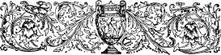
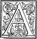
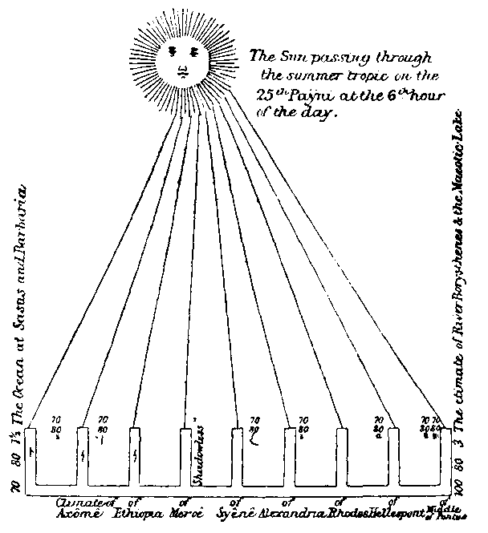
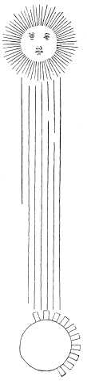
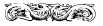
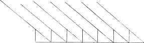
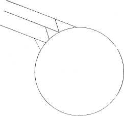
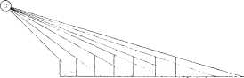

  
[Intangible Textual Heritage](../../index)  [Earth Mysteries](../index) 
[Index](index)  [Previous](ct07)  [Next](ct09) 

------------------------------------------------------------------------

**Cosmas Indicopleustes, Christian Topography (1897) pp. 244-262.  Book
6**

 

# BOOK VI. SUPERADDED.

*Regarding the Size of the Sun.*\[204\]

 FTER my work had
been finished, some questioned us about the figure of the world, saying:
"How can the sun possibly be hidden, as you hold, by the northern parts
of the earth, which according to you are very high, while he is many
times larger than the earth? For in the case of the sphere which we
advocate, however much greater the sun may be than the earth, he will
always, when giving light to one part of her surface, leave the other in
shadow." To those so questioning us we have made a very brief reply,
that such a thing is false and a pure fiction, having shown first from
the climates [1](#1) which they themselves, recognise, that
the sun projects shadows between which there is no difference, and next
from what we ourselves saw with our own eyes in the parts of Axômis in
\|245 Ethiopia. For, at the beginning of the
summer solstice on the twenty-fifth day of the month Payni at the sixth
hour of the day when the sun is now at the meridian, we plainly saw that
a man's shadow inclined to the south.[2](#2) And when I was
resident here in Alexandria, at the same time of the year on the
twenty-fifth, that is of Payni, and until the thirtieth of Thôth at the
sixth hour of the day when we were standing under the sun, I pointed out
that the shadow inclined to northward only a single foot. And, according
to them, Alexandria is the third climate. Now in this city there
happened to be living that extremely pious and admirable man, Abbot
Stephanus, the Presbyter of Antioch, a most Christian man and verily to
be \|246 numbered among the perfect, and as he
was accurately versed in lunar calculations, and moreover able, in
accordance with the scheme of the world which we have laid down from
divine scripture, to predict readily both solar and lunar eclipses, he
willingly turned his attention to this subject. Accordingly when in the
month Thôth of the current tenth indiction [3](#3) he was
asked by the erudite Anastasius, a man of science and learning, and
superior to many in point of experience, to predict when an eclipse of
the sun would take place, he stated that there would be one in that very
indiction on the twelfth day of the month Mechir; and it did so occur.
He predicted also a lunar eclipse for the twenty-fourth of Mesori in the
same indiction. Anastasius was much surprised, and asked him next to
tell what past eclipses there had been, and when he had declared them
correctly great again was his surprise. There were present too some
other scientific men, friends of ours, at this conversation. Now this
God-beloved man, who has a curiosity to investigate such \[265\]
matters, and who lived in Antioch and, for many years also, at
Constantinople, told us himself that he had measured the shadows in both
these cities, and assured us that at Antioch the shadow projected a foot
and a half at the time already mentioned,[4](#4) while at
Byzantium it projected two feet. Now Antioch is in the same climate as
Rhodes, namely, in the fourth, but Byzantium is a little \|247 beyond the fifth. For it is in the following way
they distinguish the climates. The first is, they say, the climate of
Meroê; the second of Syênê; the third of Alexandria, the fourth of
Rhodes, the fifth of Hellespont, the sixth of the middle of Pontus, the
seventh of the river Borysthenes and the Maeotic lake, and the last of
the Ocean. If therefore, as we have seen with our own eyes here, in the
climate which, according to their own laying down, is the third, the
shadow falls only one foot towards the north, and in the fourth one foot
and a half, and in the fifth two feet, is it not manifest that the
shadow is either lengthened or shortened by half a foot for each
climate? And if this be true, as assuredly it is, the sun will be found
to have the size of two climates and no more. For if, in the third
climate, he throws a shadow of one foot, in the second he will beyond
all question throw one of half a foot, while in the first he will throw
none at all.[5](#5) \|248 But as we
said by anticipation in the second book, there He between Meroê and the
Ocean in the south many of the \|249 stages into
which the earth is partitioned. For, from the Cataracts to the ocean we
remember having stated that the number of halting-places in that
distance was seventy more or less. But the number of climates which they
suppose to exist they reckon at somewhere about twenty
only.[6](#6) So then quite clearly the shadow in
the climate of Axômê, a city of the Ethiopians, is found projecting more
than a foot to the south, so that everything goes to show that, if the
sun in his passage through the summer tropic be between Syênê and
Axômis, he has the size of two climates.[7](#7) Is it not
then false and fabulous what they say about the sun, that he is greater
than the earth? And how too comes it, if, as they say, the earth is
spherical, the shadow does not vary on the convex surface of the earth?
For since they place the torrid zone in the centre, it follows of
necessity that the parts on each side of that zone must be depressed.
And they assert that none can inhabit the torrid zone----yea, even that
the northern part of the world which is inhabited by us is many stages
distant from the torrid zone. And I wonder again if, in those convex
parts of the earth which they suppose to exist, the shadows are able to
observe such a proportion that they increase or diminish by half a foot
for each climate, as with God's help we have demonstrated and with our
very eyes have witnessed to be the case, and have shown to the men with
whom we have conversed----men by no means novices but adepts in science,
\|250 and earnestly maintaining this opinion. But
further again \[266\] they affirmed most positively that when the
illuminating body is large and the body which is illuminated small, and
each of them spherical, the shadow produced is beyond question
conical----for the rays of the larger sphere, passing beyond the smaller
on this and on that side, necessarily make a very acute cone; and they
endeavoured by means of geometrical demonstrations to circumvent us; but
on this point we very concisely by optical experiments again showed the
falsehood of what they alleged; for, fetching a small wooden globe, we
drove a nail into it by which we held it in our hands, and on stretching
it out to the sun, we saw that the shadow was round and not conical. And
we said to them, look you now how small the sphere is which we hold out,
and how great, according to you at any rate, the sun is, and yet he does
not make a conical but a round shadow.[8](#8) And we made the
experiment both at a short and at a long distance----and they found
nothing to show the truth of what they say, but with their specious
sophistries they delude the multitude. We, again, fetching a cone-shaped
vessel, then showed them that a conical body produces a shadow conical
like itself. And, it is the truth I speak, O most God-beloved Father,
through the power of Christ they went away dumbfounded and sadly
crestfallen, having been put to shame by our exposure of their fictions.
And now behold, we also, in accordance with an art of theirs, having
drawn lines and imprinted one for each climate as they are wont to do,
are able, if first \|251 strengthened by the
divine power, to show that the sun is not greater than two climates, in
order that they may learn in this manner not to arch their neck proudly,
but to bow submissively to divine scripture.

\[267\] The straight (horizontal) line is the earth----the nine lines
drawn perpendicular to it are so many bodies standing each of them for
one of the climates. The lines drawn from the sun to these bodies are
the rays of the sun which, falling simultaneously upon the bodies on
this and that side, produce the shadows as we have depicted them in ink.
That particular line which descends straight down, since it falls upon
the top of the body perpendicularly, produces no shadow for it is
greater than the body and shines all round it.

The Lord also bears me witness in the Gospels, when He calls the country
of the Homerites, which is not more \|252 than a
two days' sail by sea distant from Barbaria, the ends of the earth. It
is evident again that I am right from the climates which they
acknowledge, and from the places of which Ptolemy speaks, he who made
war against Ethiopia, and of whom we made mention in the second book.
And from the shadows themselves which are produced in each climate, it
is proved that the sun does not exceed in size two climates, nay, even
that the earth is flat, as the delineation shows, and not
spherical.[9](#9)

> \[268\] *A dissertation by which it is proved more clearly and
> comprehensively that, throughout the whole of divine scripture, we are
> taught that God has made two states*----*the present state and the
> future.*

First of all, it is proved from the account of the creation that God
divided the one place which extends from the \|253 earth to the first heaven, by placing in the
middle the firmament, that is, the second heaven, thus making the one
place into two places.

Secondly, it is proved from the very structure of man, inasmuch as he
consists of two, namely, of mortal and immortal, evidently subjecting
him through their contrariety to a life of conflict, in order that he
may afterwards be honoured with gifts.

Thirdly, through the two trees which grew in the midst of Paradise,
scripture shows that there are two states, one mortal and mutable, and
one immortal and immutable. For the tree of the knowledge of good and
evil is a type of this world as a school of discipline----and the tree
of life is a type of the future state, in which neither death nor change
has any power.

Fourthly, because the expulsion of the man from the Garden, by God, and
his warning him and saying: *Lest he should stretch forth his hand and
touch the tree of life and eat and live for ever;*[10](#10)
these are the words of one who imparts knowledge, and obscurely hints
that some gift of life eternal is reserved for men after the life of
conflict here.

Fifthly, again, we are taught through Lamech the father of Noah, who
prophesied and said that his son would deliver us from toils and the
curse, and would conduct us to the enjoyment of a better condition.

Sixthly, again, through this Noah we learn that from that first earth,
all miserable and thorny, we were transferred to this earth, which we
men now inhabit: an earth that is better, and almost equal to Paradise,
whereby we are taught the difference between the first and the second
state.

Seventhly, we learn that God chose Abraham out of the \|254 land of the Chaldaeans and transferred him to
Palestine, and promised to give him great gifts and possession of the
land, without giving him, however, so much of it as to set his foot on,
according to divine scripture, and trained him to have faith, so that he
knew to expect with confidence gifts to be bestowed afterwards. And in
like manner He showed through Ishmael and Isaac the worth of the two
covenants----namely, that one was servile, and the other free.

Eighthly, a second time through Isaac and Rebecca, when twins were born,
it was said: *The elder shall serve the
younger,*[11](#11) thereby again showing there are
two states, one of bondage and the other of freedom.

\[269\] Ninthly, in the case again of Jacob and of Joseph, who could not
bear to be buried in Egypt, but only in the Land of Promise, it was
shown how each of them longed to obtain from God the hope which had been
promised them----namely, of the second state.

Tenthly, the exodus itself in the time of Moses and the deliverance from
the bondage of the Egyptians, and the freedom \[thus obtained\] and the
entrance into the Land of Promise, accomplished through Joshua the son
of Nun, clearly signified beforehand the two states.

Eleventhly, in like manner the construction of the Tabernacle and of the
Temple, which, by means of the veil placed in the middle, was made from
one into two----an inner and an outer----prefigured this state and the
future state.

But what need is there that I should speak of the dispensations that
existed through good men, for instance, the confidence Abel displayed
after death, who yet speaketh, crying from the earth in bringing to
birth the return of life.

If any reflects about the translation of Enoch, who \|255 because he pleased God, was translated that he
should not see death, knows with the utmost certainty that there will be
a better state, from an occurrence of this nature. Any one who is filled
with astonishment, as he thinks of the ascension of Elijah and his
passage in a chariot of fire, must see how much the nature of humankind
has been honoured, as, it is thereby taught and has the hope, that it
can pursue its way to heaven.

Any one who heard the multitudinous host of the heavenly ranks singing
in chorus and rejoicing and exulting at the birth of our Lord Christ
according to the flesh, and saying: *Glory to God in the highest, and on
earth peace and good-will to men,*[12](#12) would be
astonished beyond measure as he reflected that the inhabitants of heaven
and of earth had joined in making one confession, and that God was well
pleased with men.

Any one who had seen the power of the resurrection from the death of our
Lord and Saviour Jesus Christ would, with all his soul stirred up,
celebrate without ceasing God the Saviour of all, who made the conflict
of body and soul to cease, and brought into concord these two
antagonistic parts of our nature, making them in things spiritual
mutually conformable.

Any one who takes into view the ascension into Heaven of our Lord
Christ, and the angels clothed in white raiment announcing to the
Apostles his second coming, would never cease magnifying Jesus who
showed and opened up to men the ascent into the future heavenly state,
which He had prepared from the foundation of the world;

Any one who looks at the descent of the Holy Spirit upon the Apostles,
and the speech of the great Peter in the midst of all the people, would
in praying extol God \[270\] \|256 the giver of
all with loud praises, who gave such an earnest and pledge of the future
state to men.

Any one who contemplates the calling of the great Paul made from heaven,
and his being caught up into the third heaven, and again into Paradise,
will lift up his voice to God and say: Glory be unto Thee who through
all and unto all graciously givest gifts to men!

Any one who reads the writings of the company of the prophets and
priests and righteous men, and also of the Apostles and Evangelists, and
thinks of the miracles recorded by them, and of the prophecies and their
exact fulfilment, will find that they make mention only of a first and a
second state, and have not enumerated any others, as coming either
before the first or after the second. Glory to God who spake and
prophesied through them all, for ever and ever. Amen!

Any one who preserves deep in his heart remembrance of the second
illustrious and glorious coming of our Lord and Saviour Christ, and who
takes into mental account His blessed resurrection from the dead, and
the change for the better which the world has undergone, and the
unspeakable joy and hope laid up for men, will many a time beyond
measure admire and extol in songs of praise the Cause of all, the
Creator and Restorer of the universe. Yea, rather he will not be able in
adequate terms to address Him, who is above all praise and glory and
tribute of song, and who, in his supreme goodness from the beginning
suitably for us, founded the two states, educating us in the first, and
by instruction and reason teaching us to act prudently, and leading the
human race and through it the whole creation into the second state.
Glory to Thee, glory to Thee, glory to Thee, O thrice Holy, Creator,
Maker of all and Restorer of the universe, for ever and ever. Amen!

By all these considerations the opinion of the Christians \|257 is shown to be the best of all, and in accordance
and harmony with the constitution of the world, and to be most true. It
is in accordance with what those who are real and not pretended
Christians acknowledge, that from the beginning God not unsuitably, but
for apposite and useful ends, divided the one place into two places,
preparing and making ready beforehand this place for this present state,
and that other place for the future state. The Pagans accordingly, who
suppose the world to be eternal, and deny the resurrection of our bodies
and their ascension into heaven, looking upon this as foolishness, are
properly, in view of their theory, deprived of future honours and of the
ascension into heaven. The Jews, who read Moses and the prophets and
understood not the great and wise dispensation of God, which through the
prophets shows that from the beginning God made two states for the
benefit of men, and who did not receive the Prince of the second
state----nay, He proved even a stumbling-block \[271\] to them; nor,
even until now do they believe that there will be an ascension of men
into heaven, but they expect, forsooth, one to come whom they call the
Anointed, and who, they hope, will reign over their country, and subject
to Himself all the nations, and make no account at all of things
heavenly. They thus reject the counsel of God and think that the
habitation in the heavens has been prepared without occasion, which
Moses, however, shows to have been made not without occasion, saying
that it was made on the second day, and that the firmament was placed in
the middle, and that two places came to exist; and they themselves also
are excluded from this habitation. The Samaritans in like manner, being
ignorant of the same things as the Jews, and not believing, and
entertaining doubts besides, about the resurrection of the body and the
immortality of the soul, are also like the Jews banished \|258 from the habitation in the heavens. The
Manichaeans,[13](#13) holding the same opinions as
the Pagans, and supposing also the heaven to be spherical, and expecting
the utter destruction of the body, these, along with their evil deity
whom they elected for themselves about the earth, are condemned and
driven away from the City above, which they denied. In like manner,
every heresy which denies the perfect humanity of Christ, namely, a
rational soul endowed with intellect, and a body, and which does not
acknowledge all the distinctive qualities of the soul and of the body,
but wavers in doubt; and the heresy which denies the divinity of Christ
and impairs it, and which says that either He or the Holy Spirit is
inferior to the Father,[14](#14) all these fail to attain the
heavenly mansions.

Blessed then are all those who, through the divine scriptures of the Old
and New Testament, recognize the Maker of all things as one God in three
Persons, namely Father and Son and Holy Spirit, a holy Trinity,
consubstantial, equal in power, in strength, in glory and in honour, and
without beginning, and who also recognize the great and wise and
omnipotent dispensation of Him who is the Cause of all things; how
wisely and harmoniously He established the two states from the
beginning----the present state and the future----and through the perfect
humanity of Christ who is like to us in all things both in body and
soul, sin only excepted, and who sojourned among men in the last times
when He declared and showed the future state, and gave assurance unto
all by raising up that humanity from the dead. All the perfect therefore
\|259 who walk by this rule, peace be upon them
and mercy, and at the judgment of God these shall of right hear Christ
the Lord in the future state saying unto them from heaven: *Come, ye
blessed of my Father, inherit the Kingdom prepared for you from the
foundation of the world.*[15](#15) To Him be glory
for ever and ever. Amen!

The whole scope accordingly of the divine economy is this----for we must
briefly recapitulate what that scope \[272\] is----God of His goodness
willed to let others participate in existence, and power, and reason,
and knowledge, but, because those who participate in these cannot
possibly know and possess all things in combination (for this belongs to
God alone, to know all these things without learning and experience,
being of Himself both power and reason and knowledge, while created
beings participate in all these things from their Maker), He made those
two states together, the first mortal and mutable, for the trial and
discipline of rational beings, in order that, being exercised by the
variety of the universe and the juxtaposition of contraries, we might
have experience of pleasures and pains; then the second state, an
immortal and immutable enjoyment of His gracious goodness, to the end
that, from our acquired power of discernment, we may receive possession
of the pleasures. To Him be glory for ever and ever. Amen!

 No religion
therefore, neither the Judaic, nor the Samaritan, nor the Pagan, nor the
Manichaean, believes or hopes that there is a resurrection or an
ascension into heaven for men; but such of these religions as think that
heaven is a sphere, namely the Pagan and the Manichaean, are consistent
with themselves in holding their unbelief. For, where are they able to
find a place in the sphere for the kingdom of heaven? They are both of
them \|260 therefore justified in denying the
resurrection of the body, and in saying that souls only are glorified or
punished after the life here----or in saying, as some of them do, that
souls are whirled round along with the sphere and see all things, or are
condemned to be cast into Tartarus. Some of them even hold that souls
are transmigrated into other bodies, while others deny the soul's
immortality, and not one of them possesses any hope of the body after
the present life. But those religions which do not believe in a sphere,
namely the Jews and Samaritans, but think that the firmament, which is
in the middle of the one place and thus makes two places, was made
without occasion, these also, it necessarily follows, have fallen under
the sway of unbelief; for the Samaritans acknowledge neither a
resurrection nor an ascension into heaven, nor admit that the soul is
immortal, but think that our race will continue for ever, while the Jews
acknowledge a resurrection for men, but say that we shall live upon the
earth and eat and drink and marry and be given in marriage, as, in the
Gospels, the Sadducees proposed a question to the Lord, saying: *In the
resurrection of which of the seven shall she be the wife?*
[16](#16) These the Lord very summarily convicted
of error and of not knowing divine scripture, in which there is the
power of God, saying to them: *For, in the resurrection, they neither
marry, nor are given in marriage, but are as the* \[273\] *angels of God
in heaven.*[17](#17) It is therefore proved
against these, both from what is written and from the figure of the
world prepared from its foundation, that the upper place was not made
without occasion----but that there is a second heavenly state prepared
from the foundation of the world. And, in like manner, every heresy
among the Christians can be refuted; those also among the Pagans, the
Manichaeans for instance, which suppose the \|261
heaven to be a sphere, or those which embrace the theory of an
antecedent life, or those which deny that in Christ there was aught of
our nature, either body or soul or intellect, do greatly err, neither
knowing the scriptures nor the power of God. For those only are perfect
Christians who without error follow divine scripture, and who know, both
from what is written and from the figure of the first and second state,
the places and the figures which divine scripture mentions, for as this
world consists of men and angels: *We,* saith the Apostle, *are made a
spectacle to the world, to angels and to men,*[18](#18) so
also the higher place again has been prepared beforehand for angels and
men. Glory for all to God the King of the Ages. Amen!

The heaven is bound together with the earth, and is divided into parts,
for as it forms the two vaulted chambers and the two walls on each side,
and after the manner of vaulted chambers has one of these walls curving
round till it joins the other, and completes the entire figure (τὸ
σχη̃μα) of the world. And this figure, that is, the \|262 magnitude of the sun and of the earth, we here
delineate [19](#19) in accordance with the views
of those pagans, in order that any one who sees the two delineations may
be able to compare the one with the other, how that in the delineation,
which represents our view [20](#20) in accordance with the
reality, the rays of the sun falling upon bodies produce shadows for
each climate agreeably to our previous description, these shadows
showing a difference of half a foot for each climate----and how also
that in the delineation here which represents their views, the rays do
not fall upon the bodies, so that those climates which they speak of,
bodies namely, cannot be illumined by the sun; and hence we see that
they turn away from the truth and make a great boast in vain about their
fables.

 

\[Footnotes have been renumbered and moved to the end\]

1. 1 Before it was known that the earth
was a globe, it was supposed that its surface sloped from south to
north, and this slope was called κλίμα. But as science advanced, this
term was employed to designate different belts or zones of the earth's
surface, as determined by the different lengths of the longest days on
their southern and northern limits. Hipparchus (about 160 B.C.), first
used this division. The term κλίμα came afterwards to denote the average
temperature of each of the zones, and hence the present use of the word.

2. 1 Mr. Ernest A. Floyer, in a letter
sent from Egypt, which appeared in *The Academy* of 5th Oct., 1895,
makes some interesting remarks about primitive sun-dials in Upper Egypt.
He found that there the hours of work for a waterwheel were fixed by
such sun-dials. "Two kinds were used. At Edfu a horizontal dhurra stalk
lay north and south on two forked uprights. East and west were pegs in
the ground, dividing evenly the space of earth between the sunrise and
sunset shadows of the horizontal gnomon. Further south the gnomon was a
vertical stick." Afterwards he says: "It is generally admitted that the
Egyptians ascertained the length of the year to within a few hours. This
approximation must have been obtained by measuring the shadow of a
gnomon at the summer solstice, which coincided with their principal
natural phenomenon, the rising of the Nile. It could hardly be
otherwise. Given a constant and never-clouded sun, and a need to divide
up the day, the upright stick is brought into use at once. But little
time could have elapsed before it was noticed that the noon shadow was
longer or shorter one day than the preceding day .... Thus the period
from one summer solstice to another could not have remained long
unknown". After tracing further the progress of discovery, the writer
concludes with two remarks: "First, the effect of the use of a gnomon's
shadow leaves its trace to this day on Arabic astronomy. Angles are
called *shadows.* Secondly, measuring the exact length of a shadow on a
somewhat rough plane was not easy. Perhaps better results were obtained
by examining the faces of an obelisk. If the north face of an obelisk at
Luxor sloped at an angle equal to the difference of latitude between
Luxor and Syene, then at the summer solstice only all four faces would
be equally illuminated."

3. 1 Regarding *indictions,* see last
note to Book X.

4. 2 The height of a man who would cast
a shadow of 1½ foot in the latitude of Antioch, when the sun was on the
meridian "at the beginning of the summer solstice", would be about 6¾
feet. This, however, can only be considered approximate, as there is
some uncertainty about the length of the foot used, and of the exact
declination of the sun at a time now so long past. In computing the
height of the man, a plus correction of 12' has been applied to the
sun's declination at the present day, and this may be taken as
approximately correct.

5. 1 The sun is so far distant from the
earth that its *mean* parallax is only about 8", and therefore the rays
of light falling on to the earth may be considered as parallel lines;
and from the diagram below it will be at once seen that if the earth
were flat, as Cosmas supposes,  

 

the shadow of the gnomon would be the same length all the world over, at
the same instant of time. Thus what is advanced by Cosmas in support of
his theory of a flat earth proves the very opposite; for the fact of the
shadows being of different lengths, as he had observed them to be, at
the same season in different latitudes, is owing entirely to the
curvature of the earth's surface. This, I think, is very clearly shown
on diagram 2. If the sun were a small object and near to the  

 

earth, of course the length of the shadows would be different for
different latitudes, supposing the earth to be flat. This is shown in
diagram 3. It is on the assumption of a near sun that the fallacy of  

 

the whole argument lies. Cosmas builds his whole theory on this false
basis.

6. 1 Ptolemy reckoned nineteen climates.
See Ukert. *Geog.,* vol. i, Pt. II, pp. 182 ff.; or Smith's *Dictionary
of Greek and Roman Antiquities,* p. 297.

7. 2 The fallacy of this so-called proof
lies also (as shown in note on pp. 247, 248) in the fact that Cosmas
founds it on the supposition that the sun is near the earth. It falls
through at once when we consider that the sun's rays are practically
parallel lines, and the fact that the shadows vary in length, and in one
place fall to the north and in another to the south, is owing to the
spherical form of the earth.

8. 1 Cosmas evidently misunderstood the
phrase used: a cone casts a conical shadow when the rays are
perpendicular (or nearly so) to its axis, and fall on a parallel
surface, and the great distance of the sun prevents the cone of shadow
from a sphere being observed, unless it be so small that it can be held
more than 110 times its diameter from the surface on which the shadow
falls. As the distance is increased, the circular shadow diminishes to a
point, and then vanishes.

9. 1 Cosmas is more plausible than lucid
in his reasoning; his figure shows three climates from Syene to Axomis,
but possibly he meant to say between Syene and Ethiopia. Taking the
breadth of the two between Alexandria and Byzantium as about 635
geographical miles, this is his "size" of the sun. In order to appear
with a diameter of about 33' of arc, its distance from the earth would
be about 66,260 miles. But this is inconsistent with his argument from
the length of the shadows. A gnomon 7 feet in height would cast a shadow
of 11 inches at the summer solstice at Alexandria; of 1 foot 6 4/5
inches at Antioch; and of 2 feet 1 inch at the Hellespont, or 2 feet 2
inches at Byzantium; his measurements are, therefore, only approximate.
But assuming them----that his gnomon was one of 7 feet, and that the
earth were a plane, the sun's distance is easily deduced as about 4,400
miles, and his diameter as about 42 miles; a flat earth and a sun at a
much greater distance than this would bring the shadows more near to the
same length.

Cosmas was not the last to hold the theory of the earth being a plane.
From 1848 to about 1865, Mr. S. Goulden, in various papers, propounded
the doctrine that the earth is not a globe; he called his system Zetetic
Astronomy. About 1865 was issued the prospectus of a book on the
subject, in the contents of which was given "Distance of the Sun from
London 4028 miles----How measured."----See De Morgan's *Budget of
Paradoxes,* pp. 807-8.

10. 1 Gen. iii, 22.

11. 1 Gen. xxv, 23.

12. 1 Luke ii, 14.

13. 1 Manes, or Manichaeus, their
founder, appeared about the year 270 A.D. The sect spread chiefly in
Persia, Arabia, Egypt, and other parts of the East. St. Augustine at the
age of twenty became a Manichaean, and continued to be one for nine
years. See note 1, p. 242.

14. 2 The Arians.

15. 1 Matt, xxv, 34.

16. 1 Matt, xxii, 28.

17. 2 *Ibid.,* 30.

18. 1 I Cor. iv, 9.

19. 1 See preceding page. \[Note to
online text: diagram in body of text\]

20. 2 See above, p. 251.

------------------------------------------------------------------------

[Next: Book 7](ct09)
