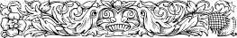
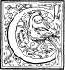
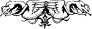

  
[Intangible Textual Heritage](../../index)  [Earth Mysteries](../index) 
[Index](index)  [Previous](ct11)  [Next](ct13) 

------------------------------------------------------------------------

**Cosmas Indicopleustes, Christian Topography (1897) pp. 331-357.  Book
10**

   

# BOOK X.

*Passages from the Fathers.*

 ERTAIN of those
\[Christians\] who delight in wrangling, on reading this book and
finding it no easy matter to face such a weight of testimony as we have
adduced in this treatise from the divine scriptures, thus addressed us:
"You and the Fathers on whom you rely interpret divine scripture in a
peculiar way to make it correspond with your own opinions, for nothing
is conveyed by it about figures and types such as you assert. But the
Fathers on whom we rely, who could not but have known accurately the
true scope of divine scripture, have in their expositions transmitted to
us nothing such as you say, since scripture tells us: *God hath set in
the Church, first Apostles, secondly Prophets, thirdly
Teachers.*[1](#1) To the Apostles indeed and to
the Prophets you seem to have attached yourself in your interpretation,
but as for the Teachers who are the exponents of the true scope of
divine scripture, you hold aloof from them entirely, and travel a
strange road, known to none but to yourself and your friends." On this
account, therefore, we are constrained to make manifest once more to all
their love of contention, and to this end we have placed together in
this book the testimonies of \|332 the Fathers,
even those whom they themselves adduce either in pretence or in
sincerity, in order that they may be refuted by their own authorities,
and be convinced how admirably our treatise is confirmed by the
testimonies of all the Apostles and Prophets and Teachers. And first let
step forward the great Athanasius[2](#2) who proclaims the
same views as ourselves.

*From the Festal Epistles of Athanasius.*[3](#3)

\[316-319\] Observe, pray, how this great Teacher is constantly in
agreement with ourselves and our doctrine, in the view he takes of the
whole figure of the world, calling the kingdom of heaven a great and
supramundane hall, sufficient for the whole creation, and proclaiming
that the Lord Christ as our forerunner is therein, and that we shall
enter into it along with him at his second coming; And the saying:
*Enter into the joy of thy Lord*:[4](#4) he refers
to that very hall, that is, to the heaven of heavens which is the
kingdom of heaven----and he says that this has been prepared for men by
God from the foundation of the world, and that the Tabernacle erected by
Moses is a type of the heavens. Can the lovers of contention show how
this great Teacher does not agree with us, or how we have been going a
strange road different from that of the Church? But away with the vain
labour of these men! We will add to Athanasius, Gregory of
Nazianzus[5](#5) with whose praises \|333 they make the world ring, and who yet proclaims
the same views as the previous authority and ourselves.

*Extract from the discourse on the Passover by Gregory of* *Nazianzus.*

"But let us sacrifice to God a sacrifice of praise upon the altar on
high along with the choir above; let us go through the first veil, let
us draw near to the second, let us glance into the Holy of Holies." How
then is it not manifest that we have not gone a strange road different
from that of the Church? Let the men of strife therefore be ashamed of
themselves when they see the harmony of the Church, and let them not be
intolerant of us, for it is hard for them to kick against the pricks.
But let us introduce a third after him, one who was his contemporary,
even Theophilus Bishop of the Church at
Alexandria,[6](#6) who also bears testimony to our
opinions, yea rather, to the truth.

*From the first Festal Epistle of Theophilus of
Alexandria.*[6](#6)

"In order that, being engaged in higher than earthly \[320\] doings in
the sublime mansion of virtue, we may, like the disciples, eat the
Passover in the upper chamber, having with us Christ, who was sacrificed
for us, while we eat Him all, as our life."

*From the same Festal Epistle of the same. *

"In order that, having again drawn back the veil of the word, we may
with unveiled face behold the festival of the \|334 divine Passover,[7](#7)
appealing thus to Jesus: *Where wilt thou that we prepare to eat the
Passover with thee?* [8](#8) On receiving his
reply that this feast was to be celebrated in an upper chamber, a
chamber, that is, of second things,[9](#9) the
disciples with alacrity of heart betook themselves with all speed to
enter the Holy of Holies, into which Christ Himself hath entered for us,
and hath done away with any further need of the typical High Priest,
having obtained eternal redemption for us, and on our behalf presenting
Himself before the face of God. Formerly indeed the High Priest alone
once a year entered into the Holy of Holies, the people remaining
without by reason of the littleness of their power. But the Saviour
having entered in, has given full liberty of access to all who wish."

Observe how this authority is also in harmony with us in calling the
upper chamber a house, into which the Lord Christ as forerunner hath
entered for us (of whom the High Priest in the Tabernacle of Moses was a
type) to present Himself before the face of God, and hath given full
liberty to all who wish, to enter into the Holy of Holies, that is, into
the kingdom of heaven. Let those who are on the side of the schismatics
reply to the following questions. How have we gone a strange road
different from that of the Church? How is it that they do not regard the
words of their own Fathers? but falsely traduce them as if they were
heretics. But passing from this Father, let us turn to the fourth who
was his contemporary and fellow mystic, Severianus, namely, the Bishop
of Gabala,[10](#10) who can be taken as a witness
to confirm all that is written in my work. \|335 

*From the first book of the Hexaemeron* (*Six days of the Creation*) *of
Severianus, Bishop of Gabala.*

"For on the first day He made the matter out of which things were
created; but on the other days He gave their form and arrangement to the
things created. For example, He made the heaven which was before
non-existent----not this visible heaven, but the one above it, for the
visible was made on the second day. God made the higher heaven----*the
heaven of heavens to the Lord*,[11](#11) and it is
higher than this visible heaven, and, as in a house of two
stories,[12](#12) between it and the "earth
another heaven is interposed. God having thus created the world as one
house, placed this visible heaven as a roof in the middle, and the
waters above it. Wherefore, David says: *Who covereth his upper chambers
with waters.*[13](#13) God then made the heaven when it was
not, the earth when it was not, the abysses when they were not, and
wind, air, fire, water; of all the things that came into existence He
made their matter on the first day. But some one will say that it is
recorded that He made the heaven and the earth, while nothing is
recorded of waters and fire and air. In the first place then, brethren,
when He said that the heaven and the earth were made, He indicated by
the things which contain, the things that are contained. Then after the
interposition of a few passages, hear Him next relate when the air was
made: *And the spirit of God moved upon the face of the
waters.*[14](#14) Here He does not speak of the
Holy Spirit, for the uncreated is not numbered along with what is
created, but it is the motion of the air which He calls *spirit. God
said, Let there be light,*[15](#15) and the nature
of fire came into being. And again proceeding He says: But our souls He
\|336 fenced round with the body, while He made
the angels bodiless. So then, what we see to be the case with respect to
human souls and to angels, the same is the case with respect to fire,
for the fire above subsists without matter, but the fire below with
matter, for the fire above is akin to the fire below, just as our souls
are also akin to the angels. How so? because the former are spirit and
the latter too are spirit. And again: All of them were then brought into
existence, fire, abyss, winds, the four elements, earth, fire, water,
air; for whatever Moses omitted he comprehended in that marvellous
summary where he says: *For in six days God made the heaven and the
earth and all the things that therein
are.*[16](#16) And just as in the case of the body
he did not speak of all its members, so in the case of the creation he
did not enumerate all its parts, although all things were created
simultaneously with the world. But if there was not fire in the world,
it could not at the present day be struck from rock and from wood; for
the friction of wood against wood generates fire, but if Nature did not
hold it, from what source does she, produce
it?"[17](#17)

*From the same, from the second book.*

"On the second day God said: *Let there be a firmament in the midst of
the waters, and let it divide the waters from the
waters.*[18](#18) He made this heaven, not the one above, but
the visible heaven which he crystallised from the waters like ice. But I
shall endeavour to place the matter before your eyes, for many things
are better explained by ocular \[322\] than by oral demonstration. This
water, let us suppose, overflowed the earth five cubits. Then God said:
*Let there be a firmament in the midst of the water,*3 and
\|337 thereupon a solid ice-like substance was
produced in the midst of the waters, which made lighter the upper half
of the water, and left the other half underneath, as it is written: *Let
there be a firmament* (στερέωμα) *in the midst of the water, and let it
make a division between the waters.*[19](#19) But
wherefore does he call it *the firmament?* It is, because God made it
*firm and solid* (ἐστερέωσε) from waters which are of rarer and less
compact substance. Wherefore David also says: *Praise him in the
firmament of his power;*[20](#20) and, to take
another example, we may adduce smoke, which when emitted from burning
wood is rarified and attenuated, but when it mounts up high into the air
becomes transformed into the density of a cloud. In this wise, when God
had made the waters, which are by nature rarified, ascend on high, He
there made them solid. And that this example is to the point, and true,
Isaiah testifies where he says: *The heaven was made firm and solid as
smoke.*[21](#21) The heaven having therefore
become solid in the midst of the waters made the upper half of them
light, but the other half He left underneath. Why then and for what
purpose were the waters placed above? Was it that we might drink them or
that we might sail on them? For that there are waters above, David
testifies, saying: *And the water which is above the
heavens.*[22](#22) Observe then the wisdom of the Creator;
the heaven was crystalline, having been consolidated from the waters;
but since it was to receive the flame of the sun and of the moon and the
countless hosts of the stars, and was entirely filled with fire, then in
order that it might not be dissolved, nor burned with the heat, He
spread over the upper surfaces of heaven those sea-like expanses of
water, with a view to soften, and as it were to anoint the upper \|338 surface and thus render it capable of resisting
the scorching heat of the flames. An example of this is ready at hand:
if, for instance, you to-day put a pot on the fire, with water therein,
the pot withstands the fire, but if you do not supply water the pot will
crack or melt. Accordingly, against fire He opposed heat as its
counteractive, in order that the upper surface of heaven being, as it
were, anointed with the waters, might be well enough able to maintain
its existence. And observe what is here marvellous; in the body of
heaven which is assailed by so much fire, the moisture is so
superabundant that it lends a constant supply to the earth. For whence
cometh the dew of the cloud? from nowhere? The air holds no water; so it
is clear that the heaven drops it from its superabundance. Wherefore
also the Patriarch Isaac when blessing Jacob said: "*God give thee of
the dew of heaven and of the fatness of the
earth"*[23](#23)----And later on
he[24](#24) thus continues: "Observe, I pray you,
that the waters above the heaven render another service, for not only do
they preserve the heaven, but they also send down the flame of the sun
and the moon, since, if the whole heaven were transparent, the rays
would mount upwards; for, as it is the nature of \[323\] fire to ascend,
it would leave the earth destitute of light. On this account, therefore,
He compressed the heaven above with a boundless expanse of waters, in
order that the rays, being confined, might be sent downwards. Behold
then the wisdom of the Architect. And thou hast even in thyself the
image of the Architect. So attend particularly, I pray you, to what I
shall now say: Suppose this head to be the heaven above, and what is
above the tongue to be the other heaven, namely, the firmament, whence
also \[the palate\] is called the little
heaven,[25](#25) or roof of the \|339 mouth; now, above, in the invisible parts is the
brain not manifest to sight, while in the lower heaven is the the
tongue, a thing manifest to sight, just as the upper heaven is classed
with things discerned by the intellect, but the world, with the things
we ordinarily talk about."[26](#26)

*From the same discourse.*

"For on the third day the fruits were produced, and in order again that
it might not be supposed that they were produced by the influence of the
sun, it was not until their creation was finished, that He made the sun
and the moon and the stars. But whence did He make them? For it has been
said that on the first day He made all things of nothing, but on the
other days, out of things existing. Whence then the Sun? Why, out of the
light created on the first day which the Architect modified at His
pleasure and transformed into objects of varied aspects, creating, in
the first place, the substance of the light, and then producing the
luminaries, just as if one should bring forward a mass of gold, and
should then coin it into pieces of money, and by so doing make it a
thing of beauty. For just as He divided the abyss, which was then one
mass of water, into the water on high, into seas, into rivers, into
fountains, into lakes, into wells, so also did the Architect divide the
light, which was a single uniform mass, and distribute it into the sun,
into the moon and into the stars." And subsequently we read: "He made
therefore the heaven, not a sphere, as those vain babblers
conceive----for He did not make a rolling sphere, but, as the prophet
says: *Who hath made the heaven as a vaulted chamber and stretched it
out as a tent to dwell in;*[27](#27) for none of
us is so impious as to be persuaded by these triflers, and not by the
words of the Prophet, which declare that the heaven has a beginning and
an end. For this \|340 reason therefore the sun
is not said by them to *ascend* but *to go out,* for the scripture
saith: *The sun goeth out upon the
earth,*[28](#28) not goeth up; and again he says:
*From the end of heaven is his going forth, and at the end of heaven is
his goal,*[29](#29) Not a going up then----but if
it is circular, it has not an end----for where are we to find an end of
what is perfectly round? Does then David only say this, or does the
Saviour also say so? Hear then this which is spoken by the Lord: *When
the Son of Man cometh he shall send forth his angels with a great sound
of a trumpet, and they shall gather* \[324\] *together his elect from
the four winds, from one end of heaven to the
other.*[30](#30) But, we ask again, where does the
sun set, and where does he pursue his course by night? as we have said.
Well, according to the pagans, under the earth, but according to us who
speak of it as a tent, consider, I pray you, whether what we assert be
false, or has the seal of the truth to attest it. Now, with my
expression the place too \[where we are met\]
coincides;[31](#31) for such things are better
explained by a reference to what is seen than by words addressed to the
ear. Suppose a dome to be placed over the church with its east towards
sunrise, its north in this direction, its south here, and its west
there. Suppose next the sun rising and then going down----going down not
under the earth, but pursuing his course through the northern parts, and
hidden from view as by a wall, the waters not permitting his path to be
seen----pursuing his course, I say, through the northern parts, and
reaching again the quarter in which he rises. But whence is it made
clear that this is so? By the blessed Solomon then, when in the book of
Ecclesiastes, a book attested \[to be inspired\], and not rejected
\[from the canon\] he says: *The sun ariseth, and the* \|341 *sun goeth down, and hasteth to his place;
arising there he gocth to the south, and wheeling in his circuits,
wheels towards the north;* *the wind goeth and turneth about in its
circuits.*[32](#32) Behold then the sun running
his course in the south, and wheeling round to the north, and be
instructed." And further on he says: "All things, therefore, obey the
law of God. The heaven stands, not as upheld by its own power but firmly
compacted by the divine word. For should I be at a loss to understand
how the heaven was consolidated out of the waters, the blessed David
resolves the difficulty when he says: *By the word of the Lord were the
heavens made solid;*[33](#33) because made from
the waters----for in no passage elsewhere is the \[heaven\] said to be
*solid;* it is one thing *to be made solid,* and another *to be solid.*
The expression *being made solid* is used when that which is rarified
and attenuated becomes consolidated."

*From the same*----*-from the sixth discourse.*

"So then that tree had not a power in itself to produce a knowledge
which would result in death, but it got its name from the dire calamity
that befell Adam in connection with it. I shall briefly explain the
matter; for divine scripture presents no difficulty. To-day we have the
saving food of which the faithful partake. That tree then has a natural
salutariness. If, through the glory
invoked,[34](#34) you have a pledge from things
that are present, why do you doubt about those that arc past? There the
food was death-giving, here it is life-giving. If this saves by its
natural properties, and not by grace----then that also killed by its
natural properties, and not by the purpose he put before him; if this
food saves by its natural properties and \|342
not by grace, that also kills by its natural properties and not by the
breaking of the commandment."

\[325\] *From the same*----*-from the fourth discourse.*

"For the angels having been created beings were not co-workers with God,
but His ministers who praised Him in song, and expressed their gratitude
for being brought into existence, being aware that, as they had no
previous existence, they had been created by the Spirit of goodness. So
they stood as spectators merely, beholding the things made along with
them, and after them; for they beheld the heaven made of nothing, and
were struck with astonishment; they beheld the sea parted off, and were
lost in wonder; they saw the earth in her beautiful apparel, and were
thrilled with delight. But that the angels were not co-workers, but
admiring spectators, God says in Job: *When I made the stars, all the
angels praised me and celebrated me in song;*"[35](#35)
subsequently he says: "He beheld Adam sinning, but He foresaw his
posterity acting righteously; He saw him being cast out from Paradise,
but He foresaw that a kingdom had been prepared for him. And what is
wonderful is this, that even before Paradise the kingdom had been made.
Why then do you wonder at his having been cast out of Paradise, when the
real wonder is that before Paradise existed, the kingdom of the heavens
had been prepared for him?----as saith the Saviour: *Come, ye blessed of
my Father, inherit the kingdom prepared for you from the foundation of
the world!*[36](#36)

*From the same*----*-from the third discourse.*

"It now remains to be examined why God made the moon at her full. Pray
attend closely, for the subject to be considered is deep, as she
required to be made on \|343 the fourth day in
order to present a fourth day's appearance. And again, if she appeared
four days old, she could not have occupied the extremity of the west.
She was found therefore having an advantage of eleven days----for on the
fourth day she appeared full, as she would have appeared on the
fifteenth day. By eleven days then the moon is in advance of the sun,
not by the act of her creation, but by her
shining.[37](#37) Wherefore what advantage she
then gained, she paid back to the sun, for as the number of days in the
lunar month is twenty-nine and a-half she makes in twelve months a year
of three hundred and fifty-four days. For if you reckon twenty-nine and
a-half days for each month there are in the year three hundred and
fifty-four days, in order that the moon may pay back annually to the sun
the days which she then gained. Let any one who can count make the
calculation."

*(Cosmas now speaks).*

What will those lovers of strife say to this, when they hear that there
is such harmony between this author and myself, both as regards the
figure of the first heaven and of the second, and as regards the two
places made by the interposition of the firmament ---- that the first
heaven, according to divine scripture, is not a sphere, but \[326\] a
vaulted chamber,----that this second heaven, which is visible, was
consolidated from the waters, and carries the waters, that it may not be
dissolved by the heat of the heavenly bodies, but be preserved therefrom
by the chillness of the waters----that the dew falls from the
firmament----that the heavenly bodies pursue their course through the
northern parts during the night----and that the angels were created
along with the heaven, and were \|344 spectators
of God's six days' handiwork, and were taught, thereby, and filled with
astonishment; and what will they say as to his reasoning concerning
souls, that they are enclosed within the body and operate in the body.
How then shall not every mouth be stopped that speaketh unrighteousness
against God, and against ourselves who carefully study divine scripture,
and argue therefrom agreeably to the tradition of the Church? For,
observe, I pray, it was shown that the Prophets and the Apostles, and
the Evangelists, and the Lord himself and all divine scripture----yea,
moreover even those who in common report are called Fathers and
Teachers, whether in truth or pretence, differ not from my opinions, but
all bear testimony to my words, so that by them all the truth may be
established, and every mouth be stopped that speaketh unrighteous
things. But, taking our leave of this author, let us pass on to his
fellow-servant, Epiphanius the Bishop
[38](#38)----the fifth in order, to show that he
also testifies to our words and is in agreement with them.

*From the work of Epiphanius, Bishop of Cyprus, On Measures and
Weights.*

"Two and twenty works, O lover of the good and the beautiful, did God
make from the beginning until the seventh day, namely these. On the
first day He made the higher heaven, the earth, the waters from which
come snow, ice, hail, frost and dew; then the spirits which minister
before His face, such as these----the angels standing in His presence,
the angels of glory, the angels of the clouds and darkness and snows and
hail and frost----the angels of sounds, of thunder and lightning; the
angels \|345 of cold and heat, of winter and
autumn, and the angels of all the spirits of His creatures which arc in
heaven and upon earth and in Chaos; then the darkness and the brooding
over the abyss, the waters which once covered the earth, out of which
darkness comes evening and night, the light of day and of the dawn.
These seven mighty works did God make on the first day. On the second
day was made the firmament which is in the midst of the waters. On the
same day the waters were divided, one half of which ascended above the
firmament, while the other half was underneath the firmament, upon the
face of all the earth. This was the only work which God made on the
second day."

This author also agrees with us testifying as to the figure, declaring
the heaven to be above, and the \[327\] firma-ment, which also carries
the waters, to be underneath. And with regard to the angels he says what
is in explicit agreement with our own views, namely, that they arc all
in this world, and are all engaged in moving all things, and ministering
for the sake of man, and that they also were brought into being on the
first day along with the upper heaven and the earth. And hearing this,
do not, O men, fret and fume, overmastered by the spirit of strife and
envy, but rather from a love of truth, recognize the ecclesiastical, yea
rather, the veritable harmony. For when ye are unable to face the truth,
it is of no avail to take to reviling. Regard then with all due
deference the great host of witnesses. But, if we have not yet adduced a
sufficiency of them for you, let us leave this authority for the Bishop
of the Capital----the admirable John, who was treated contemptuously by
the three foregoing writers, and let us show that this illustrious
champion \[of the Church\], who was devoted to deeds of mercy, bears
testimony to our argument and is in agreement therewith. \|346 

*From the work on Alms by John
Chrysostom.*[39](#39)

"A human being is a great thing, and a man, if merciful, is to be
honoured. Behold, how great a thing is mercy----the merciful man God
likens to Himself; for He saith: *Be ye merciful, even as your Father
which is in heaven is merciful.*[40](#40) Should
death come, there your riches abide."

*From the Commentary by the same on the Epistle to the Ephesians.*

"*In all wisdom and prudence,* he says, *having made known unto us the
mystery of his will,*[41](#41) as if one should
say: he made known to us the things in his heart. For this is the
mystery which is full of all wisdom and prudence. For what seekest thou
that is greater than this wisdom? Those who were nothing worth----even
those He found out, that He might lead them to great riches. What is
there that can compare with this inventive
skill?[42](#42) He that was an enemy, He that was
hated: this very man has on a sudden been raised on high, and not only
so, but at this particular time, and this was done in wisdom also. And
that this was done by the Cross, it would require a long discussion to
show. What a matter of wisdom this was, and how it has made us wise!"

*Again.*

"*According to his good pleasure,* he says, *which he purposed in
him;*[41](#41) that is, He longed for this, He was
in throes, as one may say, to bring forth this mystery. And of what
nature is this? It is that it is His will to set man on high, \|347 and this He desires with a view to a dispensation
of the fulness of the times to sum up all things in Christ, the \[328\]
things in the heavens, and the things upon the earth."

> *From the Commentary of the same, on the Epistle to the Hebrews in the
> chapter where it is said: "Now in the things which we are saying the
> chief point is this."*[43](#43)

"Where are those who say that the heaven is in motion? Where are those
who think it to be spherical? For both these opinions are here swept
away."

*From the same Commentary of the same on the chapter which says:*
"*Wherefore he is the Mediator of a new
covenant."*[44](#44)

"And how come these to be patterns of the things in the heavens? And
what does he call the things which are now in the heavens? Is it heaven?
is it the angels?[45](#45) No, none of these, but
our things, for heavenly things are ours, yea, even though they be
accomplished on the earth, since the angels also are on the earth, and
are nevertheless called heavenly. And the Cherubim too appeared on the
earth, and yet they are heavenly. But what am I saying?----that they
appeared? Is it upon the earth then they spend their time as if in
Paradise? Nay, not so, for they are heavenly and our citizenship is in
the heavens, although we spend our life with those that are here." And
subsequently He says: "I show by actual facts those that attain to this
height. And who be these? I mean Paul and his followers, who, though
they were on earth, sojourned in heaven. But what am I saying?----in
heaven? Nay, they \|348 were higher exalted than
heaven, yea even than the other heaven, for they ascended to God
Himself."

And this great and wise teacher, again, expresses opinions which are
marvellously in accordance with our own and with those of such as hold
with us with regard to the figure of the world. For with regard to this
figure he gradually advances upward from the regions of the earth to the
sovereign throne, and describes finely the gradations of the ascent. He
places the air first, then the moon, then the sun; in the next place,
the firmament, then again, the heaven of heaven, without saying there
are more than two heavens, and he ridicules those who say that it is a
sphere, and maintain that it is in motion. And with regard to the angels
and the cherubim, he declares that they are all in this world along with
ourselves, and that up to this time not one of them has winged his way
beyond this world. And with regard to doctrine again he expounds it
clearly, making a safe use of the figure in doing so. *For why?* he
says, *He that was an enemy, He that was hated, all of a sudden this
Person* has been raised on high. And again he says, *that it is the will
of God to set man on high,* etc. For when God had made the heaven and
the earth, on the second day He made the firmament, and, having placed
it midway on high, He divided the one world into two worlds, \[329\]
namely this and the one above. And when He had on the sixth day finished
all this world, last of all, as a bond to unite the whole world of
things visible and invisible, He made man----the one living being
compounded of all the natures. At the end of the days therefore, when it
behoved that the second world also should be displayed, God, having
taken him who was the bond of the whole world of things visible and
invisible, namely, Man; and having renovated him by raising him from the
dead, and made him better, he conducted him in presence of all into
heaven, namely, into the second place----that is, into the second world.
\|349 For a restoration and a renovation was
effected by the dispensation of God in man as the bond between heavenly
and earthly things, that is, of all things visible and invisible.

This Father then, knowing these things and the mystery of the will of
God, took pleasure in declaring them, and proclaimed that he who had
been expelled from Paradise as hated on account of his disobedience, had
suddenly through God's good pleasure become heavenly, for the summing up
in him of the universe.[46](#46) Oh! how wonderful
the concord of the Church! how wonderful the spiritual unanimity of the
teachers! How is he not to be condemned who sets himself in opposition
to them? O Lord God of the universe, confirm us evermore in Thy
mysteries, Amen! Let the lovers of strife cease from wrangling, and let
them rather submit their necks to the Church. For from a habit such as
this we, along with the Church, turn away with aversion. But having
ended our citations from this authority, let us adduce a seventh witness
who completes the testimony of the divine Testament both the Old and the
New. For if in divine scripture it is said that *in the mouth of two
witnesses or three every word shall be established,* how much more then
in the mouth of seven; for the company of seven witnesses shows the
testimony of the perfect testament. It is Philon then the Bishop of
Carpathus [47](#47) who gives the same testimony
as the other six. \|350 

*From the Commentary on Canticles, by Philon Bishop of Carpathus on the
passage: The King brought me into his inner
chamber.*[48](#48)

"The banqueting-house of the heavenly King, that is, His body which He
built up for Himself as His house, and then also the kingdom of heaven."

*From the same on the passage: Let him kiss me with the kisses of his
mouth.*[49](#49)

"For the son of God assumed humanity, which He put on \[received\] from
the Church, and in return gave back His sacred flesh to be partaken of
in the sacrament."

> > \[330\] *From the same on the passage: The King fettered in his
> > movements to and fro. Why wert thou made beautiful, and why wert
> > thou established?*[50](#50)

"For when He passed from heaven to earth, and when He descended to hell,
yea to the very lowest depth of hell, He thence will draw up the dead."
*And farther on he says:* "It was not His divine nature that was in
reality made beautiful, and that was established, for this does not
admit of increase or diminution, but it was the flesh which He assumed,
and the humanity which He wore. He was beautified by being conformed to
the beauty of divinity----and was established in the kingdom of heaven
at the right hand of God."

*From the same on* "*The six days*" *where he discourses on* *the man
that was born blind.*

"For although thou wert looking at the man himself, yet thou oughtest
from those very works to see God in man."

Consider pray, how this Father also maintains the same view with
ourselves concerning the figure of the world and \|351 as to the figure remark how he calls the kingdom
of heaven God's *tamieion*----the *tamieion*
[51](#51) being the innermost and securest
apartment of the house, and this he speaks of as the kingdom of heaven.
And concerning the doctrine, remark, how he represents man, whose nature
God assumed, and whom God recalled from death, and deemed worthy of the
place of honour at His right hand, as being seated and established in
the *tamieion* itself, that is, in the kingdom of heaven. How then do
those lovers of strife cry out against us, as if we have gone a strange
road----a road that is known to nobody? Let them desist from that
voluntary madness, and no longer assail us with slanders: *for it is God
who justifieth, where is he that condemneth?*[52](#52) For it
is God who first confirms our opinions, then the Prophets and Apostles
and the Evangelists and the renowned company of the Fathers----Fathers
from among whom ye yourselves profess to accept some, while moreover
there are even old pagan writers who in some points are in agreement
with our opinions. But that we may not unduly prolong the discussion, we
have deemed it sufficient to advance solely the testimonies already
offered for the sake of the lovers of strife, and for their sake only
who have the assurance to challenge our principles, or rather, I should
say, the truth itself; and this we have done, in order that they may
have an absolute refutation of their ill-timed madness, and from a
desire to make manifest to all that the motive, by which they are
actuated, is a sheer love of strife. And in order that what we have
written may be supported not solely by the testimonies of these ancient
authorities I will adduce the testimony, and that even in abounding
measure, of a recent schismatical Father of theirs, one who is still
living, and resident in Constantinople, and who whether from \|352 ignorance, or from being constrained by the truth
itself, agrees with what we have written.

\[331\] *From Theodosius, Bishop of Alexandria*----*On the fortieth day
of the Ascension of the Lord.*

"To-day human nature is conveyed into heaven----to-day heaven is thrown
open and man enters therein."

What will our opponents say to this? How has he not borne testimony to
our opinions both with regard to the figure of the world and to the
doctrine? Oh how wonderful the force of the truth, which attracts to it
even its enemies against their will!

*From the same*----*in another exposition. *

"It is no great thing if God overcame the devil."

Oh how wonderful! Here also the truth reveals their ill-timed love of
strife. For if he says it is no great thing for God when contending with
the devil to overcome him, why then----to say the opposite is downright
madness; for to God, not only the devil but the whole of creation is
subordinate, and will be counted as nought. How then is it not manifest
that he means, that it was man who contended with the devil and overcame
him? Now this is even a great point, for he had before spoken of man, as
having entered as a conqueror into heaven. And that he holds to this
meaning is shown when again he exclaims: *For it behoved, it behoved, I
say that this nature, which had been foiled in wrestling, should be
adorned with a crown*----as if he said: This nature which was overcome
by the devil in Paradise, as he,says, namely man, whom he declares
frequently and at great length to have been bettered by the
resurrection----him, I say, he pronounced with all frankness to have
been carried up into heaven. \|353 

*From an exposition by the same given in the great Church when the
Gospel was read:* "*Father, if it be possible, let it pass from
me"*[53](#53) *etc.*

"The sufferings of this flesh----and the tokens of suffering, anguish,
and sweat, grief and perturbation of soul----all these are indicative of
human nature."

Oh what a marvel is here! They say such things and yet they quarrel with
us, making divisions in the Churches in defiance of all
authority.[54](#54) For where is it written that
He was in agony and sweated, if not in Luke where it is said: *And being
in an agony he prayed more earnestly, and his sweat became as it were
great drops of blood falling down upon the ground----and there appeared
unto him an angel from heaven strengthening him.*[55](#55)
How dare they say these words, and on the other hand condemn those who
dare to \[332\] expound them? Is not the love of strife on the part of
such men manifest? But dismissing this authority, let us pass over to
one who was his predecessor in office, Timotheus the
younger,[56](#56) who recently died, and show that
he also unwillingly assents to what we have written. He writes, then, in
explanation of the passage which, at the sacred period of Easter in the
Church of St. Victor, was read from the Prophet Isaiah, who says: *He
was led as a sheep to the slaughter, and as a lamb before her shearer is
dumb so he opened not his mouth;*[57](#57) and
when in his exposition he referred to the passage: *Father, if it be
possible, let this cup pass from me,*[58](#58) he spoke to
this effect: \|354 

*Timotheus on the passage: "Father, if it be possible,"* *etc.*

"For it is natural for the soul to love to dwell always in the body, and
to be vexed at taking leave of life." And again in the Church of
Sarapammon he exclaimed: "And greater things than those will be given
unto Me by the Father----resurrection from the dead, renovation of
nature, and vivification, instead of corruption."

*From a discourse of the same at the festival of the Holy Nativity  
*----on the birth of Christ, on the 30th of Choiac in the 10th
Indiction.[59](#59)

"The Virgin brought forth a son who was perfect and sinless"----and a
little subsequently he says: "Let us be circumcised with Christ, that we
may also be purified along with Him."

*And again in the Church of St. Theodorus on the 8th of Tybi in the 10th
Indiction.*

"For through that which was apparent he showed the power of that which
was concealed." \|355 

> *From an exposition by the same in the Church of Quirinus on the
> Lord's Day on the 22nd* [60](#60) *of Pachôn in
> the 5th Indiction, when the passage in the Gospel of John had been
> read.* "*Now Jesus being wearied with his journey was
> sitting."*[61](#61)

"Since therefore He is at once both God and man He is proved to be both
by His works, and this cannot escape the notice of the spectators. For,
that He is by nature God, is shown both by His works and His signs,
cleansing the lepers, giving sight to the blind, strength to the
paralytic, and life to the dead----and what is greatest of all (for the
Prophets also equally succeeded in doing these things) He expressly and
unreservedly said: *I* *and my Father are
one.*[62](#62) But, by the things mentioned, the
might of His divinity is fully proved----and that He is also truly man,
this He does not wish to go unobserved; thus in anticipation refuting
those who erroneously think He assumed a body in appearance only, for He
showed \[333\] clearly that He submitted to sufferings----and to what
kind of sufferings? to those, forsooth, which are assigned to flesh by
reason of its infirmity and not by reason of sin----I mean, for
instance, hunger and thirst and the need of sleep, and fatigue. For as
these things happen to us by nature and not by our choice, they do not
affect with sin those who have to endure them. By these sufferings then
which were not incurred by sin the Lord declared that His flesh obeyed,
showing clearly that He had become man in nature and in truth, and not
in seeming."

*From a discourse of the same in the sanctuary at the Pachôn*
*Festival. *

"It belongs to God to work miracles, to command the \|356 elements, and to make predictions of future
events, but to man when civilized and leading a social life, it belongs
to honour parents, to maintain kindly intercourse with brothers, and to
converse with disciples and acquaintances. Accordingly our Lord Jesus
Christ being both God of God, and having become man for our sake,
exhibits both the power of His divinity, and observes also the laws of
our humanity, proving what He was and is by His miracles, and showing by
His actions what He deigned to become."

> > *From a discourse by the same on the fortieth day from the Ascension
> > of the Lord, on the 25th Pachôn in the 9th Indiction*----*the text,
> > taken from the Gospel of John, being:* "*It* *is expedient for you
> > that I go away."* [63](#63)

"But let us consider the words now spoken by Him to His illustrious
disciples----namely: *It is expedient for you that I go away.* For your
salvation have I come down to the earth, for your benefit it is well
that I go up into heaven. For your sakes did I, hitherto bodiless, come
down----it is expedient for Me to be there with the body; your race did
I resolve to draw up to heaven; it behoves Me in the flesh to take My
seat on the right hand of the Father. It behoves Me to open up a way
that before was strange, as a new way, and to show that heaven is
accessible to man. I take my way first through the air, in order that
you also afterwards may be caught up into the air in clouds to meet Me."
And I fancied I heard him, as he was reading, expressly
proclaim[64](#64) how that this man shrinks from
departure from life, and "how that He through suffering and the
resurrection received incorruption and renovation of His nature and
vivification----how that through prevailing infirmity He was formerly
subject to sufferings and fatigue----how that \|357 moreover He was drawn to heaven and deemed worthy
of the seat on the right hand, and was the first to traverse the strange
way, and the first to make heaven accessible \[334\] to men."

O harmony of those not in harmony with us! Oh! the involuntary agreement
of the schismatics with us! Oh! the unwilling laudation, the assent,
that is, of our revilers to our opinions! How have we not all round
shown ourselves to be the children of the Church? They say, forsooth, we
have not trodden the beaten way. How are they not to be utterly
condemned who disbelieve all these things or argue against them? How is
our work not in all things attested to be the true offspring of the
tradition of the Church? God is our witness, then the Apostles,
Prophets, the glorious company of the holy Fathers.

 

\[Footnotes moved to the end and renumbered\]

1. 1 I Cor. xii, 28.

2. 1 For a notice of Athanasius and his
Festal Epistles, see note 3, p. 290.

3. 2 Montfaucon here notes that he had
published the passages adduced by Cosmas in vol. xxvi, column 1431, of
the *Patrologia.* So they do not appear either in the Greek or Latin
texts.

4. 3 Matt, xxv, 21.

5. 4 St. Gregory, the son of Gregory
Bishop of Nazianzus, was born in the year A.D. 329, and was eminent for
the zeal with which he defended the Nicene creed against the attacks of
the Arians. When offered by his friend St. Basil the See of Sasima, he
declined it, but he was afterwards installed as the Patriarch of
Constantinople,----an office which he resigned after only a brief
tenure. He died in 389 or 390.

6. 1 Theophilus became Bishop of
Alexandria in 385 A.D. He was one of the most violent and unscrupulous
ecclesiastics of his time. He opposed Chrysostom, persecuted the
Origenists, and took violent measures to drive all the Pagans out of his
diocese. His turbulent career came to an end in 412.

7. 1 Gr. τὴν διαβατήριον του̃ Θείου
Πάσχα----"transitoriam divini paschatis celebritatem"----*Montfaucon.*
Philo also uses διαβατήριον to designate the Passover.

8. 2 Matt, xxvi, 17.

9. 3 Gr. δευτέρων πραγμάτων.

10. 4 Regarding Severianus, see note 2,
p. 291.

11. 1 Psalm cxiii, 5.

12. 2 Gr. ἐν οἴκῳ διωρόφῳ.

13. 3 Psalm civ, 3.

14. 4 Gen. i, 2.

15. 5 *Ibid.,* 3.

16. 1 Exod. xx, 1 1.

17. 2 Gr. πόθεν γεννᾳ̃. Montfaucon
renders this by *quomodo generabit.*

18. 3 Gen. i, 6.

19. 1 Gen. i, 6.

20. 2 Psalm cl, 1.

21. 3 Isai. li, 6.

22. 4 Psalm cxlviii, 4.

23. 1 Gen. xxvii, 23.

24. 2 Severianus.

25. 3 Gr. οὐρανίσκος*.* Aristotle uses
οὐρανός itself in this meaning: του̃το δ̕ εἰς μὲν τὸν ἐγκέφαλον οὐκ ἔχει
πόρον, εἰς δὲ τὸν του̃ στοματος οὐρανόν*.*----*Hist. Anim.,* i, 11.

26. 1 Gr. ἐν τοι̃ς λαλουμένοις.

27. 2 Isai. xl, 22.

28. 1 Psalm xix, 5.

29. 2 *Ibid.* 6.

30. 3 Matt, xxiv, 30, 1.

31. 4 Gr. Συντρέχει δέ μου τῃ̃ φράσει
καὶ ὁ τόπος*.* The expression to which he refers is σκηνή*,* a *tent,*
and the place must be the *church* in which the address was delivered.

32. 1 Eccl. i, 5.

33. 2 Psalm xxxiii, 6.

34. 3 Gr. δυὶ τὴν ἐπικαλουμένην δοξαν.
Montfaucon renders: *gloriam te advocantem.*

35. 1 Job xxxviii, 7.

36. 2 Matt, xxv, 34.

37. 1 That is, by her being fully
illuminated in advance by eleven days.

38. 1 The Bishop of Constantia (the
ancient Salamis) in Cyprus, and the Metropolitan of that island. He was
the first of three of the same name who held the same office.

39. 1 John, surnamed Chrysostomos (the
golden-mouthed), from the force of his eloquence, was born in Antioch
347 A.D.; succeeded Nectarius as Archbishop of Constantinople in 397;
died in exile at Comana in Pontus in 407.

40. 2 Luke vi, 36.

41. 3 Ephes. i, 9.

42. 4 Gr. εὐμηχανίας.

43. 1 Heb. viii, 1.

44. 2 *Ibid.*, 6.

45. 3 Gr. ̕Αρα τὸν οὐρανὸν. ἀλλὰ τοὺς
ἀγγέλους; ἀλλὰ is evidently a press error for ὰ̓̃πα.

46. 1 Gr. ἐπὶ ἀνακεφαλαιώσει του̃
παντός*.* See Ephesians, i, 10. Montfaucon renders *ad universi
restaurationem.*

47. 2 Philon was ordained Bishop of
Carpathus, an island between Crete and Rhodes, by Epiphanius of Cyprus,
about the beginning of the fifth century. His surname was probably
*Carpasius* rather than *Carpathius,* as there is a town called
*Carpasia* in the north of Cyprus. He is principally known from his
Commentary on the Canticles, which he treats allegorically.

48. 1 Song of Sol., ii, 4.

49. 2 Song of Sol., i, 2.

50. 3 Not in our Bible.

51. 1 Cosmas has not quoted the passage
where this word occurs. 

52. 2 Rom. viii, 34.

53. 1 Matt. xxvi, 39.

54. 2 Gr. turannou\~ntej. See note 2,
p. 92.

55. 3 Luke xxiii, 44.

56. 4 So called to distinguish him from
Timotheus, nicknamed *Aelurus* or *the Cat.*

57. 5 Isai. liii, 7.

58. 6 Matt. xxvi, 39

59. 1 Gr. ἰνδ. ί. The time from which
reckoning by *Indictions* began was the 1st, but, according to others,
the 15th of September, 312 A.D. The *Indiction* is a cycle of fifteen
years, which was used in reckoning time chiefly by ecclesiastical
historians onward from the time of Athanasius, and it is still used by
the Popes, who reckon it as commencing 1st January, 313. See Gibbon's
*Decline and Fall,* chap, xiv, n. 62; also chap, xviii, n. 170. The word
originally meant *a summons to pay a tax,* and only gradually came to be
a mode of reckoning time. The expression, *the Tenth Indiction,* does
not mean the tenth period of fifteen years from 313 A.D., but the tenth
year of any current Indiction. We express ourselves similarly when we
say, for instance, *the tenth January* instead of the tenth of January.

60. 1 Gr. Πασχω̃ν κβ̕. Montfaucon
translates *Pachon decima quarta. The circumflex on* ω *shows Paschôn to
be a misprint for Pachon. *

61. 2 John iv, 6.

62. 3 John x, 30.

63. 1 John xvi, 17.

64. 2 These words seem to be added by
Cosmas himself.

------------------------------------------------------------------------

[Next: Book 11](ct13)
