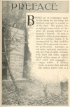
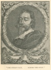
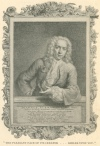
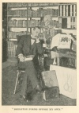

  
[Intangible Textual Heritage](../../index)  [Earth Mysteries](../index) 
[Index](index)  [Previous](eti01)  [Next](eti03) 

------------------------------------------------------------------------

[Buy this Book at
Amazon.com](https://www.amazon.com/exec/obidos/ASIN/1892062186/internetsacredte)

------------------------------------------------------------------------

  
*Etidorhpa*, by John Uri Lloyd, \[1897\], at Intangible Textual Heritage

------------------------------------------------------------------------

p. iii

 
[  
Click to enlarge](img/_00300.jpg)  
  

#### PREFACE

BOOKS are as tombstones made by the living for the living, but destined
soon only to remind us of the dead. The preface, like an epitaph, seems
vainly to "implore the passing tribute" of a moment's interest. No man
is allured by either a grave-inscription or a preface, unless it be
accompanied by that ineffable charm which age casts over mortal
productions. Libraries, in one sense, represent cemeteries, and the rows
of silent volumes, with their dim titles, suggest burial tablets, many
of which, alas! mark only cenotaphs—empty tombs. A modern book, no
matter how talented the author, carries with it a

p. iv

familiar personality which may often be treated with neglect or even
contempt, but a volume a century old demands some reverence; a
vellum-bound or hog-skin print, or antique yellow parchment, two, three,
five hundred years old, regardless of its contents, impresses one with
an indescribable feeling akin to awe and veneration,—as does the wheat
from an Egyptian tomb, even though it be only wheat. We take such a work
from the shelf carefully, and replace it gently. While the productions
of modern writers are handled familiarly, as men living jostle men yet
alive; those of authors long dead are touched as tho’ clutched by a hand
from the unseen world; the reader feels that a phantom form opposes his
own, and that spectral eyes scan the pages as he turns them.

The stern face, the penetrating eye of the personage whose likeness

<table data-align="LEFT">
<colgroup>
<col style="width: 100%" />
</colgroup>
<tbody>
<tr class="odd">
<td data-valign="CENTER"><a href="img/_00400.jpg"> 
Click to enlarge</a> 
“THE STERN FACE, 
 . . ACROSS THE GULF.” 
</td>
</tr>
</tbody>
</table>

forms the frontispiece of the yellowed volume in my hand, speak across
the gulf of two centuries, and bid me beware. The title page is read
with reverence, and the great tome is replaced with care, for an almost
superstitious sensation bids me be cautious and not offend. Let those
who presume to criticise the intellectual productions of such men be
careful; in a few days the dead will face their censors—dead.

Standing in a library of antiquated works, one senses the shadows of a
cemetery. Each volume adds to the oppression, each old tome casts the
influence of its spirit over the beholder, for have not these old books
spirits? The earth-grave covers the mind as well as the body of its
moldering occupant, and while

p. v

only a strong imagination

<table data-align="RIGHT">
<colgroup>
<col style="width: 100%" />
</colgroup>
<tbody>
<tr class="odd">
<td data-valign="CENTER"><a href="img/_00500.jpg"> 
Click to enlarge</a> 
“THE PLEASANT FACE OF 
ITS CREATOR . . . 
SMILES UPON YOU” 
</td>
</tr>
</tbody>
</table>

can assume that a spirit hovers over and lingers around inanimate clay,
here each title is a voice that speaks as though the heart of its
creator still throbbed, the mind essence of the dead writer envelops the
living reader. Take down that vellum-bound volume,—it was written in one
of the centuries long past. The pleasant face of its creator, as fresh
as if but a print of yesterday, smiles upon you from the exquisitely
engraved copper-plate frontispiece; the mind of the author rises from
out the words before you. This man is not dead and his comrades live.
Turn to the shelves about, before each book stands a guardian
spirit,—together they form a phantom army that, invisible to mortals,
encircles the beholder.

Ah! this antique library is not as is a church graveyard, only a
cemetery for the dead; it is also a mansion for the living. These
alcoves are trysting places for elemental shades. Essences of
dis-enthralled minds meet here and revel. Thoughts of the past take
shape and live in this atmosphere,—who can say that pulsations
unperceived, beyond the reach of physics or of chemistry, are not as
ethereal mind-seeds which, although unseen, yet, in living brain,
exposed to such an atmosphere as this, formulate embryotic

p. vi

thought-expressions destined to become energetic intellectual
forces?

<table data-align="LEFT">
<colgroup>
<col style="width: 100%" />
</colgroup>
<tbody>
<tr class="odd">
<td data-valign="CENTER"><a href="img/_00600.jpg"> 
Click to enlarge</a> 
“SKELETON FORMS OPPOSE MY OWN.” 
</td>
</tr>
</tbody>
</table>

I sit in such a weird library and meditate. The shades of grim authors
whisper in my ear, skeleton forms oppose my own, and phantoms possess
the gloomy alcoves of the library I am building.

With the object of carrying to the future a section of thought current
from the past, the antiquarian libraries of many nations have been
culled, and purchases made in every book market of the world.

These books surround me. Naturally many persons have become interested
in the movement, and, considering it a worthy one, unite to further the
project, for the purpose is not personal gain. Thus it is not unusual
for boxes of old chemical or pharmacal volumes to arrive by freight or
express, without a word as to the donor. The mail brings manuscripts
unprinted, and pamphlets recondite, with no word of introduction. They
come unheralded. The authors or the senders realize that in this unique
library a place is vacant if any work on connected subjects is missing,
and thinking men of the world are uniting their contributions to fill
such vacancies.

Enough has been said concerning the ancient library that has bred these
reflections, and my own personality does not concern the reader. He can
now formulate his conclusions as well perhaps as I, regarding the origin
of the manuscript that is to follow, if he concerns himself at all over
subjects mysterious or historical, and

p. vii

my connection therewith is of minor importance. Whether Mr. Drury
brought the strange paper in person, or sent it by express or
mail,—whether it was slipped into a box of books from foreign lands, or
whether my hand held the pen that made the record,—whether I stood face
to face with Mr. Drury in the shadows of this room, or have but a
fanciful conception of his figure,—whether the artist drew upon his
imagination for the vivid likeness of the several personages figured in
the book that follows, or from reliable data has given fac-similes
authentic,—is immaterial. Sufficient be it to say that the manuscript of
this book has been in my possession for a period of seven years, and my
lips must now be sealed concerning all that transpired in connection
therewith outside the subject-matter recorded therein, And yet I can not
deny that for these seven years I have hesitated concerning my proper
course, and more than once have decided to cover from sight the
fascinating leaflets, hide them among surrounding volumes, and let them
slumber until chance should bring them to the attention of the future
student.

These thoughts rise before me this gloomy day of December, 1894, as,
snatching a moment from the exactions of business, I sit among these old
volumes devoted to science-lore, and again study over the unique
manuscript, and meditate; I hesitate again: Shall I, or shall I not?—but
a duty is a duty. Perhaps the mysterious part of the subject will be
cleared to me only when my own thought-words come to rest among these
venerable relics of the past—when books that I have written become
companions of ancient works about me—for then I can claim relationship
with the shadows that flit in and out, and can demand that they, the
ghosts of the library, commune with the shade that guards the book that
holds this preface.

JOHN URI LLOYD.

------------------------------------------------------------------------

[Next: Preface to This Edition](eti03)
