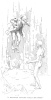
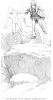

  
[Intangible Textual Heritage](../../index)  [Earth Mysteries](../index) 
[Index](index)  [Previous](eti27)  [Next](eti29) 

------------------------------------------------------------------------

[Buy this Book at
Amazon.com](https://www.amazon.com/exec/obidos/ASIN/1892062186/internetsacredte)

------------------------------------------------------------------------

  
*Etidorhpa*, by John Uri Lloyd, \[1897\], at Intangible Textual Heritage

------------------------------------------------------------------------

p. 142

## MY UNBIDDEN GUEST CONTINUES READING HIS MANUSCRIPT.

### CHAPTER XXI.

#### MY WEIGHT DISAPPEARING.

We halted suddenly, for we came unexpectedly to the edge of a precipice,
twenty feet at least in depth.

"Let us jump down," said my guide.

"That would be dangerous," I answered; "can not we descend at some point
where it is not so deep?"

"No; the chasm stretches for miles across our path, and at this point we
will meet with the least difficulty; besides, there is no danger. The
specific gravity of our bodies is now so little that we could jump twice
that distance with impunity."

"I can not comprehend you; we are in the flesh, our bodies are possessed
of weight, the concussion will be violent."

"You reason again from the condition of your former life, and, as usual,
are mistaken; there will be little shock, for, as I have said, our
bodies are comparatively light now. Have you forgotten that your motion
is continuously accelerated, and that without perceptible exertion you
move rapidly? This is partly because of the loss of weight. Your weight
would now be only about fifty pounds if tested by a spring balance."

I stood incredulous.

"You trifle with me; I weigh over one hundred and fifty pounds; how have
I lost weight? It is true that I have noticed the ease with which we
have recently progressed on our journey, especially the latter part of
it, but I attribute this, in part, to the fact that our course is down
an incline, and also to the vitalizing power of this cavern air."

"This explains part of the matter," he said; " it answered at the time,
and I stated a fact; but were it not that you are really consuming a
comparatively small amount of energy, you

p. 143

would long before this have been completely exhausted. You have been
gaining strength for some hours; have really been growing younger. Your
wrinkled face has become more smooth, 

<table data-align="RIGHT">
<colgroup>
<col style="width: 100%" />
</colgroup>
<tbody>
<tr class="odd">
<td data-valign="CENTER"><a href="img/14300.jpg"> 
Click to enlarge</a> 
“I BOUNDED UPWARD 
FULLY SIX FEET.” 
</td>
</tr>
</tbody>
</table>

and your voice is again natural. You were prematurely aged by your
brothers on the surface of the earth, in order that when you pass the
line of gravity, you might be vigorous and enjoying manhood again. Had
this aging process not been accomplished you would now have become as a
child in many respects."

He halted before me. "Jump up," he said. I promptly obeyed the
unexpected command, and sprung upward with sufficient force to carry me,
as I supposed, six inches from the earth; however I bounded upward fully
six feet. My look of surprise as I

p. 144

gently alighted, for there was no concussion on my return, seemed lost
on my guide, and he quietly said:

"If you can leap six feet upward without excessive exertion, or return
shock, can not you jump twenty feet down? Look!"

  [  
Click to enlarge](img/14400.jpg)  
“I FLUTTERED TO THE EARTH AS A LEAF WOULD FALL.”  

And he leaped lightly over the precipice and stood unharmed on the stony
floor below.

Even then I hesitated, observing which, he cried:

"Hang by your hands from the edge then, and drop."

I did so, and the fourteen feet of fall seemed to affect me as though I
had become as light as cork. I fluttered to the earth as a leaf would
fall, and leaned against the precipice in surprised, meditation.

"Others have been through your experience," he remarked, "and I
therefore can overlook your incredulity; but experiences such as you now
meet, remove distrust. Doing is believing." He smiled benignantly.

p. 145

I pondered, revolving in my mind the fact that persons had in mental
abstraction, passed through unusual experiences in ignorance of
conditions

<table data-align="RIGHT">
<colgroup>
<col style="width: 100%" />
</colgroup>
<tbody>
<tr class="odd">
<td data-valign="CENTER"><a href="img/14500.jpg"> 
Click to enlarge</a> 
“WE LEAPED OVER 
GREAT INEQUALITIES.” 
</td>
</tr>
</tbody>
</table>

about them, until their attention had been called to the seen and yet
unnoticed surroundings, and they had then beheld the facts plainly. The
puzzle picture (see [p. 129](eti26.htm#page_129)) stares the eye and
impresses the retina, but is devoid of character until the hidden form
is developed in the mind, and then that form is always prominent to the
eye. My remarkably light step, now that my attention had been directed
thereto, was constantly in my mind, and I found myself suddenly
possessed of the strength of a man, but with the weight of an infant. I
raised my feet without an effort; they seemed destitute of weight; I
leaped about, tumbled, and rolled over and over on the smooth stone
floor without injury. It appeared that I had become the airy similitude
of my former self, my material substance having wasted away without a
corresponding impairment of strength.

p. 146

\[paragraph continues\] I pinched my flesh
to be assured that all was not a dream, and then endeavored to convince
myself that I was the victim of delirium; but in vain. Too sternly my
self-existence confronted me as a reality, a cruel reality. A species of
intoxication possessed me once more, and I now hoped for the end,
whatever it might be. We resumed our journey, and rushed on with
increasing rapidity, galloping hand in hand, down, down, ever downward
into the illuminated crevice of the earth. The spectral light by which
we were aureoled increased in intensity, as by arithmetical progression,
and I could now distinguish objects at a considerable distance before
us. My spirits rose as if I were under the influence of a potent
stimulant; a liveliness that was the opposite of my recent despondency
had gained control, and I was again possessed of a delicious mental
sensation, to which I can only refer as a most rapturous exhilaration.
My guide grasped my hand firmly, and his touch, instead of revolting me
as formerly it had done, gave pleasure. We together leaped over great
inequalities in the floor, performing these aerial feats almost as
easily as a bird flies. Indeed, I felt that I possessed the power of
flight, for we bounded fearlessly down great declivities and over
abysses that were often perpendicular, and many times our height. A very
slight muscular exertion was sufficient to carry us rods of distance,
and almost tiptoeing we skimmed with ever-increasing speed down the
steeps of that unknown declivity. At length my guide held back; we
gradually lessened our velocity, and, after a time, rested beside a
horizontal substance that lay before us, apparently a sheet of glass,
rigid, immovable, immeasurably great, that stretched as a level surface
before us, vividly distinct in the brightness of an earth light, that
now proved to be superior to sunshine. Far as the eye could reach, the
glassy barrier to our further progress spread as a crystal mirror in
front, and vanishing in the distance, shut off the beyond.

p. 147

  [  
Click to enlarge](img/14700.jpg)  
“FAR AS THE EYE COULD REACH THE GLASSY BARRIER SPREAD AS A CRYSTAL
MIRROR.”  

p. 148

------------------------------------------------------------------------

[Next: Chapter XXII. My Unbidden Guest Departs](eti29)
