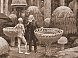

  
[Intangible Textual Heritage](../../index)  [Earth Mysteries](../index.md) 
[Index](index)  [Previous](eti35)  [Next](eti37.md) 

------------------------------------------------------------------------

[Buy this Book at
Amazon.com](https://www.amazon.com/exec/obidos/ASIN/1892062186/internetsacredte.md)

------------------------------------------------------------------------

  
*Etidorhpa*, by John Uri Lloyd, \[1897\], at Intangible Textual Heritage

------------------------------------------------------------------------

p. 186

### CHAPTER XXIX.

#### BEWARE OF BIOLOGY, THE SCIENCE OF THE LIFE OF MAN. [\*](#fn_5.md)

(The old man relates a story as an object lesson.)

"But you have not lived up to the promise; you have evaded part of the
bargain," I continued. "While you have certainly performed some curious
experiments in physics which seem to be unique, yet, I am only an
amateur in science, and your hydrostatic illustrations play be
repetitions of investigations already recorded, that have escaped the
attention of the scientific gentlemen to whom I have hitherto applied."

"Man's mind is a creature of doubts and questions," he observed. "Answer
one query, and others rise. His inner self is never satisfied, and you
are not to blame for wishing for a sign, as all self-conscious
conditions of your former existence compel. Now that I have brushed
aside the more prominent questionings, you insist upon those omitted,
and appeal to me to"—he hesitated.

"To what?" I asked, curious to see if he had intuitively grasped my
unspoken sentence.

"To exhibit to you your own brain," he replied.

"That is it exactly," I said; "you promised it, and you shall be held
strictly to your bargain. You agreed to show me my own brain, and it
seems evident that you have purposely evaded the promise."

"That I have made the promise and deferred its completion can not be
denied, but not by reason of an inability to fulfill the contract. I
will admit that I purposely deferred the exhibition, hoping on your own
account that you would forget the hasty promise. You would better
release me from the promise; you do not know what you ask."

"I believe that I ask more than you can perform," I answered, "and that
you know it."

p. 187

"Let me give you a history," he said, "and then perhaps you will relent.
Listen. A man once became involved in the study of anatomy. It led him
to destruction. He commenced the study in order to learn a profession;
he hoped to become a physician. Materia medica, pharmacy, chemistry,
enticed him at first, but after a time presented no charms. He was a
dull student in much that men usually consider essential to the practice
of medicine. He was not fitted to be a physician. Gradually he became
absorbed in two branches, physiology and anatomy. Within his mental self
a latent something developed that neither himself nor his friends had
suspected. This was an increasing desire for knowledge concerning the
human body. The insatiable craving for anatomy grew upon him, and as it
did so other sections of medicine were neglected. Gradually he lost
sight of his professional object; he dropped chemistry, materia medica,
pharmacy, and at last, morbidly lived only in the aforenamed two
branches.

"His first visit to the dissecting room was disagreeable. The odor of
putrid flesh, the sight of the mutilated bodies repulsed him. When first
his hand, warm in life, touched the clammy flesh of a corpse, he
shuddered. Then when his fingers came in contact with the viscera of a
cadaver, that of a little child, he cried out in horror. The
demonstrator of anatomy urged him on; he finally was induced to dissect
part of the infant. The reflex action on his sensitive mind first
stunned, and then warped his senses. His companions had to lead him from
the room. 'Wash it off, wash it off,' he repeated, trying to throw his
hand from his person. 'Horrid, horrible, unclean. The child is yet
before me,' he insisted. Then he went into a fever and raved. 'Some
mother will meet me on the street and curse me,' he cried. "That hand is
red with the blood of my darling; it has desecrated the innocent dead,
and mutilated that which is most precious to a mother." 'Take the hand
away, wash it,' he shouted. 'The mother curses me; she demands
retribution. Better that a man be dead than cursed by a mother whose
child has been desecrated.' So the unfortunate being raved, dreaming all
miner of horrid imaginings. But at last he recovered, a different man.
He returned voluntarily to the dissecting-room, and wrapped himself in
the uncouth work.

p. 188

Nothing in connection with corpse-mutilation was now offensive or
unclean. He threw aside his other studies, he became a slave possessed
of one idea. He scarcely took time to dine respectably; indeed, he often
ate his lunch in the dissecting-room. The blood of a child was again and
again on his fingers; it mattered not, he did not take the trouble to
wash it off. 'The liver of man is not more sacred than the liver of a
hog,' he argued; the flesh of a man is the same as other forms of animal
food. When a person dies the vital heat escapes, consciousness is
dissipated, and the cold, rigid remains are only animal. Consciousness
and life are all that is of man—one is force, the other matter; when man
dies both perish and are dissipated.' His friends perceived, his
fondness for dissection, and argued with him again, endeavoring now to
overcome his infatuation; he repelled them. 'I learned in my vision,' he
said, referring to his fever, that Pope was right in saying that the
"proper study of mankind is man"; I care nothing for your priestly
superstitions concerning the dead. These fables are the invention of
designing churchmen who live on the superstitions of the ignorant. I am
an infidel, and believe in no spirit intangible; that which can be seen,
felt, and weighed is, all else is not. Life is simply a sensation. All
beyond is chimerical, less than fantastic, believed in only by, dupes
and weak-minded, credulous tools of knaves, or creatures of blind
superstition.' He carried the finely articulated, bleached skull of a
cadaver to his room, and placed it beside a marble statue that was a
valued heirloom, the model of Venus of Milo. 'Both are lime compounds,'
he cynically observed, 'neither is better than the other.' His friends
protested. 'Your superstitious education is at fault,' he answered; you
mentally clothe one of these objects in a quality it does not deserve,
and the thought creates a pleasant emotion. The other, equally as pure,
reminds you of the grave that you fear, and you shudder. These mental
pulsations are artificial, both being either survivals of superstition,
or creations of your own mind. The lime in the skull is now as inanimate
as that of the statue; neither object is responsible for its form,
neither is unclean. To me, the delicate configuration, the exact
articulation, the perfect adaptation for the office it originally
filled, makes each bone of this skull a thing of beauty, an object of
admiration. As a

p. 189

whole, it gives me pleasure to think of this wonderful, exquisitely
arranged piece of mechanism. The statue you admire is in every respect
outrivaled by the skull, and I have placed the two together because it
pleases me to demonstrate that man's most artistic creation is far
inferior to material man. Throw aside your sentimental prejudices, and
join with me in the admiration of this thing of beauty;' and he toyed
with the skull as if it were a work of art. So he argued, and arguing
passed from bone to bone, and from organ to organ. He filled his room
with abnormal fragments of the human body, and surrounded himself with
jars of preserved anatomical specimens. His friends fled in disgust, and
he smiled, glad to be alone with his ghastly subjects. He was infatuated
in one of the alcoves of science."

The old man paused.

"Shall I proceed?" he asked.

"Yes," I said, but involuntarily moved my chair back, for I began again
to be afraid of the speaker.

"At last this scientific man had mastered all that was known concerning
physiology and anatomy. He learned by heart the wording of great volumes
devoted to these subjects. The human frame became to him as an open
book. He knew the articulation of every muscle, could name a bone from a
mere fragment. The microscope ceased to be an object of interest, the
secrets of pathology and physiology had been mastered. Then,
unconsciously, he was infected by another tendency; a new thought was
destined to dominate his brain. 'What is it that animates this frame?
What lies inside to give it life?' He became enthused again: The dead
body, to which I have given my time, is not the conscious part of man,'
he said to himself; I must find this thing of life within; I have been
only a butcher of the dead. My knowledge is superficial.'"

Again the old man hesitated and looked at me inquiringly. "Shall I
proceed?" he repeated.

I was possessed by horror, but yet fascinated, and answered
determinedly: "Go on."

"Beware," he added, "beware of the Science of Life." Pleadingly he
looked at me.

"Go on," I commanded.

p. 190

He continued:

"With the cunning of a madman, this person of profound learning, led
from the innocence of ignorance to the heartlessness of advanced
biological science, secretly planned to seek the vital forces. 'I must
begin with a child, for the life essence shows its first manifestations
in children,' he reasoned. He moved to an unfrequented locality,
discharged his servants, and notified his former friends that visitors
were unwelcome. He had determined that no interruption to his work
should occur. This course was unnecessary, however, for now he had
neither friends nor visitors. He employed carpenters and artisans,. and
perfected a series of mechanical tables, beautiful examples of automatic
mechanism. From the inner room of that house no cry could be heard by
persons outside. . . .

\[It will be seen, by referring to the epilogue, that Mr. Drury agreed
to mutilate part of the book. This I have gladly done, excising the
heart-rending passages that follow. To use the words of Prof. Venable,
they do not "comport with the general delicacy of the book."—J. U. L.\]

"Hold, old man, cease," I cried aghast; "I have had enough of this. You
trifle with me, demon; I have not asked for nightmare stories,
heart-curdling accounts of maniacal investigators, who madly pursue
their revolting calling, and discredit the name of science."

"You asked to see your own brain," he replied.

"And have been given a terrible story instead," I retorted.

"So men perverted, misconstruing the aim of science, answer the cry of
humanity," he said. "One by one the cherished treasures of Christianity
have been stolen from the faithful. What, to the mother, can replace the
babe that has been lost?"

"The next world," I answered, "offers a comfort."

"Bah," he said; "does not another searcher in that same science field
tell the mother that there is no personal hereafter, that she will never
see her babe again? One man of science steals the body, another man of
science takes away the soul, the third annihilates heaven; they go like
pestilence and famine, hand in hand, subsisting on all that craving
humanity considers sacred, and offering no tangible return beyond a
materialistic present. This same science that seems to be doing so much
for

p. 191

humanity will continue to elevate so-called material civilization until,
as the yeast ferment is smothered in its own excretion, so will
science-thought create conditions to blot itself from existence, and
destroy the civilization it creates. Science is heartless,
notwithstanding the personal purity of the majority of her helpless
votaries. She is a thief, not of ordinary riches, but of treasures

  [  
Click to enlarge](img/19100.jpg.md)  
“RISING ABRUPTLY, HE GRASPED MY HAND.”  

that can not be replaced. Before science provings the love of a mother
perishes, the hope of immortality is annihilated. Beware of materialism,
the end of the science of man. Beware of the beginning of biological
inquiry, for he who commences, can not foresee the termination. I say to
you in candor, no man ever engaged in the part of science lore that
questions the life essence, realizing the possible end of his
investigations. The insidious servant becomes a tyrannical master; the
housebreaker is innocent, the horse thief guiltless in comparison.
Science thought begins in the brain of man; science provings end all
things with the end of the material brain of man. Beware of your own
brain."

p. 192

"I have no fear," I replied, "that I will ever be led to disturb the
creeds of the faithful, and I will not be diverted. I demand to see my
brain."

"Your demand shall now be fulfilled; you have been warned of the return
that may follow the commencement of this study; you force the issue; my
responsibility ceases. No man of science realized the end when he began
to investigate his throbbing brain, and the end of the fabric that
science is weaving for man rests in the hidden future. The story I have
related is a true one, as thousands of faithful men who unconsciously
have been led into infidelity have experienced; and as the faithful
followers of sacred teachings can also perceive, who recognize that
their religion and the hope of heaven is slipping away beneath the
steady inroad of the heartless materialistic investigator, who clothes
himself in the garb of science."

Rising abruptly from his chair, he grasped my hand. "You shall see your
brain, man; come."

------------------------------------------------------------------------

### Footnotes

[186:\*](eti36.htm#fr_5.md) The reader is invited to
skip this chapter of horrors.—J. U. L.

------------------------------------------------------------------------

[Next: Chapter XXX. Looking Backward.—The Living Brain](eti37.md)
