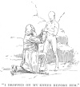

  
[Intangible Textual Heritage](../../index)  [Earth Mysteries](../index.md) 
[Index](index)  [Previous](eti41)  [Next](eti43.md) 

------------------------------------------------------------------------

[Buy this Book at
Amazon.com](https://www.amazon.com/exec/obidos/ASIN/1892062186/internetsacredte.md)

------------------------------------------------------------------------

  
*Etidorhpa*, by John Uri Lloyd, \[1897\], at Intangible Textual Heritage

------------------------------------------------------------------------

p. 230

### CHAPTER XXXV.

#### "A CERTAIN POINT WITHIN A SPHERE."—MEN ARE AS PARASITES ON THE ROOF OF EARTH.

I realized again, as I had so many times before, that it was useless for
me to rebel. "The self-imposed mystery of a sacrificed life lies before
me," I murmured, "and there is no chance to retrace my footsteps. The
'Beyond' of the course that I have voluntarily selected, and sworn to
follow, is hidden; I must nerve myself to pursue it to the bitter end,
and so help me God, and keep me steadfast."

"Well said," he replied; "and since you have so wisely determined, I am
free to inform you that these new obligations, like those you have
heretofore taken, contain nothing which can conflict with your duty to
God, your country, your neighbor, or yourself. In considering the
phenomena presented by the suspension of the act of breathing, it should
occur to you that where little labor is to be performed, little
consumption of energy is required. Where there is such a trifling
destruction of the vital force (not mind force) as at present is the
case with us, it requires but slight respiration to retain the normal
condition of the body. On earth's surface the act of respiration alone
consumes by far the larger proportion of vital energy, and the muscular
exertion involved thereby necessitates a proportionate amount of
breathing in order that breath itself may continue. This act of
respiration is the result of one of the conditions of surface earth
life, and consumes most of the vital force. If men would think of this,
they would understand how paradoxical it is for them to breathe in order
to live, when the very act of respiration wears away their bodies and
shortens their lives more than all else they have to do, and without
adding to their mental or physical constitution in the least. Men are
conversant with physical death as a constant result of suspended
respiration, and with respiration as

p. 231

an accompaniment of life, which ever constant and connected conditions
lead them to accept that the act of breathing is a necessity of mortal
life. In reality, man occupies an unfortunate position among other
undeveloped creatures of external earth; he is an animal, and is
constitutionally framed like the other animals about him. He is exposed
to the warring elements, to the vicious attacks of savage beasts and
insidious parasites, and to the inroads of disease. He is a prey to the
elementary vicissitudes of the undesirable exposure in which he exists
upon the outer surface of our globe, where all is war, even among the
forces of nature about him. These conditions render his lot an unhappy
one indeed, and in ignorance he overlooks the torments of the weary,
rasping, endless slavery of respiration in the personal struggle he has
to undergo in order to retain a brief existence as an organized being.
Have you never thought of the connected tribulations that the wear and
tear of respiration alone inflict upon the human family? The heaving of
the chest, the circulation of the blood, the throbbing of the heart,
continue from mortal birth until death. The heart of man forces about
two and one-half ounces of blood with each pulsation. At seventy beats
per minute this amounts to six hundred and fifty-six pounds per hour, or
nearly eight tons per day. The lungs respire over one thousand times an
hour, and move over three thousand gallons of air a day. Multiply these
amounts by three hundred and sixty-five, and then by seventy, and you
have partly computed the enormous life-work of the lungs and heart of an
adult. Over two hundred thousand tons of blood, and seventy-five million
gallons of air have been moved by the vital force. The energy thus
consumed is dissipated. No return is made for the expenditure of this
life force. During the natural life of man, more energy is consequently
wasted in material transformation resulting from the motion of heart and
lungs, than would be necessary to sustain the purely vital forces alone
for a thousand years. Besides, the act of respiration which man is
compelled to perform in his exposed position, necessitates the
consumption of large amounts of food, in order to preserve the animal
heat, and replace the waste of a material body that in turn is worn out
by these very movements. Add this waste of energy to the foregoing, and
then you will surely perceive that

p. 232

the possible life of man is also curtailed to another and greater degree
in the support of the digestive part of his organism. His spirit is a
slave to his body; his lungs and heart, on which he imagines life
depends, are unceasing antagonists of life. That his act of breathing is
now a necessity upon the surface of the earth, where the force of
gravity presses so heavily, and where the elements have' men at their
command, and show him no mercy, I will not deny; but it is exasperating
to contemplate such a waste of energy, and corresponding loss of human
life."

"You must admit, however, that it is necessary?" I queried.

"No; only to an extent. The natural life of man should, and yet will be,
doubled, trebled, multiplied a dozen, yes a thousand fold."

I stepped in front of him; we stood facing each other.

"Tell me," I cried, "how men can so improve their condition as to
lengthen their days to the limit you name, and let me return to surface
earth a carrier of the glad tidings."

<table data-align="LEFT">
<colgroup>
<col style="width: 100%" />
</colgroup>
<tbody>
<tr class="odd">
<td data-valign="CENTER"><a href="img/23200.jpg"> 
Click to enlarge</a> 
“I DROPPED ON MY 
KNEES BEFORE HIM.” 
</td>
</tr>
</tbody>
</table>

He shook his head.

I dropped on my knees before him.

"I implore you in behalf of that unfortunate humanity, of which I am a
member, give me this boon. I promise to return to you and do your
bidding. Whatever may be my subsequent fate, I promise to acquiesce
therein willingly."

He raised me to my feet. "Be of good cheer," he said, "and in the proper
time you may return to the surface of this rind of earth, a carrier of
great and good news to men."

"Shall I teach them of what you have shown me?" I asked.

"Yes; in part you will be a forerunner, but before you obtain the
information that is necessary to the comfort of mankind you

p. 233

will have to visit surface earth again, and return again, perhaps
repeatedly. You must prove yourself as men are seldom proven. The
journey you have commenced is far from its conclusion, and you may not
be equal to its subsequent trials; prepare yourself, therefore, for a
series of events that may unnerve you. If you had full confidence and
faith in your guide, you would have less cause to fear the result, but
your suspicious human nature can not overcome the shrinking sensation
that is natural to those who have been educated as you have been amid
the changing vicissitudes of the earth's surface, and you can not but be
incredulous by reason of that education."

Then I stopped as I observed before me a peculiar fungus—peculiar
because unlike all others I had-seen. The convex part of its bowl was
below, and the great head, as an inverted toadstool, stood upright on a
short, stem-like pedestal. The gills within were of a deep green color,
and curved out from the center in the form of a spiral. This form,
however, was not the distinguishing feature, for I had before observed
specimens that were spiral in structure. The extraordinary peculiarity
was that the gills were covered with fruit. This fruit was likewise
green in color, each spore, or berry, being from two to three inches in
diameter, and honeycombed on the surface, corrugated most beautifully. I
stopped, leaned over the edge of the great bowl, and plucked a specimen
of the fruit. It seemed to be covered with a hard, transparent shell,
and to be nearly full of a clear, green liquid. I handled and examined
it in curiosity, at which my guide seemed not to be surprised. Regarding
me attentively, he said:

"What is it that impels a mortal towards this fruit?"

"It is curious," I said; "nothing more."

"As for that," said he, "it is not curious at all; the seed of the
lobelia of upper earth is more curious, because, while it is as
exquisitely corrugated, it is also microscopically small. In the second
place you err when you say it is simply curious, 'nothing more,' for no
mortal ever yet passed that bowl without doing exactly as you have done.
The vein of curiosity, were it that alone that impels you, could not but
have an exception."

Then he cracked the shell of the fruit by striking it on the stony
floor, and carefully opened the shell, handing me one of

p. 234

the halves filled with a green fluid. As he did so he spoke the single
word, "Drink," and I did as directed. He stood upright before me, and as
I looked him in the face he seemingly, without a reason, struck off into
a dissertation, apparently as distinct from our line of thought as a
disconnected subject could be, as follows:

  [  
Click to enlarge](img/23400.jpg.md)  
“HANDING ME ONE OF THE HALVES, HE SPOKE THE SINGLE WORD, DRINK.”  

------------------------------------------------------------------------

[Next: Chapter XXXVI. Drunkenness.—The Drinks of Man](eti43.md)
