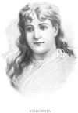

  
[Intangible Textual Heritage](../../index)  [Earth Mysteries](../index) 
[Index](index)  [Previous](eti46)  [Next](eti48) 

------------------------------------------------------------------------

[Buy this Book at
Amazon.com](https://www.amazon.com/exec/obidos/ASIN/1892062186/internetsacredte)

------------------------------------------------------------------------

  
*Etidorhpa*, by John Uri Lloyd, \[1897\], at Intangible Textual Heritage

------------------------------------------------------------------------

p. 252

### CHAPTER XL.

#### FURTHER TEMPTATION.—ETIDORHPA.

Then, as my voice reverberated from the outer recesses, I caught a sound
as of music in the distance. I raised my head and listened—yes, surely
there was music. The melody became clearly distinct, and soon my senses
were aware that both vocal and instrumental music were combined. The
airs which came floating were sweet, simple, and beautiful. The voices
and accompanying strains approached, but I could distinguish no words.
By and by, from the corridors of the cavern, troops of bright female
forms floated into view. They were clad in robes ranging from pure white
to every richest hue, contrasting strangely, and in the distance their
rainbow brilliancy made a gorgeous spectacle. Some were fantastically
attired in short gowns, such as I imagine were worn by the dancing girls
of sacred history, others had kirtles of a single bright color, others
of, many shades intermingled, while others still were dressed in
gauze-like fabrics of pure white.

As they filed into the cavern, and approached me, they formed into
platoons, or into companies, and then, as dissolving views come and go,
they presented first one and then another figure. Sometimes they would
stretch in great circling lines around the hall, again they would form
into squares, and again into geometrical figures of all shades and
forms, but I observed that with every change they drew nearer to the
stone on which I rested.

They were now so near that their features could be distinguished, and
never before had I seen such loveliness in human mold. Every face was as
perfect as a master's picture of the Madonna, and yet no two seemed to
possess the same type of beauty. Some were of dark complexion with
glossy, raven hair, others were fair with hair ranging from light brown
to golden. The style of head dress, as a rule, was of the simplest

p. 253

description. A tinted ribbon, or twisted cord, over the head, bound
their hair with becoming grace, and their silken locks were either
plaited into braids, curled into ringlets, or hung loosely, flowing in
wavelets about their shoulders. Some held curious musical instruments,
others beautiful wands, and altogether they produced a scenic effect of
rare beauty that the most extravagant dream of fairyland could not
surpass. Thus it was that I became again the center of a throng, not of
repulsive monsters, but of marvelously lovely beings. They were as
different from those preceding as darkness is from daylight.

Could any man from the data of my past experiences have predicted such a
scene? Never before had the semblance of a woman appeared, never before
had an intimation been given that the gentle sex existed in these silent
chambers. Now, from the grotesque figures and horrible cries of the
former occupants of this same cavern, the scene had changed to a
conception of the beautiful and artistic, such as a poetic spirit might
evolve in an extravagant dream of higher fairy land. I glanced above;
the great hall was clothed in brilliant colors, the bare rocks had
disappeared, the dome of that vast arch reaching to an immeasurable
height, was decorated in all the colors of the rainbow. Flags and
streamers fluttered in breezes that also moved the garments of the
angelic throng about me, but which I could not sense; profiles of
enchanting faces pervaded the glimmering space beyond; I alone was but
an onlooker, not a participant of the joys about me.

The movements of the seraph-like figures continued, innumerable forms
and figures followed forms and figures innumerable, and music
indescribable blended with the poetry of notion. I was rapt, the past
disappeared, my former mind was blotted from existence, the world
vanished, and I became a thrill of joy, a sensation of absolute delight.

The band of spirits or fairy forms reached the rock at my feet, but I
did not know how long a time they consumed in doing this; it may have
been a second, and it may have been an eternity. Neither did I care. A
single moment of existence such as I experienced, seemed worth an age of
any other pleasure.

Circling about me, these ethereal creatures paused from their motions,
and, as the music ceased, I stood above them, and yet

p. 254

in their midst, and gazed out into a distance illimitable, but not less
beautiful in the expanse than was the adjacent part. The cavern had
altogether disappeared, and in the depths about me as far as the eye
could reach, seemingly into the broad expanse of heaven, I saw the
exquisite forms that I have so imperfectly described.

Then a single band from the throng lightly sprung upon the stony terrace
where I stood, and sung and danced before me. Every motion was perfect
as imagination could depict, every sound was concentrated extract of
melody. This band retired to be replaced by another, which in turn gave
way to another, and still another, until, as in space we have no
standard, time vanished, and numbers ceased to be numbers.

No two of the band of dancers were clothed alike, no two songs were
similar, though all were inexpressibly enchanting. The first group
seemed perfect, and yet the second was better, and each succeeding band
sung sweeter songs, were more beautiful, and richer in dress than those
preceding. I became enveloped in the æsthetic atmosphere, my spirit
seemed to be loosened from the body, it was apparently upon the point of
escaping from its mortal frame; suddenly the music ceased, the figures
about became passive, and every form standing upright and graceful,
gazed upon my face, and as I looked at the radiant creatures, each
successive face, in turn, seemed to grow more beautiful, each form more
exquisite than those about.

Then, in the distance, I observed the phalanx divide, forming into two
divisions, separated by a broad aisle, stretching from my feet to the
limit of space without, and down this aisle I observed a single figure
advancing toward me.

As she approached, the phalanx closed in behind her, and when at last
she reached the stone on which I stood, she stepped, or was wafted to my
side, and the phalanx behind moved together and was complete again.

"My name is Etidorhpa. In me you behold the spirit that elevates man,
and subdues the most violent of passions. In history, so far back in the
dim ages as to be known now as legendary mythology, have I ruled and
blessed the world. Unclasp my power over man and beast, and while heaven
dissolves, the

p. 255

 
[  
Click to enlarge](img/25500.jpg)  
ETIDORHPA.  

p. 256 p. 257

charms of Paradise will perish. I know no master. The universe bows to
my authority. Stars and suns enamored pulsate and throb in space and
kiss each other in waves of light; atoms cold embrace and cling
together; structures inanimate affiliate with and attract inanimate
structures; bodies dead to other noble passions are not dead to love.
The savage beast, under my enchantment, creeps to her lair, and gently
purrs over her offspring; even man becomes less violent, and sheathes
his weapon and smothers his hatred as I soothe his passions beside the
loved ones in the privacy of his home.

"I have been known under many titles, and have comforted many peoples.
Strike my name from Time's record, and the lovely daughters of Zeus and
Dione would disappear; and with them would vanish the grace and beauty
of woman; the sweet conception of the Froth Child of the Cyprus Sea
would be lost; Venus, the Goddess of Love, would have no place in song,
and Love herself, the holiest conception of the poet, man's superlative
conception of Heaven's most precious charms, would be buried with the
myrtle and the rose. My name is Etidorhpa; interpret it rightly, and you
have what has been to humanity the essence of love, the mother of all
that ennobles. He who loves a wife worships me; she, who in turn makes a
home happy, is typical of me. I am Etidorhpa, the beginning and the end
of earth. Behold in me the antithesis of envy, the opposite of malice,
the enemy of sorrow, the mistress of life, the queen of immortal bliss.

"Do you know," she continued, and her voice, soft and sweet, carried
with it a pleasurable sense of truthfulness indescribable, "do you know
that man's idea of heaven, places me, Etidorhpa, on the highest throne?
With the charm of maiden pure, I combine the devotion of wife and the
holiness of mother. Take from the life of man the treasures I embody,
and he will be homeless, childless, loveless. The thought of Heaven will
in such a case be as the dismal conception of a dreary platitude. A life
in such a Heaven, a Heaven devoid of love (and this the Scriptures
teach), is one of endless torment.

"Love, by whatever name the conception is designated, rules the world.
Divest the cold man of science, of the bond that binds him to his
life-thought, and his work is ended. Strike

p. 258

from the master in music the chord that links his soul to the voice he
breathes, and his songs will be hushed. Deaden the sense of love which
the artist boars his art, and as the spirit that underlies his
thought-scenes vanishes, his touch becomes chilled, and his brush
inexpressive. The soldier thinks of his home and country, and without a
murmur sheds his life blood.

"And yet there are debasing phases of love, for as love of country
builds a nation, so love of pillage may destroy it. Love of the holy and
the beautiful stands in human life opposed to love of the debasing and
vicious, and I, Etidorhpa, am typical of the highest love of man. As the
same force binds the molecules of the rose and the violet as well as
those of noxious drugs, so the same soul conception may serve the love
of good or the love of evil. Love may guide a tyrant or actuate a saint,
may make man torture his fellow, or strive td ease his pain.

"Thus, man's propensity to serve his holy or his evil passion may each
be called a degree in love, and in the serving of that passion the love
of one heart may express itself as the antithesis of love in another. As
bitter is to some men's taste more pleasant than sweet, and sour is yet
more grateful to others, so one man may love the beautiful, another
delight in the grotesque, and a third may love to see his neighbor
suffer. Amid these, the phase of love that ennobles, brings the greatest
degree of pleasure and comfort to mankind, but the love that degrades is
love nevertheless, by whatever name the expression of the passion may be
called. Love rules the world, and typical of man's intensest, holiest
love, I, Etidorhpa, stand the Soul of Love Supreme." She hesitated.

"Go on."

"I have already said, and in saying this have told the truth, I come
from beyond the empty shell of a materialistic gold and silver
conception of Heaven. Go with me, and in my home you will find man's
soul devotion, regardless of material surroundings. I have said, and
truly, the corridors of the Heaven mansion, enriched by precious stones
and metals fine, but destitute of my smiles and graces, are deserted.
The golden calf is no longer worshiped, cobwebs cling in festoons
motionless, and the dust of selfish thoughts perverted, dry and black as
the soot from Satan's fires settling therein, as the dust of an
antiquated

p. 259

sarcophagus, rest undisturbed. Place on one side the Heaven of which
gold-bound misers sing, and on the other Etidorhpa and the treasures
that come with me to man and woman, (for without me neither wife, child,
nor father could exist,) and from any other heaven mankind will turn
away. The noblest gift of Heaven to humanity is the highest sense of
love, and I, Etidorhpa, am the soul of love."

She ceased speaking, and as I looked at the form beside me I forgot
myself in the rapture of that gaze.

Crush the colors of the rainbow into a single hue possessed of the
attributes of all the others, and multiply that entity to infinity, and
you have less richness than rested in any of the complex colors shown in
the trimming of her raiment. Lighten the softness of eiderdown a
thousand times, and yet maintain its sense of substance, and you have
not conceived of the softness of the gauze that decked her simple,
flowing garments. Gather the shadows cast by a troop of radiant angels,
then sprinkle the resultant shade with star dust, and color therewith a
garment brighter than satin, softer than silk, and more ethereal than
light itself, and you have less beauty than reposed in the modest dress
that enveloped her figure. Abstract the perfume from the sweetest
oriental grasses, and combine with it the essential spirit of the wild
rose, then add thereto the soul of ambergris, and the quintessential
extracts of the finest aromatics of the East, and you have not
approached the exquisite fragrance that penetrated my very being at her
approach. She stood before me, slender, lithe, symmetrical, radiant. Her
hair was more beautiful than pen can depict; it was colorless because it
can not be described by colors known to mortals. Her face paled the
beauty of all who had preceded her. She could not be a fairy, for no
conception of a fairy can approach such loveliness; she was not a
spirit, for surely material substance was a part of her form; she was
not an angel, for no abnormal, irrational wing protruded from her
shoulder to blemish her seraphic figure.

"No," I said musingly; "she is a creature of other climes; the
Scriptures tell of no such being; she is neither human nor angelic,
but"—

"But what?" she said.

"I do not know," I answered.

p. 260

"Then I will tell you," she replied. "Yes; I will tell you of myself and
of my companions. I will show you our home, carrying you through the
shadows of heaven to exhibit that fair land, for heaven without
Etidorhpa casts a shadow in comparison therewith. See," she said, as
with her dainty fingers she removed front her garment a fragment of
transparent film that I had not previously observed; "see, this is a
cobweb that clung to my skirt, as, on my way to meet you, I passed
through the dismal corridors of the materialists’ loveless heaven."

She dropped it on the floor, and I stooped to pick it up, but vainly—my
fingers passed through it as through a mist.

"You must be an angel," I stammered.

She smiled.

"Come," she said, "do not consume your time with thoughts of
materialistic heaven; come with me to that brighter land beyond, and in
those indescribable scenes we, you and I, will wander together forever."

She held out her hand; I hesitatingly touched it, and then raised it to
my lips. She made no resistance.

I dropped upon my knees. "Are you to be mine?" I cried. "Mine forever?"

"Yes," she answered; "if you will it, for he who loves will be loved in
turn."

"I will do it," I said; "I give myself to you, be you what you may, be
your home where it may, I give up the earth behind me, and the hope of
heaven before me; the here and the hereafter I will sacrifice. Let us
hasten," I said, for she made no movement.

She shook her head. "You must yet be tempted as never before, and you
must resist the tempter. You can not pass into the land of Etidorhpa
until you have suffered as only the damned can suffer, until you have
withstood the pangs of thirst, and have experienced heat and cold
indescribable. Remember the warning of your former guide, mark well the
words of Etidorhpa: you must not yield. ’T was to serve you that I came
before you now, ’t was to preserve you from the Drunkard's Cavern, that
I have given you this vision of the land beyond the End of Earth where,
if you will serve yourself, we will meet again.

She held aloft two tiny cups; I sprung to my feet and grasped one of
them, and as I glanced at the throng in front of

p. 261

me, every radiant figure held aloft in the left hand a similar cup. All
were gazing in my face. I looked at the transparent cup in my hand; it
appeared to be partly filled with a green liquid. I looked at her cup
and saw that it contained a similar fluid.

Forgetting the warning she had so recently given, I raised the cup to my
lips, and just before touching it glanced again at her face. The fair
creature stood with bowed head, her face covered with her hand; her very
form and attitude spoke of sorrow and disappointment, and she trembled
in distress. She held one hand as though to thrust back a form that
seemed about to force itself beyond her figure, for peering exultingly
from behind, leered the same Satanic face that met my gaze on the
preceding occasion, when in the presence of the troop of demons, I had
been tempted by the perfect man.

Dashing the cup to the floor I shouted:

"No; I will not drink."

Etidorhpa dropped upon her knees and clasped her hands. The Satanic
figure disappeared from sight. Realizing that we had triumphed over the
tempter, I also fell upon my knees in thankfulness.

------------------------------------------------------------------------

[Next: Chapter XLI. Misery](eti48)
