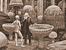

  
[Intangible Textual Heritage](../../index)  [Earth Mysteries](../index) 
[Index](index)  [Previous](eti54)  [Next](eti56) 

------------------------------------------------------------------------

[Buy this Book at
Amazon.com](https://www.amazon.com/exec/obidos/ASIN/1892062186/internetsacredte)

------------------------------------------------------------------------

  
*Etidorhpa*, by John Uri Lloyd, \[1897\], at Intangible Textual Heritage

------------------------------------------------------------------------

p. 327

### CHAPTER XLVIII.

#### WHY AND HOW.—"THE STRUGGLING RAY OF LIGHT FROM THOSE FARTHERMOST OUTREACHES."

"Confronting mankind there stands a sphinx—the vast Unknown. However
well a man may be informed concerning a special subject, his farthermost
outlook concerning that subject is bounded by an impenetrable infinity."

"Granted," I interrupted, "that mankind has not by any means attained a
condition of perfection, yet you must admit that questions once regarded
as inscrutable problems are now illuminated by the discoveries of
science."

"And the 'discovered,' as I will show, has only transferred ignorance to
other places," he replied. "Science has confined its labors to
superficial descriptions, not the elucidation of the fundamental causes
of phenomena."

"I can not believe you, and question if you can prove what you say."

"It needs no argument to illustrate the fact. Science boldly heralds her
descriptive discoveries, and as carefully ignores her explanatory
failures. She dare not attempt to explain the why even of the simplest
things. Why does the robin hop, and the snipe walk? Do not tell me this
is beneath the notice of men of science, for science claims that no
subject is outside her realm. Search your works on natural history and
see if your man of science, who describes the habits of these birds,
explains the reason for this evident fact. How does the tree-frog change
its color? Do not answer me in the usual superficial manner concerning
the reflection of light, but tell me why the skin of that creature is
enabled to perform this function? How does the maple-tree secrete a
sweet, wholesome sap, and deadly nightshade, growing in the same soil
and living on the same elements, a poison? What is it that your
scientific men find in the cells of root, or rootlet, to indicate that
one may produce a

p. 328

food, and the other a noxious secretion that can destroy life? Your
microscopist will discuss cell tissues learnedly, will speak fluently of
physiological structure, will describe organic intercellular
appearances, but ignore all that lies beyond. Why does the nerve in the
tongue respond to a sensation, and produce on the mind the sense of
taste? What is it that enables the nerve in the nose to perform its
discriminative function? You do not answer. Silver is sonorous, lead is
not; why these intrinsic differences? Aluminum is a light metal, gold a
heavy one; what reason can you offer to explain the facts other than the
inadequate term density? Mercury at ordinary temperature is a liquid;
can your scientist tell why it is not a solid? Of course anyone can say
because its molecules move freely on each other. Such an answer evades
the issue; why do they so readily exert this action? Copper produces
green or blue salts; nickel produces green salts; have you ever been
told why they observe these rules? Water solidifies at about thirty-two
degrees above your so-called zero; have you ever asked an explanation of
your scientific authority why it selects that temperature? Alcohol
dissolves resins, water dissolves gums; have you any explanation to
offer why either liquid should dissolve anything, much less exercise a
preference? One species of turtle has a soft shell, another a hard
shell; has your authority in natural history told you why this is so?
The albumen of the egg of the hen hardens at one hundred and eighty
degrees Fahrenheit; the albumen of the eggs of some turtles can not be
easily coagulated by boiling the egg in pure water; why these
differences? Iceland spar and dog-tooth spar are identical, both are
crystallized carbonate of lime; has your mineralogist explained why this
one substance selects these different forms of crystallization, or why
any crystal of any substance is ever produced? Why is common salt white
and charcoal black? Why does the dog lap and the calf drink? One child
has black hair, another brown, a third red; why? Search your physiology
for the answer and see if your learned authority can tell you why the
life-current makes these distinctions? Why do the cells of the liver
secrete bile, and those of the mouth saliva? Why does any cell secrete
anything? A parrot can speak; what has your anatomist found in the
structure of the brain, tongue,

p. 329

or larynx of that bird to explain why this accomplishment is not as much
the birthright of the turkey? The elements that form morphine and
strychnine, also make bread, one a food, the other a poison; can your
chemist offer any reason for the fact that morphine and bread possess
such opposite characters? The earth has one satellite, Saturn is
encompassed by a ring; it is not sufficient to attempt to refer to these
familiar facts; tell me, does your earth-bound astronomer explain why
the ring of Saturn was selected for that planet? Why are the salts of
aluminum astringent, the salts of magnesium cathartic, and the salts of
arsenicum deadly poison? Ask your toxicologist, and silence will be your
answer. Why will some substances absorb moisture from the air, and
liquefy, while others become as dry as dust under like conditions? Why
does the vapor of sulphuric ether inflame, while the vapor of chloroform
is not combustible, under ordinary conditions? Oil of turpentine, oil of
lemon, and oil of bergamot differ in odor, yet they are composed of the
same elements, united in the same proportion; why should they possess
such distinctive, individual characteristics? Further search of the
chemist will explain only to shove the word why into another space, as
ripples play with and toss a cork about. Why does the newly-born babe
cry for food before its intellect has a chance for worldly education?
Why"—

"Stop," I interrupted; "these questions are absurd."

"So some of your scientific experts would assert," he replied; "perhaps
they would even become indignant at my presumption in asking them, and
call them childish; nevertheless these men can not satisfy their own
cravings in attempting to search the illimitable, and in humiliation, or
irritation, they must ignore the word Why. That word Why to man
dominates the universe. It covers all phenomena, and thrusts inquiry
back from every depth. Science may trace a line of thought into the
infinitely little, down, down, beyond that which is tangible, and at
last in that far distant inter-microscopical infinity, monstrous by
reason of its very minuteness, must rest its labors against the word
Why. Man may carry his superficial investigation into the immeasurably
great, beyond our sun and his family of satellites, into the outer
depths of the solar system, of which our sun is a part, past his sister
stars, and out again into the depths of the

p. 330

cold space channels beyond; into other systems and out again, until at
last the nebulæ shrink and disappear in the gloom of thought-conjecture,
and as the straggling ray of light from those farthermost outreaches,
too feeble to tell of its origin, or carry a story of nativity, enters
his eye, he covers his face and rests his intellect against the word
Why. From the remote space caverns of the human intellect, beyond the
field of perception, whether we appeal to conceptions of the unknowable
in the infinitely little, or the immeasurably great, we meet a circle of
adamant, as impenetrable as the frozen cliffs of the Antarctic, that
incomprehensible word—Why!

"Why did the light wave spring into his field of perception by
reflection from the microscopic speck in the depths of littleness, on
the one hand; and how did this sliver of the sun's ray originate in the
depths of inter-stellar space, on the other?"

I bowed my head.

p. 331

  [![DESCRIPTION OF
JOURNEY FROM K. \[KENTUCKY\] TO P.—“THE END OF EARTH.”](tn/33100.jpg)  
Click to enlarge](img/33100.jpg)  
DESCRIPTION OF JOURNEY FROM K. \[KENTUCKY\] TO P.—“THE END OF EARTH.”  

A, B, Diameter of earth, 8,000 miles.

A, D, Thickness of earth crust, 800 miles.

C, D, Distance from inner earth crust to energy sphere, too miles.

E, Underground lake.

E, F, Distance from surface of lake to earth's surface.

G, Inner Circle (the Unknown Country).

H, Middle Circle (Sphere of Energy, or Circle of Rest).

L to M, Height of atmosphere, 200 miles.

K, Entrance to cavern in Kentucky.

L, Outer circle, earth's surface.

Mt. E, Mount Epomeo in Italy

N, North Pole.

O, Rock shelf from which the leap was made into the intra-earth space.

P, Junction of earth crust with Circle of Rest. Point where I-Am-The-Man
stepped "onward and upward" in "The Unknown Country."

S, South Pole.

------------------------------------------------------------------------

[Next: Chapter XLIX. Oscillating Through Space.—Earth's Shell Above
Me](eti56)
