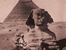

  
[Intangible Textual Heritage](../../index)  [Earth Mysteries](../index.md) 
[Index](index)  [Next](hhp01.md) 

------------------------------------------------------------------------

[Buy this Book at
Amazon.com](https://www.amazon.com/exec/obidos/ASIN/0892540923/internetsacredte.md)

------------------------------------------------------------------------

[Buy this Book on
Kindle](https://www.amazon.com/exec/obidos/ASIN/B002KKCTTS/internetsacredte.md)

------------------------------------------------------------------------

  
*The House of the Hidden Places*, by W. Marsham Adams, \[1895\], at
Intangible Textual Heritage

------------------------------------------------------------------------

# The House of the Hidden Places

### A Clue to the Creed of Early Egypt

## by W. Marsham Adams

#### John Murray: London

#### \[1895\]

  [  
Click to enlarge](img/front.jpg.md)  
THE “STONE OF GOD.”  
Throne in the Luminous Hall of Truth.  

  [  
Click to enlarge](img/chart.jpg.md)  
The Path of Light in the House of the Hidden Places (350 Kb)  

Scanned, proofed, and formatted at Intangible Textual Heritage, January
2007, by John B. Hare. This text is in the public domain in the US
because it was published prior to 1923.

------------------------------------------------------------------------

[Next: Contents](hhp01.md)

