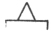
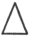
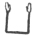

  
[Intangible Textual Heritage](../../index)  [Earth Mysteries](../index.md) 
[Index](index)  [Previous](hhp02)  [Next](hhp04.md) 

------------------------------------------------------------------------

[Buy this Book at
Amazon.com](https://www.amazon.com/exec/obidos/ASIN/0892540923/internetsacredte.md)

------------------------------------------------------------------------

[Buy this Book on
Kindle](https://www.amazon.com/exec/obidos/ASIN/B002KKCTTS/internetsacredte.md)

------------------------------------------------------------------------

  
*The House of the Hidden Places*, by W. Marsham Adams, \[1895\], at
Intangible Textual Heritage

------------------------------------------------------------------------

p. 1

# THE HOUSE

###### OF THE

# HIDDEN PLACES.

### CHAPTER I.

### THE PYRAMID OF LIGHT.

CLOSE to the verge of the immense desert which stretches its arid wastes
across the whole breadth of the continent to the shore of the Western
Ocean, just at the apex of the famous delta which marks the meeting
point of Upper and Lower Egypt, at the very spot where the busy life of
the earliest civilization on record was bordered by the vast and barren
solitude, stands the most majestic and most mysterious monument ever
erected by the

p. 2

hand of man. Of all the other structures which made the marvels of the
ancient world, scarcely a vestige is left. Where are the hanging
gardens, the boast of the monarch of Babylon? Where is the far-famed
Pharos of Alexandria? Centuries have passed since earthquake laid low
the Colossus which bestrode the harbour of Rhodes; and a madman's hand
reduced to ashes the temple of Artemis, the pride of Ephesus. But the
Grand Pyramid of Ghizeh still remains undestroyed and indestructible,
ages after the lesser marvels have passed away, as it stood ages before
ever they came into being. Certainly more than fifty, it may be more
than sixty, centuries have gone by since that building, which never
since has needed the care of man, first concealed from view its hidden
places, those secret chambers of which no other building on the globe
contains the like. Upwards of two million times has the sun risen and
set upon its mighty walls, since first the pure and

p. 3

unbroken surface of polished casing-stones flashed back the rays like a
veil of dazzling lustre, and vindicated its ancient title of The Light.

What the concealed significance may be of that secret masonry; by whom,
and for what purpose, the complex plan was designed; at what epoch the
huge structure was erected, are questions which have perplexed many
minds in many lands, and have resulted in a discord more akin to Babel,
than to the grandeur of its silent majesty. It was built by the Jews in
the days of their captivity, says, or rather said, one school of
theorists. It was built by Chemmis, but attributed by Egyptians in
hatred of him to the Shepherd Philition, is the account given by
Herodotus. It was built by Ibn Salluk, say the Arabs, just before the
Flood, to preserve the royal treasures from the predicted inundation. It
was built by Melchisedec—or somebody—vehemently asserts the Scottish
professor of astronomy,

p. 4

who seems always to write in a whirlwind of miscellaneous indignation.
It was indisputably intended by the founder for his tomb, one party
stoutly maintains,—a tomb in which he left especial instructions that he
should not be buried, and in which nobody could possibly have been
buried, replies another. It was an observatory, maintains a third,—where
every place for observation was carefully closed up, retorts a fourth.
It is the "prophetic floor-roll of human history," screams Professor
Smyth,—with all the dates gone wrong, softly sneers Mr. Flinders Petrie.

Side by side with that masonic mystery, well nigh as impenetrable at the
present moment as when the Hir Sheshta, or "Master of the Secret," was
an officer of Pharaoh's household, has come down to us another enigma,
the strange collections of sacred writings, or Ritual [\*](#fn_0.md) of Ancient Egypt, which

p. 5

modern writers have called the "Book of the Dead," but which claims for
itself the title of the "Book of the Master of the Hidden Places." Vivid
as is the interest now awakened in those writings, little progress has
been made in elucidating their meaning. The doctrines inculcated by
their religion, the relations of the worshipper to the object or objects
worshipped, the signification of the particular symbol under which those
relations were at once veiled and expressed, are but little better
understood at the present time, notwithstanding

p. 6

our greatly increased knowledge of the sacred writings, than when the
hieroglyphs themselves were undeciphered. Yet, strange to say,
prominently as these mysteries stand out in every matter that relates to
ancient Egypt, no one has hitherto thought of collating the masonic
secret of the monument with the doctrinal secret contained in the
mysterious books of Thoth, to whom the origin of Egyptian wisdom is
attributed. [\*](#fn_1.md) Such an omission is the
more singular, because indications are not wanting on either side to
hint at the connection. That Khufu (miscalled by the Greeks, Cheops)
should have adopted the pyramidal form in the hieroglyph of his name is
not surprising, as he was the monarch under whom the building was
erected. But it is not perhaps unworthy of notice, that the form of the
Pyramid enters into the hieroglyph of the

p. 7

star Sothis, or Sirius. [\*](#fn_2.md) For the Grand
Orient, or position of that star when its rising forms the immediate
harbinger of dawn on midsummer morning, was, as is well known, the great
starting-point for the age-long cycles of the Egyptian reckoning. And
whereas the figure usually employed to denote the Pyramid embraces both
the edifice and the rocky platform on which it is built  , the form used in the
hieroglyph of Sothis consists of the masonic portion alone  , that is to say, the structure
which represented to the Egyptian mind the Eternal Light, apart from its
earthly support; while a Papyrus dating from the time of Khufu, the
founder of the building,

p. 8

speaks of Isis as the ruler of the Pyramid; and a later inscription,
that of Syene, calls her also the "Mother of God," and identifies her
with "The Divine Sothis, the Star, the Queen of the Heaven."

On the other hand, the sacred writings, or Ritual of ancient Egypt, are
full of allusions which become vocal only when applied to the Pyramid of
Light. Such are the festivals of the "Northern Passage" and of the
"Southern Passage," that of the "Hidden Lintel," that of "Osiris, who
dwells in the roofed house" and in the "Pool of the Great House." So in
the Kalendar of Esne, we read of the "Festival of the Sockets," and
again of the "Opening of the Doors," which is closely connected in the
Ritual with the "Chapter of the Orientation," and the raising of Osiris
from the Open Tomb. The whole progress of the Departed seems, in fact,
to take place in some kind of building. The Ritual is full of references
to his "Going in" and "Coming out," to "Going in after

p. 9

coming out," to passing gates and gateways, and doors and staircases.
Nay, the very titles employed, whether in the written or the masonic
record, point directly, though secretly, to each other. Where else, if
not in these chambers, so jealously concealed, the like of which not
even the later pyramids contain, shall we look for the Hidden Places,
the master of which is claimed for its own master by the "Book of the
Dead"? Again, hundreds of years before the date of the principal papyrus
containing those writings, as early as the twelfth dynasty, the
inscription on the coffin of Amamu, buried in the sacred city of Abydos,
makes a similar allusion, and shows that the secret places determine the
order of the Ritual. "Thou hast not gone dying, thou hast gone living to
Osiris. [\*](#fn_3.md) Now

p. 10

thou hast found the *words of order, the mystery of the secret places*."

What a sudden significance, then, attaches to the title "Ta Khut," "The
Light," whereby the Grand Pyramid, that monument of flame, was known to
the Pharaohs, when, turning to the sacred papyri, we find the title of
the opening chapter to be the Pir M Hru, or Entrance on Light—that is,
not the light of common day, which the deceased was quitting, but, as is
shown by the image of the setting sun, wherewith the descent of the tomb
was always associated, of the invisible Light of the Unseen World,
renewed for ever in the splendour of Osiris. For the doctrine contained
in those mystic writings was nothing else than an account of the path
pursued by the just, when the bonds of the flesh being loosed, he passed
through stage after stage of spiritual growth, until initiated in the
new birth and illumined in the hidden life, he became indissolubly
united with him whose

p. 11

name, says the Egyptian Ritual, "is Light, Great Creator." And that path
which the Ritual gives in writing, the grand Pyramid of Light
materializes in the masonry.

In the double symbolism of Pyramid and Ritual lie both the chief
difficulties of decipherment and the strongest evidence of their
correspondence. For as the departed in his progress was to become united
in the fulness of intimacy with his Creator, so it was necessary that he
should progress in the knowledge of the mysteries which envelop alike
the spiritual and the material creation. To know Osiris in his forms of
manifestation was the secret of power, to "understand Osiris in all his
names, Osiris in all his places," conferred the crown of illumination.
But in the attainment of that infinite knowledge there were many stages
which must be traversed by the finite mortal, many grades which must be
achieved by the holy departed, when the mouth of the tomb, the

p. 12

portal of Eternal Day, had been opened for him, and the Catechumen of
the Divine Wisdom had been admitted as the Postulant of Immortality. The
"inner man" or "person" of the deceased, the "Ka" (or postulant with the
upraised arms,  ) must be
re-created in incorruption, the soul must be born anew, before that
postulant could be initiated into things divine; the Initiate must pass
the fiery ordeal, and become approved as Adept; the Adept must be
justified in the Tribunal of Truth, before he could emerge from the
shadow of the Halls of Death into the immediate presence of the Source
of Light. The Justified must become the Illuminate, the Illuminate must
be consummated as Master, before he could attain the innermost mansion
in the divine house of Osiris. For each of such grades, according to the
creed of Egypt, the Creator has assigned a distinct locality in the
great exterior manifestation of Himself, the universe of space; and each
of these localities

p. 13

is described symbolically in the books of the mystical Ritual, and
inscribed masonically in the features and the dimensions of the Hidden
Places of the Pyramid.

Not to every one therefore did that house lie open, nor could there be a
more unpardonable offence than the profanation of its secrets. "This
Book," says the final chapter of the Ritual, "is the greatest of
mysteries. Do not let the eye of any one see it; that were abomination."
So, too, the secrecy enjoined by the Ritual was enforced by the
structure of the building; nor was it ever violated so long as Egypt
remained Egyptian. And as it was the characteristic of that religion to
be concealed, and as the manifestation of the Creator is deeper and more
secret yet than the knowledge of His works, so it was essential that the
symbols relating to Him, and to the connection of man with Him, should
not betray their deepest mysteries even to the Initiate; but should
reserve their more secret meaning for

p. 14

the Illuminate after full probation. Here, then, was the problem which
lay before the first Hir Shesta, the "Master of the Secret," the
originator of the "wisdom of the Egyptians;" to express, but in
expressing to conceal, to veil, but with a veil of light, the mysteries
of the Deity; to choose such symbols as would without betraying their
nature convey their living energy, their illuminative power, and, above
all, their illimitable endurance. No ordinary image, it is clear, no
mineral, no animal, no plant, no man, could suffice for an expression
such as this. Only the orbs of heaven, obeying in their lustrous course
the laws that know no change, could fulfil the required conditions.
Alike in the pictured and the masonic record the path of the just is
traced amid the shining worlds, and his progress measured in the terms
of celestial motion.

A remarkable instance is that of the orbit of the earth, involving a
knowledge of the

p. 15

rotation of the earth on its axis, and its revolution around the sun, on
which rested the ancient kalendar of Egypt. The "Lord of the Orbit" (Neb
Sennen) was a title of the Egyptian monarch. And in the Pyramid we find
the orbit, together with many other phenomena masonically expressed on
the walls of the magnificent and unique upper Chamber of Ascent.
Similarly, another great astronomical conception, viz. the horizon, runs
not only through the "Book of the Dead," but through all the funereal
imagery of the country, as in the "Sai-an-Sinsin," or "Book of the
Migration of the Soul;" and in that of Queen Anchnes-ra-neferab and
other papyri. What horizon then is the "horizon of heaven," to which
such mystery attaches, and what is its apex, the Grand Zenith of the
celestial dome? We have no such general conception, and consequently our
ideas of the celestial mechanism lack something of simplicity. But
suppose that on the day of Equinox, the equal

p. 16

division of light and darkness, we are standing on the Equator, the
equal divider of the earth into the hemispheres of North and South, and
that we take up our position, say at the point where it is cut by the
meridian of Memphis, close to the lake from whence flow the waters of
the life-giving river. At our feet is spread the great plane, passing
through the celestial poles, and bounded by the Purple Arch which
encircles the floor of the starry dome. From the midst of our Horizon on
that day rises the sun right upwards, [\*](#fn_4.md)
and at the summit of his course, where day by day he equally divides the
heaven East and West, on that day alone he equally divides also the
Grand Arch, or Grand Meridian, which rises transverse from the same
horizon, and stretches from pole to pole of the azure depths. Then we
shall

p. 17

  [  
Click to enlarge](img/01700.jpg.md)  
The “Horizon of Heaven”  

p. 18

have marked out the four Cardinal Points of the universal sphere—the
four points whereby the sides of the Pyramid of Light were defined; the
fiery seats, according to the Egyptian theosophy, of the four "Sons of
Light," whereof the most famous was Hapi, the presiding Spirit of the
Nile. Into that Grand Horizon too, when the equal day is done, the sun
passes beneath the Western waters. And out of it, the whole host of
stars, from pole to pole, in serried array, each preserving his
appointed distance from the solar path, follow him through the silent
night—the "night of reckoning the spirits;" one-half springing into
light as their leader disappears, the rest completing their numbers,
just in time to herald his return from the Eastern point of the same
Grand Horizon. "The road is of fire," says the Ritual;"they whirl in
fire behind him."

Now this horizon seems strikingly indicated by the entrance passage of
the Grand Pyramid,

p. 19

which, as is well known, may be defined by reference to the position of
the pole-star. For, taking as the date of the IVth dynasty
that given by Dr. Brugsch (about B.C. 3700), [\*](#fn_5.md) we find that about two hundred and sixty
years later (B.C. 3440), the pole-star of the period (Alpha-Draconis)
occupied, as Professor Smyth has pointed out, just that position; so
that it would shine right down the passage. And thus the disciples of
the Master of the Secret, who in successive generations must have
watched for more than two centuries the approach of the star, would
receive in its final co-ordination the most convincing

p. 20

proof of the truth of those astronomical relations, wherein their
mystical religion was embodied. Hence when we read in the Ritual, of the
"Good Paddle of the North the Opener of the Disc," we recall at once the
narrow paddle-shaped passage widened at the entrance towards the North,
which opens the sacred interior to the outer universe; the pointer of
the dial which sweeps through space, indicating perennially the position
occupied by each successive star, which for a brief period of centuries
keeps watch before the pole.

Taking in our hands now, the sacred writings of the Pir M Hru, let us
approach the masonic Light; and opening the book at the first chapter,
where Thoth the Eternal Wisdom commences to instruct the catechumen
freed from the corruption of the body, let us with him penetrate the
interior of the building, and take such a preliminary view of its secret
places and their analogues in the Ritual, as

p. 21

may enable us to study more deeply the twofold expression of that
masonic mystery. Reciting chapter by chapter as we mount, grade by grade
along with the Catechumen of Light, we approach at the fifteenth step a
gateway two courses yet above us, just as the catechumen in the
fifteenth chapter approaches the "double gate of the horizon," the
double-arched gate which points towards the pole-star; when he invokes
"Haroeris the great guide of the world, the guide of the souls in their
secret places, the light dwelling in the horizon." From this point the
first veil of secrecy begins. For so effectually was the opening
concealed from the uninstructed eyes by a revolving stone, that the
position, once lost, was impossible to recover; and for two hundred
years after passing under the barbarous Omar, the building remained
impenetrable, until Caliph Al Mamoon, in the ninth century of our era,
forced an opening at random through the solid masonry, and hit
accidentally upon the

p. 22

entrance passage. Entering by the low gateway, thus built in the
Northern side, at a considerable height above the ground, we have before
us the passage of the horizon of the point of Equinox, which, while
descending Southwards into the depths of darkness, points Northwards
towards the star of the Purple Arch. As we cross the gate on the
seventeenth

  [  
Click to enlarge](img/02200.jpg.md)  
Gate of the Ascent. Northern Face: Course xvii.  

course we recognize the point where, in the seventeenth chapter, the
catechumen is admitted as a postulant, and exclaims, "I go from the Gate
of Taser (the Ascent). What

p. 23

is the gate of Taser? It is the gate where the god Shu (the Light) lifts
the disc of heaven. The Gate of the North is the Gate of the Great God:
"he continues, speaking evidently of the same gate; exactly as in the
Pyramid the only entrance is the Gate of the Ascent in the seventeenth
course of Northern face. Bidding now with him farewell to the light of
earthly day, and treading the descending passage, we pass, some little
way down, a very fine and beautifully ruled double line, [\*](#fn_6.md) scored perpendicularly on the

p. 24

slanting wall so as to point downwards to the foundation, and separating
the upper section of the passage where the Departed in the Ritual is
bereft of every faculty except that of motion, from the more advanced
portion where his mental faculties are gradually restored to him.
Continuing the long descent, we arrive at an aperture in the western
wall, and passing through the opening thus disclosed mount gently into a
kind of grotto at the bottom of the Well, a square perpendicular shaft,
with footholds cut in the precipitous sides. Into that chamber of the
Deep Waters the postulant descends on the Western side, as the sun at
the close of day goes down into the Western waters, and bursts forth in
splendour on the hidden world. From the top of the shaft a level passage
runs to the place of the divine birth mentioned in the Ritual, the
Chamber of the Moon, where, according to Egyptian teaching, Osiris each
month renewed his birth. In that chamber,

p. 25

once rigidly blocked up, the liberated soul was born anew; and thence it
came forth to descend the ladder of the shaft, as we see in the papyrus
of Ani, [\*](#fn_7.md) and to become re-united with
the postulant awaiting it in the Well of Life. Then, when the soul is
restored, initiation takes place and strength is given to endure the
ordeal.

Returning from the bottom of the well to the Passage of the Horizon, and
pursuing our course still further downwards, we come, after a short
level continuation, to the subterranean chamber or the Place of the
Central Fire, where the initiate undergoes his ordeal; a chamber hewn
out of the solid rock, and having an inaccessible floor covered with
huge blocks of varying height resembling a pool of petrified flame, or
the masses of the mountain chains formed by the action of the earth's
central

p. 26

fire; while beyond that terrible chamber a small passage leads to
nothingness. Resuming our exploration of the edifice, and coming forth
from the place of ordeal, as the Initiate, now become the Adept, turns
back and avoids the place of annihilation; we remount the Passage of the
Horizon until, at a little distance below the scored line, we come to a
granite gate, or portcullis, built in the roof. This great gate, which
originally was totally hidden by masonry and was only discovered by the
falling of a stone when Al Mamoon was forcing his entrance into the
pyramid, stands at the threshold of the Secret Places. Not only was the
whole gate carefully hidden, but the lower portion of the passage within
was blocked with enormous stones, still unremoved, and perhaps
irremovable. So even now the Lintel is still hidden, and admission is
only effected through a hole forced by violence in the wall of the
passage above the blocks; while a precisely similar difficulty is
experienced by the adept

p. 27

in passing the Lintel of Justice before entering the Double Hall of
Truth. Creeping with difficulty through the hole, we find ourselves in a
small low corridor about one hundred and twenty-nine feet long, inclined
upwards at an elevation slightly less than that of the depression of the
Entrance Passage, and corresponding to the lower portion of the Hall of
Truth where the adept justifies himself before the forty-two judges of
the unseen world, "The Gods of the Horizon, and the Gods of the Orbit."
Then, stooping beneath the low gateway, by which it is terminated (but
not obstructed) at the top, "The Gateway of the Festival," we stand upon
a kind of landing-place, from which the whole system of the interior
passages opens out. On every side, is "the crossing of the pure roads of
life" of which the coffin of Amamu speaks. On the Western side, is the
mouth of the well, "The gate of Anruhf" leading down to the "roads of
darkness." Before us lie the fields of

p. 28

\[paragraph continues\] Aahlu, the blessed
country where the justified executes the works, which he is privileged
to perform for Osiris. "I have digged in Anruhf," he says later on, "I
have drilled the holes," the holes, that is, for the good seed, the corn
which grew seven cubits high, the holes which are drilled in the ramps
of the Southern Ascending Passage, but to which no signification has yet
been attached.

Beyond the fields, the road leads direct to the Queen's Chamber, the
Place of the New Birth, where the soul received her second life; and
here on the Eastern wall, within a staircase of five ascents, is a kind
of niche or image, the "type," to use the expression of the Ritual, into
which the soul is new born with the fivefold dominion of the regenerate
senses. From the same point also, at the head of the well, diverge the
interior ladders on the coffin already spoken of. Sheer down, "the
ladder which has been made for Osiris," descends into the well.
Northwards, "the

p. 29

ladder of Earth," slopes downward to the Hidden Lintel, the entrance of
the upward path. Upwards to the South, but with a very slightly
different inclination, runs the ascending passage, called by some
writers "the Grand Gallery," forming the upper portion of the Hall of
Truth, the Grand Lodge, or Luminous Chamber of the Orbit. This
remarkable structure, consists of a corridor, about one hundred and
fifty-seven feet long, and twenty feet high, built entirely on a slope,
floor, walls, and roof, except a small portion at the Southern or upper
end. On either side of the sloping floor, are twenty-eight ramps, each
with a hole in it, a reference to which in the Ritual has been already
noticed. And at the upper end the slope of the floor-line is closed
abruptly, just above the Queen's Chamber by a block three feet high,
forming a dais, or throne of judgment. From hence along the top of the
block, or seat of the throne, the passage runs level for about sixty-one
inches,

p. 30

the wall at the side being not quite vertical, but impending very
slightly towards the slope. At the back of the throne the gallery is
brought to a termination, by the Southern wall closing down in seven
over-lappings within forty-two inches of the seat and leaving as an exit
further South, a narrow and grave-like tunnel. In the sloping roof of
the gallery, running downwards from South to North at a somewhat greater
inclination than the floor, are thirty-six overlappings, like the waves
of a river of light, and corresponding to the number of decades in the
orbit of the Egyptian year. And on the side wall of the dais at the
upper end of the gallery are also seven overlappings, one above another,
arching over to the summit; while in the position corresponding to that
occupied by our own globe among the planets, runs a deep groove or orbit
along its entire length. Thus we are confronted with a vivid connection
between the Orbit and "the Passage of the

p. 31

\[paragraph continues\] Sun" in the Double
Hall of Truth, the Lower Hall of Truth in Darkness, and the Upper Hall
of Truth in Splendour, with the Throne of Radiance at the higher end.
And above that throne rises the habitation of the seven great spirits in
the service of their Lord, the Creator, who, the Sacred Books tell us,
"protect the coffin of Osiris."

Now comes the most mysterious portion of the building. Stripped of its
noble proportions, and reduced to an altitude so low, that a man must
creep on hand and knee to pass, the passage pierces the southern wall of
the Grand Gallery, and runs straight on, first into the Ante-chamber, or
"Place of Preparation," and then into the splendid hall called the
King's Chamber, in the most secluded portion of the building. In each of
these halls is one and only one object. In the antechamber is a kind of
masonic veil, which no one can pass without bowing the head. In the
King's Chamber is a sarkophagus, not

p. 32

closed, but open; while the air channels wherewith this deeply buried
room is amply ventilated proclaim that it is not a chamber of the dead,
but of the living, the place of "the Orient," where, in the Ritual,
Osiris is awakened from his slumbers. In this portion of the building
the structure changes its material for granite, forming, as it were, a
house by itself within the Pyramid, an inner House yet within the House
of Osiris, entered by the low and grave-like passage leading from behind
the throne. This is the House of Glory described on the coffin of Amamu
already quoted, the house to which the Illuminate approaches after
passing the tribunal of Osiris. Here is the "Gate of the pure spirits,"
which they alone can enter who are washed in the waters of Life and
radiant with the splendours of the Orbit. And here, too, it would seem,
takes place the solemn address described in the Sai-an-Sinsin, "of the
Gods in the House of Osiris," followed by the response

p. 33

of the "Gods in the House of Glory;" the joyous song of the holy
departed who stand victorious before the judgment seat, echoed
triumphantly by the inner chorus of their beloved who have gone before
them into the fulness of light. Above is the "Empyrean Gate" ("the
opening of Athor," as the Ritual calls it), which leads to the "Secret
Places of Heaven;" the ascending spaces above the King's chamber, once
completely closed, and constituting the innermost, the loftiest, and the
most secret of the Hidden Places. And the whole is dominated and crowned
by a gigantic triangle of granite, masonically expressing the divine
Trinity of Egypt.

Such is the complex and hitherto unexplained system of gateways and
passages, shafts, channels, and chambers; some leading upwards, some
downwards, some level; some rough in the last degree, others exquisitely
polished; some magnificent in their proportions, some so low that a man
must creep,

p. 34

so narrow that he can with difficulty pass, to be found within the
Pyramid of Light. It is absolutely unique; no other building, it may be
safely averred (not even the later Pyramids), having contained any
structure bearing the least resemblance to the higher chambers. Striking
as it is in every feature, the most remarkable circumstance of all is
the evident intention of the architect to preserve that secrecy which
lends a majesty to the strange theosophy of Egypt. What then was the
design, the secret and jealously guarded design, with which this
wondrous edifice was constructed? That its various features are
meaningless, or the mere result of caprice, is a suggestion to which the
forethought and lavishness of calculation displayed in every detail
unmistakably give the lie. Nor again can we maintain that they are
necessary for the purposes of an ordinary tomb. For, in the first place,
they are not to be found in the other Pyramids, which were used for that

p. 35

purpose; and, secondly, if there be any intention which the architect
has openly manifested, it is to create such a series of obstructions,
that no human body could be buried therein.

In truth, the Grand Pyramid is the House of a Tomb; but it is not a
closed, but an open tomb. It is the tomb not of a man, but a god; not of
the dead, but of the risen. It is the tomb of the divine Osiris, whose
birth on earth, descent into the under-world, victory over the serpent
Apep, resurrection and judgment of the dead, were the most prominent
features in the creed of Egypt, and in union with whom the holy departed
achieved the path of illumination, and passed in safety the divine
tribunal.

Viewed in this light, the practical value of the structure begins to
become clear. On that doctrine rested the whole organization of social
life amongst the ancient Egyptians. The kalendar, the festivals, the
duties of the monarch, the rights of the priesthood, the

p. 36

relations of the provinces to their paramount temples, all were
illustrated in the Path of Light. Endless confusion therefore in the
State would result, no less than injury to the religion, from any
misconstruction, or misrepresentation of doctrine (such as seems to have
taken place under Khu en Aten); a circumstance all the more likely to
occur, on account of the obscurity of the symbols employed.

Now the masonic symbolism of the Grand Pyramid affords a simple and
practically indestructible means for perpetuating without betraying the
doctrine of Egyptian wisdom. That expression, once formulated, was never
repeated; the other tombs and Pyramids of Egypt claiming kinship only by
subordinate and particular features with the work of the Grand Master.
While then the written records of the Ritual, none of which now extant
probably possess a higher date than that of Khufu, were liable to change
and error, no

p. 37

lapse of time could impair, no variation could affect in the secret
places, the masonry of the Pyramid of Light. This embodiment, at once
secret and unalterable, forming literally a Masonic Ritual of the whole
doctrine of Light, accounts for the singularly piecemeal fashion in
which the sacred words were committed to writing. During the first three
dynasties one chapter alone has a dim traditional claim to have been
written, while one other is said to have been revealed to Men Kau Ra,
the grandson of the builder of the Grand Pyramid. And though on the
later Pyramids sacred inscriptions begin to appear, it is not until the
XIth dynasty that they become at all common. Of the various
chapters so published (that is, used as inscriptions or written on
papyri) at different times, there have been, as Mr. Budge mentions in
his "Treatise on the Mummy," four principal recensions. The first is
that of the Ancient Empire, written in hieroglyphics, to which the
important inscription on the coffin of Amamu

p. 38

belongs. Then comes the Theban recension, also in hieroglyphics, of
which the papyri have been with great labour collated and published by
M. Naville; followed during the succeeding dynasty (XXth) by
another written in the Hieratic (or priestly) characters. And last of
all, we have the recension of the XXVIth or Saite dynasty, to
which is due the great papyrus [\*](#fn_8.md) now
preserved at Turin, of which

p. 39

\[paragraph continues\] Lepsius published
a facsimile in 1846, consisting of upwards of one hundred and sixty
original, with three supplementary chapters. Now it was during that
recension that the order of the chapters is said to have been fixed for
the first time. What canon then, or standard of order, did the revisers
employ? It certainly was not the relative antiquity of the chapters, for
the only one which claims to remount to the Ist dynasty
stands one hundred and thirtieth in the papyrus, while that which is
attributed in it to the IVth dynasty—and which is entitled

p. 40

\[paragraph continues\] "The Entrance on
Light in one Chapter," as though it had once been the single chapter in
use—comes sixty-fourth. But the answer to the question appears to be
contained in the last of the supplementary chapters; for the papyrus
proclaims the key to be within the reach of all who understand in full
the masonic secrets. "This Book," it says, "is the Book of the Master of
the Hidden Places." And in those Hidden Places therefore the Secret of
the Master of the Hidden Places, the "Mystery of the words of order," as
the coffin of Amamu says, is to be found. This is the version,
therefore, which we shall compare with the Ritual in stone, its
predecessor by more than three thousand years; the very magnitude of the
intervening period serving to exhibit in a more striking light the
closeness of the correspondence. Nobly indeed does that stupendous
monument respond to the mystic title which it bore. Surrounded by
darkness as profound as that which the Almighty has

p. 41

made His secret place; in the midst of scenery invisible to the eye, but
faithfully pourtraying the glories of the celestial expanse, the Grand
Architect has set up the throne which the lapse of ages has had no power
to impair, and has immutably inscribed in its secret places the
immutable path of the just in characters of light, embodied in the
immutable motions of the heavenly orbs.

------------------------------------------------------------------------

### Footnotes

[4:\*](hhp03.htm#fr_0.md) This title, which was
conferred by Champollion, is vehemently repudiated by Mr. Budge, though
without p. 5any particular reason assigned. But
it appears to me to be as good a word as any which can be used as a
popular expression; though doubtless the Catholic term, "Office of the
Dead," would be preferable if it were sufficiently familiar to our ears.
The title "Book of the Dead," devised by Lepsius, appears to me, I own,
singularly unfortunate. For in the first place the Papyrus is not a
book, but a collection of sacred writings; and in the second, that title
appears to refer to the practice of burying copies or parts of the copy
with the mummy; so that it gives the idea of regarding the holy departed
as dead; whereas the whole conception of the doctrine was the entrance
of the departed on life and light.

[6:\*](hhp03.htm#fr_1.md) M. Maspéro courteously
informs me that the same idea has occupied himself, but that he has not
published.

[7:\*](hhp03.htm#fr_2.md) When a star rises, not
simultaneously with the sun (in which case the star would be invisible),
but just so long before dawn as to appear for a few moments on the
horizon before it is swallowed up in the growing light, it is said to
rise "heliacally," and "the heliacal rising of Sothis" on the day of the
summer solstice, or midsummer—an event which occurs every 1461 years
(viz. four times 365¼)—was the epoch of the Egyptian secular cycle.

[9:\*](hhp03.htm#fr_3.md) More correctly written
Ausar; but in this and other sacred names I have kept the older
spelling, not as being in any way preferable in itself (which it
certainly is not), but in order to avoid introducing a fresh and not
absolutely necessary element of unfamiliarity.

[16:\*](hhp03.htm#fr_4.md) The conception here
described, though not explicitly defined by our astronomers, is
implicitly contained in the terms Right (or direct) Ascension, the
mounting straight upwards of the stars; and Declination, or the falling
off on either side from the equinoctial plane.

[19:\*](hhp03.htm#fr_5.md) In deference to the very
high authority of Dr. Brugsch, on all matters connected with Egyptian
history, I have adopted, and still adhere to the date which he estimated
for the Grand Pyramid. The recent discoveries of Mr. F. Petrie may
perhaps point to an earlier date; and the question cannot be considered
as settled; but on such a point the general harmony with other
historical records is the supreme test: and of that knowledge none was
more skilled than the great master whom we have recently lost.

[23:\*](hhp03.htm#fr_6.md) The detection of this
line is connected with a circumstance of a highly singular character,
which seemed at one time to lend some appearance of support to the
historic theories of Professor Smyth. It was due not to any measurer or
observer of the Pyramid, but to a student who had never seen the
building, but believed that if the professor's theories were correct,
some such special mark would point out that particular spot. Examination
being made—for the professor had never noticed it—the prediction proved
to be true; an act of divination which would have been remarkable enough
if those theories had been true, but which seems strange indeed when one
considers their palpable error.

[25:\*](hhp03.htm#fr_7.md) I am indebted for this
illustration to Mr. F. Compton Price, the well-known expert in ancient
characters, who has just completed the splendid facsimile of that
papyrus for the Trustees of the British Museum.

[38:\*](hhp03.htm#fr_8.md) An English translation
has been published by Mr. Birch, in Bunsen's "Place of Egypt;" and one
in French has been produced by M. Pierret. While speaking on this
subject, it is impossible to refrain from a regret at the almost
incredible carelessness with which the papyri, relating to every kind of
topic, have been scattered loose-cast over half the museums of Europe,
without the preservation of any general account of their contents, or
even of their existence. Some are to be found at the Bodleian; others at
the Louvre; others, again, in the museums of Bologna, of Naples, of
Turin, of Leipsic, of Berlin, of Copenhagen, of Stockholm, and of Rome;
while our insatiable sarkophagus, the British Museum, entombs them by
the thousand. If France, the country to which belongs so distinguished a
record in these matters, could be induced to join with us in urging the
Government of Egypt to issue a Commission for the p.
39 purpose of requesting from the various European Governments
the fullest possible information with regard to the papyri and other
relics of ancient Egypt, which they may happen respectively to possess,
a favourable answer would doubtless be returned; so that a mass of
invaluable evidence would be opened up, wherein we might not
unreasonably hope to trace the action and inter-action of the religious,
political, and economical factors in that complex constitution. And thus
material might be collected for commencing a general Encyclopædia of
Archaic Sociology; and possibly for founding a science of organic
society in its concrete development.

------------------------------------------------------------------------

[Next: Chapter II. The House of Osiris](hhp04.md)

