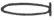
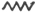
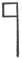
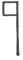
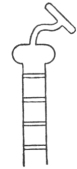
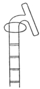
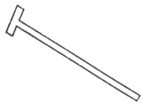

  
[Intangible Textual Heritage](../../index)  [Earth Mysteries](../index) 
[Index](index)  [Previous](hhp04)  [Next](hhp06) 

------------------------------------------------------------------------

[Buy this Book at
Amazon.com](https://www.amazon.com/exec/obidos/ASIN/0892540923/internetsacredte)

------------------------------------------------------------------------

[Buy this Book on
Kindle](https://www.amazon.com/exec/obidos/ASIN/B002KKCTTS/internetsacredte)

------------------------------------------------------------------------

  
*The House of the Hidden Places*, by W. Marsham Adams, \[1895\], at
Intangible Textual Heritage

------------------------------------------------------------------------

p. 80

### CHAPTER III.

### THE HIDDEN GOD.

DEEPLY embedded in the heart of some ancient forest, we find here and
there a massive and hoary boulder, its antiquity far exceeding that of
the venerable trees, and its whole appearance telling of a distant soil
and a by-gone day. As we sit upon the granite block, with the branches
waving high above our heads, our wonder at its presence is deepened by
the quiet scene. For countless ages that great stone has lain
motionless, lifeless, changeless, amid all the infinite movement of
changing life around it. No human power brought that huge mass where it
lies; no eye can trace the path along which it was driven by the forces

p. 81

of nature. And not until we have traced the mighty variations and
convulsions which in the recesses of time our whole globe has undergone,
not until we have looked back far beyond the earliest seed-time of the
forest, to the days when the surrounding country for hundreds of miles
formed the bottom of an immense ocean, through which the icebergs bore
the huge rocks torn from its frozen shores, can we understand the
position of that primeval stone.

Something of a similar character may not unfrequently be discerned in
regard to the religious belief and worship of a nation, when a tradition
or custom survives the convulsions and changes of the centuries, and
remains firmly embedded in the national life, though every trace of
significance is long buried in the past. Most superstitions, it is
probable, had once an intelligible meaning, even if that meaning were
founded on a mistaken belief; but such survivals are by no means due to

p. 82

superstition alone. Who, for instance, can explain the Latin titles used
for the psalms in the Prayer-book of the Church of England, without
going back more than three hundred and fifty years to the time when
England used the same language in her public worship as the rest of
Christendom? So in the Latin Mass the Kyrie Eleison betrays its
connection with the Greek; and the word Hosanna in the office for Palm
Sunday carries us back to the Hebrew.

But there is one word in particular which is employed not on any special
occasion but in every service, not once or twice but after every
petition, not as a portion of the prayer but as its summary and its
seal. If a stranger stand outside the closed doors of a church while
service is going on, there is one word, and probably but one which he
would hear distinctly repeated again and again. "Amen," "Amen," "Amen,"
that is the aspiration which time after time comes rolling forth with
the

p. 83

full strength of choir and congregation. That is the word by which the
apostle denotes the absolute nature of the Deity as compared with
created matter. "In Him all things are Amen." That is the title with
which the seer of the apocalypse invokes the advent of his Divine Master
at the conclusion of the vision: "Amen, Veni Domine Jesu." That is the
title which the Master assumed to Himself, "Amen, I say to you." And
that is the title by which the Egyptian priests of old addressed the
secret Deity—Amen, that is to say, in Egyptian, "The Hidden One."

That the existence of the one God was widely known by some classes of
men at least among the nations of antiquity there can be little doubt.
Among the Chinese, according to the most eminent authority, Dr. Legge,
the word Ti represented the same idea as we express by the word God; and
its assumption as a title by the earliest dynasty of the Emperors of
China would be quite in accordance with the ancient belief

p. 84

that the monarch ruled as the divine representative. When the disciples
of Manu approached that sage to beg for instruction in the wisdom which
afterwards formed the foundation of Indian law, they addressed him as
follows: "For thou, O lord, alone knowest the purport (or rites) and the
knowledge taught in the whole ordinance of the Self-Existent (Svayam
bhu), which is unknowable and unfathomable." And their master, in his
reply, laid down the principle of the One Uncreated God, the Giver of
Light. "The Divine Self-Existent," he said, "indiscernible, making the
elements and the rest discernible, appeared with creative force,
dispelling the darkness."

Again, in the Mahabharata, the earliest production of post-Vedic
literature, a translation of which, as well as of the laws of Manu, is
given in the magnificent series of the Sacred Books of the East, the
most enduring monument to its illustrious editor, a similar doctrine is
ascribed to Vyasa. "In the commencement

p. 85

was Brahman, without beginning or end, unborn, luminous, free from
decay, immutable, eternal, unfathomable, not to be fully known."

Equally explicit are the utterances of some of the Greek poets.

"One Self-begotten, from whom all things sprang;" is one of the lines
attributed to the famous Orpheus.

"To God all things are easy, nought impossible;" so sang Linus, a
brother of the same bright band. A fuller but not less accurate
description is given by Xenophanes—

"One God there is, greatest ’mongst gods and men;  
 Not like to mortals, or in form or thought.  
 In full he sees, he hears, in full he knows,  
 And without labour doth his mind move all."

Another poet, Cleanthes, whom St. Paul quotes in his famous speech to
the Athenians, strikes at the root of the exclusiveness arising from the
characteristic principle of ancient idolatry, that a deity listens to no
prayers except from his own descendants, by proclaiming

p. 86

that all men are the offspring of God, and that consequently the right
of prayer to Him is universal—

"O thou most glorious and immortal One,  
 O many-titled, O Omnipotent,  
 Zeus, Lord of Nature, ruling all by Law,  
 Hail! whom to worship is the right of all;  
 Since all of us are of Thee."

Even the Roman mind, dim-eyed as it was for the invisible world, was not
altogether without a glimpse of this truth, to which Horace has given
expression when speaking of the supreme deity—

"From whom none greater than himself is born;  
 Nor doth his equal, or his second, live."

But the truths which sparkle here and there in the teachings of India,
China, or of Greece, fade and vanish before the blaze of Egyptian
theosophy. Take, for example, the following extract given by Mr. Budge
from the hymn to Amen-Ra, the hidden deity, the Self-Existent Light:
"Hail to thee, Ra, Lord of

p. 87

\[paragraph continues\] Law, whose shrine
is hidden; Master of the gods, the god Chepera (Self-Existent Light) in
his boat; by the sending forth of (his) Word the gods sprang into
existence. Hail, god Atmu (Light), Maker of mortals. However many are
their forms, he causes them to live, he makes different the colour of
one man from another. He *hears the prayers* of him that is oppressed;
he is kind of heart to him that calls unto him; he delivers him that is
afraid from him that is strong of heart; he judges between the mighty
and the weak.

"O Form, One, Creator of all things. O One, Only Maker of existences.
Men came forth from his two eyes, the gods sprang into existence at the
utterance of his mouth. He maketh the green herb to make the cattle
live, and the staff of life for the (use of) man. He maketh the fish to
live in the rivers, the winged fowl in the sky; he giveth the breath of
life to the germ in the egg, he maketh birds of all kinds to live, and
likewise the reptiles

p. 88

that creep and fly, he causeth the rats to live in their holes, and the
birds that are on every green twig. Hail to thee, O maker of all these
things, thou Only One."

Nor was the unity the only truth concerning the Godhead known to the
priesthood of Egypt. Throughout the extent of the kingdom, at Thebes, at
Ombos, at Tentera, at Memphis, at Annu (or On) a Triune God—of whom some
knowledge seems to have been attained by Greece—invoked by many names,
but everywhere consisting of three persons, consubstantial and
co-eternal, was worshipped as supreme. "I am Tmu in the morning," says
the Creator, in a well-known passage, "Ra at noon, and Harmachi in the
evening;" that is to say, as the dawn, the noon, and the sunset (which
these names denote) are three several forms co-existing perpetually and
coequally in the substance of the sun, so also did the three divine
persons co-exist perpetually and co-equally in the substance of the

p. 89

\[paragraph continues\] Uncreated Light.
Thus, after declaring the sacred Unity in the most emphatic and explicit
terms, the hymn already quoted proceeds to invoke the three persons by
name, using, nevertheless, the singular pronoun for the collective
Three. "He is of many forms;" so the hymn proceeds, "O Amen, establisher
of all things, Atmu and Harmachi, all people adore thee, saying, Praise
to thee because of thy resting among us, homage to thee because thou
hast created us. All creatures say Hail to thee, and all lands praise
thee. From the height of the sky, to the breadth of the earth, and to
the depths of the sea art thou praised."

If the Divine Trinity however were the only secret of the Ritual, there
would not be so great a difficulty in following its symbols. But there
is a depth of mystery beyond, a mystery the greater because manifested
in a visible form. We read in the Ritual of an incarnate, and not only
of an incarnate, but of

p. 90

a suffering and a dying God. We are confronted with the tears of Isis,
and with the agony of Osiris—an agony so overwhelming that gods and men
and the very devils, says the Ritual, are aghast. Moreover, not only is
the twofold action of the same sacred person as man and as God
recognized, but it is embodied in an animal symbolism; just as, amongst
Christians, the symbol of the Lamb is used for the Divine Person, the
calf and the eagle for the Evangelists. Take, for example, the vignette
of the Ritual representing the resurrection of Osiris as taking place in
the presence of the Egyptian Trinity. The human form, being the highest
available, is required by the supreme Three; and in order to represent
the lower nature, or divine humanity, it is necessary to take a lower
creature whose characteristic should indicate that of the Divine Person
represented. Of such a form was the cat, whose eyes, varying in form
like the sun with the period of the

p. 91

day, imaged to the Egyptian the splendour of the light. And thus we have
the cat cutting off the head of the serpent of darkness in the presence
of the sacred Three. And that symbolism, when its original meaning was
lost, that is, when the knowledge of God was no longer retained in their
science, would naturally give rise to the foolishness of animal worship.

No less profound was the relation between the Creator and His works, as
intimated in their well-known symbol for created life, called the
Ank [\*](#fn_15) or Sacred Mirror, wherein every
great deity contemplates perpetually his own image; but which is rarely
grasped in the hand of any except Amen. But how should the universe be
represented by a mirror, and, if it be, why should the heavenly powers
behold themselves

p. 92

reflected in it? Since Egypt gives only the symbol, but betrays no clue
to the secret, the great Master of mediæval philosophy shall declare to
us that profound relation, which alters not with the passing of ages.
According to the teaching of Aquinas, the universe exists in a twofold
manner, first ideally in the mind of God, and secondly materially
externally to him, so that in creation the Almighty contemplates His own
mind as in a mirror. As a dramatist before he gives living expression to
his characters conceives in his own mind their forms, their
countenances, their actions, passions, and conditions of life, with all
the details of their environment; and as his work reflects the image of
the author's mind, so in the theosophy of Egypt did the entire cosmos,
embracing all space, all time, and all orders of created being, reflect
a single thought in the mind of the Creator.

Man himself therefore had a "double" or

p. 93

counterpart in the Divine Idea, a sacred "type" of which the festival is
celebrated in the Ritual, and which is masonically expressed within the
niche of the Chamber of New Birth. Hence it was that the ideal
counterpart possessed such divine sanctity, and the monarch offered
sacrifice to his own double. For in the intelligible, no less than in
the mechanical world, the expressed form is ever the counterpart of the
impressed force; while conversely, in the mechanical world, the material
form is due to an immaterial motive-power. For can any mathematician
define the very nature of force, otherwise than as that which sets
matter in motion? But if force be that which sets matter in motion, it
cannot itself be material, if the fundamental law of motion be true that
matter at rest remains at rest. Unless, therefore, the motions of the
material universe—and it is of the motions of the heavenly bodies, and
not merely of their existence that the Ritual continually speaks—be the
result of an

p. 94

immaterial force impressing itself upon matter, our whole conception of
dynamical science is wrong from the beginning. And reason itself becomes
the mockery of reason; for there is not an achievement of the engineer,
not a prediction of the astronomer, not an application of the
mathematician, which does not prove the truth of a principle radically
false. So, on the other hand, no philosopher can long maintain any
substantiality as underlying the phenomena around him, who does not
recognize them as the expression of creative thought impressing itself
upon created matter; nor can poet or artist present new types of
character unless he is gifted with the supreme power of the imagination,
the faculty of perceiving and defining the unexhausted forms of human
personality potentially existing in the sole creative mind. For genius
is the power of giving form to potentialities.

Pursue Egyptian theosophy in which direction we may, the things of time
speak ever of

p. 95

eternity, the self-existent Deity is always secretly reflected in his
creatures. Accordingly each phenomenon of nature conveyed to them a
corresponding manifestation of the divine personality, and according to
the Ritual it was the Deity indwelling in the soul, which confers upon
the man the power of perceiving these relations. "I am perception," we
read, "the imperishable soul." In the noonday glow of the sun they
beheld the splendour of Ra; in his setting the death of Osiris; in the
new dawn his resurrection as the incarnate Horus; in the glowing fire
the creator-spirit, Ptah; in the harmonious proportions of the universe
the Eternal Wisdom, Thoth, "the mind and will of God;" in the starry
firmament crowned by Alcyone and the Pleiades (the sacred bull and
attendant cows) the ineffable beauty of Athor, [\*](#fn_16) the living tabernacle of the sacred
Light.

p. 96

Bearing now carefully in mind the extreme complexity of this secret
parallelism, and the strict analogy between the visible and invisible
worlds which constitutes the basis of the political organism, we have
little difficulty in perceiving the importance of the function in regard
to the Hidden God, discharged by the House of Osiris. Viewed
independently, the great temples of Egypt present to us a heterogeneous
collection of miscellaneous deities, amongst whom now the sun, now the
moon, now the earth, now the river, now the orbit, now the horizon, is
predominant without any apparent reason or purpose; while the Ritual
breaks up into a chaos of broken images and grotesque distortions of
astronomical conceptions. Seen by the inner light of the great house,
where the Path of the Hidden Places reflects the river of celestial
light, the great temple system of Egypt reveals itself as an organic
whole with a simple majesty not unworthy of its unrivalled shrines. For
since

p. 97

the chief localities on the material Nile represented the different
stages on the Path of Light, so do the various worships naturally arise
of the spirits exercising the corresponding functions—somewhat as among
ourselves the water of the Jordan is peculiarly consecrated to the rite
of baptism. Thus with regard to Annu, the divine birthplace, reference
is constantly made to the new birth; Thebes is peculiarly connected with
Amen, the Hidden God; while at Memphis, the key of the organism was the
House of Osiris itself. And a knowledge of the spirits exercising
special powers in these places, formed a conspicuous portion of the
Ritual in the preparation of the Initiate for enduring the ordeal.

Had the case been otherwise, indeed; had the real objects of Egyptian
worship been a mass of deities local and unrelated; then inasmuch as the
form of government was well nigh a pure theocracy, the authority of the
monarch being derived not merely from his

p. 98

descent but from his personal union with Ra, and inasmuch as heresy was
punished with excommunication and even, as M. Maspéro states, with death
by fire, it would have been inevitable that each successive dynasty, as
it proceeded now from This, now from Memphis, now from Thebes, now from
Sais, should have torn up by the roots the religion established by its
predecessors; and the annals of Egypt would have been as full of
religious discord and confusion as those of our own Tudor princes.
History however has produced, so far, but one instance of an endeavour
on the part of the king to introduce novelty into the religion. Amenoph
IV., who married a foreign princess, adopted the title of
Khu-en-Aten, [\*](#fn_17)

p. 99

or "Illuminate of the Disc"—a title which, as we may see, clearly
outrages the Ritual which we have seen embodied in the masonry. For as
the disc of the sun is but its visible surface, so the "disc" of the
tomb was but its entrance gate which was lifted by Shu (the Light) "when
the sun sets from the world of life;" and to place the illumination
therefore at that point was to ignore all the grades of the Postulant,
the Initiate, and the Adept, and to destroy the most essential
conditions of illumination. In the same way the expression "Living in
Truth," which, as Mr. Petrie points out, was constantly employed by
Khuenaten,

p. 100

indicates, when applied to the disc, the same degraded and idolatrous
conception, since it substitutes a material and visible object for that
Truth which in the older worship was spiritual, interior, and unseen.
And thus, under the succeeding monarch, while the word Aten was
preserved, the offending title, Khu, was sedulously obliterated.

In the masonic record therefore, the House of Osiris, we have a key to
the whole politico-religious constitution of the country—a key which
none could imitate, none could alter, none destroy; which no man could
comprehend unless initiated, nor any forget or mistake, who had once
received illumination. Accordingly, in that masonry we find the
originals of many of the mystic symbols, whereby the priests so
expressed the divine and the royal authority as to be intelligible to
those and those alone who had been initiated masonically. Thus, if we
draw the groove of the orbit in the Chamber of the Splendour, with

p. 101

\[paragraph continues\] "The Wall of
Earth" at the Northern end separating the Orbit from the Shadow, we
shall have the hieroglyph for the orbit "Sennen," which is identical
with the cartouche,  
surrounding the titles of the monarch. That familiar symbol, by aid of
which Champollion first divined the secret of the writing, is therefore
nothing else than a masonic sign, signifying that not the circumference,
but the immensely more extensive orbit of the earth is the limit of the
royal authority; and indicating thereby (since the orbit implies renewal
from age to age) its endurance no less than its universality. Again, if
we represent the course of the celestial Nile by the rays traced in the
roof of the same chamber, 
 we have the hieroglyph of the river, while the
straight floor-line descending from the throne gives its hieratic
equivalent. So if we draw the

<table data-border="0">
<colgroup>
<col style="width: 50%" />
<col style="width: 50%" />
</colgroup>
<tbody>
<tr class="odd">
<td data-valign="top" width="327">
  
Throne and axis.
</td>
<td data-valign="top" width="327">
  
Nuter Holy.
</td>
</tr>
</tbody>
</table>

p. 102

great throne in the Hall of Truth with the central line of the light,
running down to depths of the rock on which it is built, we obtain the
hieroglyph denoting holiness; and if we add to this the lower portion of
the building, the territory of initiation, there results the hieroglyph
for the territory of the holy dead.

   
The Place of the Holy Dead.

Again, suppose that we represent the same place interiorly by drawing
the Well, where the re-born soul is reunited to the postulant, together
with the line where the interior

   
Well of Life, Place of Initiation.

masonry is bounded by the natural rock through which entrance or
initiation into the interior masonry is obtained from below—the

p. 103

entrance impassable by the postulant until the soul is restored to him.
Then, if we indicate the image of the Well itself, shining in its own
living but invisible waters, as seen by the soul from above, just as the
Creator looks down on His own image in the universe, we obtain the
symbol of the "Ank," or mirror

   
Ank, Symbol of Created Life.

of life. So, if we represent the descent traversed by the Initiate from
the Head of the Well to the Opening into the Chamber

<table data-border="0">
<colgroup>
<col style="width: 50%" />
<col style="width: 50%" />
</colgroup>
<tbody>
<tr class="odd">
<td data-valign="top" width="327">
  
Sceptre of Ptah, Spirit of Divine Fire.
</td>
<td data-valign="top" width="327">
  
Opening from Well of Life to Chamber of Divine Fire.
</td>
</tr>
</tbody>
</table>

of the Fiery Ordeal, we have the Sceptre of Ptah, the Spirit of Divine
Fire. And, if

p. 104

we represent the passage of the horizon together with the masonry of the
entrance, we

<table data-border="0">
<colgroup>
<col style="width: 50%" />
<col style="width: 50%" />
</colgroup>
<tbody>
<tr class="odd">
<td data-valign="top" width="327">
  
Passage of Pole-star.
</td>
<td data-valign="top" width="327">
  
Sceptre of Anup.
</td>
</tr>
</tbody>
</table>

have the sceptre of Anup, the guide of the soul. Sometimes the whole
hieroglyphic name receives illustration at least, if not origination,
from the same pyramidal source; as, for instance, in the name of Hapi,
the radiant guardian of the Nile. For if we draw the Grand Arch of the
highest chamber, imaging the Grand Arch of the universe, the seat of
that luminous spirit, we shall produce the initial of that word. And if
we add the Entrance Gate (itself surmounted by the Double Arch),
together with the scored line in the Passage of the Horizon, pointing
downward to the foundation of the rock, we shall

p. 105

have the complete set of hieroglyphs which compose his name,   and thus masonically indicate
his office as protector of the rock, the mouth, and the fount of the
River of Light.

But by far the most important expression of these truths is contained in
the kalendar, or recurrent series of festivals, which reflected on earth
the rejoicings of heaven; and a full understanding of which was one of
the glories reserved in the Ritual for the Illuminate. By means of that
kalendar the "Mystery-Teachers of the Heavens" co-ordinated not only the
political but the social life of the nation with the theosophy of The
Light, while through its masonic expression the divine manifestations
and the personal attributes of the Hidden Deity were at once
communicated to the instructed and protected from the profane. To their
sense indeed of the divine personality, far more probably than to any
artificial pretension to a supposed exclusiveness which

p. 106

does not seem to have had any real existence, may be ascribed the
mystery enshrouding their religion. For mystery is to God only what
privacy is to man, our sense of which deepens with deepening intimacy.
And though three hundred years of continuous wrangling over the secret
truths which most profoundly affect the heart and mind have gone far to
coarsen and deaden our spiritual sense, the soul still resents, as the
most unpardonable offence, the profanation of a vulgar touch. For
whether we acknowledge it or not, the springs of our entire existence
are hidden. From the darkness of the womb to the darkness of the tomb,
the source of our every action is veiled from us. Mystery is the
beginning; mystery is the ending; mystery is the whole body of our life.
We cannot breathe, nor sleep, nor eat, nor move, far less think or
speak, without exercising powers which to us are inconceivable, by means
of processes which to us are inscrutable. Who is so ignorant as not to

p. 107

know these things; who so learned as to make them clear?

Most powerful and most hidden of all is the passion which grows the more
reticent in proportion as it is more enduring, the passion which
dominates at once the senses and the spirit; the master-mystery of Love.
But Love himself was none other than the hidden God. In Greece, where
some rays of Egyptian wisdom penetrated with a brightness denied to more
distant lands, this truth was not unknown. Love was the third in the
Trinity of Hesiod. And in Parmenides we read how "strife has entered
into the deepest places; but in the centre Love stands calm." But in the
teaching of Egypt, the Creator's love so conspicuous in the sublime hymn
already quoted, is the motive power of the universe, the secret energy
of the Light. "I am the Inundation," says the Creator in the Ritual—the
fulness of the Torrent of Life. And again, "I am the Fount of Joy," the

p. 108

inexhaustible source of happiness to the soul. Most striking too is the
allusion which occurs in another hymn to Amen, where it speaks of the
crown of illumination, or "Atf" crown of

   
“Atf,” Crown of Supreme Light, Crown of Illuminate in Burning Circle of
the Orbit.

the monarchs, fashioned after the form of the light which sometimes
crowns the Zodiac, the Burning Circle of supreme heaven, before the

   
Light of Supreme Heaven, Crown of Burning Circle of Zodiac.

summer dawn. That crown, we learn from the Ritual, was placed upon the
head of the illuminate on his accomplishing the "passage of the sun," in
the ascent of "the orbit," and the hymn proclaims that "North and South
of that crown

p. 109

is Love." So when the Illuminate in the masonic Light after ascending
the Chamber of the Orbit stood before the throne at its higher end,
Northward and Southward of him was Love—to the Northward, the Love
manifested in the starry guide which led him to the knowledge of truth
in its splendour, and before him the Love concealed in the heights of
heaven, the Secret Places of the Hidden God.

------------------------------------------------------------------------

### Footnotes

[91:\*](hhp05.htm#fr_15) Another signification,
that of a fisherman's knot, has of late been adopted by some
authorities; but the shape of the knot differs essentially from that of
the Ank, the head of the latter being upright upon the stem. And again,
how should a fisherman's knot stand upright on the knees of the gods?
and, if it could, why should it?

[95:\*](hhp05.htm#fr_16) Properly Hat-hor, The
House of Horus, the Risen God of Light.

[98:\*](hhp05.htm#fr_17) I have adopted the
translation of the word Khou, given by M. Deveria in the passage above
quoted, the hieroglyphs being identical; but the name, according to Mr.
Flinders Petrie, is more correctly pronounced Akhenaten. That diligent
explorer, in his interesting work on Tel-el-Amarna, the site of the
palace built by Khuenaten, on the borders of Middle and Upper Egypt, has
abundantly illustrated the theory that the monarch's object p. 99was to substitute the solar disc (Aten) as an
object of worship for the personal Deity—Ra, the Hidden God and
Untreated Light, Amen—previously worshipped under various symbols. This
attempt, as well as the distinction between the disc and the rays—which
he also considers Khuenaten to have introduced—Mr. Petrie characterizes
as a striking advance in philosophical truth: though it is difficult to
understand in what way the adoration of a material object in place of a
Personal and Unseen God can be philosophically regarded as an advance.

------------------------------------------------------------------------

[Next: Chapter IV. The Mystery of the Heavens](hhp06)

