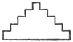
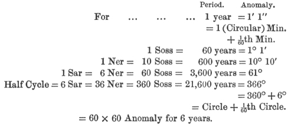

  
[Intangible Textual Heritage](../../index)  [Earth Mysteries](../index.md) 
[Index](index)  [Previous](hhp06)  [Next](hhp08.md) 

------------------------------------------------------------------------

[Buy this Book at
Amazon.com](https://www.amazon.com/exec/obidos/ASIN/0892540923/internetsacredte.md)

------------------------------------------------------------------------

[Buy this Book on
Kindle](https://www.amazon.com/exec/obidos/ASIN/B002KKCTTS/internetsacredte.md)

------------------------------------------------------------------------

  
*The House of the Hidden Places*, by W. Marsham Adams, \[1895\], at
Intangible Textual Heritage

------------------------------------------------------------------------

p. 147

### CHAPTER V.

### THE MYSTERY OF THE DEPTHS.

LIGHT is the first principle of created life. There is no life without
growth; there is no growth without light. Colour, perfume, savour, every
varied object of sense vanishes if light be absent. Each beam is a
separate celestial gift, direct from the hand of the Creator; as in the
bas-relief on the tomb at Thebes, discovered by Mr. Stuart, where the
diverging rays form a pyramid of light, and to each ray is attached a
hand of blessing.

Universal too, as is the necessity for light in living nature, equally
extended is its manifestation in the form of motion. Wherever

p. 148

life exists, in man or bird, or beast or fish, there also is that power
which is denied to inanimate matter—the power to originate motion. To
live and move and have our being are three states inseparably connected
with each other. Mathematician and poet alike acknowledge the
universality of motion in living form. "Motion, fount of beauty,"
exclaims Pindar in one of his loftiest odes. "All nature is in motion,"
says Professor Price in his lucid treatise on infinitesimals. So too,
the unfailing harmonies of the heavenly bodies express themselves in the
periods of their orbits. And through the correlations of those luminous
circuits, as through a veil of glory, the correlations of interior truth
were shadowed forth by the Egyptian "Mystery-Teachers of the Depths."
Depth beyond depth, space beyond space, height beyond height, from the
company of planets around our sun, to where the "clusters of countless
stars are but a faint nebulous gleam," Light is everywhere the

p. 149

\[paragraph continues\] Omnipotent
Creator, the laws of Light the expression of infallible truth. [\*](#fn_22.md)

But how to seize with material grasp the intellectual relations of the
most ethereal element known to man? How imprison in stable form the
flashes of the fiery spark as it darts with inconceivable speed from
space to furthest space? How render palpable to the direct touch the
distant courses of those flying orbs? In a word, how shall we build up
the manifestation of Light, and find masonic expressions for the Mystery
of the Depths? Light itself gives us a reply. For if, as in the
bas-relief at Thebes, the diverging flood

p. 150

of rays be represented as it pours down at noon on the day of summer
solstice, the opening day of the Egyptian year, we shall have one face
of the Pyramid of Light. Suppose now that a quadrangular pyramid be
erected with four such sides facing respectively the cardinal points of
the heavens. Then since each revolution of the earth is completed by one
quarter of a rotation later than the preceding, it follows that every
fourth or grand year the same face will be turned towards the sun when
the revolution of the earth is accomplished; and thus the Egyptian Grand
Cycle (of four years) will be masonically expressed. Just such a form is
found in the quadrangular Pyramid of Light, its sides so oriented as to
have originally faced the cardinal points, and its summit so truncated
as to permit the sun on one day in the year to rest upon it "with all
its rays," so that the building "devours its own shadow."

p. 151

The general form determined, what proportions shall the dimensions
assume, or in other words, at what angle shall the sides converge
towards the invisible vertex? The earth in her orbit gives reply. For as
that planet moves around the sun in an (approximately) circular path,
while each ray travels towards it in a direct line, the relation between
the illuminating force and the illuminated body may be expressed by the
relation between the radius and the circumference of a circle. But this
relation is such that the altitude of a pyramid when bearing the same
ratio to its base-circuit subtends an angle of about 51° 50´. And that
is the Angle of Elevation of the Grand Pyramid. Nor is this most
important, and indeed dominating, measure due to accident; since the
angle in question is the most marked, and almost the only feature, which
the lesser and later Pyramids share with the Pyramid of Light, so that
it forms the masonic sign whereby the inferior buildings

p. 152

tacitly asserted their kinship with the Great House.

Although however, these general aspects of the radiance suffice to
determine the general aspect of the building, yet a closer investigation
of the light will disclose a more intimate relation. For since our
atmosphere may be conceived as divided into successive layers of air,
increasing in density as they approach the earth, each ray as it travels
will be slightly deflected, or refracted, as it passes from a finer to a
denser ring, the refraction being greatest when the body is on the
horizon, and imperceptible when it is near the zenith. Conversely, if on
any given day the position of the sun be observed at equal intervals
from rising to noon, and from noon to sunset, the apparent place of the
sun will, owing to refraction, be slightly different from its true
position at any

 

p. 153

observation; and a diagram representing their mutual relations will
offer the appearance of a house having many stories, with a small
platform at the summit, since near the zenith the true and apparent
positions are identical (and the only motion is that of transit)—that is
to say, we shall have the appearance of the Grand Pyramid when the
casing-stones are removed.

If then, on the first day of the (Egyptian) new year—when the sun is
about fourteen hours visible above the horizon at Memphis—an observation
be taken every two minutes (four observations for the period occupied by
any ray in reaching the earth from the sun) there will be altogether
about four hundred and forty observations, making two hundred and twenty
courses of ascent and descent, of which a certain number will be wanting
at the top since at the zenith there is no refraction. But this is
precisely the case in the Pyramid of Light; the number of existing
courses being

p. 154

about two hundred, and the number required to complete it reckoned at
about twenty more. Further, since the moon in every two minutes of time
completes a (circular) minute of her circuit relatively to the sun, and
since at the commencement of every Sothiac cycle she commences a new
lunation and comes (invisibly) to the meridian at the same time with the
sun at noon, it follows that these unit-intervals of observation
correspond with the minute-intervals of her motion; and each course of
the Grand Pyramid corresponds to the change in the altitude of the sun
for one circular minute of the moon's motion relatively to that body.

The true and apparent forms of the Grand Pyramid being thus determined
by the true and apparent motions of light, we have now to inquire with
what scale we are to build up the chambers of the house. The rolling
earth once more suggests the standard. The cosmic unit of space—the
Sceptre of Anup, the Guide

p. 155

of the Horizon of Heaven—must be clearly defined, and incapable of
confusion; it must be self-evolved, and yet immutable; it must be within
man's power to compass, but not within his grasp to alter. Now these
conditions are fulfilled by one line, and one only known to man, the
polar axis of the earth—the line, that is to say, about which takes
place the earth's daily rotation, while itself performs the annual
circuit around the sun. Let that line be carried far as the eye can
follow or thought can reach, the depths through which it pierces remain
for us for ever at rest. That is the line which directs the axis of the
Sacred Horizon of the Point of Equinox, and which indicated to the mind
of Egypt the entrance path for the holy departed as they passed from the
created to the Uncreated Light. A beautiful allusion is made in the
Ritual to the illuminative action of the sun in reference to this double
motion of the axis, as the earth, the vessel of God, performs her daily
and

p. 156

annual course in the heavens. For we read there how the holy departed
"has appeared in the Bark of Ra in the course of every day;" and how
Thoth, the Divine Wisdom, "clothes the spirits of the justified a
million times in a garment of true linen;" of that substance, that is to
say, which by its purity and brilliancy reminds us of the mantle woven
out of rays of light wherewith the sun enwraps the earth afresh each day
she rotates before him, just as the soul of man is invested with new
radiance each time that he turns to the presence of his Creator.

How then shall we avail ourselves of this mighty measure, this rule of
light and standard of space? This time the building itself answers
through its familiar title. According to Dr. Brugsch, the term Pir-am-us
in Egyptian signifies the EDGE; and on examining the base-circuit of the
building, we find it to be composed of casing-stones with a bevelled
horizontal edge, so exquisitely finished that

p. 157

according to Mr. Flinders Petrie, it is equal "to the finest work of the
optician." On the occasion of the visit of the Empress Eugénie to Egypt,
in 1869, one of these casing-stones was measured *in situ* by Mr. W.
Dixon, and found to contain just 25.025 British inches. But the relation
of this length to the polar radius (or semi-axis) of the earth is of the
very last importance in universal measurement. Several years ago Sir
John Herschel pointed out that our inch is contained in the earth's
polar radius just 250,250,000 times; so that if that unit be increased
by its thousandth part (less than the fineness of the finest hair) it
will be contained in the polar radius just two hundred and fifty million
times. Since therefore this stone contains twenty-five inches so
increased, it measures the earth's polar radius exactly ten million
times; and as the Egyptians were certainly familiar with the decimal
system, expressing units, tens, hundreds, thousands, and millions by
distinct hieroglyphs, this stone

p. 158

in the base circuit of the Great House supplies a simple masonic unit of
cosmic length, a standard of universal measurement.

Were this ratio an isolated instance, some question might not
unnaturally arise as to the accidental nature of the connection; but the
intention of the architect is strongly confirmed by the kindred
discovery due to Mr. Flinders Petrie. That acute observer has pointed
out that the length of the raised pavement was a simple measure
(one-twentieth) of a geographical mile. And since a geographical mile is
a measure of the earth's circumference at the Equator, a knowledge of it
implies a knowledge of the measurement of the polar radius.

Striking however as is the ratio which this stone bears to the cosmic
standard, its relation to the Pyramidal Edge, of which it forms a part,
is no less prolific of universal results. For, taking as the length of
that base-line, [\*](#fn_23.md)

p. 159

the average of the results obtained by the principal surveys executed
since the great Napoleon opened the dull eyes of Europe to the
inexhaustible treasures of ancient Egypt, we find that the casing-stone
is contained in the line so measured just 365.25 times, and consequently
in the entire circuit (4 x 365¼) 1461 times. Hence, as the form suggests
the

p. 160

\[paragraph continues\] Grand Cycle, so
also does the measure of the base-circuit; the number of times the
cosmic unit is repeated in that circuit, defining the number of solar
days in the Grand Cycle, and consequently also the number of the solar
years in the cycle of Sothis.

It seems, therefore, not unreasonable to conceive that before the
casing-stones finally shut up the secret, the relations of the sun and
moon to the position of Sothis and of the pole-star should have been
correlated with the courses of the Pyramid in the manner above
described; and thus a starting-point for all the motions of the earth,
whether in relation to the moon, the sun, the equinox, or the stars,
have been registered unalterably in the masonic light.

To measure the motions of the earth however is the commencement, but
only the commencement, of the universal scale. That which we need for
the Mystery of the Depths is nothing less than the span of solar or

p. 161

measurable space. In other words, we require to define the extreme
limits on either hand within which no fount of original light is found
except our own sun, since the distances of the stars are beyond accurate
measurement. But the distance of the limiting point of solar or
measurable space, or rather the radius of the limiting horizon (since
the distance will be the same in every direction) is about twenty-five
hundred million times the length of the earth's polar axis; so that that
axis is contained in the radius of measurable space two hundred and
fifty times as often as itself contains the edge of the casing-stone.
Now, if that casing-stone be divided into twenty-five equal parts, each
of such parts will, as we have seen, contain our own inch increased by
its thousandth part. This unit, therefore, which we may call the polar
inch, measures not only the axis of the earth, but of the depths of
solar or measurable space, being contained in the former two hundred and
fifty

p. 162

million times, and in the latter two hundred and fifty thousand billion
times. But in that ancient chapter of the Ritual (lxiv.) which claims to
have been revealed in the days of the IVth dynasty, we read that the
Creator, when revealing Himself to the new-born soul as the Measurer of
space, employs this very ratio as standard. "'I who know the Depths' is
my Name," so runs the text of this sublime chapter;" I make the cycles
of the shining millions of years; and billions are My
measurement." [\*](#fn_24.md)

The mention of these cycles of the shining years suggests a principle of
singular beauty, as the key to the architectural measures of ancient
Egypt. Among the many valuable results due to the industry of Mr.
Flinders Petrie is a collection of cubits of various lengths, employed
by the architects of the

p. 163

IVth and XIth dynasties. These architectural units
are very numerous, and, unless referred to cosmic principles, quite
miscellaneous, having no apparent co-ordination either among themselves
or with anything else. When however taking as our unit the polar
inch, [\*](#fn_25.md) we compare them with the
measures of light, as expressed in the shining circuits and radii of the
celestial periods—remembering always that the radii and semi-radii of
the cycles of years are both consonant with the angular construction of
the Pyramid and are secretly involved in the analogy of Illumination—we
find a most remarkable correspondence in measure after measure, not
absolute indeed, but different only by decimals of an inch.

Take for example, the number of polar

p. 164

inches into which the casing-stone is divided, when considered as a
measure of space, viz. twenty-five; a close approximation to which is
found in two specimens [\*](#fn_26.md) belonging to
the IVth dynasty, which were discovered at Ghizeh—that is to
say, which were employed in the neighbourhood of the Grand Pyramid about
the time of its erection. Again, taking as unit the semi-radius of the
cycle of Equinox, the radius of which cycle is about 4122 years, and
expressing an inch to a century, the half of it gives us the cubit of
20.6 inches; and this measure is the more common form of the Egyptian
cubit, the standard employed for the sacred "Tat," or Nilometer, which
measured the waters of life, the symbol regarded as the

p. 165

highest expression of sanctity, and the final ornament placed upon the
holy dead. From the moon also we (approximately) obtain two standards of
Egyptian measure. For the number of days in a lunar month gives closely,
at an inch for a day, the 29.3 inch cubit of the IVth
dynasty. And, at an inch for a year, the number of years (about 18.6) in
the cycle of the lunar nodes—(that is, the interval which elapses
between two successive crossings of the equinoctial plane by the moon at
precisely the same point of her orbit)—yields (very nearly) the 18.7
inch cubit of the XIIth dynasty. And, once more, since the
orbit of the earth is not strictly a circle, but an ellipse with the sun
in one focus, there will always be one point in the orbit which will be
in "perihelion," that is, nearer the sun than any other. And this point
is not stationary, but makes a circuit of the earth's orbit in about
114,000 years; whereof the half-circuit gives us the fifty-seven inch
cubit

p. 166

of the XIth dynasty (at an inch to ten thousand years), and
the quarter radius the forty-five inch cubit of the IVth
dynasty (at an inch to a thousand years). It would seem therefore, that
a table of the cubits employed by the architects of those early times
would represent a general system of cosmic measures, the scale being
marked off upon the axis of the earth, the sole standard of immutable
space, and the ratios of the different cubits being proportional to the
immutable time-periods of the heavenly bodies. And thus, when the film
is brushed away which the dust of ages has cast over these relics of
antique science, their aspect remains no longer lifeless and repulsive;
but we recognize in them the glowing insignia of universal truth, the
gems from the azure depths, sparkling with the lustre of intrinsic
light.

No sooner do we apply this key to the Book of the Master, than a series
of concealed significations begins to unclose. The famous

p. 167

\[paragraph continues\] Urœus, or symbol
of the snake—connected in some not very definite manner with solar
phenomena—has always been intimately associated with the royalty of
Egypt. But it appears to have escaped attention that in the Ritual are
to be found several serpentine forms of various lengths, and—what is
most striking in itself but easily explained by the results already
attained,—that when those several lengths are expressed in inches, they
prove to be proportional to the measures of the various serpentine
curves traced by the motions of the earth and moon. For instance, in
chapter cxxx., we read of "a snake seventy cubits in his coil." But
taking the well-known cubit of 20.6 inches and repeating it seventy
times, we obtain one thousand four hundred and forty-two inches; which
is proportional (within the seven hundredth part) to the number of
minutes of time (24 × 60) in the average daily rotation of the Equator
or coil of the snake; so that it expresses our own division of the
heavens into

p. 168

twenty-four hour-circles, each divided again into sixty equal parts or
minutes of time; both which measures, we have already seen, were
familiar to the Egyptians. Moreover the number of the sun's rotations
about his own axis is, approximately, one hundred and forty-four in a
period of ten years, so that the snake expresses an axial motion common
both to the sun and its satellite: and appears therefore to be "the
chief Urœus, gleaming and guiding millions of years," of which we read
in chapter xxxiv. On the other hand, in another passage of the chapter
previously mentioned, an extent of seven cubits gives the length—not of
the snake's coil but—of his back: and this length (one hundred and
forty-four inches) just gives the back of the tropical snake, or spiral,
that is, the distance of the sun at solstice from the Equator, at that
epoch about twenty-four degrees, or one hundred and forty-four decades
of circular minutes. Other examples of a more complex character might be
adduced;

p. 169

but these may be sufficient to show that in the inch we possess a clue
to the secret significance of numerous symbols; and that for very reason
it was not openly set forth as the standard, but its place was supplied
by the cubit, which betrays no meaning except to one already so far
initiated in the Mysteries of the Depths.

Turning now to the Pyramid of Light, we find the same principle
conspicuous throughout the building; the lengths of its various passages
and chambers, when expressed in polar inches, being apparently
proportional to the radii (or semi-radii) of the celestial periods
corresponding respectively to the stages in the progress of the
departed. And so strongly marked is the prevalence of this principle,
that while a mere knowledge of the measures, however exact, suggests
nothing of the spiritual meaning, the insight which we have already
attained into the co-ordination of the building with the Ritual enables
us to determine for

p. 170

ourselves the dimensions of many of the parts. For throughout the
teaching of Egypt progress in Light is effected by increased instruction
and experience in Truth; and in the Wisdom of that ancient country, the
measures of Truth were the years of the Most High.

At the very point of entrance, indicating the sacred horizon of the
pole-star (as the hieroglyph of the star signifies the invisible world),
we find that a consideration of the particular position occupied by the
star, when in conjunction, so to speak, with the Pyramid, widens and
elevates our view from an earthly to a celestial plane. For though to a
dweller on our globe the great plane of reference is the plane passing
through the celestial poles and containing the horizon of the point of
Equinox; yet when we proceed to regard our companion orbs, circling
around the same parent luminary, and when we take into account the
influence which those members of the same luminous family exert upon
each

p. 171

other, we are compelled to recognize what is called the Invariable Plane
of the Planetary System, the plane, that is to say, about which, as La
Place demonstrates, certain highly important relations between the
masses and the motions of the planets are always fulfilled. Now this
plane has never a greater inclination than about 3° 6´ to the apparent
ecliptic, that is, the plane of the orbit of the earth. But that arc (3°
6´) measures within a few minutes the distance of the pole from the
pole-star when in conjunction, so to speak, with the Grand Pyramid. When
therefore the pole-star shines down the entrance passage, its position
in regard to the pole (due allowance being made for corrections),
defines the limiting position of the invariable plane to the plane of
the orbit.

Similarly in regard to the inconceivably slow variation [\*](#fn_27.md) in the inclination of the axis

p. 172

to the ecliptic, a variation which, while never exceeding 2½° on either
side, requires no less than thirty thousand years to accomplish. And
from this majestic depression and elevation of the polar axis in its
course around the sun—the inexpressibly stately obeisance made by the
sceptre of Anup before the throne of Ra—we may determine relatively to
each other the inclinations of the interior passages. The difference
between the limits of the solstices (calculated at about 2° 22´) gives
the difference between the inclination of the roof and of the floor-line
of the Grand Gallery, or Chamber of the Orbit, while the inclination of
that roof to the level passage leading to the Lunar Chamber of New Birth
(28° 30´) defines, as we have already seen, the limiting inclination of
the moon to the Equator. The variation during one Sothiac cycle
corresponds with the difference between the floor-lines of the upper and
lower galleries. And if we may place the completion of the building at
B.C. 3732 (only

p. 173

a generation earlier than the estimate of Dr. Brugsch, which is not
designed to be exact), then, since it occupied thirty years building,
the number of years from the foundation of the Kalendar to foundation of
Pyramid will be about four hundred and eighty-two; that is, will
correspond with the number of inches between the entrance and the scored
line which points to the foundation; while the interval between the
foundation of the Kalendar and the co-ordination of the Pyramid with the
pole-star (viz. about eight hundred years), the difference during the
inclination (about 4´), corresponds closely with the difference between
the inclinations of the Lower Ascending Gallery and the Passage of the
Pole-star: so that to such as understood the meaning of that
inclination, the periods of the star's co-ordination with the entrance
would be foreknown. If this were the principle employed—and considering
the difficulty of obtaining exact measures, the points of

p. 174

correspondence are surprisingly close—none could understand the relation
of the star to the building without first understanding the masonic
relation embodied in the edifice, between the standard of space, as
represented in the entrance passage, and the solar throne at the head of
the Grand Gallery or Chamber of the Orbit. Nor could any one be
instructed in that secret by the Master without acquiring masonic
evidence of its truth, in the Path of the Horizon of Heaven, and its
orientation with the hidden interior—the beginning and the ending of the
Ritual of Light.

Penetrating now to the innermost recesses of the Hidden Places, let us
review the celestial significance which we have attached to the various
chambers, and (remembering always that we are dealing with
approximations) let us note the proportion of their measures to the
corresponding celestial periods; the celestial unit varying in each case
according to the nature of the celestial cycle (and demanding

p. 175

in each case therefore a knowledge of the connection of the Ritual with
the particular chamber); while the masonic unit throughout is the polar
inch, the twenty-fifth part of the Pir-am-us, or edge of the
base-circuit casing-stone, the twenty-fifth ten-millionth part of the
polar radius of the earth, and the twenty-fifth thousand-billionth part
of the radius of solar space. For "millions and billions are the measure
of things."

Commencing with the highest and most secret source of life and light,
the Eternal and Self-Begotten Energy of the Hidden God, we find it
illustrated in the never-ceasing rotation of the sun about its own axis,
the energy of which we know not the origin, and to which we attribute
the birth of the planets. Of such rotations about two thousand five
hundred and twenty-five are performed by the sun, while the earth is
performing one hundred thousand similar rotations, and that number gives
the number of polar inches in the height

p. 176

of the extreme point of the huge granite triangle [\*](#fn_28.md) which dominates the secret places of the
interior. Descending thence to the King's Chamber, where the birth of
the Eternal Day is celebrated in the open tomb of Osiris, we have
recourse to the measure of light, not in its interior energy, but in its
emission; and find that the cubit proportional to the radius of the
cycle of equal Light and Darkness (20.6 inches) is a measure of that
chamber, as it is also of the Chamber of the New Birth of the Soul.

As we proceed towards the outer portion, the manifestation of the
splendour defines the proportions of the Chamber of the Orbit, the Upper
Hall of Truth, where so many lunar and solar phenomena have already been
noticed. At the head of that chamber is the great

p. 177

throne, "the stone of God," to use the expression of the Ritual,
surrounded on every hand by masonified radiance. The seat of that throne
(about 61.3 inches) measures the number of times the radius of the earth
is contained in the radius of the orbit of the moon; while its height is
proportioned to the number of decades in the orbit of the Egyptian year,
the five divine birthdays being expressed in the Chamber of New Birth
immediately beneath. Above that throne at the higher end of the chamber
rises the seven-pointed arch of the planetary heavens, its boundary
lines defining the flaming belt of the zodiac. And from its foot runs
downward the floor-line ascended by the Illuminate, and measured by the
radius of the cycle of perihelion, or Circle of Nearest Approach, formed
by "the Assembly of Ministers of Truth," but along the midst of which
none might pass save the Illuminate alone. And if we may estimate the
distance of Sothis (whose chamber lies beyond) to be 1,374,000

p. 178

instead of 1,375,000 times the distance of the sun, the number of
thousands of hours occupied by light in reaching us from that star
(between 1881 and 1882), will be defined by the number of polar inches
in the continuous floor-line of the Grand Gallery (1881-2) ascended by
the Illuminate before passing to Sothis; while the integral years (21)
in the same period gives the number of the Gates of Aahlu corresponding
to the (21) Stages of Judgment traversed by him in ascending the same
Chamber of the Splendour.

As we descend yet further towards the outer world, the Chamber of the
Shadow, where Truth is manifested in darkness, with its Seven Halls of
Death leading upwards from the Hidden Lintel, and its final projection
into the Place of Light (1561 inches), is measured by the number of
lunations in seven cycles of eclipse (7 × 223=1561). And finally, as the
Horizon of the Point of Equinox determines the entrance for the departed
to the path of

p. 179

light; so does the radius of the equinoctial cycle (about 4122 years)
determine the descent of the entrance passage (about 4122 polar inches)
on the side of the west, where "the sun sets from the land of life."

With this brief survey of the celestial periods and their masonic
analogues, we take up once more the Book of the Master, and approach the
House of the Hidden Places, wherein are concealed the Mystery of the
Heavens and the Mystery of the Depths. In every standard, every unit,
angle, ratio and multiple employed by the great Architect of the Masonic
Light, we have seen reflected the proportions of the house not made with
hands, eternal in the heavens, the house which the divine Horus built
for his father Osiris; the "House of the Great God," to which, as the
papyrus of Amen-Hotep tells us, Thoth, the Eternal Wisdom, conducts the
Illuminate. And as we gaze around in silent contemplation, from every
corner of the universe the profound words of

p. 180

the Ritual come echoing back to us: "Millions and billions are my
measurements. 'I who know the Depths' is my name."

#### NOTE ON CERTAIN MEASURES AT BABYLONIA AND EARLY CHINA.

Since, supposing the views put forward in the f ore-going chapters to be
correct, the Egyptian measures of time and space are certainly the
oldest on record, it may not be amiss if, before passing to the inner
mysteries, we compare with them two other famous systems of antiquity,
and observe how certain anomalies which have hitherto been incapable of
explanation, become simple and intelligible when regarded as
misconceptions of the Egyptian reckoning. Take, for example, that of
Chaldæa. That the Babylonian astronomers measured their time by periods
of 60, of 600, and of 3600 years (the *soss*, the *ner*, and the *sar*)
is well known, and that they also divided the circle into degrees, and
again into sixty and sixty times sixty measures. But upon what principle
they chose the sexagesimal measure, and whether they regarded the two
sets of multiples as possessing any connection with each other, is not
so clear. According to Lenormant, they calculated their periods "on the
great astronomical cycle of 43,200 solar years, representing,

p. 181

according to their calculation, the total period of the precession of
the Equinoxes" (!)—a theory which, if true, does not say much for their
astronomical skill.

There is, however, another cycle, closely connected with that of
precession, which, while suggesting the sexagesimal measure, will be
found to yield a convenient unit for both divisions. For since the two
points of perihelion and Equinox revolve gradually in opposite
directions, they will increase their distance from each other every year
by the sum of their annual movements, which is reckoned at about 61.9″,
and is called the Anomaly. Hence, neglecting the decimal of the second,
and remembering that 61″ = 1´ 1″, and 61´ = 1° 1´, we have the following
table:—

 

Now, as the cycles of precession and perihelion are involved in the
construction of the Egyptian measures, so also would this cycle (which
is a mere deduction from the other two) also be known; and, in fact, we
find standards of lengths in Egypt corresponding to this cycle as to the
others. Suppose then, that some visitor

p. 182

or half-educated native should acquire a smattering of the astronomy, so
far as to obtain the measure of one cycle and the name of another; then
we should have the confusion between Anomaly and Equinox contained in
the Babylonian measures. And suppose again, that the same ingenious
inquirer should hear, without understanding, of the double reckoning
involved in the Sothiac cycle; and in order to make things quite
correct, should apply it to the period he had devised for precession;
then we should have the 43,200 years (2 × 21,600) above described.
Whether or not this be the explanation, a remarkable example of a very
similar misconception is supplied by the orientation of their buildings.
For, as the late Professor De Lacouperie pointed out, their cardinal
points, though relatively correct, are all shifted through one-eighth of
a circle, their South really being South-West. And this, it will be
easily seen, is precisely what would be done by any one who, having
obtained his notion of the cardinal points in Egypt without
understanding the principle, should imagine them to be fixed, and should
use the Egyptian points while dwelling in Babylonia.

Such an origin is quite in agreement with other points connected with
Babylonian civilization. That certain of their principal measures, such
as the standard of Telloh, were derived from Egypt is undoubted. And
their tradition that the elements of their civilization were imparted by
Oannes, half man and half fish, who retired every night into the sea,
just answers the description of an immigrant sailing up the Persian Gulf
from the Eastern coast of Egypt, and retiring to his ship each night;
while

p. 183

such a course itself would be a natural continuation of the course
pursued by the ancestors of the Egyptians in their emigration from Poont
in the South.

 

Far to the Eastward again, a problem, or rather a whole set of problems,
given up for many centuries by the native archæologists, receive simple
solution when we apply the same principle to the ancient Kalendar of
China. From a highly interesting paper read in the Victoria Institute by
the Rev. Dr. Legge, University Professor of Chinese at Oxford, and
prince of Sinologists, we find that after the ninth century before the
Christian era, the Chinese year was divided into periods of sixty days.
These days were expressed in writing by means of two classes of
characters, called respectively the ten heavenly stems and the twelve
earthly branches, which were taken together in pairs, each branch being
taken with each stem, but the stem always preceding, never following,
the branch; whereby each day of the cycle was represented by a different
pair. And he observes that the sexagesimal cycle was of extreme
antiquity, and that "how it arose is a mystery; but that he would make
little account of that if he could tell from whence the inventors got
the component parts, the ten stems and the twelve branches." But a
reference to the far more ancient Egyptian Kalendar naturally suggests
the sexagesimal measure; while the sixty alternations of light and
darkness which constituted the Egyptian month easily resolve themselves
in foreign hands into a period of sixty days. Again, the two hieroglyphs
which express the year, the stem ("Se") for its totality, and the

p. 184

branch (Apu-ter) for its commencement, supply the titles of the
characters; while the number of days in the sacred decade give the ten
heavenly stems, and the number of months in the civil year the twelve
earthly branches. There seems therefore little difficulty in conceiving
that the elements of the Eastern calculations may have been obtained
from that more central and far more ancient civilization, particularly
if we consider, as many now admit, that the elements of religion and of
science were first imported into China from the head of the Persian Gulf
(the direct route from Egypt) [\*](#fn_29.md) by
the famous tribe which bore the name of Bak; which in the hieroglyphic
signifies the land of Egypt.

Turning now for a while from Professor Legge's valuable paper to the
oldest of the religious books of China, the Shu King, of which he has
himself given a translation to the world, we are met by more than one
passage referring unmistakably to a superior condition of culture
formerly enjoyed and irrecoverably lost. At the end of

p. 185

the third Book the chiefs lament the loss of the "Standard Stone and the
Equalizing Quarter, [\*](#fn_30.md) formerly
preserved in the treasury." A standard stone kept in the royal treasury
as a reference for weights and measures is intelligible enough, and
reminds us of the allusion in the Egyptian Ritual to "the Stone from the
building of those who possess the Ark of Osiris." But an "Equalizing
Quarter!" A quarter of what? And what did it equalize? We know indeed of
one quarter—a quarter of a day by which in the older country the
rotations of the earth were equalized or harmonized with its
revolutions, and which served as a standard for all manner of periods
and measures. And this very quarter suggests at once a connection with
the Standard Stone, since that stone itself, the throne of Ra in the
House of Osiris, crowning the Chamber of the five Divine Birthdays, and
containing the measure of the thirty-six sacred decades, represented the
"Hep-Tep" or sacred Festival of Completion-Beginning, involving the
secret of the Grand Cycle, and the equalizing quarter of a day.

That such a quarter had been lost we have proof from another part of the
same sacred books of China. About

p. 186

twenty-two or twenty-three centuries before the Christian era, and some
fourteen or fifteen hundred years before the earliest extant trace of
the Chinese Kalendar, the Emperor of China was seized with a fit of
archæological fervour, and instituted the first historical records of
that country of which any traces remain. One result of his researches
had an unfortunate effect upon certain of his subjects. Filled as he
felt himself to be with the ancient wisdom, he summoned his astronomers
and laid down to them the broad and simple principle that every year
consists of three hundred and sixty-six days—a statement which is, as we
have seen, more strictly correct than three hundred and sixty-five days
if understood properly and as the Egyptians understood it; but which,
without the secret either of the sidereal day or of the Grand Cycle,
inevitably leads to calculations which events would refuse to verify.
Accordingly it is not surprising that the unlucky astronomers when next
engaged in predicting an eclipse went altogether wide of the mark. But
the Emperor rose to the occasion. He had been, he said, "searching into
antiquity," and had no doubt what was due to so gross an ignorance of
their office. Everything, he observed severely, "had been done which
ought to have been done. The tom-toms were beaten; the petty officers
galloped; the inhabitants ran about the streets." And yet when the sun
took no notice of these proceedings, the astronomers sat like a log and
did nothing! It was disgraceful. However, the law was clear on the
matter. If the astronomers predicted the eclipse too soon, off with
their heads; if too late, off with their heads. And as in this case it
must have

p. 187

been either too soon or too late, their heads went off accordingly. No
wonder the Chinese men of science lamented the loss of the Equalizing
Quarter.

In these cases however, the suggestion of an Egyptian origin is only
indirect, through that country supplying the clue which the later nation
apparently lost. But there is another problem to which Professor Legge
invites particular attention, observing that he looks forward to its
solution with no slight interest; and that is the origin of certain
"dissyllables and trissyllables," introduced in the place of the days of
the month by the illustrious archæologist and reviser of the Chinese
Kalendar, Szemâ Ch’ien, descended of a long line of imperial
historiographers, who wrote towards the close of the second century B.C.
Although all the terms which Ch’ien uses appear in a rudimentary
dictionary of the time of the Han Dynasty, Professor Legge is strongly
of opinion, or rather entertains no manner of doubt, that they are of
foreign extraction; and he states that a famous Taoistic scholar, Kwo
P’o, who died A.D. 324, put the terms on one side as incapable of
explanation. "A discovery," the eminent scholar goes on to say, "may be
in store for the explorers in Sanskrit or Assyriology, or some other
Eastern mine. But let it be borne in mind that the use of the cycle of
sixty for the measurement of days, and possibly for other periods, was
long—very long—anterior to Szemâ Ch’ien." Now it is a most singular
circumstance, and one which testifies strongly to the penetration of
that eminent scholar, that these same names when referred to the Coptic
or vulgar tongue of Egypt, not only possess an intelligible meaning, but

p. 188

that in almost every case they signify an Egyptian festival, as
follows:—

|                                                             |                                                          |                                                                  |                                                                         |
|-------------------------------------------------------------|----------------------------------------------------------|------------------------------------------------------------------|-------------------------------------------------------------------------|
| Titles employed by Szemâ Ch’ien. | Egyptian Phonetic Equivalent. | Signification of Egyptian Equivalent. | Corresponding Egyptian Festival or Doctrine. |
| Yu Chao                                                     | Ioh-Khaou                                                | Moon-Day                                                         | Birth of Moon.                                                          |
| Chiang Wu                                                   | Chinka-Oue                                               | Separation                                                       | Separation (celebrated twice a month).                                  |
| Chû-Li                                                      | Khouo-Lai                                                | Abundant Rejoicing                                               | Great Festival (Kalendar).                                              |
| Shun-Hang                                                   | Sheu-N-Ankh                                              | Altar of Life                                                    | Fire Altar (Ritual).                                                    |
| Sheh-ti-Ko                                                  | Sheu-Ti-Koi                                              | Altar of the Fields of God                                       | Fields of Aahlu (Paradise).                                             |
| Chao Yang                                                   | Khao-Ch’ink’                                             | Separation of Day                                                | Burial of Osiris.                                                       |
| Tan-eh                                                      | Tanghe                                                   | Preservation                                                     | One of the stages in the Path of Light.                                 |
| Chih-Hsu                                                    | Khi-Shu                                                  | Dart of Shu                                                      | Dart of Shu (turn of the year).                                         |
| Ta Mang-Lo                                                  | Taia-Maein-Laou                                          | Panegyric of the Sail                                            | Sail of the Bark of Ra (Ritual).                                        |
| Ch’ih-Fun-Jo                                                | Khi-Foon-Ioh                                             | Dart of Hairs of Moon                                            | Locks of Athor.                                                         |
| Kwan-tu                                                     | Koun-Tou                                                 | Within the Wall                                                  | Festival of "Hidden Lintel" (Ritual).                                   |
| Hsieh Hsiah                                                 | Hsiohe Hssa                                              | Measure the Fields and Regions                                   | Fields and Paths of the Dead.                                           |

The expression "Within the wall" is particularly

p. 189

notable, for its accordance with an Egyptian festival is in itself so
extraordinary as to render it very difficult to regard it as a mere
coincidence. Although therefore it is far from probable that a Chinese
scholar should deliberately adopt foreign, in the place of native
titles, yet, on the other hand, if the elements of the kalendar were
imported into China by its first civilizers from the more primæval
country, nothing is more likely than that a man so devoted to archæology
as Professor Legge describes Szemâ Ch’ien to have been, should have
hunted out these archaic titles from the earliest records of China, and
should have endeavoured to bring them into use as more correct terms,
although possibly he himself may have been unable to understand their
meaning. In any case the table, wherein the strange titles employed by
Ch’ien are paralleled with their phonetic equivalent in the Egyptian
tongue, and the translation of those equivalents in the festival to
which they seem to correspond, will enable the reader to judge for
himself how far the Egyptian key avails to open the Chinese lock which
for fifteen hundred years has been given up by the Chinese experts.

------------------------------------------------------------------------

### Footnotes

[149:\*](hhp07.htm#fr_22.md) In the same way Moses,
who never claims for himself direct revelation in regard to any matter
contained in Genesis (though in subsequent books that claim is repeated
again and again), and whose fame as an expert in Egyptian science was
quoted hundreds of years after his death by St. Stephen in his address
to his countrymen, commences his exposition of the Mystery of the Depths
by the initiation, of Light and Motion. "The Spirit of God moved upon
the face of the deep. And God said, Let there be light: and there was
Light."

[158:\*](hhp07.htm#fr_23.md) These results are as
follows, expressed in our inches:—

p. 159

|                             |      |
|-----------------------------|------|
| French Commission           | 9163 |
| Colonel Howard Vyse         | 9168 |
| Professor Smyth             | 9110 |
| Royal Engineers, 1st survey | 9130 |
|           „        2nd  „   | 9140 |
| Mr. F. Petrie               | 9126 |
| Mean                        | 9140 |

\[paragraph continues\] This length
differs therefore from that obtained by Mr. Flinders Petrie. But, as for
some reason, which is not very clear, Mr. Petrie allows no less than 4½
inches for each socket to "play," a most extraordinary condition,
surely, in the case of workmanship "equal to the finest work of the
optician," it is difficult to place our usual reliance on his accuracy.
The average here taken, it will be observed, of the whole results
coincide precisely with one of the measurements, and also with the mean
of the greatest and least.

[162:\*](hhp07.htm#fr_24.md) In the original: "Ari
Kherti Khuu aha pu tefnut pu krastuf." The translation above given
differs slightly both from the version of Dr. Birch and that of M.
Pierret.

[163:\*](hhp07.htm#fr_25.md) This inch is of course
the same as that adopted by Professor Smyth, and called by him the
"Pyramid Inch;" but he has so inextricably associated that name with
views directly opposed to Egyptological research, that I prefer to use
an expression which denotes an undoubted relation, first pointed out by
Sir John Herschel.

[164:\*](hhp07.htm#fr_26.md) Mr. Petrie maintains
this cubit to be "evidently an Egyptian edition of the royal twenty-five
inch cubit of Persia;" but why a Persian cubit should be employed at
Ghizeh, or what we know of Persia some thousands of years before the
time of Darius, he does not tell us. It is difficult to see why he might
not with equal reason pronounce the Capitol of Romulus to be "evidently
an Italian edition of the Capitol at Washington."

[171:\*](hhp07.htm#fr_27.md) See the table and
memoir published by the Smithsonian Institute of Washington.

[176:\*](hhp07.htm#fr_28.md) This is the number
given of British inches; and the correction for their conversion into
polar inches will about be counter-balanced by the thickness of the
granite apex.

[184:\*](hhp07.htm#fr_29.md) The late Professor De
Lacouperie, to whose labours is chiefly due the tracing of a connection
between the civilization of China and the Bak tribe (proceeding, not
from Babylonia itself, but from the country immediately to the Eastward
of it), has detected a certain resemblance, in a considerable number of
instances, between the archaic characters employed by the two countries.
But if a further comparison be made with the corresponding characters of
Egypt, the Chinese will be found to resemble the latter with at least
equal, if not greater closeness, a circumstance which seems to point to
a common origin from the source more ancient than either. And an
immigration, it is to be observed, from the country East of Babylonia
into China would be a natural continuation of an emigration to the head
of the Persian Gulf; just as the latter course would be a natural
continuation of the original migration from Poont.

[185:\*](hhp07.htm#fr_30.md) Professor De
Lacouperie, who favoured me with a discussion on this subject, pointed
out that Midleton translates this expression simply by the general word
"measure." To this I have no reply to make, except that Professor Legge
is a very high authority, and that he can scarcely have been unacqainted
with that translation. The expression, moreover, seems to speak for
itself, for it is just of that peculiar character which no translator
would be likely to assign gratuitously, while a very able scholar might
fail to render it with precision.

------------------------------------------------------------------------

[Next: Chapter VI. The Initiation of the Postulant](hhp08.md)

