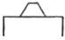

  
[Intangible Textual Heritage](../../index)  [Earth Mysteries](../index) 
[Index](index)  [Previous](hhp08) 

------------------------------------------------------------------------

[Buy this Book at
Amazon.com](https://www.amazon.com/exec/obidos/ASIN/0892540923/internetsacredte)

------------------------------------------------------------------------

[Buy this Book on
Kindle](https://www.amazon.com/exec/obidos/ASIN/B002KKCTTS/internetsacredte)

------------------------------------------------------------------------

  
*The House of the Hidden Places*, by W. Marsham Adams, \[1895\], at
Intangible Textual Heritage

------------------------------------------------------------------------

p. 225

### CHAPTER VII.

### THE ILLUMINATION OF THE ADEPT.

INITIATION achieved, and Ordeal undergone, the character both of
building and of Ritual seem to undergo a transformation. Not that the
air of mystery is in any way lessened, rather it deepens if possible, as
we penetrate into the more secret parts. But the period of weakness and
of expectancy once passed, a sense of power and triumph grows more and
more distinctly perceptible as we enter the secret places of absolute
"Truth." Turning back with the Initiate, now become the Adept from the
"Meskwa" or Place of Ordeal, we retrace our steps upwards, under the
direction

p. 226

of the celestial guide, who conducts us to the "Gate on the Hill"
(cxvii.); the lintel hidden in the roof far up along the Passage of the
Star. In remounting the ascent the adept once more "enters and comes
forth" (cxx.) from the Gateway of the Well, that he may again receive
strength for the coming judgment. And as he approaches the hidden
portcullis, which now he is called upon to pass, where sits in person
the Eternal Wisdom, he recites for himself (cxxi.) the unforgotten words
wherein the Divine Teacher warned him of the hour now drawing near of
entering into (xiii.) judgment and of issuing from thence. Arrived at
the hidden portcullis (cxxii., cxxiii.), carefully concealed within the
roof, that arduous "Gateway reserved for the Gods," the divine
Osiris-souls, the gateway which none can enter, except "after coming
out" from the place of initiation, obstruction meets him at every step.
Alike in the Ritual, and in the building, each portion of that most

p. 227

mysterious gateway, the secret of whose masonry still remains
undisclosed, refuses entrance to the upward path except to the adept.
"'I will not let thee go over me,'" says the sill, "'unless you tell me
my name.' 'The weight in the right place is thy name,'" is the profound
reply of the adept. For, as the raising of the portcullis depends upon
the true adjustment of the weight, so also is justice the virtue without
which the path on high remains for ever closed. "'I will not let thee
pass me,'" says the Left Lintel—so continues this strange
dialogue—"'unless you tell me my name.' 'Return of the true is thy
name.' 'I will not let thee pass me,'" says the Right Lintel, "'unless
you tell me my name.' 'Return of judged hearts is thy name.'" For
without truth, and without self-judgment, no step can be taken of
progress in the Path of Truth (cxxv.). With that doctrine we may compare
the "Golden Words" of Pythagoras, himself a pupil of the priests of
Egypt—

p. 228

"Do innocence; take heed before thou act;  
 Nor let soft sleep upon thy eyelids fall,  
 E’er the day's actions thou hast three times scanned,  
 What have I done, where erred, what left unwrought?  
 Go through the whole account, and if the sum  
 Be evil, chide thee; but if good, rejoice.  
 This do, this meditate, this ever love,  
 And it shall guide thee into virtue's path."

But to him who has learned of wisdom, however long, however arduous the
search, the entrance into Truth cannot finally be denied. The Hidden
Lintel is crossed; and the memory of that passage is for ever kept
sacred by the grateful departed. "I have come through the Hidden
Lintel," he cries triumphantly, later on, "I have come like the sun
through the gate of the festival." The lintel crossed, the Person of the
Divine Teacher is disclosed, having before him the true Balance of Light
and Darkness (cxxv.). The "secret faces at the gate" unveil themselves;
and the adept stands within the Double Hall of Truth—of Truth in Death
and Truth in Life, of Truth in Justice and Truth in Mercy, of Truth in
Darkness and

p. 229

\[paragraph continues\] Truth in
Splendour. Then, as he surmounts each obstacle besetting the entrance to
the path which leads on high, and achieves the triumph over Death, he
beholds the long array of the Judges of the Dead, the celestial powers
who take account of the moral actions of mankind, each supreme in his
own province of the holy land; and to each in turn the adept, whose
stains have been washed from his heart in the furnace of the ordeal,
pleads his innocence of the sin of which that power is the special
avenger. Very terrible are the images under which those heart-searching
spirits are presented—terrible as the moral effects of our own
transgression, when viewed by the inner light of Truth. "The Eyes of
Fire," the passion which shrivels the intellect; the "Face of Smoke,"
the pride that clouds the judgment; the "Crackler of Bones," the sin
which corrodes the entire manhood, these and such as these are the
fearful insignia of the supernal powers. Most terrible of all is the
spirit "whose mouth

p. 230

is twisted when he speaks, because his face is behind him," the spirit
of conscience, which keeps its dread eyes inexorably on our past, and
speaks to us with mouth contorted in the agony of self-condemnation—like
the cry of the penitent, which echoes as bitterly now as when uttered
three thousand years ago, "My sin is ever before me."

Undeterred by that august tribunal, which as we learn at the threshold,
none can endure but he who has truly judged himself, the departed,
protected by the Divine Guardian, ascends the Passage of the Shadow
where the light is eclipsed, and achieves through Truth his victory over
Death. Gradually, as he draws near the low but unobstructed gateway, the
glow of the splendour begins to appear; and he sees before him the
Sacred Orbit of the circling earth defined by the four burning points of
Solstice and Equinox, like a basin of fire surrounded by four jets of
flame (cxxvi.). In front of each of those cardinal points of the

p. 231

heaven, are seated four divine spirits having the assemblance of an ape,
the form nearest akin to humanity. To those four universal guardians and
heralds of truth, the justified prays, that he may be purified yet
further from his transgressions. "O ye," he says, "who send forth truth
to the universal Lord, nurtured without fraud, who abominate wickedness,
extract all the evil from me. Obliterate my faults and annihilate my
sins." "Thou mayest go," is the gracious reply of the four heavenly
teachers; "we obliterate all thy faults, we annihilate all thy sins." In
this manner, as the Ritual declares, is separation of his sins effected
"after he has seen the faces of the Gods." From henceforth death has no
more power over him, and in rapture he returns thanksgiving to the
supreme judges, the Gods of the Orbit, towards whom he now advances, and
to Osiris on his throne (cxxvii., cxxviii.).

As he stands at the entrance of the upper chamber, where the slight
projection of the

p. 232

lower floor bears witness to the passage from death to life, the divine
voice, which has been silent till its first lesson is exhausted,
recommences his illumination, and he is "instructed" (cxxix.) how "to
stand at the Bark of Ra"—no longer in the lower portion of the vessel,
but free of every part. Obedient to the divine command, he passes the
"Gate of the Gateway" (cxxx.), and celebrates the Birthday of Osiris,
the Opening of the Eternal Year. Then, as he advances a step and stands
within the hall upon the slight projection, he beholds the whole
building before him, the vast universe of space, in its immeasurable
grandeur, now free to his immaculate spirit. And as at the Lintel of
Justice all is barred, so here every part lies open. "The heaven opens,"
we read (cxxx.)—the Chamber of the Splendour with its seven-fold rays
around the solar throne; "the earth opens," the Chamber of the Shadow;
"the North opens" to the Chamber of the Pole-star;" the South opens"

p. 233

to the Chamber of Grand Orient; "the West opens" to the Entrance of the
Well; "the East opens" to the Chamber of New Birth, with its Eastern
ascent of the regenerate senses;" the Northern and Southern Chapels
open," the Ante-chamber and the Place of Grand Orient, the Northern and
Southern chapels of the inner house. Here, too, is the "crossing of the
pure roads of life," of which the coffin of Amamu speaks. Behind are
"the roads of darkness," which the departed in the Ritual once prayed so
earnestly that he might pass. In front lie the fields of Aahlu, the
blessed country where the justified executes the works which he is
privileged to do for Osiris.

A burst of triumph greets the justified, when having accomplished the
Passage of the Sun, he enters the Chamber of the Orbit, the Hall of
Illumination. "The deceased," we read, "passes through the Gate of the
Gateway. Prepare ye his hall when he comes. Justify his words against
the accusers. There is given

p. 234

to him the food of the gods of the Gate. There has been made for him the
crown which belongs to him as the dweller in the Secret Place." In
another place the justified himself exclaims, "I have opened the gate of
heaven and earth" (at the junction of the Halls of the Orbit and of the
Shadow). "The soul of Osiris rests there. I cross through the halls. No
defect or evil is found in me." And once more the deceased prays that he
may pass this hall. "Place me before thee, O Lord of Eternity. Hail,
Dweller of the West, good Being, Lord of Abydos. Let me pass the roads
of darkness; let me follow thy servants in the gate."

A similar note of exultation marks the passage in the Sai-an-Sinsin,
where we read of the great tribunal and the House of Light. "Thou comest
into the House of God with much purity," exclaim the mourners,
addressing the departed. "The gods have abundantly purified thee in the
great tribunal. Thou art

p. 235

not shut out of heaven; thy body is renewed in the presence of Osiris.
Thou hast not been shut out from the House of Glory. Thou seest the Path
of Beauty, completing every transformation which thou desirest." And the
ancient coffin of Amamu bore on the outside this inscription, full of
desire and hope: "An act of homage to Anup, who passes the deceased over
the distant paths, the fairest of the Karneter"—that is, the land of the
holy dead. "Thine eyes," say our own sacred writings, "shall see the
King in his beauty; they shall behold the land that is very far off."

The gateway passed (cxxx.), the divine voice resumes its instruction;
and teaches him of "going to the heaven where Osiris is;" of being
"received into the Sacred Heart of Ra," the fount of life
(cxxxi.–cxxxiii.), of "the adoration which he must render," of the
vessel of eternity in which the holy souls for ever move, of the
rejoicings of heaven (cxxxiv.–cxxxvi.)

p. 236

in the manifestations of the Godhead to man, and of the names and places
wherein those manifestations are made (cxli.–cxliii.).

And now the justified stands within the full glory of the orbit, and
looks forth, not with the vision of mortal seer, but as the deathless
spirits who encircle the throne. While he stands gazing, splendour after
splendour, revelation beyond revelation, bursts upon his sight. Down
from the radiant throne, along the floor, along the walls, along the
roof, streams, floods, rivers of light come sweeping on like the torrent
of the summer rays, like the inundation of the overwhelming Nile. But
the justified breathes freely the air of opened heaven. His senses "for
ever vivified," pierce through the utmost bounds of space; his quickened
intellect grasps each starry law and harmony; his purified spirit,
undazzled by the blinding radiance, discerns the Hidden Love that
occupies the throne. No longer as a stranger, or at a distance, but as a
prince

p. 237

  [  
Click to enlarge](img/23700.jpg)  
The Gate of the Burning Crown.  

p. 238

admitted to the highest honour of the court, the justified takes his
place in the very line of direct approach; while around and above him,
the measureless expanse is filled with rank beyond rank of
spirit-ministers. "He has passed his billions," we read, "the circle of
flaming ministers is around him. His blessings follow him. 'Come,' says
Truth; and he approaches her Lord."

At that gracious word of Truth, the abysses of mystery reveal their most
secret depths. First, the Chamber of the Shadow is lit by the
irradiating brightness; and the Illuminate discerns the nature of sin
viewed in the light of truth. The Seven Halls of Death (cxliv.), each
measured by its cycle of eclipse, lie open to him who has looked upon
the face of God; and each name of mystery betrays the form of darkness.
"Babbling" Malice, that delights in "overthrow;" "Fire-faced" Anger,
"leaping on a sudden to the front;" Envy, the "Eater of Dirt;" Hatred,
silent and

p. 239

\[paragraph continues\] "vigilant;" Lust,
"the consumer, the overthrower in a moment," that "lives off reptiles;"
Pride, with its "face of stone;" Sloth, that hardens irretrievably the
heart, the "final stopper of the rejected;" all these betray their
nature to him over whom death has power no longer. And he discerns (as
in the vignette) the seven avenging spirits, each armed with the two
swords of physical and spiritual destruction.

Mounting then the steep ascent, he beholds the mystery of judgment
disclose itself in successive stages as the twenty-one Gates of
Aahlu—their spaces measured by the years of Light, as it speeds from
Sothis, the gates which open only to "the meek-hearted" (cxlvi.) unfold
before him. At each of the first ten portals flows a celestial stream of
sparkling waters, which shed their undying lustre over the person of the
Illuminate. Ascending still towards the throne of Ra, at the nineteenth
portal he is clothed with robes of power; and

p. 240

at "the Gate of the Burning Crown," he stands beneath the Royal Arch of
the Planetary Spheres. Immediately beyond is the "Stone of God," where
he receives from the Divine Occupant a "Crown of Illumination," the
"Atf"-crown of Egypt, fashioned after the zodiacal light of highest
heaven. And behind the throne rises the final "Gate of Peace" with its
seven crowns of joy.

But not as yet can the Illuminate attain the infinite serenity which
lies beyond that gate. Death and judgment are not the only secrets to be
disclosed when the eye of faith becomes the eye of sight. The place of
the divine birth, the chamber in the "Fields of Aahlu," must be visited
before the Illuminate become the Master of the secret. And as he passes
portal after portal of the fields (cxlvii.), he recites the titles of
her whose habitation he now approaches: the "Mistress of Holy Awe," the
"Mistress of Heaven," the "Regent of the Earth," the "Help of the
Meek-hearted,"

p. 241

the "Mistress of Prayer," the "Light of the Secret River." Then, having
learnt the majesty of its queen, he scans the sevenfold arch, the
Mystery of the Transcendent Heaven (cxlviii.); to hold converse with the
seven Supreme Intelligences who overarch the Splendour of Creation.

Yet once again must the Depths be sounded, and the Secret Places be
traversed, before the Illuminate can pass as master through the Gate of
Peace. One secret of death still remains, most terrible and most
inscrutable of all. While we are yet imperfect, we can gain some
knowledge of the effect of moral death upon ourselves, and even form a
faint adumbration of its nature when viewed in the light of absolute
truth. But the mystery of its divine permission who can penetrate? If
the Omnipotent be all good, why did He ever allow of evil? If He be
all-merciful, why does He permit His creatures to suffer? How can our
actions be justly

p. 242

\[paragraph continues\] "balanced" (cli.)
when the forces which produced them were not of our own creation? Why
are we to be made parties to the battle of light and darkness, when no
choice was given whether we would exist or not? Why are the souls of
just men secretly snared and overthrown? Whence comes the "foul flux"
which is purged from man, and which causes all living creatures to
shudder? Such questions as these we ask, and ask in vain. Yet if that
darkest shadow, that horror which forms the depth of human agony, the
enshrouding of the Eternal Justice in the blackness of utter eclipse, is
still liable to arise and overpower the soul, how can man ever repose in
safety; and what revelation or degree of glory will suffice to bring him
peace? But that it too is destined to pass away in light, when the
secrets are revealed, and illumination is transformed into union, who
can doubt? So at least we read in the creed of Ancient Egypt; where,
when the

p. 243

other mysteries of death and of judgment have been disclosed to the
Illuminate; when he has entered into the secrets of the new birth, and
conversed with the Supreme Intelligences who "watch before the tomb of
Osiris;" when time exists for him no more, and he understands the design
of the Eternal House, from foundation to consummation, he makes a final
circuit of its Secret Places. Clothed in power, and crowned with light,
he traverses the "Abodes" (cli.) or scenes of his former weakness; there
to discern, by his own enlightened perception, how it is "Osiris who
satisfies the balance of him who rules the heavens;" to exert in its
supernal freedom his creative will, now the lord, not the slave, of the
senses; and to rejoice in the just suffering which wrought his
illumination and emancipation.

Finally, when that grand progress through the Habitations of Humanity
has been completed, the Master returns in majesty to the

p. 244

celestial company assembled in the Grand Lodge of the solar throne.
Mounting beneath the Royal Arch of the Burning Crown, he treads the
Stone of God itself, and passes through the Gate of Peace, with its
seven crowns and titles of Victory. Then, outstripping in his flight the
power of mortal thought, he passes beyond the shining orbit of the
earth, beyond the vast expanse of solar glory, across the awful chasms
of the unfathomable depths, to far-off Sothis, the land of Eternal Dawn,
the ante-chamber of the infinite morning. He "has his star established
to him in Sothis," says the Ritual. And here the Illuminate, now become
a Master, is instructed in the last mysteries which precede the
universal glory; the mysteries of the divine sorrow, the "tears of Isis"
(clii.), whence comes the source of the celestial Nile, the fount of
illumination to man. Here he passes within the triple veil, and is
invested with the imperishable jewels of supernal lustre (cliii.–clxi.).

p. 245

One chapter and one chamber yet remain—the chapter of Orientation, and
the Chamber of Grand Orient beneath the Secret Places of the Most High.
"Awake, awake, Osiris?" so sing the mourners to the beloved departed,
now glorious in the House of Light, and united indissolubly with the
divine Being; "awake? see what thy son Horus bath done for thee. See
what thy father Seb hath done for thee. Raised is the Osiris." "I have
opened the doors," replies the Osiris-soul, "I have opened the doors. .
. . Well is the Great One who is in the Coffer. For all the dead shall
have passages made to him through their embalming," when their body in
the flesh shall be raised in incorruption. Again and again is celebrated
the Mystery of the Open Tomb. As the eclipsing planet which moves
nearest to the sun crawls like a tortoise across the face of that orb,
defacing it for a moment by its own darkness, and then is swallowed in
the radiance, so also death, that dark spot

p. 246

which crawls across the vision of the eternal splendour, is swallowed in
the resurrection of Osiris-Ra, the Uncreated Light. Four times is that
Gospel of ancient Egypt proclaimed in the chapter which bears the title
of the Orient. "The tortoise dies; Ra lives!" Death is swallowed in
Light; God lives for evermore. "O Amen, Amen," so continues that chapter
of mystery, "Amen, who art in heaven, give thy face to the body of thy
Son. Make him well in Hades. It is finished."

Thus ends the strange and solemn dirge of ancient Egypt. Once perceived,
the intimate connection between the secret doctrine of Egypt's most
venerated books and the secret significance of her most venerable
monument seems impossible to dissever, and each form illustrates and
interpenetrates the other. As we peruse the dark utterances and
recognize the mystic allusions of the Book, we seem to stand amid the
profound darkness enwrapping the whole interior of the building. All
around

p. 247

are assembled the spirits and the powers that make the mystery of the
unseen world: the "Secret Faces at the Gate," the "Gods of the Horizon
and of the Orbit." And dimly before our eyes, age after age, the sacred
procession of the Egyptian dead moves silently along, as they pass
through the "Gate of the Hill" to the tribunal of Osiris. In vain do we
attempt to trace their footsteps till we enter with them into the Hidden
Places, and penetrate the secret of the House of Light. But no sooner do
we approach the passage and tread the chambers of the mysterious
Pyramid, than the teaching of the Sacred Books seems lit up as with a
tongue of flame. The luminous veil itself melts slowly away, disclosing
the Path of Illumination and the Splendours of the Orbit; the celestial
Powers and Intelligences shine forth from beneath their enshrouding
symbols; the spirits of the just grow lustrous with the rays that
proceed from the tribunal. For though none may look upon these things

p. 248

unveiled till the Guardian of the Starry Gate has opened for him the
Portal of the Light, yet for the adept, who has been mystically
initiated in the deep waters, and illuminated by the sevenfold Beauty,
the invisible things become manifest by the visible creation. And a
Light which is not of earth reveals in its divine unity the full secret
of the Hidden Places; the Entrance to the Path of Heaven; the Well of
Life, the Place of New Birth, the Ordeal of Fire, the Lintel of Justice,
the Victory over Death, the Judgment of Truth, the Splendour of
Illumination, the Throne of Radiance, the Veil of Perfection, and the
Grand Orient of the Open Tomb, beneath secret chambers of the Height,
crowned by the Grand Arch of the Supreme Trinity.

Thus only according to that primeval creed could man fulfil his
marvellous destiny; and thus only can that destiny accomplish his
heart's desire. No skill in the secrets of the material universe, no
dominion over the forces

p. 249

of life and death, no power to pierce the veil which hangs before the
unseen world and to hold communion with the spiritual intelligences,
will satisfy his secret aspirations. For the soul of man—so every form
of creed declares—can know no rest, nor can his spirit ever be
satisfied, so long as the thinnest film remains to interrupt the
unclouded vision of the Hidden Love; until he stand face to face, and
eye to eye with "Him who knows the Depths."

We quit that solemn monument of primeval mystery; and as we turn a
farewell glance upon the Gate of Heaven, the veil of the majestic
masonry once more hides from view the interior splendour, and enwraps
the Secret Places of the Hidden God.

 

THE END.

 

 

 
