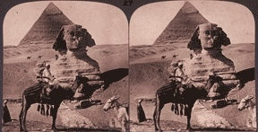

  
[Intangible Textual Heritage](../../index)  [Earth Mysteries](../index) 

------------------------------------------------------------------------

[Buy this Book at
Amazon.com](https://www.amazon.com/exec/obidos/ASIN/0892540923/internetsacredte)

------------------------------------------------------------------------

[Buy this Book on
Kindle](https://www.amazon.com/exec/obidos/ASIN/B002KKCTTS/internetsacredte)

------------------------------------------------------------------------

<table width="75%">
<colgroup>
<col style="width: 50%" />
<col style="width: 50%" />
</colgroup>
<tbody>
<tr class="odd">
<td width="50%" data-valign="TOP"> 
Stereograph of the Pyramids and Sphinx [1908] (Public Domain Image)</td>
<td width="50%" data-valign="CENTER"><h1 id="the-house-of-the-hidden-places" data-align="CENTER">The House of the Hidden Places</h1>
<h2 id="by-w.-marsham-adams" data-align="CENTER">by W. Marsham Adams</h2>
<h4 id="section" data-align="CENTER">[1895]</h4></td>
</tr>
</tbody>
</table>

------------------------------------------------------------------------

[Contents](#contents)    [Start Reading](hhp00)    [Page
Index](pageidx)    [Text \[Zipped\]](hhp.txt.gz)

------------------------------------------------------------------------

|                                                                                                                           |
|---------------------------------------------------------------------------------------------------------------------------|
|  |

There were many speculative attempts to explain the internal
architecture of the Great Pyramid of Giza in the 19th century. Most of
them were composed with an eye to Christian dispensational prophecies.
Adams, on the other hand, thought that the blueprint for the Great
Pyramid was the recently translated [Egyptian Book of the
Dead](../../egy/ebod/index), a journey of the soul through the
afterlife. He viewed this as an allegory of initiation, a precursor of
Masonic rituals. Adams was dismissive of the 'pyramidologists.'

When this book was initially published, it was taken seriously by many
scholars and esoteric researchers. However, the lack of scholarly
apparatus was a stumbling block for many. In addition, the Great Pyramid
was constructed about 2500 BCE, and first versions of the Book of the
Dead date to about 1500 BCE: a gap of nearly a thousand years. So the
Great Pyramid could not possibly be based on the Book of the Dead.
Although Adams drops hints about high-level Masonic themes in the
Pyramid and Book of the Dead, he was not a member of any Masonic group.
On the balance, some of Adams' ideas were ahead of his time,
particularly his theory that the Egyptians were African in origin, not
Asian, as most believed at the time. G.R.S. Mead, although critical of
Adams' methodology, thought that there was a kernel of truth in his
thesis.

Not much is known about Adams' biography, other than that he described
himself as a fellow of New College, Oxford. It is unknown when he died.
This makes determining its copyright status difficult in countries which
use the date of decease of the author as a criteria for copyright terms.
However, it was probably over 70 years ago, since he was born in 1837.
Unless he lived to over 100, it is probably safe to say that this book
is public domain in the vast majority of countries. He followed this
book up later with The Book of the Master in 1898, which was more
speculation about Egyptian religion, and also wrote six other books on
unrelated topics.

------------------------------------------------------------------------

 [Title Page](hhp00)  
[Contents](hhp01)  
[Preface](hhp02)  
[Chapter I. The Pyramid of Light](hhp03)  
[Chapter II. The House of Osiris](hhp04)  
[Chapter III. The Hidden God](hhp05)  
[Chapter IV. The Mystery of the Heavens](hhp06)  
[Chapter V. The Mystery of the Depths](hhp07)  
[Chapter VI. The Initiation of the Postulant](hhp08)  
[Chapter VII. The Illumination of the Adept](hhp09)  
