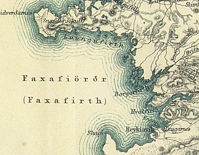

  
[Intangible Textual Heritage](../../index)  [Earth Mysteries](../index) 

------------------------------------------------------------------------

[Buy this Book at
Amazon.com](https://www.amazon.com/exec/obidos/ASIN/B0027P884Q/internetsacredte)

------------------------------------------------------------------------

<table width="75%">
<colgroup>
<col style="width: 50%" />
<col style="width: 50%" />
</colgroup>
<tbody>
<tr class="odd">
<td width="50%" data-valign="TOP"> 
Detail of 19th cent. map of Iceland (see below)</td>
<td width="50%" data-valign="CENTER"><h1 id="journey-to-the-center-of-the-earth" data-align="CENTER">Journey to the Center of the Earth</h1>
<h5 id="a-journey-into-the-interior-of-the-earth" data-align="CENTER">[A Journey into the Interior of the Earth]</h5>
<h2 id="by-jules-verne" data-align="CENTER">by Jules Verne</h2>
<h5 id="tr.-by-frederick-amadeus-malleson" data-align="CENTER">tr. by Frederick Amadeus Malleson</h5>
<h4 id="section" data-align="CENTER">[1877]</h4></td>
</tr>
</tbody>
</table>

------------------------------------------------------------------------

[Contents](#contents)    [Start Reading](jce00)    [Text
\[Zipped\]](jce.txt.gz)

------------------------------------------------------------------------

|                                                                                                                           |
|---------------------------------------------------------------------------------------------------------------------------|
|  |

*About the map: Detail of map of western Iceland
from [Gisli the Outlaw](../../neu/ice/gto/index). Snaefalls Volcano is
on the peninsula in the upper left, and Reykjavik is in the lower
right.*

This is Jules Verne's entry in the subterranean adventure genre, a
classic of 19th century science fiction. Originally published in 1864 as
Voyage au centre de la Terre, there are two principal English
translations. The most commonly reprinted translation, published by
Griffith and Farran in 1871, changed the names of some of the
characters, and added and deleted passages *ad lib*. This translation,
however, is considered more accurate.

Verne looms large in the literature of the hollow earth, not only
because of his fame, but because the book is so well written, and,
despite some creaky science, is not a complete departure from reality,
compared with [Etidorpha](../eti/index), or even the
[Pellucidar](../atec/index) books of Egdar Rice Burroughs.

------------------------------------------------------------------------

 [Title Page and Redactor's Note](jce00)  
[Preface](jce01)  
[Contents](jce02)  
[Chapter I. The Professor and His Family](jce03)  
[Chapter II. A Mystery to be Solved at Any Price](jce04)  
[Chapter III. The Runic Writing Exercises the Professor](jce05)  
[Chapter IV. The Enemy to be Starved Into Submission](jce06)  
[Chapter V. Famine, then Victory, Followed by Dismay](jce07)  
[Chapter VI. Exciting Discussions About an Unparalleled
Enterprise](jce08)  
[Chapter VII. A Woman's Courage](jce09)  
[Chapter VIII. Serious Preparations For Vertical Descent](jce10)  
[Chapter IX. Iceland! But What Next?](jce11)  
[Chapter X. Interesting Conversations With Icelandic Savants](jce12)  
[Chapter XI. A Guide Found to the Centre of the Earth](jce13)  
[Chapter XII. A Barren Land](jce14)  
[Chapter XIII. Hospitality Under the Arctic Circle](jce15)  
[Chapter XIV. But Arctics Can Be Inhospitable, Too](jce16)  
[Chapter XV. Snæfell at Last](jce17)  
[Chapter XVI. Boldly Down the Crater](jce18)  
[Chapter XVII. Vertical Descent](jce19)  
[Chapter XVIII. The Wonders of Terrestrial Depths](jce20)  
[Chapter XIX. Geological Studies in Situ](jce21)  
[Chapter XX. The First Signs of Distress](jce22)  
[Chapter XXI. Compassion Fuses the Professor's Heart](jce23)  
[Chapter XXII. Total Failure of Water](jce24)  
[Chapter XXIII. Water Discovered](jce25)  
[Chapter XXIV. Well Said, Old Mole! Canst Thou Work I’ the Ground So
Fast?](jce26)  
[Chapter XXV. De Profundis](jce27)  
[Chapter XXVI. The Worst Peril of All](jce28)  
[Chapter XXVII. Lost in the Bowels of the Earth](jce29)  
[Chapter XXVIII. The Rescue in the Whispering Gallery](jce30)  
[Chapter XXIX. Thalatta! Thalatta!](jce31)  
[Chapter XXX. A New Mare Internum](jce32)  
[Chapter XXXI. Preparations for a Voyage of Discovery](jce33)  
[Chapter XXXII. Wonders of the Deep](jce34)  
[Chapter XXXIII. A Battle of Monsters](jce35)  
[Chapter XXXIV. The Great Geyser](jce36)  
[Chapter XXXV. An Electric Storm](jce37)  
[Chapter XXXVI. Calm Philosophic Discussions](jce38)  
[Chapter XXXVII. The Liedenbrock Museum of Geology](jce39)  
[Chapter XXXVIII. The Professor in His Chair Again](jce40)  
[Chapter XXXIX. Forest Scenery Illuminated by Eletricity](jce41)  
[Chapter XL. Preparations for Blasting a Passage to the Centre of the
Earth](jce42)  
[Chapter XLI. The Great Explosion and the Rush Down Below](jce43)  
[Chapter XLII. Headlong Speed Upward Through the Horrors of
Darkness](jce44)  
[Chapter XLIII. Shot Out of a Volcano at Last!](jce45)  
[Chapter XLIV. Sunny Lands in the Blue Mediterranean](jce46)  
[Chapter XLV. All's Well That Ends Well](jce47)  
