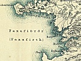

  
[Intangible Textual Heritage](../../index)  [Earth Mysteries](../index) 
[Index](index)  [Next](jce01) 

------------------------------------------------------------------------

[Buy this Book at
Amazon.com](https://www.amazon.com/exec/obidos/ASIN/B0027P884Q/internetsacredte)

------------------------------------------------------------------------

  
*Journey to the Center of the Earth*, by Jules Verne, \[1877\], at
Intangible Textual Heritage

------------------------------------------------------------------------

# A Journey into the Interior of the Earth

## by Jules Verne

#### Ward, Lock, &Co., Ltd., London

#### \[1877\]

### Produced by Norman M. Wolcott.

Redactor's Note: The following version of Jules Verne's "Journey into
the Interior of the Earth" was published by Ward, Lock, &Co., Ltd.,
London, in 1877. This version is believed to be the most faithful
rendition into English of this classic currently in the public domain.
The few notes of the translator are located near the point where they
are referenced. The Runic characters in Chapter III are visible in the
HTML version of the text \[These are displayed using images in this
edition.—JBH\]. The character set is ISO-8891-1, mainly the Windows
character set. The translation is by Frederick Amadeus Malleson.

While the translation is fairly literal, and Malleson (a clergyman) has
taken pains with the scientific portions of the work and added the
chapter headings, he has made some unfortunate emendations mainly
concerning biblical references, and has added a few 'improvements' of
his own, which are detailed below:

III\. "*pertubata seu inordinata*, " as Euclid has it."

XXX\. cry, "Thalatta! thalatta!" the sea! the sea! The deeply indented
shore was lined with a breadth of fine shining sand, softly

XXXII\. hippopotamus. \[as if the creator, pressed for time in the first
hours of the world, had assembled several animals into one.\] The
colossal mastodon

XXXII\. I return to the scriptural periods or ages of the world,
conventionally called 'days,' long before the appearance of man when the
unfinished world was as yet unfitted for his support. \[I return to the
biblical epochs of the creation, well in advance of the birth of man,
when the incomplete earth was not yet sufficient for him.\]

XXXVIII\. (footnote) , and which is illustrated in the negro countenance
and in the lowest savages.

XXXIX\. of the geologic period . \[antediluvian\]

(These corrections have kindly been pointed out by Christian Sánchez
&lt;chvsanchez@arnet.com.ar&gt; of the Jules Verne Forum.)

------------------------------------------------------------------------

[Next: Preface](jce01)
