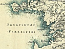

  
[Intangible Textual Heritage](../../index)  [Earth Mysteries](../index) 
[Index](index)  [Previous](jce01)  [Next](jce03) 

------------------------------------------------------------------------

[Buy this Book at
Amazon.com](https://www.amazon.com/exec/obidos/ASIN/B0027P884Q/internetsacredte)

------------------------------------------------------------------------

  
*Journey to the Center of the Earth*, by Jules Verne, \[1877\], at
Intangible Textual Heritage

------------------------------------------------------------------------

### CONTENTS

|         |     |                                                                 |
|---------|-----|-----------------------------------------------------------------|
| I       |     | THE PROFESSOR AND HIS FAMILY                                    |
| II      |     | A MYSTERY TO BE SOLVED AT ANY PRICE                             |
| III     |     | THE RUNIC WRITING EXERCISES THE PROFESSOR                       |
| IV      |     | THE ENEMY TO BE STARVED INTO SUBMISSION                         |
| V       |     | FAMINE, THEN VICTORY, FOLLOWED BY DISMAY                        |
| VI      |     | EXCITING DISCUSSIONS ABOUT AN UNPARALLELED EXERCISE             |
| VII     |     | A WOMAN'S COURAGE                                               |
| VIII    |     | SERIOUS PREPARATIONS FOR VERTICAL DESCENT                       |
| IX      |     | ICELAND, BUT WHAT NEXT?                                         |
| X       |     | INTERESTING CONVERSATIONS WITH ICELANDIC SAVANTS                |
| XI      |     | A GUIDE FOUND TO THE CENTRE OF THE EARTH                        |
| XII     |     | A BARREN LAND                                                   |
| XIII    |     | HOSPITALITY UNDER THE ARCTIC CIRCLE                             |
| XIV     |     | BUT ARCTICS CAN BE INHOSPITABLE, TOO                            |
| XV      |     | SNÆFFEL AT LAST                                                 |
| XVI     |     | BOLDLY DOWN THE CRATER                                          |
| XVII    |     | VERTICAL DESCENT                                                |
| XVIII   |     | THE WONDERS OF TERRESTIAL DEPTHS                                |
| XIX     |     | GEOLOGICAL STUDIES IN SITU                                      |
| XX      |     | THE FIRST SIGNS OF DISTRESS                                     |
| XXI     |     | COMPASSION FUSES THE PROFESSOR'S HEART                          |
| XXII    |     | TOTAL FAILURE OF WATER                                          |
| XXIII   |     | WATER DISCOVERED                                                |
| XXIV    |     | WELL SAID, OLD MOLE! CANST THOU WORK IN THE GROUND SO FAST?     |
| XXV     |     | DE PROFUNDIS                                                    |
| XXVI    |     | THE WORST PERIL OF ALL                                          |
| XXVII   |     | LOST IN THE BOWELS OF THE EARTH                                 |
| XXVIII  |     | THE RESCUE IN THE WHISPERING GALLERY                            |
| XXIX    |     | THALATTA! THALATTA!                                             |
| XXX     |     | A NEW MARE INTERNUM                                             |
| XXXI    |     | PREPARATIONS FOR A VOYAGE OF DISCOVERY                          |
| XXXII   |     | WONDERS OF THE DEEP                                             |
| XXXIII  |     | A BATTLE OF MONSTERS                                            |
| XXXIV   |     | THE GREAT GEYSER                                                |
| XXXV    |     | AN ELECTRIC STORM                                               |
| XXXVI   |     | CALM PHILOSOPHIC DISCUSSIONS                                    |
| XXXVII  |     | THE LIEDENBROCK MUSEUM OF GEOLOGY                               |
| XXXVIII |     | THE PROFESSOR IN HIS CHAIR AGAIN                                |
| XXXIX   |     | FOREST SCENERY ILLUMINATED BY ELECTRICITY                       |
| XL      |     | PREPARATIONS FOR BLASTING A PASSAGE  TO THE CENTRE OF THE EARTH |
| XLI     |     | THE GREAT EXPLOSION AND THE RUSH DOWN BELOW                     |
| XLII    |     | HEADLONG SPEED UPWARD THROUGH THE HORRORS OF DARKNESS           |
| XLIII   |     | SHOT OUT OF A VOLCANO AT LAST!                                  |
| XLIV    |     | SUNNY LANDS IN THE BLUE MEDITERRANEAN                           |
| XLV     |     | ALL'S WELL THAT ENDS WELL                                       |

------------------------------------------------------------------------

[Next: Chapter I. The Professor and His Family](jce03)
